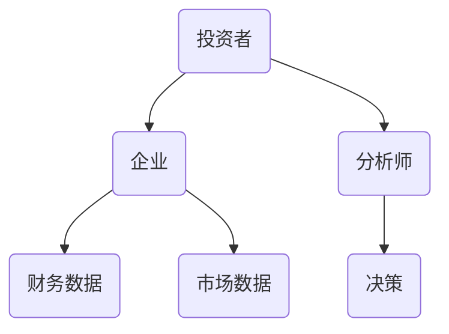
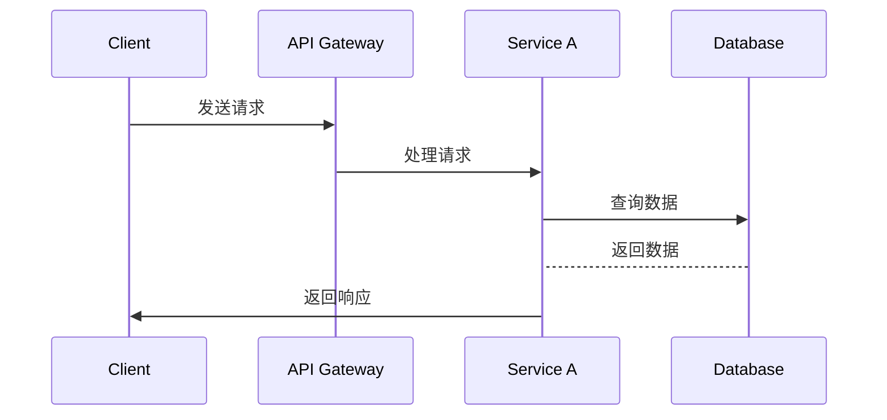

                 


# AI辅助的私募股权投资分析

**关键词**：AI辅助、私募股权投资、机器学习、自然语言处理、图神经网络

**摘要**：本文深入探讨了AI技术在私募股权投资分析中的应用，从背景概述到算法原理，再到系统设计和项目实战，全面解析了如何利用AI提升私募股权投资的效率和准确性。文章通过详细的技术分析和实际案例，展示了AI在私募股权投资中的潜力和实现方法。

---

# 第一部分: AI辅助的私募股权投资分析概述

## 第1章: 私募股权投资的背景与现状

### 1.1 私募股权投资的定义与特点
#### 1.1.1 私募股权投资的定义
私募股权投资是指通过投资于非公开交易的企业股权，以获得资本增值和分红收益的一种投资方式。其核心在于选择具有高增长潜力的企业，并通过长期持有实现价值增长。

#### 1.1.2 私募股权投资的核心特点
- **高风险高回报**：私募股权投资通常集中在高成长性但风险较高的企业，因此回报潜力较大。
- **非流动性**：私募股权的投资期限较长，流动性较低。
- **专业性**：需要专业的知识和经验来评估企业价值和潜在风险。

#### 1.1.3 私募股权投资的市场现状与发展趋势
近年来，私募股权投资市场持续增长，尤其是在科技和医疗领域表现突出。随着数据量的增加和算法的进步，AI在私募股权投资中的应用越来越广泛，为投资决策提供了新的可能性。

---

## 第2章: AI在金融领域的应用

### 2.1 AI在金融领域的核心应用领域
- **风险管理**：通过机器学习模型预测市场风险和信用风险。
- **投资组合优化**：利用算法优化资产配置，提高投资回报。
- **市场预测**：使用自然语言处理分析新闻和社交媒体，预测市场走势。

### 2.2 AI在私募股权投资中的潜在价值
- **数据处理能力**：AI能够快速处理大量非结构化数据，如财务报表和市场报告。
- **风险评估**：通过机器学习模型评估企业的信用风险和市场风险。
- **决策支持**：AI辅助分析师做出更精准的投资决策。

### 2.3 当前AI在私募股权投资中的应用现状
目前，AI在私募股权投资中的应用主要集中在数据清洗、特征提取和模型训练阶段。部分机构已经开始使用AI进行企业估值和风险评估，但整体应用仍处于初级阶段。

---

# 第二部分: AI辅助私募股权投资的核心概念与联系

## 第3章: AI辅助私募股权投资的核心概念

### 3.1 私募股权投资的分析框架
#### 3.1.1 投资决策的关键因素
- **财务指标**：如净利润、毛利率等。
- **市场因素**：如行业趋势、竞争对手分析。
- **管理团队**：团队的能力和稳定性。

#### 3.1.2 数据驱动的分析方法
通过收集和分析企业的财务数据、市场数据和新闻数据，利用AI技术进行预测和评估。

#### 3.1.3 AI在投资决策中的角色
AI作为辅助工具，帮助分析师快速处理数据，提供决策支持，但最终决策仍由人类完成。

---

### 3.2 AI辅助分析的关键技术
#### 3.2.1 机器学习在投资分析中的应用
- **监督学习**：用于分类问题，如企业信用评级。
- **无监督学习**：用于聚类分析，发现潜在的投资机会。

#### 3.2.2 自然语言处理在财务报告分析中的应用
通过NLP技术分析财务报告和新闻，提取关键词和情感倾向，帮助评估企业风险。

#### 3.2.3 图神经网络在关系分析中的应用
利用图神经网络分析企业之间的关联，如供应链关系和投资关系，发现潜在风险。

---

### 3.3 核心概念对比分析
#### 3.3.1 不同AI模型的特征对比
| 模型类型 | 输入数据 | 输出结果 | 优点 | 缺点 |
|----------|-----------|-----------|------|------|
| 线性回归  | 结构化数据 | 数值预测   | 简单 | 易受多重共线性影响 |
| 随机森林 | 结构化数据 | 分类/回归  | 鲁棒性高 | 计算复杂度高 |

#### 3.3.2 私募股权投资中的实体关系分析


#### 3.3.3 AI辅助分析的优缺点对比
- **优点**：提高效率，发现潜在机会，降低人为误差。
- **缺点**：依赖数据质量，模型可能存在过拟合风险。

---

# 第三部分: AI辅助私募股权投资的算法原理

## 第4章: 机器学习在私募股权投资中的应用

### 4.1 机器学习的基本原理
#### 4.1.1 机器学习的定义与分类
机器学习是一种通过数据训练模型，使其能够做出预测或决策的技术。主要分为监督学习、无监督学习和强化学习。

#### 4.1.2 监督学习、无监督学习与强化学习的区别
- **监督学习**：基于标记的数据进行训练，适用于分类和回归问题。
- **无监督学习**：基于未标记的数据进行训练，适用于聚类和降维问题。
- **强化学习**：通过与环境交互学习策略，适用于游戏和机器人控制。

---

### 4.2 常见机器学习算法在私募股权投资中的应用
#### 4.2.1 线性回归模型
线性回归用于预测连续型变量，如企业净利润。其数学模型为：
$$ y = \beta_0 + \beta_1x_1 + \beta_2x_2 + \ldots + \beta_nx_n + \epsilon $$
其中，$y$是目标变量，$x_i$是自变量，$\beta_i$是系数，$\epsilon$是误差项。

#### 4.2.2 支持向量机（SVM）
SVM用于分类问题，如企业信用评级。其核心思想是将数据映射到高维空间，找到一个超平面将数据分为两类。

#### 4.2.3 随机森林与梯度提升树（如XGBoost）
随机森林是一种集成学习方法，通过构建多个决策树并取其平均值来提高准确性和鲁棒性。

---

### 4.3 基于机器学习的私募股权风险评估模型
#### 4.3.1 模型输入特征的选择
选择对企业价值影响较大的特征，如净利润增长率、资产负债率等。

#### 4.3.2 模型训练与验证
通过交叉验证评估模型性能，调整超参数优化模型。

#### 4.3.3 模型在风险评估中的应用
通过模型预测企业的违约概率，帮助投资者做出风险控制决策。

---

# 第四部分: AI辅助私募股权投资的系统分析与架构设计

## 第5章: 系统分析与架构设计

### 5.1 问题场景介绍
系统需要处理大量的私募股权数据，包括企业的财务数据、市场数据和新闻数据，利用AI技术进行分析和预测。

### 5.2 系统功能设计
#### 5.2.1 领域模型


#### 5.2.2 系统架构设计
```mermaid
graph TD
    Client --> API Gateway
    API Gateway --> Service A
    Service A --> Database
    Service B --> Database
    API Gateway --> Service B
    Service B --> Service C
```

#### 5.2.3 系统接口设计
接口主要用于数据的输入输出和模型的调用，采用RESTful API设计。

#### 5.2.4 系统交互设计


---

# 第五部分: AI辅助私募股权投资的项目实战

## 第6章: 项目实战

### 6.1 环境安装
安装必要的Python库，如pandas、scikit-learn和tensorflow。

### 6.2 系统核心实现源代码
```python
import pandas as pd
from sklearn.ensemble import RandomForestClassifier
from sklearn.metrics import accuracy_score

# 加载数据
data = pd.read_csv('private_equity_data.csv')
X = data.drop('target', axis=1)
y = data['target']

# 训练模型
model = RandomForestClassifier()
model.fit(X, y)

# 预测
predictions = model.predict(X)
print(accuracy_score(y, predictions))
```

### 6.3 代码应用解读与分析
上述代码展示了如何使用随机森林模型进行分类，适用于企业信用评级问题。

### 6.4 实际案例分析
通过具体案例分析，展示AI在私募股权投资中的实际应用，如风险评估和投资建议。

### 6.5 项目小结
总结项目实现的关键步骤和成果，为读者提供参考。

---

# 第六部分: 最佳实践与小结

## 第7章: 最佳实践与小结

### 7.1 小结
本文全面介绍了AI在私募股权投资中的应用，从理论到实践，为读者提供了系统的知识框架。

### 7.2 注意事项
- 数据质量和完整性对模型性能至关重要。
- 模型的可解释性需要重视，特别是在金融领域。
- 需要结合人类专家的知识进行决策。

### 7.3 拓展阅读
推荐阅读相关书籍和论文，深入学习AI在金融领域的应用。

---

**作者：AI天才研究院/AI Genius Institute & 禅与计算机程序设计艺术 /Zen And The Art of Computer Programming**

---

以上是《AI辅助的私募股权投资分析》的完整目录大纲，内容涵盖从背景介绍到系统设计再到项目实战的各个方面，满足用户对深度分析和具体实现的需求。

