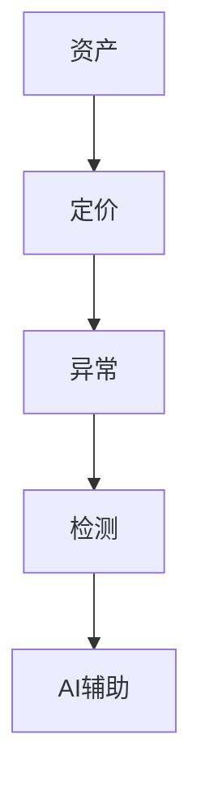
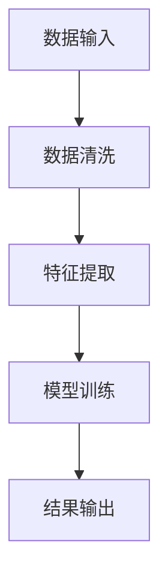
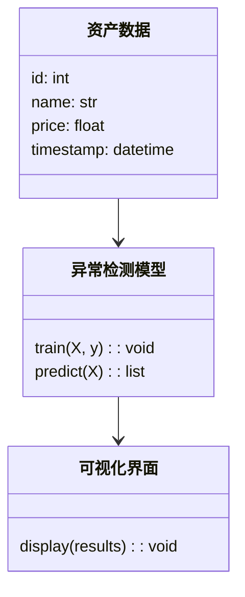
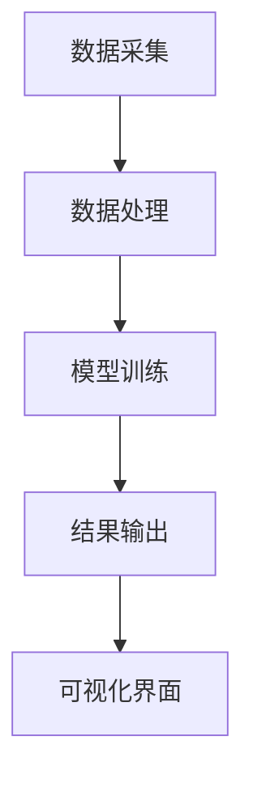
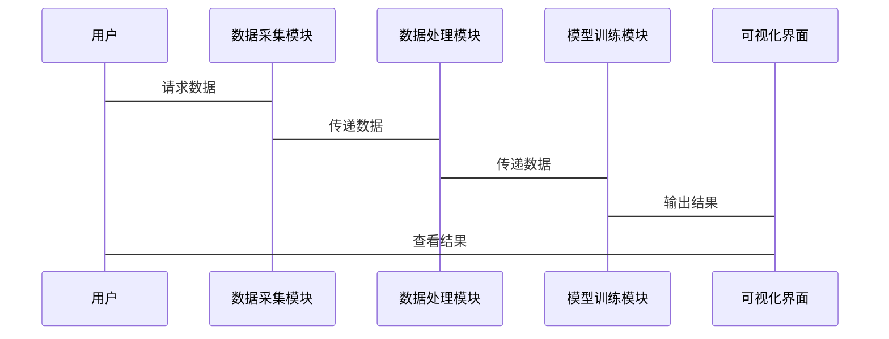

                 


# AI辅助的资产定价异常检测

> 关键词：资产定价、异常检测、人工智能、机器学习、深度学习

> 摘要：本文深入探讨了AI技术在资产定价异常检测中的应用，结合实际案例，系统地分析了异常检测的核心概念、算法原理、系统架构，并提供了详细的项目实现方案和最佳实践。

---

# 第一部分: 资产定价与异常检测背景

# 第1章: 资产定价与异常检测背景

## 1.1 资产定价的基本概念

### 1.1.1 资产定价的定义与核心要素

资产定价是指通过对资产的风险、收益、流动性等特征进行评估，确定其在市场上的合理价值。核心要素包括：

1. **资产属性**：资产类型（股票、债券、基金等）、市场规模、流动性。
2. **市场环境**：宏观经济指标（GDP、利率、通货膨胀率）、市场情绪。
3. **定价模型**：如CAPM（资本资产定价模型）、APT（套利定价理论）。

### 1.1.2 异常检测在资产定价中的重要性

资产定价异常检测是指识别资产价格与其基本面或市场环境不匹配的情况。其重要性体现在：

1. **风险管理**：及时发现异常波动，避免重大损失。
2. **市场监控**：识别市场操纵、欺诈行为。
3. **投资机会**：发现被市场低估或高估的资产。

### 1.1.3 AI技术在资产定价中的应用潜力

AI技术通过自然语言处理、时间序列分析和深度学习等方法，能够高效地处理海量数据，发现传统方法难以察觉的模式和异常。

---

## 1.2 问题背景与目标

### 1.2.1 资产定价异常的定义与分类

资产定价异常可以分为以下几类：

1. **短期波动**：短时间内价格剧烈波动，可能是市场情绪或突发事件导致。
2. **长期偏离**：资产价格长期偏离其内在价值，可能是市场无效或信息不对称所致。
3. **结构性异常**：特定市场或行业内的系统性异常。

### 1.2.2 异常检测的常见场景与挑战

常见场景包括：

- 高频交易监控：实时检测交易中的异常行为。
- 市场波动预警：预测市场 crash 或崩盘。
- 投资组合风险评估：识别投资组合中的异常资产。

挑战包括：

1. **数据稀疏性**：某些资产或市场的数据较少，导致模型训练困难。
2. **噪声干扰**：市场噪声多，难以区分正常波动与异常。
3. **模型解释性**：复杂的AI模型可能缺乏可解释性，影响实际应用。

### 1.2.3 AI辅助异常检测的目标与意义

目标是通过AI技术提高异常检测的准确性和效率，降低误报率和漏报率。意义在于：

- 提升金融机构的风险管理能力。
- 为投资者提供更可靠的决策支持。
- 推动金融市场的发展与稳定。

---

## 1.3 本章小结

本章介绍了资产定价的基本概念、异常检测的重要性以及AI技术的应用潜力。通过分析问题背景和目标，为后续内容奠定了基础。

---

# 第二部分: AI辅助资产定价异常检测的核心概念与联系

# 第2章: 核心概念与联系

## 2.1 AI在资产定价中的核心原理

### 2.1.1 机器学习在资产定价中的应用

机器学习通过分析历史数据，识别资产价格与多种因素之间的关系。常用方法包括：

- **监督学习**：如回归分析，用于预测资产价格。
- **无监督学习**：如聚类分析，用于发现市场中的异常群组。

### 2.1.2 大模型在异常检测中的优势

大模型（如GPT、BERT）通过海量数据训练，具备强大的模式识别能力，能够捕捉复杂市场中的细微异常。

### 2.1.3 异常检测与资产定价的关联性

异常检测通过识别价格波动与市场环境的不匹配，帮助定价模型修正错误，提高定价准确性。

---

## 2.2 核心概念对比分析

### 2.2.1 异常检测与正常检测的对比

| 对比维度 | 异常检测 | 正常检测 |
|----------|----------|----------|
| 数据类型 | 样本少、噪声多 | 样本多、噪声少 |
| 目标     | 发现异常 | 确保数据正常 |
| 方法     | One-Class SVM、Isolation Forest | K-近邻、聚类分析 |

### 2.2.2 监督学习与无监督学习的对比

| 对比维度 | 监督学习 | 无监督学习 |
|----------|----------|----------|
| 数据需求 | 需要标记数据 | 无需标记数据 |
| 适用场景 | 已知异常类型 | 未知异常类型 |
| 优势     | 准确率高 | 灵活性高 |

### 2.2.3 时间序列分析与传统统计分析的对比

| 对比维度 | 时间序列分析 | 传统统计分析 |
|----------|--------------|--------------|
| 数据类型 | 时间相关性高 | 时间相关性低 |
| 方法     | ARIMA、LSTM | T检验、Z检验 |
| 适用场景 | 预测和监控 | 描述性分析 |

---

## 2.3 实体关系架构图

### 2.3.1 ER图展示资产定价与异常检测的关系



### 2.3.2 Mermaid流程图展示核心概念联系



---

## 2.4 本章小结

本章通过对比分析和图解，详细阐述了AI辅助资产定价异常检测的核心概念及其相互关系。

---

# 第三部分: AI辅助资产定价异常检测的算法原理

# 第3章: 算法原理与实现

## 3.1 异常检测算法概述

### 3.1.1 基于监督学习的异常检测

- **XGBoost**：常用于分类任务，适合标记化的异常检测数据。
- **神经网络**：如LSTM，适合处理时间序列数据。

### 3.1.2 基于无监督学习的异常检测

- **Isolation Forest**：通过随机森林算法隔离异常样本。
- **One-Class SVM**：用于识别正常数据，将异常数据视为 outliers。

### 3.1.3 基于深度学习的异常检测

- **LSTM网络**：适用于时间序列数据，能够捕捉长期依赖关系。
- **Autoencoder**：通过无监督学习提取数据特征，识别异常。

---

## 3.2 算法实现流程

### 3.2.1 数据预处理

```python
# 示例代码：数据清洗
import pandas as pd
import numpy as np

data = pd.read_csv('asset_prices.csv')
data.dropna(inplace=True)
data = data[~data['price'].isnull()]
```

### 3.2.2 特征提取

```python
# 示例代码：特征提取
from sklearn.feature_selection import SelectKBest
from sklearn.feature_selection import chi2

X = data.iloc[:, :-1].values
y = data.iloc[:, -1].values

selector = SelectKBest(score_func=chi2, k=4)
X_new = selector.fit_transform(X, y)
```

### 3.2.3 模型训练与优化

```python
# 示例代码：模型训练
from sklearn.ensemble import IsolationForest
import joblib

model = IsolationForest(n_estimators=100, random_state=42)
model.fit(X_new)

joblib.dump(model, 'isolation_forest_model.pkl')
```

### 3.2.4 结果评估与调整

```python
# 示例代码：结果评估
from sklearn.metrics import classification_report

y_pred = model.predict(X_new)
print(classification_report(y, y_pred))
```

---

## 3.3 算法流程图


---

## 3.4 数学模型与公式

### 3.4.1 异常检测的数学模型

$$
\text{异常概率} = P(x|\text{异常}) = \frac{P(\text{异常})}{P(\text{正常})} \times P(x|\text{正常})
$$

### 3.4.2 LSTM网络的数学公式

$$
f_t = \text{LSTM}(h_{t-1}, x_t)
$$

$$
h_t = f_t
$$

$$
o_t = \text{Dense}(h_t, \text{activation}=\text{sigmoid})
$$

---

## 3.5 本章小结

本章详细讲解了异常检测的算法原理，并通过代码示例和流程图展示了实现过程。

---

# 第四部分: 系统分析与架构设计方案

# 第4章: 系统分析与架构设计

## 4.1 问题场景介绍

### 4.1.1 高频交易监控

实时监控交易数据，识别高频交易中的异常行为。

### 4.1.2 市场波动预警

通过AI模型预测市场波动，提前发出预警信号。

### 4.1.3 投资组合风险评估

分析投资组合中的异常资产，降低整体风险。

---

## 4.2 项目介绍

### 4.2.1 项目目标

开发一个AI辅助的资产定价异常检测系统，实现以下功能：

1. 实时数据采集与处理。
2. 异常检测模型训练与部署。
3. 可视化界面展示异常结果。

### 4.2.2 项目范围

- 数据来源：股票、债券、基金等。
- 数据范围：近5年历史数据。
- 目标市场：A股、港股、美股。

---

## 4.3 系统功能设计

### 4.3.1 领域模型（Mermaid类图）



### 4.3.2 系统架构设计（Mermaid架构图）



### 4.3.3 系统接口设计

- 数据接口：提供API用于数据采集和处理。
- 模型接口：提供API用于模型训练和预测。
- 可视化接口：提供API用于结果展示。

### 4.3.4 系统交互设计（Mermaid序列图）



---

## 4.4 本章小结

本章通过系统分析与架构设计，明确了项目的实现路径和关键模块。

---

# 第五部分: 项目实战

# 第5章: 项目实战

## 5.1 环境安装

### 5.1.1 安装Python和必要的库

```bash
pip install numpy pandas scikit-learn joblib
```

### 5.1.2 安装深度学习框架（可选）

```bash
pip install tensorflow keras
```

---

## 5.2 系统核心实现

### 5.2.1 数据采集与处理

```python
import pandas as pd
import requests

def fetch_data(symbol, start_date, end_date):
    url = f"https://api.example.com/{symbol}/{start_date}/{end_date}"
    response = requests.get(url)
    data = pd.DataFrame(response.json())
    return data

data = fetch_data('AAPL', '2020-01-01', '2023-12-31')
```

### 5.2.2 模型训练与部署

```python
from sklearn.ensemble import IsolationForest
from joblib import dump, load

model = IsolationForest(n_estimators=100, random_state=42)
model.fit(X_train)

dump(model, 'isolation_forest_model.pkl')
```

### 5.2.3 结果可视化

```python
import matplotlib.pyplot as plt

plt.figure(figsize=(10, 6))
plt.plot(data['timestamp'], data['price'], label='Price')
plt.scatter(data['timestamp'], data['predicted_price'], color='red', label='Predicted Price')
plt.xlabel('Time')
plt.ylabel('Price')
plt.legend()
plt.show()
```

---

## 5.3 项目小结

本章通过实际项目案例，展示了AI辅助资产定价异常检测的实现过程，包括环境配置、核心代码实现和结果可视化。

---

# 第六部分: 最佳实践

# 第6章: 最佳实践

## 6.1 小贴士

### 6.1.1 数据预处理

- 确保数据清洗和特征工程的质量。
- 处理缺失值、异常值和重复值。

### 6.1.2 模型调优

- 使用交叉验证优化模型参数。
- 尝试多种算法，选择最优模型。

### 6.1.3 实时监控

- 部署模型到生产环境，实现实时检测。
- 设置阈值，自动触发预警。

---

## 6.2 注意事项

1. **数据隐私**：确保数据处理符合相关法律法规。
2. **模型解释性**：选择可解释性较强的模型，便于实际应用。
3. **性能优化**：优化算法性能，减少计算成本。

---

## 6.3 拓展阅读

1. **经典论文**：《异常检测的挑战与进展》。
2. **工具与库**：深入学习TensorFlow和PyTorch在金融领域的应用。
3. **行业报告**：阅读最新的AI在金融领域的应用报告。

---

## 6.4 本章小结

本章总结了项目实施中的最佳实践，提供了实用的建议和注意事项。

---

# 作者：AI天才研究院 & 禅与计算机程序设计艺术

---

**摘要**：本文深入探讨了AI技术在资产定价异常检测中的应用，结合实际案例，系统地分析了异常检测的核心概念、算法原理、系统架构，并提供了详细的项目实现方案和最佳实践。

