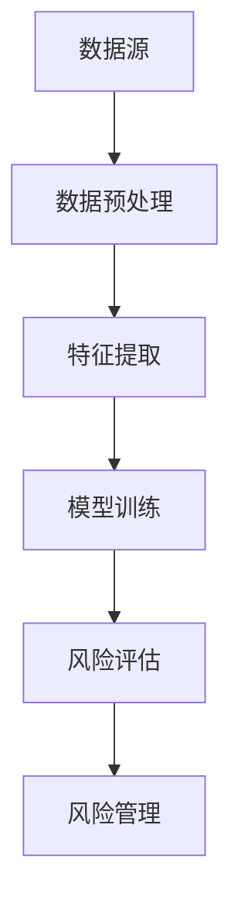
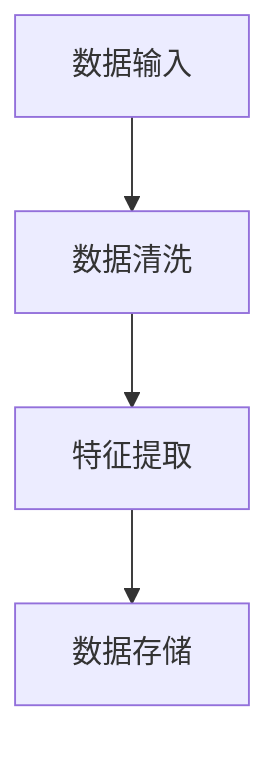
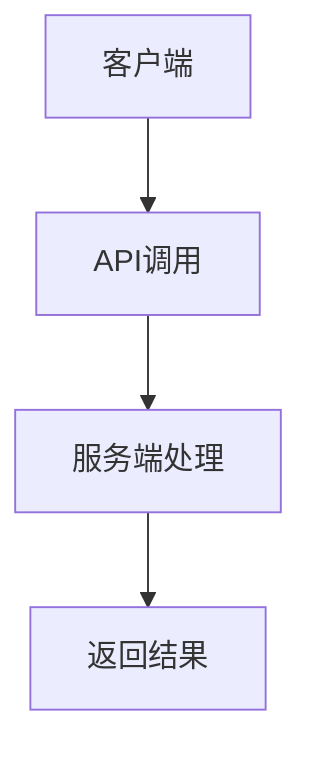

                 


# AI辅助的金融风险评估系统设计

**关键词**：AI、金融风险、系统设计、机器学习、深度学习、风险评估、金融分析

**摘要**：  
本文详细探讨了如何利用人工智能技术设计和实现一个高效的金融风险评估系统。通过结合传统金融分析方法与现代AI技术，本文提出了一个基于机器学习和深度学习的金融风险评估框架，旨在提高风险预测的准确性和效率。文章从系统设计背景、核心算法原理、系统架构到实际案例分析进行了全面阐述，为读者提供了一个系统化的设计思路和实践指导。

---

## 第1章: 金融风险评估概述

### 1.1 金融风险的基本概念

#### 1.1.1 金融风险的定义  
金融风险是指在金融活动中，由于不确定因素的影响，导致资金损失的可能性。它涵盖了市场风险、信用风险、流动性风险等多种类型。

#### 1.1.2 金融风险的分类  
- **市场风险**：由于市场波动（如股票价格、汇率变动）导致的资产价值损失。  
- **信用风险**：由于债务人或交易对手无法履行合同义务而产生的损失。  
- **流动性风险**：无法及时以合理价格变现资产的风险。  
- **操作风险**：由于内部流程、系统或人为错误导致的损失。  

#### 1.1.3 金融风险评估的重要性  
准确评估金融风险是金融机构稳健经营的核心，有助于制定合理的风险管理策略，避免重大损失。

---

### 1.2 AI技术在金融领域的应用

#### 1.2.1 AI技术的基本概念  
人工智能（AI）是指模拟人类智能的计算机系统，包括学习、推理、自适应等能力。在金融领域，AI技术广泛应用于数据分析、风险评估、交易决策等领域。

#### 1.2.2 AI在金融分析中的优势  
- **高效性**：AI能够快速处理海量数据，提取有价值的信息。  
- **准确性**：通过机器学习算法，AI能够发现数据中的非线性关系，提高预测精度。  
- **实时性**：AI系统可以实时监控市场动态，及时发现潜在风险。  

#### 1.2.3 AI辅助金融风险评估的潜力  
AI技术能够通过自然语言处理（NLP）分析新闻、社交媒体数据，结合传统金融指标，构建更加全面的风险评估模型。

---

### 1.3 本章小结  
本章介绍了金融风险的基本概念及其分类，并探讨了AI技术在金融领域的应用优势，为后续的系统设计奠定了基础。

---

## 第2章: 金融风险评估系统的核心概念

### 2.1 金融风险评估的流程

#### 2.1.1 数据收集与处理  
数据是风险评估的基础，包括市场数据、财务数据、新闻数据等。数据预处理是关键步骤，包括清洗、特征提取和标准化。

#### 2.1.2 风险模型构建  
根据数据特点选择合适的算法，构建风险预测模型，并通过交叉验证优化模型性能。

#### 2.1.3 风险评估与决策  
基于模型输出的风险评分，制定相应的风险管理策略。

#### 2.1.4 数据流图  


---

### 2.2 AI辅助的金融风险评估系统架构

#### 2.2.1 系统的组成模块  
- **数据采集模块**：从多种来源获取数据。  
- **特征工程模块**：对数据进行清洗和特征提取。  
- **模型训练模块**：基于机器学习算法训练风险预测模型。  
- **风险评估模块**：输出风险评分和建议。  

#### 2.2.2 系统的核心功能  
- 数据采集与处理：支持多种数据格式，具备自动清洗功能。  
- 模型训练：支持多种算法，可配置参数优化。  
- 风险评估：提供可视化报告和风险管理建议。  

#### 2.2.3 系统的性能指标  
- 训练时间：模型训练所需的时间。  
- 预测精度：模型的准确率、召回率等指标。  
- 实时性：系统的响应速度。  

---

### 2.3 本章小结  
本章详细描述了金融风险评估系统的组成模块和核心功能，并通过数据流图展示了系统的整体架构。

---

## 第3章: AI辅助金融风险评估的核心算法

### 3.1 线性回归算法

#### 3.1.1 线性回归的基本原理  
线性回归是一种统计学习方法，用于预测目标变量与特征变量之间的线性关系。其数学模型为：  
$$ y = \beta_0 + \beta_1x + \epsilon $$  
其中，$\beta_0$和$\beta_1$是模型参数，$\epsilon$是误差项。

#### 3.1.2 线性回归的数学模型  
通过最小二乘法优化目标函数：  
$$ \text{最小化} \sum_{i=1}^{n}(y_i - (\beta_0 + \beta_1x_i))^2 $$  

#### 3.1.3 线性回归的应用案例  
案例：基于历史数据预测股票价格走势。

---

### 3.2 随机森林算法

#### 3.2.1 随机森林的基本原理  
随机森林是一种基于决策树的集成学习算法，通过随机采样和特征选择提高模型的泛化能力。

#### 3.2.2 随机森林的数学模型  
模型由多棵决策树组成，最终结果是各棵树预测结果的投票或平均。

#### 3.2.3 随机森林的应用案例  
案例：评估客户信用风险，预测违约概率。

---

### 3.3 神经网络算法

#### 3.3.1 神经网络的基本原理  
神经网络是一种模仿人脑结构的深度学习算法，能够处理非线性关系。

#### 3.3.2 神经网络的数学模型  
模型由输入层、隐藏层和输出层组成，通过反向传播算法优化权重。

#### 3.3.3 神经网络的应用案例  
案例：预测市场波动，识别异常交易。

---

### 3.4 本章小结  
本章介绍了三种常用的机器学习算法，并通过案例展示了它们在金融风险评估中的应用。

---

## 第4章: 金融风险评估系统的架构设计

### 4.1 系统总体架构

#### 4.1.1 系统模块划分  
- **数据采集模块**：从数据库、API获取数据。  
- **特征工程模块**：清洗数据，提取特征。  
- **模型训练模块**：训练预测模型。  
- **风险评估模块**：生成风险报告。  

#### 4.1.2 系统功能设计  
- 数据输入与存储：支持多种数据格式，具备高效的存储机制。  
- 模型训练与优化：支持多种算法，提供参数调优功能。  
- 风险评估与报告：提供可视化报告和风险管理建议。  

#### 4.1.3 系统性能优化  
- 数据处理：采用分布式计算提高效率。  
- 模型训练：利用GPU加速训练过程。  

---

### 4.2 系统数据流设计

#### 4.2.1 数据输入与处理  


#### 4.2.2 数据存储与管理  
- 数据库：用于存储原始数据和特征数据。  
- 文件存储：用于存储处理后的数据集。  

---

### 4.3 系统接口设计

#### 4.3.1 API接口定义  
- 数据接口：获取数据的API。  
- 模型接口：调用模型进行预测的API。  
- 报告接口：获取风险评估报告的API。  

#### 4.3.2 接口调用流程  


---

### 4.4 本章小结  
本章详细设计了金融风险评估系统的总体架构，包括模块划分、功能设计和数据流设计。

---

## 第5章: AI辅助金融风险评估系统的实现

### 5.1 系统环境搭建

#### 5.1.1 开发工具安装  
- Python：推荐使用最新版本。  
- 深度学习框架：TensorFlow或PyTorch。  
- 数据库：MySQL或MongoDB。  

#### 5.1.2 数据集准备  
- 数据来源：爬虫获取新闻数据，API获取市场数据。  
- 数据格式：CSV或JSON。  

#### 5.1.3 开发环境配置  
- 安装依赖库：pandas、numpy、scikit-learn、keras等。

---

### 5.2 系统核心代码实现

#### 5.2.1 数据预处理代码  
```python
import pandas as pd
import numpy as np

# 数据清洗
def data_cleaning(df):
    df.dropna(inplace=True)
    df = df[~df.isin([np.nan, np.inf, -np.inf]).any(axis=1)]
    return df

# 特征提取
def feature_engineering(df):
    df['log_return'] = np.log(df['close'] / df['close'].shift(1))
    df.dropna(inplace=True)
    return df

data = pd.read_csv('financial_data.csv')
data = data_cleaning(data)
data = feature_engineering(data)
```

#### 5.2.2 模型训练代码  
```python
from sklearn.ensemble import RandomForestClassifier
from sklearn.model_selection import train_test_split

# 数据分割
X = data.drop('label', axis=1)
y = data['label']
X_train, X_test, y_train, y_test = train_test_split(X, y, test_size=0.2)

# 模型训练
model = RandomForestClassifier(n_estimators=100, max_depth=10, random_state=42)
model.fit(X_train, y_train)

# 模型预测
y_pred = model.predict(X_test)
print("Accuracy:", accuracy_score(y_test, y_pred))
```

---

### 5.3 系统功能测试

#### 5.3.1 测试用例  
- 测试数据预处理功能。  
- 测试模型训练和预测功能。  
- 测试风险报告生成功能。  

---

## 第6章: 最佳实践与小结

### 6.1 小结  
本文详细探讨了AI辅助的金融风险评估系统设计，从算法原理到系统架构，再到实际实现，为读者提供了一个系统化的解决方案。

### 6.2 注意事项  
- 数据隐私和安全问题需要高度重视。  
- 模型的可解释性是实际应用中的重要考量。  
- 系统的实时性和稳定性需要通过优化实现。  

### 6.3 拓展阅读  
- 《机器学习实战》  
- 《深度学习》  
- 《金融风险管理》  

---

## 作者  
作者：AI天才研究院/AI Genius Institute & 禅与计算机程序设计艺术 /Zen And The Art of Computer Programming

