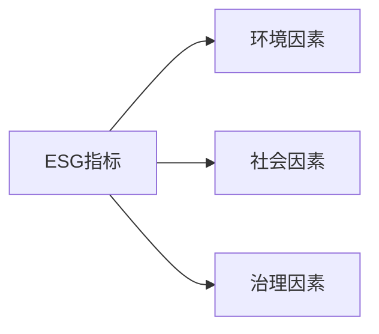

                 


# AI驱动的ESG投资分析

> 关键词：ESG投资分析, 人工智能, 机器学习, 环境社会治理, 数据分析

> 摘要：本文详细探讨了人工智能技术如何驱动ESG（环境、社会、治理）投资分析的发展。通过分析ESG的核心概念、AI算法在ESG分析中的应用、系统架构设计以及实际项目案例，展示了AI如何提升ESG投资分析的效率和准确性。本文旨在为金融从业者、数据科学家和技术爱好者提供深入的技术见解和实践指导。

---

# 第1章: ESG投资分析的背景与概述

## 1.1 ESG投资分析的定义与重要性

### 1.1.1 ESG的定义与内涵

ESG（Environmental, Social, Governance）是衡量企业可持续发展能力的重要指标，分别代表环境、社会和治理三个方面：

- **环境（E）**：关注企业在资源使用、碳排放、污染等方面的表现。
- **社会（S）**：关注企业在员工权益、社会责任、产品安全等方面的表现。
- **治理（G）**：关注企业在公司治理结构、高管薪酬、董事会多样性等方面的表现。

ESG分析不仅仅是对企业的财务表现的补充，更是对企业长期价值和风险的全面评估。

### 1.1.2 ESG投资分析的背景与发展趋势

随着全球对可持续发展的关注增加，ESG投资分析逐渐成为金融机构和投资者的重要决策工具。以下是ESG投资分析发展的主要背景：

- **全球气候变化问题**：企业对环境的影响已成为投资者关注的重点。
- **社会责任投资（SRI）的兴起**：越来越多的投资者关注企业的社会责任表现。
- **监管政策推动**：各国政府出台相关政策，要求金融机构披露ESG信息。
- **技术进步**：AI技术的快速发展为ESG数据的分析和建模提供了新的工具。

### 1.1.3 ESG在投资决策中的作用

ESG分析在投资决策中的作用主要包括：

- **风险识别**：识别企业在环境、社会和治理方面的潜在风险。
- **价值评估**：评估企业在可持续发展方面的长期价值。
- **投资组合优化**：通过ESG评分优化投资组合，降低风险并提高回报。

---

## 1.2 AI技术在金融领域的应用

### 1.2.1 AI在金融数据分析中的应用

AI技术在金融领域的应用主要体现在以下几个方面：

- **数据清洗与特征提取**：利用AI技术自动清洗数据并提取关键特征。
- **预测模型构建**：基于AI算法（如机器学习、深度学习）构建金融市场的预测模型。
- **风险评估与管理**：通过AI技术识别和评估金融市场的潜在风险。

### 1.2.2 AI在风险评估与投资组合优化中的作用

AI技术可以帮助投资者更准确地评估投资风险并优化投资组合。具体表现为：

- **实时风险监控**：通过AI技术实时监控市场风险并提供预警。
- **动态资产配置**：根据市场变化动态调整资产配置。
- **个性化投资建议**：基于投资者的财务状况和风险偏好提供个性化投资建议。

### 1.2.3 AI驱动的ESG投资分析的独特优势

AI技术在ESG投资分析中的独特优势包括：

- **数据处理能力**：AI能够处理海量非结构化数据（如新闻、社交媒体数据）并提取有用信息。
- **模型可解释性**：通过AI技术可以构建可解释的ESG评分模型，帮助投资者理解评分依据。
- **实时更新能力**：AI系统能够实时更新ESG评分，确保评分的时效性。

---

## 1.3 本章小结

本章主要介绍了ESG投资分析的背景、定义和重要性，以及AI技术在金融领域的应用。通过本章的分析，我们了解到ESG投资分析不仅是企业可持续发展的关键指标，也是投资者优化投资组合的重要工具。同时，AI技术的应用为ESG投资分析提供了新的可能性。

---

# 第2章: ESG投资分析的核心概念与联系

## 2.1 ESG分析的核心要素

### 2.1.1 环境因素（E）

环境因素关注企业在资源使用、碳排放、污染等方面的表现。以下是常见的环境指标：

- **碳排放**：企业生产过程中产生的二氧化碳排放量。
- **资源使用效率**：单位产品消耗的能源、水等资源的量。
- **环保合规性**：企业是否遵守环保法规并采取环保措施。

### 2.1.2 社会因素（S）

社会因素关注企业在员工权益、社会责任、产品安全等方面的表现。以下是常见的社会指标：

- **员工福利**：员工的薪酬、福利、工作条件等。
- **社会责任**：企业是否积极参与公益活动，支持弱势群体。
- **产品安全**：产品是否符合安全标准，是否存在安全隐患。

### 2.1.3 治理因素（G）

治理因素关注企业在公司治理结构、高管薪酬、董事会多样性等方面的表现。以下是常见的治理指标：

- **董事会结构**：董事会是否多元化，是否包括独立董事。
- **高管薪酬**：高管的薪酬是否合理，是否与企业绩效挂钩。
- **公司透明度**：企业是否定期披露财务信息和治理信息。

---

## 2.2 ESG分析的核心概念对比

### 2.2.1 ESG与传统财务分析的对比

以下是ESG分析与传统财务分析的对比：

| 指标 | ESG分析 | 传统财务分析 |
|------|----------|---------------|
| 数据来源 | 非财务数据（如社会责任报告、新闻） | 财务数据（如收入、利润） |
| 分析目标 | 评估企业可持续发展能力 | 评估企业财务健康状况 |
| 分析方法 | 文本分析、 sentiment analysis | 财务比率分析、趋势分析 |

### 2.2.2 ESG与企业可持续发展的关系

ESG分析是企业可持续发展的重要组成部分。通过ESG分析，投资者可以更好地评估企业的长期价值和潜在风险。

### 2.2.3 ESG与风险管理的联系

ESG分析可以帮助投资者识别企业在环境、社会和治理方面的潜在风险，从而更好地进行风险管理。

---

## 2.3 ESG分析的实体关系图



---

## 2.4 本章小结

本章详细介绍了ESG分析的核心要素，包括环境、社会和治理三个方面，并对比了ESG分析与传统财务分析的差异。通过实体关系图展示了ESG指标与各个核心要素之间的关系。

---

# 第3章: AI驱动的ESG投资分析算法原理

## 3.1 ESG数据预处理与特征提取

### 3.1.1 数据清洗与标准化

数据清洗是ESG分析的第一步，主要包括：

- **去除重复数据**：删除重复的记录。
- **处理缺失值**：填充或删除缺失值。
- **标准化**：将数据标准化到统一的范围。

### 3.1.2 文本数据的特征提取

文本数据的特征提取是ESG分析中的重要步骤。常用的方法包括：

- **TF-IDF**：计算文本中关键词的重要性。
- **Word Embedding**：将词语映射到向量空间。
- **BERT模型**：基于深度学习的文本表示方法。

### 3.1.3 时间序列数据的特征提取

时间序列数据的特征提取方法包括：

- **移动平均**：计算一定时间窗口内的平均值。
- **指数平滑**：通过加权平均预测未来值。
- **ARIMA模型**：基于时间序列的自回归模型。

---

## 3.2 基于机器学习的ESG评分模型

### 3.2.1 模型选择与训练

常用的机器学习模型包括：

- **随机森林**：适用于分类和回归任务。
- **支持向量机（SVM）**：适用于分类任务。
- **梯度提升树（如XGBoost）**：适用于回归和分类任务。

### 3.2.2 基于XGBoost的ESG评分模型

以下是基于XGBoost的ESG评分模型的实现代码：

```python
import xgboost as xgb

# 数据准备
X_train, y_train = prepare_data()

# 模型训练
model = xgb.XGBRegressor(n_estimators=100, learning_rate=0.1, max_depth=6)
model.fit(X_train, y_train)

# 模型预测
y_pred = model.predict(X_test)
```

### 3.2.3 模型评估与优化

模型评估指标包括：

- **均方误差（MSE）**：评估模型预测值与实际值的差距。
- **R²系数**：评估模型解释能力。
- **调整后的R²系数**：考虑模型复杂度的调整系数。

---

## 3.3 基于深度学习的ESG文本分析

### 3.3.1 文本嵌入与编码

文本嵌入方法包括：

- **Word2Vec**：将词语映射到向量空间。
- **GloVe**：基于全局词嵌入的词向量。
- **BERT模型**：基于深度学习的文本表示方法。

### 3.3.2 基于BERT的ESG文本分类

以下是基于BERT的ESG文本分类的实现代码：

```python
from transformers import BertTokenizer, BertModel

# 加载BERT模型和分词器
tokenizer = BertTokenizer.from_pretrained('bert-base-uncased')
model = BertModel.from_pretrained('bert-base-uncased')

# 分词
inputs = tokenizer.encode_plus(text, add_special_tokens=True, return_token_ids=True)

# 提取特征
features = model(**inputs)
```

### 3.3.3 模型的可解释性分析

模型的可解释性可以通过以下方法实现：

- **特征重要性分析**：分析模型中各个特征的重要性。
- **LIME解释性分析**：通过局部线性解释模型的预测结果。
- **SHAP值分析**：通过SHAP值解释模型的预测结果。

---

## 3.4 本章小结

本章详细介绍了AI驱动的ESG投资分析中的算法原理，包括数据预处理、特征提取、模型选择与训练等内容。通过具体的代码示例和模型对比，展示了AI技术在ESG分析中的强大能力。

---

# 第4章: ESG投资分析的系统架构与设计

## 4.1 系统功能设计

### 4.1.1 数据采集模块

数据采集模块的主要功能包括：

- **数据源接入**：接入企业公开数据、新闻数据等。
- **数据清洗**：处理缺失值、重复值等。
- **数据存储**：将数据存储到数据库中。

### 4.1.2 数据处理模块

数据处理模块的主要功能包括：

- **特征提取**：从文本、时间序列数据中提取特征。
- **数据标准化**：将数据标准化到统一的范围。
- **数据分组**：按行业、地区等分组。

### 4.1.3 模型训练与部署模块

模型训练与部署模块的主要功能包括：

- **模型训练**：基于数据训练ESG评分模型。
- **模型部署**：将模型部署到生产环境。
- **模型监控**：实时监控模型性能。

### 4.1.4 结果展示与分析模块

结果展示与分析模块的主要功能包括：

- **结果展示**：展示ESG评分结果。
- **数据可视化**：通过图表展示ESG评分的分布。
- **分析报告**：生成ESG分析报告。

---

## 4.2 系统架构设计

### 4.2.1 系统架构图

以下是系统的架构图：


---

## 4.3 系统接口设计

### 4.3.1 数据接口

数据接口的主要功能包括：

- **数据获取接口**：获取企业ESG数据。
- **数据上传接口**：上传新的数据。

### 4.3.2 模型接口

模型接口的主要功能包括：

- **模型训练接口**：训练ESG评分模型。
- **模型预测接口**：预测ESG评分。

### 4.3.3 用户接口

用户接口的主要功能包括：

- **用户登录**：用户登录系统。
- **数据查询**：查询企业的ESG评分。
- **报告下载**：下载ESG分析报告。

---

## 4.4 系统交互流程图

以下是系统的交互流程图：


---

## 4.5 本章小结

本章详细介绍了ESG投资分析系统的功能设计和架构设计。通过系统的功能模块和架构图，展示了AI技术在ESG投资分析中的具体应用。

---

# 第5章: 项目实战

## 5.1 项目背景与目标

### 5.1.1 项目背景

本项目旨在利用AI技术构建一个ESG评分系统，帮助企业投资者更好地评估企业的可持续发展能力。

### 5.1.2 项目目标

本项目的目标包括：

- **构建ESG评分模型**：基于AI技术构建ESG评分模型。
- **开发分析系统**：开发一个ESG投资分析系统。
- **实现数据可视化**：通过数据可视化展示ESG评分结果。

---

## 5.2 环境安装与配置

### 5.2.1 安装Python环境

安装Python环境并配置虚拟环境：

```bash
python --version
pip install virtualenv
virtualenv venv
source venv/bin/activate
```

### 5.2.2 安装依赖库

安装所需的依赖库：

```bash
pip install numpy pandas scikit-learn xgboost transformers
```

---

## 5.3 系统核心实现

### 5.3.1 数据采集与处理

以下是数据采集与处理的代码：

```python
import pandas as pd
import requests

# 数据采集
url = "https://example.com/esg_data"
response = requests.get(url)
data = response.json()

# 数据处理
df = pd.DataFrame(data)
df.dropna(inplace=True)
```

### 5.3.2 模型训练与部署

以下是模型训练与部署的代码：

```python
from sklearn.model_selection import train_test_split
from xgboost import XGBRegressor

# 数据分割
X_train, X_test, y_train, y_test = train_test_split(df.drop('esg_score', axis=1), df['esg_score'], test_size=0.2)

# 模型训练
model = XGBRegressor(n_estimators=100, learning_rate=0.1, max_depth=6)
model.fit(X_train, y_train)

# 模型部署
import joblib
joblib.dump(model, 'esg_model.pkl')
```

### 5.3.3 数据可视化

以下是数据可视化的代码：

```python
import matplotlib.pyplot as plt

# 绘制柱状图
plt.bar(df['company'], df['esg_score'])
plt.xlabel('公司')
plt.ylabel('ESG评分')
plt.show()
```

---

## 5.4 项目案例分析

### 5.4.1 案例背景

本案例以某公司为例，分析其ESG评分。

### 5.4.2 数据分析

以下是数据分析的代码：

```python
import pandas as pd
df = pd.read_csv('data.csv')
print(df.head())
```

### 5.4.3 模型预测

以下是模型预测的代码：

```python
import joblib
model = joblib.load('esg_model.pkl')
print(model.predict(X_test))
```

---

## 5.5 项目小结

本章通过一个具体的项目案例，详细介绍了ESG投资分析系统的开发过程，包括环境安装、数据采集与处理、模型训练与部署以及数据可视化等内容。

---

# 第6章: 最佳实践与注意事项

## 6.1 最佳实践

### 6.1.1 数据清洗与特征提取

- 数据清洗是ESG分析的第一步，确保数据的准确性和完整性。
- 特征提取是关键，选择合适的特征可以提高模型的准确性。

### 6.1.2 模型选择与优化

- 根据具体问题选择合适的模型。
- 通过交叉验证和超参数调优优化模型性能。

### 6.1.3 系统架构设计

- 系统架构设计要合理，确保系统的可扩展性和可维护性。
- 数据安全是系统设计的重要考虑因素。

---

## 6.2 小结

通过本文的分析，我们可以看到AI技术在ESG投资分析中的巨大潜力。然而，在实际应用中，我们需要注意数据质量和模型的可解释性，确保模型的准确性和可靠性。

---

# 第7章: 未来展望与总结

## 7.1 未来展望

### 7.1.1 技术进步

随着AI技术的不断进步，ESG投资分析将更加智能化和自动化。

### 7.1.2 数据共享

数据共享将成为ESG投资分析的重要趋势，通过数据共享可以提高模型的准确性和可解释性。

### 7.1.3 政策支持

政策支持是ESG投资分析发展的重要保障，各国政府应出台相关政策，推动ESG投资分析的发展。

---

## 7.2 总结

本文详细探讨了AI驱动的ESG投资分析的发展，通过分析ESG的核心概念、AI算法在ESG分析中的应用、系统架构设计以及实际项目案例，展示了AI技术在ESG投资分析中的强大能力。未来，随着技术的进步和政策的支持，AI驱动的ESG投资分析将更加广泛地应用于金融领域。

---

# 作者：AI天才研究院/AI Genius Institute & 禅与计算机程序设计艺术 /Zen And The Art of Computer Programming

---

以上是《AI驱动的ESG投资分析》的完整目录和文章内容，涵盖从基础概念到实际应用的各个方面，旨在为读者提供全面的技术见解和实践指导。

