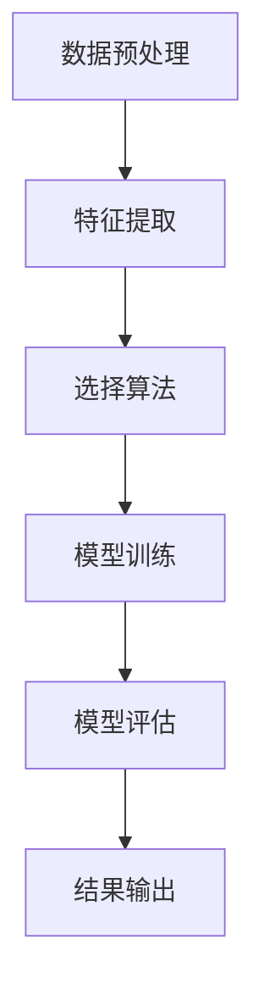
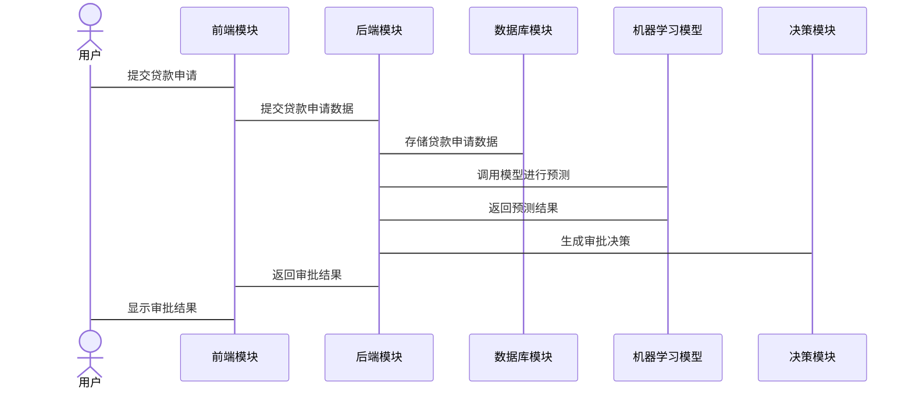

                 


# AI驱动的个人信贷审批系统设计

> 关键词：AI驱动，个人信贷审批，机器学习，NLP技术，系统架构，金融系统

> 摘要：本文系统地探讨了AI驱动的个人信贷审批系统的背景、核心概念、算法原理、系统架构、项目实战、优化与安全、未来趋势等方面。文章详细分析了AI技术在信贷审批中的应用，从机器学习到自然语言处理，从系统架构到项目实现，为读者提供了全面的技术指导和深度分析。通过本文，读者将能够深入了解AI如何优化个人信贷审批流程，提升审批效率和准确性。

---

# 第一章: AI在金融领域的应用与挑战

## 1.1 AI在金融领域的应用现状

### 1.1.1 人工智能在金融行业的应用领域
人工智能技术在金融行业的应用非常广泛，主要包括以下几个方面：
- **智能投顾**：通过AI算法为投资者提供个性化的投资建议。
- **风险管理**：利用机器学习模型预测和识别金融风险。
- **信用评估**：基于AI技术对客户的信用状况进行评估。
- **欺诈检测**：通过模式识别和异常检测技术识别 fraudulent transactions。
- **股票预测**：利用深度学习模型预测股票价格走势。

### 1.1.2 AI技术在金融行业的优势
- **高效性**：AI能够快速处理大量数据，提高金融业务的处理效率。
- **准确性**：通过机器学习模型，AI能够提高金融决策的准确性。
- **智能化**：AI能够自动化完成许多金融任务，减少人工干预。

### 1.1.3 当前AI技术在金融领域的挑战
- **数据隐私**：金融数据往往涉及用户隐私，如何在保证隐私的前提下进行数据分析是一个重要挑战。
- **模型解释性**：复杂的AI模型（如深度学习模型）往往缺乏可解释性，这在金融领域尤为重要。
- **监管合规**：金融行业受到严格的监管，AI技术的应用需要符合相关法律法规。

## 1.2 个人信贷审批的业务流程

### 1.2.1 传统个人信贷审批流程
传统的个人信贷审批流程通常包括以下几个步骤：
1. **贷款申请**：客户提交贷款申请表及相关材料。
2. **资料审核**：人工审核客户提交的资料，包括收入证明、资产证明等。
3. **信用评估**：通过人工方式评估客户的信用状况。
4. **贷款审批**：根据审核结果决定是否批准贷款。
5. **放款**：批准后发放贷款。

### 1.2.2 AI驱动的信贷审批流程
AI驱动的信贷审批流程引入了机器学习和自然语言处理技术，流程更加高效和自动化：
1. **贷款申请**：客户提交贷款申请表及相关材料。
2. **数据采集与处理**：系统自动采集并处理客户的信用报告、银行流水等数据。
3. **特征提取**：利用自然语言处理技术提取文本数据中的关键信息。
4. **模型预测**：基于机器学习模型对客户进行信用评估和风险预测。
5. **贷款审批**：系统根据模型预测结果自动决定是否批准贷款。
6. **放款**：批准后自动发放贷款。

### 1.2.3 信贷审批的关键业务流程优化
通过引入AI技术，信贷审批的关键业务流程得到了显著优化：
- **自动化处理**：从数据采集到模型预测的整个过程实现了自动化，大大减少了人工干预。
- **高效性**：AI模型能够快速处理大量数据，显著缩短审批时间。
- **准确性**：通过机器学习模型提高信用评估的准确性，降低欺诈风险。

---

# 第二章: 个人信贷审批系统的核心概念与联系

## 2.1 核心概念原理

### 2.1.1 机器学习在信贷审批中的应用
机器学习在信贷审批中的应用主要体现在以下几个方面：
- **监督学习**：用于分类问题，如信用评分和欺诈检测。
- **无监督学习**：用于聚类分析，发现潜在的客户群体或欺诈行为。
- **特征工程**：通过特征选择和特征构建，提高模型的预测能力。

### 2.1.2 自然语言处理在信贷审批中的应用
自然语言处理（NLP）技术在信贷审批中的应用主要体现在处理非结构化数据，如信用报告和贷款申请表中的文本信息。具体应用包括：
- **文本预处理**：对文本数据进行分词、去除停用词等处理。
- **实体识别**：识别文本中的关键实体，如姓名、地址、金额等。
- **关键词提取**：提取文本中的关键词，用于信用评估。
- **情感分析**：分析文本中的情感倾向，评估客户的态度。

### 2.1.3 图神经网络在信贷审批中的应用
图神经网络（Graph Neural Network, GNN）在信贷审批中的应用主要体现在处理关系数据，如客户之间的社交网络或交易网络。GNN可以有效捕捉数据中的关系信息，用于风险评估和欺诈检测。

## 2.2 核心概念属性特征对比表

| 概念       | 属性1 | 属性2 | 属性3 | 属性4 |
|------------|--------|--------|--------|--------|
| 机器学习   | 数据驱动 | 模型训练 | 预测结果 | 监督/无监督 |
| NLP        | 文本处理 | 实体识别 | 关键词提取 | 情感分析 |
| 图神经网络 | 节点表示 | 边关系 | 集群分析 | 关系图谱 |

## 2.3 ER实体关系图架构

```mermaid
erd
actor: 用户
bank: 银行
credit_approval_system: 信贷审批系统
credit_report: 信用报告
fraud_detection: 反欺诈系统
approval_decision: 审批决策
```

用户提交贷款申请后，银行调用信贷审批系统，系统调用信用报告和反欺诈系统进行评估，生成审批决策。

---

# 第三章: 机器学习算法在信贷审批中的应用

## 3.1 机器学习算法原理

### 3.1.1 监督学习算法
- **逻辑回归（Logistic Regression）**：用于分类问题，如信用评分。
- **随机森林（Random Forest）**：用于分类和回归问题，具有较强的抗过拟合能力。

### 3.1.2 无监督学习算法
- **K-means**：用于聚类分析，发现客户群体。
- **DBSCAN**：用于密度聚类，发现异常点。

### 3.1.3 算法流程图



---

## 3.2 NLP技术在信贷审批中的应用

### 3.2.1 文本预处理
文本预处理是NLP技术应用的基础，主要包括以下步骤：
1. **分词**：将文本分割成单词或短语。
2. **去除停用词**：移除无意义的词汇，如“的”、“是”等。
3. **词干提取**：将单词还原到其基本形式，如“computing”还原为“compute”。

### 3.2.2 实体识别
实体识别（Named Entity Recognition,NER）是NLP技术的重要应用之一，用于识别文本中的关键实体，如姓名、地址、金额等。

### 3.2.3 关键词提取
关键词提取是通过算法从文本中提取出具有代表性的关键词，用于信用评估。

### 3.2.4 情感分析
情感分析用于评估文本中的情感倾向，如客户对贷款的满意度。

---

# 第四章: 系统架构设计

## 4.1 系统模块划分

### 4.1.1 前端模块
- **用户界面**：用户提交贷款申请表。
- **数据采集**：采集用户的个人信息和贷款申请表。

### 4.1.2 后端模块
- **数据处理模块**：处理用户提交的数据，进行特征提取和模型预测。
- **模型预测模块**：调用机器学习模型进行信用评估和欺诈检测。
- **决策模块**：根据模型预测结果生成审批决策。

### 4.1.3 数据库模块
- **关系型数据库**：存储用户信息、贷款申请表、信用报告等数据。
- **非关系型数据库**：存储日志、模型参数等数据。

## 4.2 系统架构设计

```mermaid
graph TD
frontend --> backend: 数据提交
backend --> database: 数据存储
backend --> ml_model: 模型预测
backend --> decision_maker: 生成决策
frontend <-- decision_maker: 审批结果
```

---

## 4.3 系统接口设计

### 4.3.1 API接口
- **提交贷款申请**：`POST /submit_loan_application`
- **获取审批结果**：`GET /get_approval_result`

### 4.3.2 数据接口
- **获取信用报告**：`GET /get_credit_report`
- **更新用户信息**：`PUT /update_user_info`

---

## 4.4 系统交互流程



---

# 第五章: 项目实战

## 5.1 环境搭建

### 5.1.1 安装Python
```bash
python --version
pip install --upgrade pip
```

### 5.1.2 安装机器学习库
```bash
pip install numpy pandas scikit-learn
```

### 5.1.3 安装NLP库
```bash
pip install nltk spacy
```

## 5.2 系统核心实现

### 5.2.1 数据处理
```python
import pandas as pd
import numpy as np

# 加载数据
data = pd.read_csv('loan_data.csv')

# 数据清洗
data = data.dropna()
data = data.drop_duplicates()
```

### 5.2.2 特征工程
```python
from sklearn.preprocessing import LabelEncoder

# 对分类变量进行编码
label_encoder = LabelEncoder()
data['income_level'] = label_encoder.fit_transform(data['income_level'])
```

### 5.2.3 模型训练
```python
from sklearn.model_selection import train_test_split
from sklearn.linear_model import LogisticRegression

# 划分训练集和测试集
X_train, X_test, y_train, y_test = train_test_split(data.drop('default_probability', axis=1), data['default_probability'], test_size=0.2, random_state=42)

# 训练模型
model = LogisticRegression()
model.fit(X_train, y_train)
```

### 5.2.4 模型预测
```python
# 预测结果
y_pred = model.predict(X_test)

# 模型评估
from sklearn.metrics import accuracy_score
print('准确率:', accuracy_score(y_test, y_pred))
```

## 5.3 代码实现与分析

### 5.3.1 实现代码
```python
import spacy

nlp = spacy.load("en_core_web_sm")

text = "The customer has a high income and good credit history."
doc = nlp(text)

for token in doc:
    print(token.text, token.pos_, token.dep_)
```

### 5.3.2 代码分析
- **NLP模型加载**：使用 spaCy 加载 English 模型。
- **文本处理**：对输入文本进行分词、词性标注和句法分析。
- **结果输出**：打印每个词的文本、词性及句法依赖关系。

---

# 第六章: 系统优化与安全

## 6.1 系统优化

### 6.1.1 模型优化
- **超参数调优**：使用网格搜索（Grid Search）优化模型参数。
- **特征选择**：通过特征重要性分析选择关键特征。

### 6.1.2 性能优化
- **并行计算**：利用多线程或分布式计算提高处理效率。
- **缓存优化**：优化数据读取和处理流程，减少I/O时间。

## 6.2 安全与风险管理

### 6.2.1 数据加密
- **数据传输加密**：使用SSL/TLS加密数据传输。
- **数据存储加密**：对敏感数据进行加密存储。

### 6.2.2 模型安全
- **模型保护**：防止模型被恶意攻击或窃取。
- **模型监控**：实时监控模型的运行状态，发现异常及时报警。

---

# 第七章: 未来趋势与展望

## 7.1 未来趋势

### 7.1.1 模型可解释性
随着监管要求的提高，模型的可解释性将成为一个重要研究方向。

### 7.1.2 实时性
未来，AI驱动的信贷审批系统将更加注重实时性，实现实时审批和实时监控。

### 7.1.3 自动化决策
随着AI技术的不断发展，信贷审批将更加自动化，减少人工干预。

## 7.2 技术展望

### 7.2.1 深度学习
深度学习技术将在信贷审批中发挥更大的作用，特别是在图像识别和自然语言处理方面。

### 7.2.2 联邦学习
联邦学习（Federated Learning）将允许多个机构在不共享数据的前提下进行模型训练，保护数据隐私。

---

# 第八章: 附录

## 8.1 术语表

| 术语       | 定义 |
|------------|------|
| AI驱动     | 基于人工智能技术的驱动方式 |
| 信贷审批   | 对个人或企业的贷款申请进行审核和批准 |
| 机器学习   | 一种人工智能技术，通过数据训练模型进行预测和决策 |
| NLP技术    | 自然语言处理技术，用于处理文本数据 |
| 图神经网络  | 基于图结构的数据进行学习的神经网络 |

## 8.2 工具安装指南

### 8.2.1 安装Python
```bash
python --version
pip install --upgrade pip
```

### 8.2.2 安装机器学习库
```bash
pip install numpy pandas scikit-learn
```

### 8.2.3 安装NLP库
```bash
pip install nltk spacy
```

## 8.3 参考文献
- [1] 周志华. 机器学习. 清华大学出版社, 2016.
- [2] 张浩. 自然语言处理入门. 人民邮电出版社, 2020.
- [3] 李航. 统计学习方法. 清华大学出版社, 2012.

---

# 作者：AI天才研究院/AI Genius Institute & 禅与计算机程序设计艺术 /Zen And The Art of Computer Programming

---

通过本文的详细分析和讲解，读者可以全面了解AI驱动的个人信贷审批系统的背景、核心概念、算法原理、系统架构、项目实战、优化与安全、未来趋势等方面。无论是理论还是实践，本文都能为读者提供有益的指导和启示。

