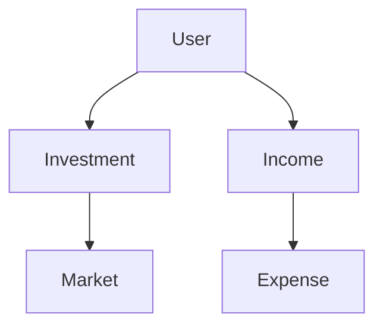
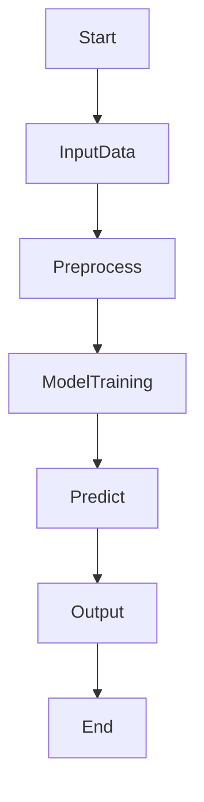
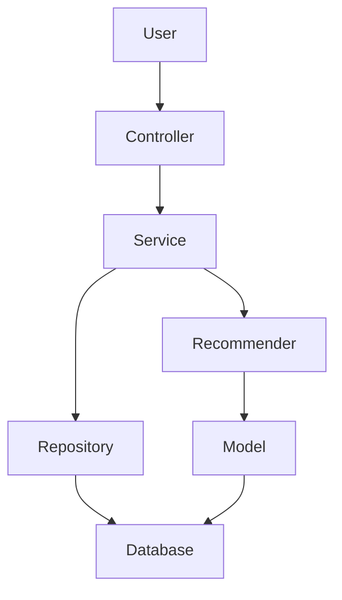
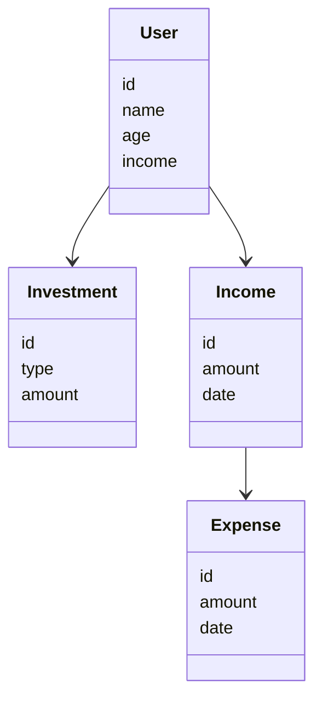
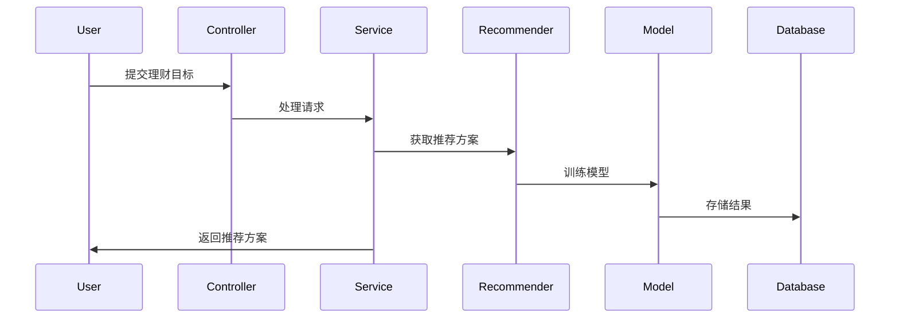

                 

# AI驱动的个人理财目标规划助手

**关键词**：人工智能, 个人理财, 理财目标规划, 推荐算法, 系统架构, 项目实战

**摘要**：  
本文将详细介绍AI驱动的个人理财目标规划助手的开发与应用。首先，我们将探讨AI技术在个人理财中的应用背景及其核心价值。接着，分析AI驱动理财助手的核心概念与原理，包括数据驱动的理财分析、AI算法在理财规划中的应用及个性化推荐机制。随后，深入讲解推荐算法的原理与实现，结合协同过滤推荐算法、基于深度学习的推荐算法等具体案例进行详细分析。最后，我们将从系统架构设计、项目实战到最佳实践，全面解析如何利用AI技术打造高效、个性化的个人理财目标规划系统。

---

# 第一部分: AI驱动的个人理财目标规划助手概述

## 第1章: AI驱动的个人理财目标规划助手背景介绍

### 1.1 个人理财的基本概念

#### 1.1.1 个人理财的定义与范围  
个人理财是指个人对其财务资源（如收入、支出、储蓄、投资等）进行管理、规划和优化的过程。其核心目标是实现财务目标（如资产增值、风险控制、财富传承等），并提高生活质量。个人理财的范围包括日常开支管理、投资决策、税务规划、退休计划等。

#### 1.1.2 理财目标的分类与特点  
理财目标可以根据时间、金额、风险偏好等维度进行分类，主要包括以下几种：  
- **短期目标**：如应急资金储备、旅行基金等，通常在1年内完成。  
- **中期目标**：如购房首付、子女教育基金等，通常在1~3年完成。  
- **长期目标**：如退休计划、财富传承等，通常需要5年以上时间。  

理财目标的特点包括：个性化、动态变化、风险与收益的平衡。

#### 1.1.3 传统理财规划的局限性  
传统理财规划主要依赖人工分析，存在以下问题：  
- **效率低**：需要大量人工计算和分析，耗时且成本高。  
- **个性化不足**：难以针对每个人的具体情况提供定制化建议。  
- **主观性强**：依赖理财顾问的经验，可能存在主观偏差。  
- **数据不足**：难以充分利用大数据进行分析和优化。  

### 1.2 AI技术在个人理财中的应用现状

#### 1.2.1 AI技术的基本概念  
人工智能（Artificial Intelligence, AI）是指计算机系统模拟人类智能的能力，包括学习、推理、自适应等。AI技术的核心包括机器学习（Machine Learning）、自然语言处理（NLP）、计算机视觉等。

#### 1.2.2 AI在金融领域的应用案例  
AI技术在金融领域的应用非常广泛，主要包括以下几种：  
- **智能投顾**：通过算法分析市场数据，为投资者提供个性化的投资建议。  
- **风险管理**：利用AI技术预测市场风险，优化资产配置。  
- **欺诈检测**：通过异常检测技术识别 fraudulent transactions（欺诈交易）。  
- **客户画像**：利用大数据分析客户行为，精准定位客户需求。  

#### 1.2.3 AI驱动理财目标规划的必要性  
随着大数据和AI技术的发展，AI驱动的理财目标规划助手能够帮助用户实现以下目标：  
- **高效数据处理**：快速分析海量数据，提供精准的理财建议。  
- **个性化方案**：基于用户的财务状况、风险偏好和目标需求，定制专属理财方案。  
- **动态优化**：实时跟踪市场变化和用户财务状况，动态调整理财策略。  

### 1.3 AI驱动的个人理财目标规划助手的核心价值

#### 1.3.1 提高理财效率  
AI技术能够快速处理大量数据，帮助用户快速找到最优理财方案，节省时间和精力。

#### 1.3.2 个性化理财方案  
通过AI技术分析用户的财务状况、风险偏好和目标需求，提供个性化、精准的理财建议。

#### 1.3.3 风险控制与优化  
AI技术能够预测市场风险，优化资产配置，帮助用户规避风险，实现财富保值与增值。

## 1.4 本章小结  
本章介绍了AI驱动的个人理财目标规划助手的背景，分析了传统理财规划的局限性和AI技术在金融领域的应用现状，重点阐述了AI驱动理财助手的核心价值，包括提高效率、个性化方案和风险控制。

---

# 第二部分: AI驱动的个人理财目标规划助手的核心概念与联系

## 第2章: AI驱动的个人理财目标规划助手的核心概念

### 2.1 核心概念原理

#### 2.1.1 数据驱动的理财分析  
AI驱动的理财规划助手通过收集和分析用户的财务数据（如收入、支出、资产、负债等），利用大数据技术进行深度分析，为用户提供个性化的理财建议。

#### 2.1.2 AI算法在理财规划中的应用  
AI算法（如机器学习、深度学习）能够自动分析市场数据和用户需求，生成最优理财方案。

#### 2.1.3 个性化推荐机制  
通过协同过滤、基于内容的推荐算法等，为用户提供个性化的产品推荐和理财建议。

### 2.2 核心概念属性特征对比表格

| 特征             | 传统理财规划                     | AI驱动理财规划                     |
|------------------|----------------------------------|----------------------------------|
| 数据来源         | 单一数据源（用户提供的有限数据） | 多数据源整合（用户数据、市场数据、行为数据） |
| 分析方式         | 人工分析                        | AI自动分析                       |
| 推荐方式         | 人工推荐                        | 自动推荐                       |
| 定价方式         | 统一化定价                      | 个性化定价                       |
| 服务效率         | 低效                            | 高效                            |
| 服务成本         | 高                             | 低                             |

### 2.3 ER实体关系图架构

### 2.4 本章小结  
本章通过对比分析，阐述了AI驱动理财助手的核心概念，包括数据驱动分析、AI算法应用和个性化推荐机制，并通过表格和ER图展示了传统理财规划与AI驱动理财规划的差异。

---

# 第三部分: AI驱动的个人理财目标规划助手的算法原理讲解

## 第3章: AI驱动理财规划的算法原理

### 3.1 推荐算法

#### 3.1.1 基于规则的匹配算法  
基于规则的匹配算法是一种简单但有效的推荐方法，通过预设规则（如用户年龄、收入、职业等）进行匹配推荐。

#### 3.1.2 协同过滤推荐算法  
协同过滤是一种基于用户行为相似性推荐算法，分为基于用户的协同过滤和基于物品的协同过滤。

##### 基于用户的协同过滤  
基于用户的协同过滤通过计算用户之间的相似性，推荐相似用户的喜欢的物品。

##### 基于物品的协同过滤  
基于物品的协同过滤通过计算物品之间的相似性，推荐与当前用户喜欢的物品相似的其他物品。

#### 3.1.3 基于深度学习的推荐算法  
基于深度学习的推荐算法能够处理复杂的用户行为和市场数据，推荐效果更优。

##### 基于神经网络的推荐算法  
通过训练神经网络模型，学习用户和物品的特征表示，进行推荐。

##### 基于注意力机制的推荐算法  
通过注意力机制，捕捉用户行为中重要的特征，进行推荐。

#### 3.1.4 强化学习的应用  
强化学习通过与环境的交互，学习最优策略，应用于动态市场环境下的理财推荐。

### 3.2 算法流程图

### 3.3 本章小结  
本章详细讲解了AI驱动理财助手的推荐算法，包括基于规则的匹配算法、协同过滤推荐算法、基于深度学习的推荐算法和强化学习的应用，并通过流程图展示了推荐算法的整体流程。

---

## 第四部分: AI驱动的个人理财目标规划助手的系统架构设计

## 第4章: 系统架构设计

### 4.1 问题场景介绍  
本系统旨在为用户提供个性化的理财目标规划服务，帮助用户实现财务目标。

### 4.2 系统功能设计  
系统功能包括用户信息管理、理财目标设定、投资组合优化、风险评估与预警、财务报告生成等。

### 4.3 系统架构设计

#### 4.3.1 系统架构图  

#### 4.3.2 领域模型类图  

#### 4.3.3 系统交互流程图  

### 4.4 接口设计  
系统接口包括用户接口、数据接口和第三方API接口。

### 4.5 本章小结  
本章详细介绍了AI驱动理财助手的系统架构设计，包括系统功能、架构图、类图和交互流程图，为后续的系统实现提供了设计依据。

---

## 第五部分: AI驱动的个人理财目标规划助手的项目实战

## 第5章: 项目实战

### 5.1 环境搭建  
需要安装Python、TensorFlow、Pandas、Scikit-learn等工具。

### 5.2 数据预处理  
收集和清洗用户数据，包括收入、支出、资产、负债等。

### 5.3 模型训练  
训练推荐算法模型，如协同过滤模型、深度学习模型等。

### 5.4 系统实现  
实现系统功能模块，包括用户界面、数据处理、推荐算法等。

### 5.5 系统测试  
进行功能测试、性能测试和用户体验测试。

### 5.6 本章小结  
本章通过实际项目案例，详细讲解了AI驱动理财助手的环境搭建、数据预处理、模型训练和系统实现过程。

---

## 第六部分: AI驱动的个人理财目标规划助手的最佳实践与注意事项

## 第6章: 最佳实践与注意事项

### 6.1 最佳实践 tips  
- 定期更新模型，适应市场变化。  
- 提供多维度的用户反馈，优化推荐算法。  
- 加强用户隐私保护，确保数据安全。

### 6.2 当前挑战与未来趋势  
- **数据隐私**：如何在保护用户隐私的前提下，利用大数据进行分析。  
- **模型解释性**：如何提高AI模型的可解释性，增强用户信任。  
- **实时性**：如何实现实时数据处理和推荐。  

### 6.3 使用注意事项  
- 选择合适的AI技术，根据实际需求进行优化。  
- 定期进行系统维护，确保功能正常运行。  
- 提供用户教育，帮助用户理解AI理财助手的功能和优势。

### 6.4 拓展阅读  
推荐阅读《Python机器学习实战》、《深度学习入门》等书籍，深入了解AI技术在金融领域的应用。

### 6.5 本章小结  
本章总结了AI驱动理财助手的最佳实践，分析了当前面临的挑战和未来趋势，并提出了使用注意事项和拓展阅读资料。

---

## 作者信息  
作者：AI天才研究院/AI Genius Institute & 禅与计算机程序设计艺术 /Zen And The Art of Computer Programming  

---

**附录**：  
- 代码实现示例  
- 数据集说明  
- 参考文献  

---

**结束**

