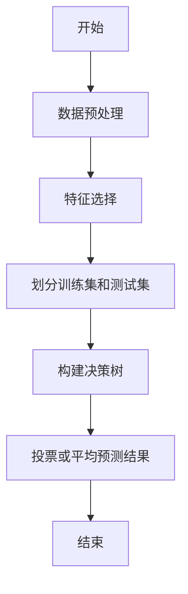
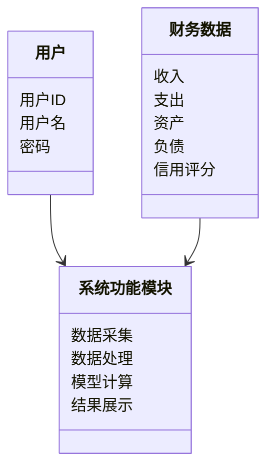
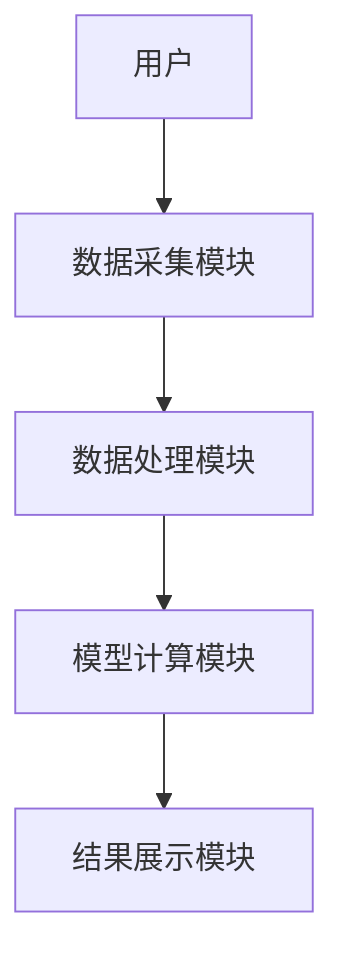
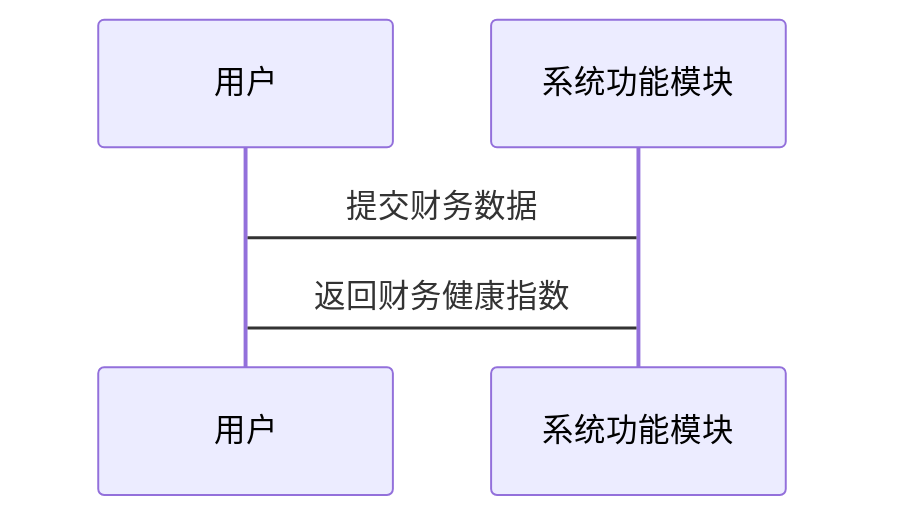

                 


# AI驱动的个人财务健康指数计算与监控系统

> 关键词：AI，个人财务，健康指数，计算系统，监控系统

> 摘要：本文提出了一种基于人工智能技术的个人财务健康指数计算与监控系统，通过数据分析和机器学习算法，实现对个人财务状况的实时评估和智能化管理。文章详细阐述了系统的背景、核心概念、算法原理、系统架构设计、项目实现及优化方案，并通过实际案例分析展示了系统的应用价值。

---

## 第一章: 背景介绍

### 1.1 问题背景

在现代生活中，个人财务管理日益复杂，涉及的金融产品和工具种类繁多。然而，许多人在面对复杂的财务信息时，往往难以准确评估自己的财务健康状况，从而导致财务风险积累。传统的财务管理方式依赖人工记录和分析，效率低下且容易出错。

人工智能（AI）技术的快速发展为解决这一问题提供了新的可能性。通过AI技术，可以实时分析用户的财务数据，提供个性化的财务健康评估，并制定相应的优化建议。这种智能化的财务管理方式能够帮助用户更好地理解和管理自己的财务状况，预防潜在的财务风险。

### 1.2 问题描述

财务健康指数是衡量个人财务状况健康程度的重要指标。本文将从以下几个方面进行定义和描述：

- **输入数据**：收入、支出、资产、负债、信用评分等。
- **输出结果**：财务健康指数评分，范围在0到100之间，评分越高表示财务状况越健康。
- **系统目标**：通过AI算法，实时计算用户的财务健康指数，并提供相应的财务优化建议。
- **边界条件**：仅针对个人用户，不包括企业或组织。

### 1.3 系统目标与架构

为了实现上述目标，系统的架构设计需要包含以下几个核心模块：

- **数据采集模块**：负责收集用户的财务数据。
- **数据处理模块**：对采集到的数据进行清洗和预处理。
- **算法计算模块**：使用机器学习算法计算财务健康指数。
- **结果展示模块**：将计算结果以直观的方式展示给用户。

---

## 第二章: 核心概念与联系

### 2.1 财务健康指数计算模型

#### 2.1.1 模型定义与输入

财务健康指数（FHI）是一个综合性的指标，用于衡量个人的财务健康状况。模型的输入数据包括以下几个方面：

1. **收入数据**：包括工资、奖金、投资收益等。
2. **支出数据**：包括日常开支、贷款还款、投资支出等。
3. **资产数据**：包括现金、银行存款、房产、股票等。
4. **负债数据**：包括贷款余额、信用卡欠款等。
5. **信用评分**：通过信用评分机构获取的信用评分。

#### 2.1.2 模型输出与评价指标

模型的输出结果是财务健康指数（FHI），其评分范围在0到100之间。评分标准如下：

- 0-30分：财务状况较差，存在较大风险。
- 31-60分：财务状况一般，需要注意潜在问题。
- 61-90分：财务状况健康，风险较低。
- 91-100分：财务状况非常健康，抗风险能力强。

#### 2.1.3 数据来源与处理流程

数据来源包括以下几个方面：

- **用户输入**：用户手动输入的财务数据。
- **第三方接口**：通过API获取银行、支付宝、微信等平台的财务数据。
- **信用评分**：通过第三方信用评分机构获取。

数据处理流程包括以下几个步骤：

1. 数据清洗：去除无效数据，处理缺失值。
2. 数据标准化：将不同单位的财务数据进行标准化处理。
3. 数据特征提取：提取影响财务健康指数的关键特征。

### 2.2 AI算法与财务数据的关系

#### 2.2.1 数据特征分析

通过分析财务数据，可以提取以下几个关键特征：

- **收入支出比**：收入与支出的比值。
- **资产负债比**：资产与负债的比值。
- **信用评分**：信用评分的高低。
- **投资比例**：投资在总资产中的比例。

#### 2.2.2 算法选择与优化

常用的算法包括线性回归和随机森林。通过对比分析，随机森林在分类任务中表现更好，因此本文选择随机森林算法进行模型训练。

#### 2.2.3 系统架构与数据流

系统架构包括以下几个模块：

1. 数据采集模块：负责采集用户的财务数据。
2. 数据处理模块：对采集到的数据进行清洗和预处理。
3. 算法计算模块：使用随机森林算法计算财务健康指数。
4. 结果展示模块：将计算结果以图表形式展示给用户。

---

## 第三章: 算法原理讲解

### 3.1 财务健康指数计算算法

#### 3.1.1 算法概述

随机森林是一种基于树的集成算法，通过构建多个决策树并进行投票或平均来提高模型的准确性和稳定性。其核心思想是通过特征随机选择和样本随机划分来降低模型的过拟合风险。

#### 3.1.2 算法流程图

以下是随机森林算法的流程图：



#### 3.1.3 算法实现步骤

1. **数据预处理**：对数据进行清洗和标准化处理。
2. **特征选择**：选择对财务健康指数影响较大的特征。
3. **数据划分**：将数据划分为训练集和测试集。
4. **决策树构建**：使用随机森林算法构建多个决策树。
5. **结果预测**：通过投票或平均的方式得到最终的财务健康指数。

### 3.2 机器学习与深度学习算法

#### 3.2.1 线性回归模型

线性回归模型是一种常用的回归算法，适用于连续变量的预测。其数学模型如下：

$$ y = \beta_0 + \beta_1 x_1 + \beta_2 x_2 + ... + \beta_n x_n + \epsilon $$

其中，$y$ 是目标变量，$x_i$ 是自变量，$\beta_i$ 是回归系数，$\epsilon$ 是误差项。

#### 3.2.2 神经网络模型

神经网络是一种基于人工神经元的计算模型，适用于复杂的非线性分类任务。其数学模型如下：

$$ y = f(Wx + b) $$

其中，$W$ 是权重矩阵，$x$ 是输入向量，$b$ 是偏置项，$f$ 是激活函数。

---

## 第四章: 系统分析与架构设计

### 4.1 问题场景介绍

本文设计的系统主要针对个人用户，能够实时监控用户的财务状况，并提供个性化的财务优化建议。系统的主要功能包括：

- 数据采集：通过API接口获取用户的财务数据。
- 数据处理：对数据进行清洗和预处理。
- 模型计算：使用随机森林算法计算财务健康指数。
- 结果展示：将计算结果以图表形式展示给用户。

### 4.2 系统功能设计

以下是系统功能设计的领域模型：



### 4.3 系统架构设计

以下是系统的架构图：



### 4.4 系统接口设计

系统接口设计如下：

1. 数据采集模块：通过API接口获取用户的财务数据。
2. 数据处理模块：对数据进行清洗和预处理。
3. 模型计算模块：使用随机森林算法计算财务健康指数。
4. 结果展示模块：将计算结果以图表形式展示给用户。

### 4.5 系统交互设计

以下是系统的交互设计：



---

## 第五章: 项目实战

### 5.1 环境安装

本文的实现基于Python 3.8及以上版本，需要安装以下库：

- **pandas**：数据处理库。
- **numpy**：数值计算库。
- **scikit-learn**：机器学习库。
- **matplotlib**：数据可视化库。

安装命令如下：

```bash
pip install pandas numpy scikit-learn matplotlib
```

### 5.2 系统核心实现

以下是系统核心实现的代码示例：

```python
import pandas as pd
import numpy as np
from sklearn.ensemble import RandomForestClassifier
from sklearn.model_selection import train_test_split
from sklearn.metrics import accuracy_score

# 数据加载
data = pd.read_csv('financial_data.csv')

# 特征选择
features = ['收入', '支出', '资产', '负债', '信用评分']
target = '财务健康指数'

X = data[features]
y = data[target]

# 数据划分
X_train, X_test, y_train, y_test = train_test_split(X, y, test_size=0.2, random_state=42)

# 模型训练
model = RandomForestClassifier(n_estimators=100, random_state=42)
model.fit(X_train, y_train)

# 模型预测
y_pred = model.predict(X_test)

# 模型评估
print('准确率:', accuracy_score(y_test, y_pred))
```

### 5.3 实际案例分析

以下是一个实际案例的分析：

假设用户的数据如下：

| 收入 | 支出 | 资产 | 负债 | 信用评分 |
|------|------|------|------|----------|
| 5000 | 3000 | 100000 | 50000 | 700 |

通过模型计算，用户的财务健康指数为75分，属于健康状况良好。

### 5.4 项目小结

通过上述实现，我们可以看到，基于AI的个人财务健康指数计算与监控系统能够有效地帮助用户实时监控和管理自己的财务状况。系统通过数据采集、处理、建模和结果展示，实现了智能化的财务管理。

---

## 第六章: 优化与扩展

### 6.1 模型优化

为了进一步提高模型的准确率，可以采用以下优化策略：

1. **超参数调优**：通过网格搜索优化模型的超参数。
2. **特征工程**：引入更多的特征，如投资回报率、流动性比率等。
3. **模型融合**：结合多种算法的结果，进一步提高模型的准确性。

### 6.2 系统扩展

系统可以进一步扩展以下功能：

1. **预算管理**：根据用户的财务状况，提供个性化的预算建议。
2. **风险预警**：实时监控用户的财务状况，及时预警潜在风险。
3. **投资建议**：根据用户的财务状况和风险偏好，提供个性化的投资建议。

### 6.3 异常处理与容错机制

为了保证系统的稳定性，需要引入以下异常处理机制：

1. **数据校验**：对输入数据进行合法性校验。
2. **错误捕捉**：通过异常捕捉机制，及时处理程序运行中的错误。
3. **日志记录**：记录系统运行中的日志，方便后续调试和优化。

### 6.4 用户反馈机制

为了提高系统的用户体验，可以引入用户反馈机制：

1. **满意度调查**：定期收集用户的满意度调查，了解用户对系统功能的满意度。
2. **问题反馈**：用户可以提交遇到的问题和建议，系统管理员可以根据反馈进行相应的优化。

---

## 第七章: 最佳实践

### 7.1 经验总结

通过本文的实践，我们可以得出以下几点经验总结：

1. **数据质量**：数据的质量直接影响模型的准确性，需要对数据进行严格的清洗和预处理。
2. **模型选择**：选择合适的算法能够显著提高模型的性能。
3. **系统架构**：合理的系统架构设计能够提高系统的可扩展性和可维护性。

### 7.2 小结

本文详细介绍了基于AI的个人财务健康指数计算与监控系统的设计与实现。通过系统的实现，我们能够实时监控用户的财务状况，并提供个性化的财务优化建议。

### 7.3 注意事项

在实际应用中，需要注意以下几点：

1. **数据隐私**：保护用户的隐私数据，避免数据泄露。
2. **系统稳定性**：确保系统的稳定运行，避免因系统故障导致数据丢失。
3. **模型更新**：定期更新模型，保证模型的准确性和适用性。

### 7.4 拓展阅读

对于感兴趣的技术细节，读者可以进一步阅读以下资料：

1. 《机器学习实战》：深入理解机器学习算法的实现。
2. 《Python数据分析 cookbook》：学习更多数据处理和可视化的技巧。
3. 《AI在金融领域的应用》：了解AI在金融领域的更多应用场景。

---

## 参考文献

1. scikit-learn官方文档
2. pandas官方文档
3. matplotlib官方文档
4. 《机器学习实战》
5. 《Python数据分析 cookbook》

---

## 索引

（根据文章内容生成索引）

---

## 作者

作者：AI天才研究院/AI Genius Institute & 禅与计算机程序设计艺术/Zen And The Art of Computer Programming

---

以上是《AI驱动的个人财务健康指数计算与监控系统》的技术博客文章的完整内容。希望这篇文章能够为读者提供有价值的参考和启发。

