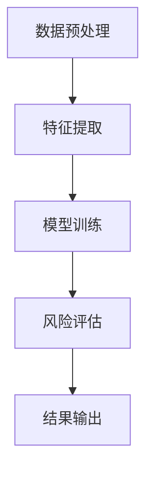
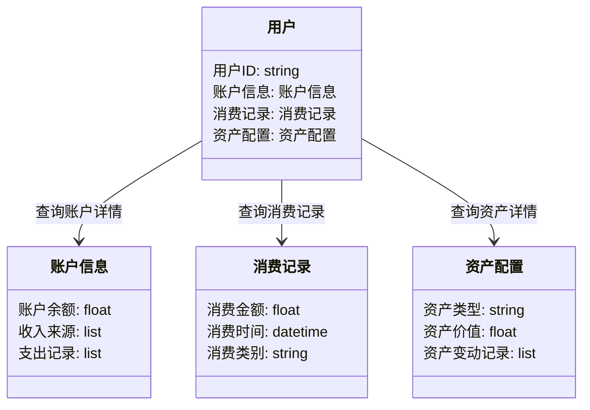
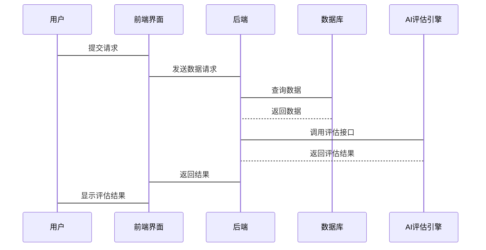

                 


# AI驱动的个人财务健康评估系统设计

> 关键词：AI技术，个人财务管理，财务健康评估，机器学习，风险管理，系统架构设计

> 摘要：随着人工智能技术的飞速发展，个人财务管理领域正经历着一场深刻的技术变革。传统的财务健康评估方法逐渐显现出其局限性，而基于AI的自动化评估系统正成为这一领域的新兴解决方案。本文将详细探讨AI驱动的个人财务健康评估系统的背景、核心算法、系统架构设计及实现方案，通过理论与实践相结合的方式，为读者提供一个全面的系统设计蓝图。

---

# 第一部分: AI驱动的个人财务健康评估系统背景与核心概念

## 第1章: 个人财务健康评估系统概述

### 1.1 问题背景与描述

#### 1.1.1 传统财务健康评估的局限性
传统的个人财务健康评估方法主要依赖于人工记录和分析，这种方式不仅效率低下，而且容易受到人为因素的影响，导致评估结果的准确性不足。具体表现在以下几个方面：
- **数据获取与处理效率低**：传统方法依赖手动录入和整理财务数据，耗时且容易出错。
- **评估维度单一**：传统评估方法通常只关注收支平衡，难以全面分析资产配置、风险承受能力等关键指标。
- **缺乏实时性**：传统评估方法难以实现对财务数据的实时更新和分析，导致评估结果滞后。

#### 1.1.2 个人财务管理的痛点分析
个人财务管理过程中存在诸多痛点，亟需技术手段来解决：
- **数据分散**：个人的财务数据可能分布在不同的平台（如银行账户、支付宝、理财平台等），难以统一管理。
- **风险预警不及时**：在面对市场波动或个人消费超支时，缺乏实时的预警机制，容易导致财务危机。
- **个性化需求难以满足**：每个人的财务状况和目标不同，传统方法难以提供个性化的评估和建议。

#### 1.1.3 AI技术在财务管理中的应用潜力
AI技术的引入为个人财务管理带来了新的可能性：
- **自动化数据处理**：AI能够自动抓取和整理分散的财务数据，提高数据处理效率。
- **多维度分析**：通过机器学习算法，AI可以对财务数据进行多维度分析，提供更全面的评估结果。
- **实时监控与预警**：AI能够实时跟踪财务状况，及时发现潜在风险并发出预警。

### 1.2 问题解决与边界定义

#### 1.2.1 AI驱动的解决方案概述
AI驱动的个人财务健康评估系统通过整合多种AI技术（如机器学习、自然语言处理等），实现对个人财务数据的自动化处理、智能分析和实时监控，从而帮助用户更好地管理财务状况。

#### 1.2.2 系统功能边界与外延
系统的功能边界包括：
- **数据采集与整合**：从多个数据源（如银行账户、消费记录等）获取财务数据。
- **数据分析与评估**：利用AI算法对数据进行分析，生成财务健康评估报告。
- **风险预警与建议**：根据分析结果，提供风险预警和个性化财务建议。

系统外延包括：
- **用户界面**：提供直观的可视化界面，方便用户查看评估结果。
- **数据安全**：确保用户数据的安全性和隐私性。

#### 1.2.3 核心要素与组成结构
系统的组成结构如下：
1. **数据源**：包括银行账户、消费记录、资产信息等。
2. **数据处理模块**：负责数据的清洗、整合和预处理。
3. **评估模型**：基于机器学习算法，对数据进行分析和评估。
4. **用户界面**：展示评估结果、预警信息和建议。

### 1.3 核心概念与联系

#### 1.3.1 AI技术与财务评估的结合原理
AI技术通过以下方式与财务评估结合：
- **数据预处理**：利用自然语言处理技术，从非结构化数据（如账单信息）中提取有用信息。
- **特征提取**：通过机器学习算法，从数据中提取关键特征（如收入、支出、资产配置等）。
- **模型训练**：利用训练数据，训练出能够预测财务健康状况的模型。

#### 1.3.2 核心概念属性对比表
| 概念         | 特性                       |
|--------------|----------------------------|
| 数据源       | 来源广泛（银行、消费平台等） |
| 数据处理模块 | 功能包括清洗、整合、预处理 |
| 评估模型     | 基于机器学习算法           |
| 用户界面     | 提供可视化结果展示           |

#### 1.3.3 ER实体关系图架构
```mermaid
er
    actor 用户 {
        role: 个人用户
    }
    actor 评估系统 {
        role: AI驱动的评估引擎
    }
    database 财务数据 {
        contains 账户信息, 消费记录, 资产配置
    }
    account 账户信息 {
        key: 用户ID
        attributes: 账户余额, 收入来源, 支出记录
    }
    account 消费记录 {
        key: 消费流水号
        attributes: 消费金额, 消费时间, 消费类别
    }
    account 资产配置 {
        key: 资产ID
        attributes: 资产类型, 资产价值, 资产变动记录
    }
    用户 --> 账户信息: 查询账户详情
    用户 --> 消费记录: 查询消费记录
    用户 --> 资产配置: 查询资产详情
    评估系统 --> 账户信息: 读取账户数据
    评估系统 --> 消费记录: 读取消费数据
    评估系统 --> 资产配置: 读取资产数据
```

### 1.4 本章小结
本章详细介绍了AI驱动的个人财务健康评估系统的背景、核心概念和组成结构。通过分析传统财务管理的痛点，提出了基于AI技术的解决方案，并通过ER实体关系图展示了系统的核心要素之间的关系。

---

## 第2章: AI驱动的个人财务健康评估系统核心算法

### 2.1 算法原理概述

#### 2.1.1 机器学习在财务评估中的应用
机器学习在财务评估中的主要应用包括：
- **回归分析**：用于预测未来的财务状况。
- **分类算法**：用于判断财务健康状况的类别（如健康、风险、危机）。

#### 2.1.2 深度学习在风险预测中的作用
深度学习在风险预测中的优势在于其强大的特征提取能力，能够从复杂的数据中发现潜在的模式。

#### 2.1.3 自然语言处理在财务数据分析中的应用
自然语言处理技术可以用于分析财务报告、账单等文本数据，提取有用的信息。

### 2.2 算法流程图


### 2.3 核心算法实现

#### 2.3.1 线性回归模型
线性回归模型是最常用的回归分析方法之一，其数学模型如下：
$$
y = \beta_0 + \beta_1 x_1 + \beta_2 x_2 + \dots + \beta_n x_n + \epsilon
$$
其中：
- $y$ 是目标变量（如财务健康评分）。
- $x_i$ 是自变量（如收入、支出等）。
- $\beta_i$ 是回归系数。
- $\epsilon$ 是误差项。

#### 2.3.2 线性回归实现代码
```python
import numpy as np
from sklearn.linear_model import LinearRegression

# 示例数据
X = np.array([[1], [2], [3], [4], [5]])
y = np.array([2, 4, 5, 4, 6])

# 模型训练
model = LinearRegression()
model.fit(X, y)

# 预测
print(model.predict([[6]]))
```

### 2.4 本章小结
本章详细介绍了AI驱动的个人财务健康评估系统中使用的机器学习算法，包括线性回归模型的实现和应用。通过算法流程图和代码示例，读者可以清晰地理解AI技术在财务评估中的具体应用。

---

## 第3章: 系统分析与架构设计

### 3.1 问题场景介绍
系统需要解决的主要问题包括：
- 如何高效地整合多源财务数据。
- 如何确保系统的安全性和稳定性。

### 3.2 项目介绍
本项目旨在开发一个基于AI的个人财务健康评估系统，通过整合多源数据，利用机器学习算法，为用户提供个性化的财务健康评估和风险管理建议。

### 3.3 系统功能设计

#### 3.3.1 领域模型类图


### 3.4 系统架构设计

#### 3.4.1 系统架构图
```mermaid
subgraph 前端
    前端界面
end

subgraph 后端
    业务逻辑处理
    AI评估引擎
end

subgraph 数据库
    用户数据
    账户信息
    消费记录
    资产配置
end

frontEnd --> 后端: 请求数据
后端 --> 数据库: 查询数据
后端 --> frontEnd: 返回结果
```

### 3.5 系统接口设计
系统主要接口包括：
- 数据接口：从银行、支付宝等平台获取财务数据。
- 评估接口：调用AI评估引擎进行财务健康评估。
- 用户接口：提供给用户查看评估结果和管理数据的界面。

### 3.6 系统交互流程


### 3.7 本章小结
本章详细介绍了系统的架构设计和交互流程，通过类图和架构图展示了系统的组成和数据流。

---

## 第4章: 项目实战与实现

### 4.1 环境安装
读者需要安装以下工具：
- Python 3.8+
- Jupyter Notebook
- Scikit-learn
- Pandas
- Matplotlib

### 4.2 核心代码实现

#### 4.2.1 数据采集与预处理
```python
import pandas as pd
import requests
from bs4 import BeautifulSoup

# 示例：从网页获取消费记录
url = "https://example.com/consumption"
response = requests.get(url)
soup = BeautifulSoup(response.text, 'html.parser')
data = pd.read_html(soup.prettify())
print(data.head())
```

#### 4.2.2 评估模型实现
```python
from sklearn.model_selection import train_test_split
from sklearn.metrics import accuracy_score

# 示例：训练一个分类模型
X_train, X_test, y_train, y_test = train_test_split(X, y, test_size=0.2)
model.fit(X_train, y_train)
y_pred = model.predict(X_test)
print("准确率：", accuracy_score(y_test, y_pred))
```

#### 4.2.3 结果可视化
```python
import matplotlib.pyplot as plt

plt.scatter(X, y, color='b')
plt.plot(X, model.predict(X), color='r')
plt.title('Financial Health Assessment')
plt.xlabel('Income')
plt.ylabel('Health Score')
plt.show()
```

### 4.3 本章小结
本章通过实际代码示例，展示了如何在Python环境中实现AI驱动的个人财务健康评估系统的数据采集、模型训练和结果可视化。

---

## 第5章: 最佳实践与总结

### 5.1 小结
AI驱动的个人财务健康评估系统通过整合多源数据、利用机器学习算法，为个人用户提供了一种高效、智能的财务管理方式。

### 5.2 注意事项
- 数据安全：确保用户的财务数据不会被泄露。
- 模型优化：根据实际使用情况，不断优化评估模型。
- 用户教育：提高用户的财务知识水平，帮助他们更好地理解评估结果。

### 5.3 拓展阅读
- 推荐书籍：《机器学习实战》、《深度学习入门》。
- 推荐资源：Kaggle上的财务数据分析项目。

### 5.4 本章小结
本章总结了AI驱动的个人财务健康评估系统的实现过程，并提出了实际应用中的注意事项和进一步学习的资源。

---

# 作者：AI天才研究院/AI Genius Institute & 禅与计算机程序设计艺术 /Zen And The Art of Computer Programming

---

以上是《AI驱动的个人财务健康评估系统设计》的技术博客文章的完整目录和内容框架。

