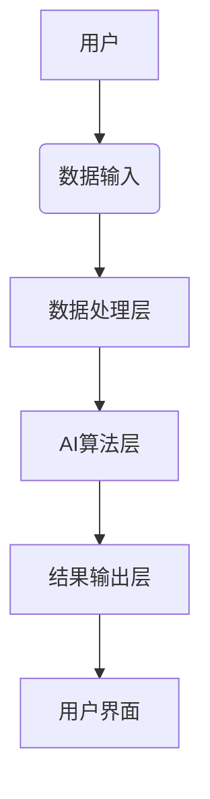
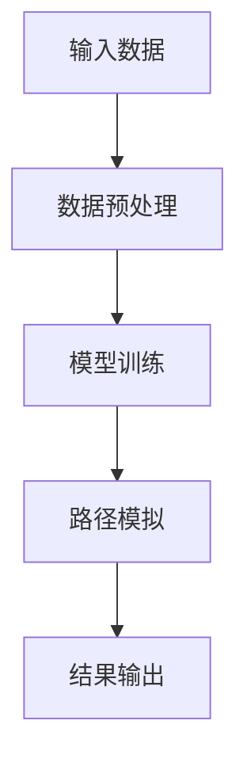
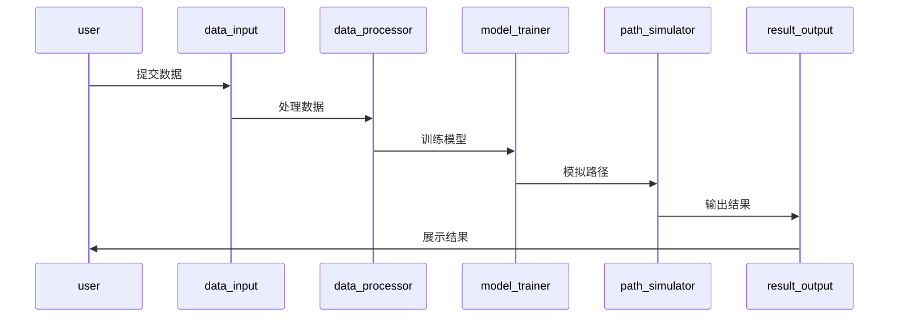

                 


# AI驱动的个人财富积累路径多场景模拟器

> 关键词：AI模拟器，财富管理，多场景模拟，强化学习，神经网络

> 摘要：本文提出了一种基于AI的个人财富积累路径多场景模拟器，通过分析不同场景下的财富积累需求，设计了一种结合强化学习和神经网络的算法，构建了一个高效的系统架构，并通过实际案例验证了该模拟器的有效性。

---

# 第一部分: 问题背景与需求分析

## 第1章: 问题背景

### 1.1 核心概念术语说明
- **AI模拟器**：一种基于人工智能技术的工具，用于模拟和预测个人财富积累的路径。
- **多场景模拟**：在不同的假设条件下，模拟财富积累的过程，找出最优路径。
- **强化学习**：一种机器学习方法，通过不断试错来优化决策。

### 1.2 问题背景
#### 1.2.1 传统财富积累方式的局限性
传统的财富积累方式主要依赖于人工分析和经验判断，存在以下问题：
1. **信息不全**：难以全面考虑市场波动、个人收入变化等多种因素。
2. **效率低下**：人工分析耗时且容易出错。
3. **个性化不足**：难以根据个人的财务状况和风险偏好提供定制化建议。

#### 1.2.2 AI技术在财富管理中的潜力
AI技术可以通过以下方式提升财富管理的效率和准确性：
1. **数据处理能力**：能够快速处理大量复杂的数据，提供实时的市场分析。
2. **自我学习能力**：通过不断学习市场动态和用户行为，优化财富积累策略。
3. **个性化推荐**：基于用户的财务状况和目标，提供个性化的财富管理方案。

#### 1.2.3 当前市场对个性化财富管理的需求
随着经济全球化和市场的复杂化，人们对个性化财富管理的需求日益增长。传统的财富管理方式已经无法满足用户对高效率、高精度的需求。

### 1.3 问题解决思路
#### 1.3.1 AI驱动的解决方案优势
AI驱动的财富积累路径模拟器可以通过以下方式解决传统方法的不足：
1. **自动化分析**：利用AI技术快速分析市场数据和用户信息，提供实时的财富管理建议。
2. **多场景模拟**：在多种假设条件下，模拟财富积累的过程，找出最优路径。
3. **自我优化**：通过强化学习不断优化模拟器的决策能力，提高预测的准确性。

#### 1.3.2 多场景模拟器的设计目标
多场景模拟器的设计目标是为用户提供一种高效、准确的财富积累路径模拟工具，能够在多种假设条件下，找到最优的财富积累策略。

#### 1.3.3 系统边界与功能外延
系统的边界主要限定在财富积累路径的模拟和优化，功能外延包括：
1. 数据输入与处理
2. 模型训练与优化
3. 结果输出与展示

---

## 第2章: 核心概念与系统架构

### 2.1 核心概念原理
#### 2.1.1 AI模拟器的基本原理
AI模拟器通过以下步骤实现财富积累路径的模拟：
1. **数据输入**：获取用户的财务数据和市场数据。
2. **数据预处理**：对数据进行清洗和标准化处理。
3. **模型训练**：利用神经网络模型对数据进行训练，生成财富积累路径的预测模型。
4. **路径模拟**：基于预测模型，模拟不同场景下的财富积累路径。
5. **结果输出**：输出模拟结果，并提供优化建议。

#### 2.1.2 多场景模拟的核心算法
多场景模拟的核心算法包括：
1. **强化学习**：通过试错不断优化决策。
2. **多目标优化**：在多个目标之间找到平衡点，找到最优路径。

#### 2.1.3 系统输入与输出的关系
系统的输入包括用户的财务数据和市场数据，输出包括财富积累路径的预测结果和优化建议。

### 2.2 核心概念对比表
| 概念 | 属性 | 描述 |
|------|------|------|
| AI模拟器 | 输入 | 用户的财务数据、市场数据 |
|        | 输出 | 财富积累路径预测、优化建议 |
| 多场景模拟 | 输入 | 不同场景的假设条件 |
|        | 输出 | 不同场景的模拟结果、最优路径 |

### 2.3 系统架构设计


---

## 第3章: 算法原理与实现

### 3.1 算法原理
#### 3.1.1 基于强化学习的路径优化
强化学习通过试错不断优化路径选择，具体步骤如下：
1. **环境定义**：定义财富积累的环境，包括市场条件、用户目标等。
2. **动作选择**：根据当前状态，选择一个动作（如投资决策）。
3. **奖励机制**：根据动作的结果，给予奖励或惩罚。
4. **策略优化**：根据奖励不断优化策略。

#### 3.1.2 多目标优化算法
多目标优化算法通过在多个目标之间找到平衡点，找到最优路径。常用的算法包括：
1. **遗传算法**：通过模拟自然选择的过程，找到最优解。
2. **粒子群优化算法**：通过模拟粒子的运动，找到最优解。

#### 3.1.3 神经网络模型的应用
神经网络模型可以用于财富积累路径的预测和优化。常用的模型包括：
1. **卷积神经网络（CNN）**：用于处理图像数据。
2. **循环神经网络（RNN）**：用于处理时间序列数据。
3. **深度神经网络（DNN）**：用于复杂的非线性问题。

### 3.2 算法实现步骤


### 3.3 Python代码实现
```python
import numpy as np
import tensorflow as tf

# 定义神经网络模型
class WealthSimulator(tf.keras.Model):
    def __init__(self):
        super(WealthSimulator, self).__init__()
        self.dense1 = tf.keras.layers.Dense(64, activation='relu')
        self.dense2 = tf.keras.layers.Dense(1, activation='sigmoid')

    def call(self, x):
        x = self.dense1(x)
        return self.dense2(x)

# 初始化模型
model = WealthSimulator()

# 定义损失函数和优化器
loss = tf.keras.losses.BinaryCrossentropy()
optimizer = tf.keras.optimizers.Adam()

# 训练模型
model.compile(optimizer=optimizer, loss=loss)
model.fit(x_train, y_train, epochs=10, batch_size=32)
```

### 3.4 算法优化与改进
通过不断优化算法，可以提高模拟器的预测精度和运行效率。常用的优化方法包括：
1. **超参数调整**：通过调整学习率、批量大小等参数，优化模型的性能。
2. **模型剪枝**：通过剪枝操作，减少模型的复杂度，提高运行效率。
3. **集成学习**：通过集成多个模型的结果，提高预测的准确性。

---

## 第4章: 系统分析与架构设计方案

### 4.1 问题场景介绍
系统的主要问题场景包括：
1. **数据输入与处理**：如何高效地处理用户的财务数据和市场数据。
2. **模型训练与优化**：如何快速训练模型并优化其性能。
3. **结果输出与展示**：如何将模拟结果清晰地展示给用户。

### 4.2 系统功能设计
系统的主要功能包括：
1. **数据输入**：用户输入财务数据和市场数据。
2. **数据处理**：对输入数据进行清洗和标准化处理。
3. **模型训练**：利用神经网络模型对数据进行训练，生成财富积累路径的预测模型。
4. **路径模拟**：在不同场景下模拟财富积累路径，找出最优路径。
5. **结果输出**：输出模拟结果，并提供优化建议。

### 4.3 系统架构设计


### 4.4 系统接口设计
系统接口设计包括：
1. **数据接口**：与数据源（如银行账户、股票市场数据）对接，获取实时数据。
2. **用户接口**：通过图形用户界面，让用户输入数据和查看结果。
3. **算法接口**：与AI算法层对接，提供数据和接收结果。

### 4.5 系统交互设计


---

## 第5章: 项目实战

### 5.1 环境安装
需要安装的环境包括：
1. **Python**：推荐使用Python 3.8及以上版本。
2. **TensorFlow**：用于深度学习模型的训练。
3. **Mermaid**：用于绘制系统架构图和流程图。

### 5.2 系统核心实现
```python
import numpy as np
import tensorflow as tf

# 定义神经网络模型
class WealthSimulator(tf.keras.Model):
    def __init__(self):
        super(WealthSimulator, self).__init__()
        self.dense1 = tf.keras.layers.Dense(64, activation='relu')
        self.dense2 = tf.keras.layers.Dense(1, activation='sigmoid')

    def call(self, x):
        x = self.dense1(x)
        return self.dense2(x)

# 初始化模型
model = WealthSimulator()

# 定义损失函数和优化器
loss = tf.keras.losses.BinaryCrossentropy()
optimizer = tf.keras.optimizers.Adam()

# 训练模型
model.compile(optimizer=optimizer, loss=loss)
model.fit(x_train, y_train, epochs=10, batch_size=32)
```

### 5.3 代码应用解读与分析
通过上述代码，可以实现一个简单的财富积累路径模拟器。模型通过训练，能够预测用户的财富积累路径，并提供优化建议。

### 5.4 实际案例分析
以一个典型的财富积累路径为例，模拟器可以预测用户的财富积累情况，并提供优化建议。

### 5.5 项目小结
通过本项目的实施，我们可以看到AI技术在财富管理中的巨大潜力。通过不断优化算法和系统架构，可以进一步提高模拟器的预测精度和运行效率。

---

## 第6章: 最佳实践与注意事项

### 6.1 小结
通过本文的介绍，我们可以看到AI驱动的个人财富积累路径多场景模拟器是一种高效、准确的财富管理工具。通过结合强化学习和神经网络，可以实现财富积累路径的优化和预测。

### 6.2 注意事项
1. **数据隐私**：在处理用户的财务数据时，需要注意数据的隐私和安全。
2. **模型优化**：需要不断优化模型，提高预测的精度和运行效率。
3. **用户体验**：需要提供友好的用户界面，方便用户使用和理解结果。

### 6.3 拓展阅读
1. 《深度学习》——Ian Goodfellow
2. 《强化学习》——Richard S. Sutton
3. 《Python机器学习》——Andreas Müller

---

作者：AI天才研究院/AI Genius Institute & 禅与计算机程序设计艺术 /Zen And The Art of Computer Programming

