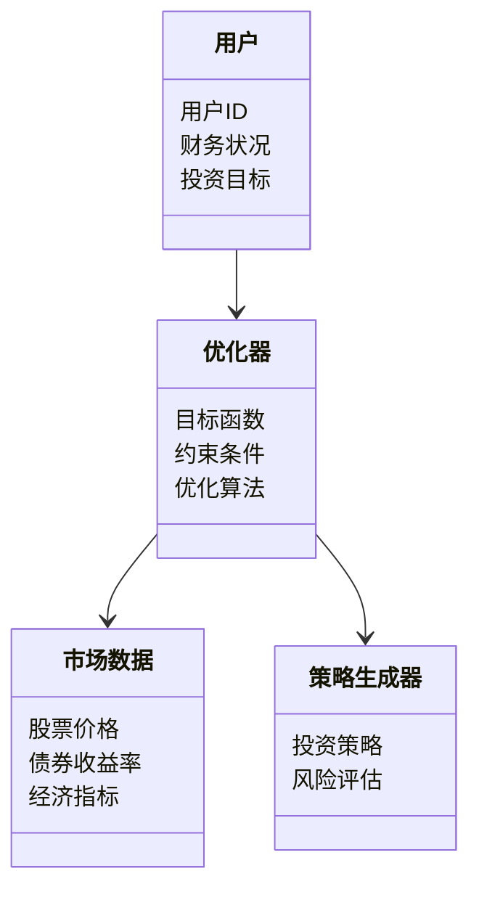
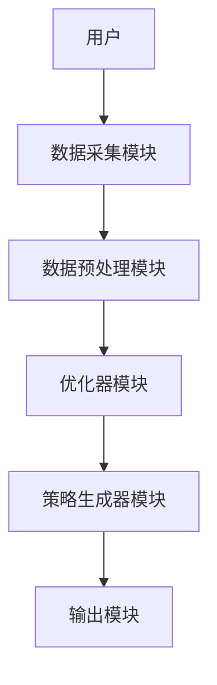
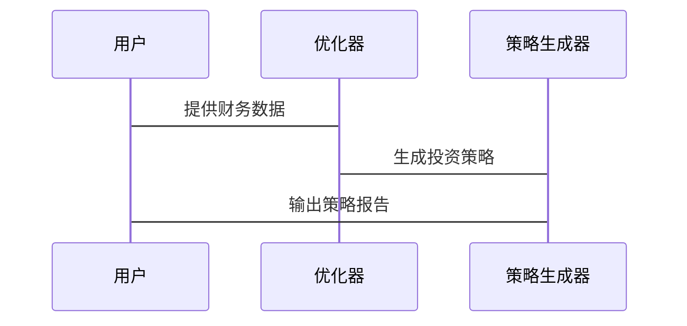

                 


# AI驱动的个人财富积累路径多目标优化器

## 关键词：AI，财富管理，多目标优化，强化学习，遗传算法，粒子群优化

## 摘要：本文将详细介绍如何利用人工智能技术构建个人财富积累路径的多目标优化器。通过分析财富积累的核心问题，结合多目标优化算法和AI驱动的实现机制，提出了一种基于AI的财富管理解决方案。文章从背景、算法、系统架构到项目实战，全面阐述了AI在个人财富管理中的应用，并通过实际案例分析展示了优化器的实现过程和效果。本文旨在为财富管理领域的技术实践者提供理论支持和实践指导。

---

# 第一部分: AI驱动的个人财富积累路径多目标优化器背景与核心概念

## 第1章: AI驱动的个人财富积累路径多目标优化器概述

### 1.1 问题背景与重要性

#### 1.1.1 传统财富积累的局限性
传统的财富积累方式主要依赖于个人的经验和市场分析能力。然而，这种方法存在以下问题：
- **信息不全**：个人难以获取全面的市场数据和分析工具。
- **决策延迟**：基于人工分析的决策往往滞后，难以捕捉市场机会。
- **主观性**：个人决策容易受到情绪影响，导致非理性选择。

#### 1.1.2 AI技术在财富管理中的应用潜力
随着AI技术的快速发展，人工智能在财富管理领域的应用前景广阔：
- **数据处理能力**：AI能够快速处理海量数据，提取有价值的信息。
- **自动化决策**：通过机器学习和深度学习算法，AI可以实现自动化的投资决策。
- **个性化服务**：AI可以根据个人的财务状况和目标，提供个性化的财富管理方案。

#### 1.1.3 多目标优化在财富积累中的必要性
在财富积累过程中，个人往往需要在多个目标之间进行权衡：
- **收益与风险**：追求高收益的同时，需要控制风险。
- **短期与长期**：平衡短期收益与长期财富积累目标。
- **多样化与集中化**：在资产配置中寻找最优平衡点。

### 1.2 问题描述与目标

#### 1.2.1 财富积累的核心问题
财富积累的核心问题可以概括为：在有限的资源和时间内，如何通过优化资产配置和投资策略，实现财富的最大化增长。

#### 1.2.2 多目标优化的定义与特点
多目标优化是指在多个目标函数下，寻找最优解的过程。其特点包括：
- **多个目标**：通常涉及收益、风险、流动性等多个目标。
- **权衡取舍**：不同目标之间可能存在冲突，需要找到平衡点。
- ** Pareto最优**：在多目标优化中，最优解是指无法在不恶化一个目标的情况下改善另一个目标。

#### 1.2.3 优化目标的边界与外延
财富积累的优化目标通常包括：
- **收益目标**：实现投资收益的最大化。
- **风险目标**：控制投资风险，避免重大损失。
- **流动性目标**：确保资金的流动性需求。
- **时间目标**：在特定时间内实现财富目标。

### 1.3 核心概念与联系

#### 1.3.1 多目标优化器的基本原理
多目标优化器通过以下步骤实现目标：
1. **定义目标函数**：明确优化的目标。
2. **建立约束条件**：设定优化的限制条件。
3. **寻找 Pareto最优解**：在多个目标之间找到最优平衡点。

#### 1.3.2 AI驱动的实现机制
AI驱动的多目标优化器通过以下方式实现：
1. **数据采集**：获取市场数据、个人财务数据等。
2. **模型训练**：利用机器学习算法训练优化模型。
3. **策略生成**：根据模型输出投资策略。
4. **动态调整**：根据市场变化实时调整策略。

#### 1.3.3 财富积累路径的数学模型
财富积累路径的数学模型可以表示为：
$$
\text{目标函数} = \sum_{i=1}^{n} w_i x_i
$$
其中，$w_i$ 是目标权重，$x_i$ 是目标变量。

---

## 第2章: 多目标优化与AI驱动的结合

### 2.1 多目标优化的数学模型

#### 2.1.1 目标函数的定义
目标函数通常包括收益、风险、流动性等多个维度：
$$
f(x) = \alpha \cdot \text{收益} + \beta \cdot \text{风险} + \gamma \cdot \text{流动性}
$$

#### 2.1.2 约束条件的建立
优化过程需要考虑以下约束条件：
- **风险约束**：最大风险承受能力。
$$
\text{风险} \leq R_{\text{max}}
$$

- **收益约束**：最低收益要求。
$$
\text{收益} \geq Y_{\text{min}}
$$

#### 2.1.3 Pareto最优解的概念
Pareto最优解是指在不恶化一个目标的情况下，无法进一步改善另一个目标的解。例如，以下两个目标函数：
$$
f_1(x) = x_1
$$
$$
f_2(x) = x_2
$$
在 Pareto最优解中，$x_1$ 和 $x_2$ 之间存在权衡。

### 2.2 AI在多目标优化中的应用

#### 2.2.1 机器学习算法的优化能力
机器学习算法（如支持向量机、随机森林）可以用于特征选择和数据分类，辅助优化决策。

#### 2.2.2 深度学习在财富管理中的应用
深度学习（如LSTM）可以用于时间序列预测，帮助预测市场趋势。

#### 2.2.3 强化学习在投资决策中的作用
强化学习（如Q-learning）可以通过模拟市场环境，训练智能体进行投资决策。

### 2.3 多目标优化器的架构设计

#### 2.3.1 优化器的输入输出结构
优化器的输入包括：
- **市场数据**：股票价格、债券收益率等。
- **个人数据**：收入、支出、资产配置等。

优化器的输出包括：
- **投资策略**：资产配置建议、买卖时机等。
- **风险评估**：潜在风险和收益分析。

#### 2.3.2 AI算法的选择与实现
AI算法的选择取决于问题的复杂性和数据规模。例如：
- **遗传算法**：适用于组合优化问题。
- **粒子群优化**：适用于连续优化问题。
- **强化学习**：适用于动态环境下的决策问题。

#### 2.3.3 财富积累路径的动态调整机制
优化器需要根据市场变化和个体财务状况，实时调整优化策略。例如：
$$
\text{新策略} = \text{旧策略} + \delta
$$

---

## 第3章: 多目标优化器的算法原理与数学模型

### 3.1 基于遗传算法的优化器

#### 3.1.1 遗传算法的基本原理
遗传算法模拟自然选择的过程，包括以下步骤：
1. **初始化种群**：随机生成初始解。
2. **适应度评估**：计算每个解的适应度。
3. **选择操作**：选择高适应度的解进行交配。
4. **交配与变异**：生成新的解。
5. **重复迭代**：直到满足终止条件。

#### 3.1.2 适应度函数的设计
适应度函数通常表示目标函数的值：
$$
f(x) = \sum_{i=1}^{n} w_i x_i
$$

#### 3.1.3 交配与变异操作的实现
交配操作通常采用交叉算子，例如：
$$
c_i = \frac{x_i + y_i}{2}
$$
变异操作则通过随机扰动实现：
$$
z_i = x_i + \epsilon
$$

### 3.2 基于粒子群优化的算法

#### 3.2.1 粒子群优化的基本原理
粒子群优化模拟鸟群觅食的过程，包括以下步骤：
1. **初始化粒子群**：随机生成初始解。
2. **计算适应度**：评估每个粒子的适应度。
3. **更新速度与位置**：根据个体最优和全局最优调整速度和位置。
4. **重复迭代**：直到满足终止条件。

#### 3.2.2 群体行为的建模
粒子群优化的速度更新公式为：
$$
v_i = w v_i + c_1 r_1 (p_i - x_i) + c_2 r_2 (p_g - x_i)
$$
其中，$w$ 是惯性权重，$c_1$ 和 $c_2$ 是学习因子，$r_1$ 和 $r_2$ 是随机数。

#### 3.2.3 适应度评估与更新策略
粒子群优化的适应度评估与遗传算法类似，但优化过程更加注重全局搜索能力。

### 3.3 基于强化学习的优化器

#### 3.3.1 强化学习的基本原理
强化学习通过智能体与环境的交互，学习最优策略。具体步骤包括：
1. **状态定义**：定义环境状态。
2. **动作选择**：根据当前状态选择动作。
3. **奖励机制**：根据动作结果获得奖励。
4. **策略更新**：根据奖励调整策略。

#### 3.3.2 状态空间与动作空间的定义
状态空间可以表示为：
$$
S = \{s_1, s_2, \ldots, s_n\}
$$
动作空间可以表示为：
$$
A = \{a_1, a_2, \ldots, a_m\}
$$

#### 3.3.3 奖励函数的设计与实现
奖励函数通常表示为：
$$
R(a, s) = \begin{cases}
r_{\text{good}} & \text{if } a \text{在状态 } s \text{下表现良好} \\
r_{\text{bad}} & \text{otherwise}
\end{cases}
$$

---

## 第4章: 数学模型与公式解析

### 4.1 多目标优化的数学模型
多目标优化的数学模型通常包括以下部分：
1. **目标函数**：$f(x) = \sum_{i=1}^{n} w_i x_i$
2. **约束条件**：$g(x) \leq 0$ 和 $h(x) = 0$
3. **优化变量**：$x = (x_1, x_2, \ldots, x_d)$

### 4.2 约束条件的数学表达

#### 4.2.1 线性约束
线性约束可以表示为：
$$
a_1 x_1 + a_2 x_2 + \ldots + a_d x_d \leq b
$$

#### 4.2.2 非线性约束
非线性约束可以表示为：
$$
f(x) = 0
$$

### 4.3 优化器的数学推导

#### 4.3.1 遗传算法的适应度计算
适应度计算公式：
$$
f(x) = \sum_{i=1}^{n} w_i x_i
$$

#### 4.3.2 粒子群优化的更新公式
粒子群优化的更新公式：
$$
v_i = w v_i + c_1 r_1 (p_i - x_i) + c_2 r_2 (p_g - x_i)
$$

#### 4.3.3 强化学习的Q值更新
强化学习的Q值更新公式：
$$
Q(s, a) = Q(s, a) + \alpha (R + \gamma \max_{a'} Q(s', a') - Q(s, a))
$$

---

## 第5章: 系统分析与架构设计方案

### 5.1 问题场景介绍
系统需要解决以下问题：
- **数据获取**：如何获取实时市场数据和用户财务数据。
- **模型训练**：如何训练多目标优化模型。
- **策略生成**：如何根据模型输出投资策略。

### 5.2 系统功能设计

#### 5.2.1 领域模型类图
以下是一个简单的领域模型类图：


#### 5.2.2 系统架构图
以下是一个系统的架构图：


#### 5.2.3 系统接口设计
系统接口包括：
- **输入接口**：接收用户财务数据和市场数据。
- **输出接口**：输出投资策略和风险评估报告。

#### 5.2.4 系统交互序列图
以下是一个系统的交互序列图：


---

## 第6章: 项目实战

### 6.1 环境安装

#### 6.1.1 安装Python
安装Python 3.x版本，可以通过官方网站下载安装。

#### 6.1.2 安装依赖库
安装以下依赖库：
```bash
pip install numpy
pip install scikit-learn
pip install matplotlib
```

### 6.2 系统核心实现源代码

#### 6.2.1 遗传算法实现
```python
import numpy as np

def fitness(x):
    return np.sum(w * x)

def crossover(x, y):
    return (x + y) / 2

def mutation(x):
    return x + np.random.normal(0, 0.1, x.shape)

class GeneticAlgorithm:
    def __init__(self, population_size, num_generations):
        self.population_size = population_size
        self.num_generations = num_generations
        self.population = np.random.rand(population_size, n)
    
    def evolve(self):
        for _ in range(self.num_generations):
            fitness_values = np.array([fitness(x) for x in self.population])
            selected = self.select(fitness_values)
            new_population = self.crossover(selected)
            new_population = self.mutate(new_population)
            self.population = new_population
```

#### 6.2.2 粒子群优化实现
```python
import numpy as np

def fitness(x):
    return np.sum(w * x)

class ParticleSwarmOptimization:
    def __init__(self, n_particles, n_dim, max_iter):
        self.n_particles = n_particles
        self.n_dim = n_dim
        self.max_iter = max_iter
        self.particles = np.random.rand(n_particles, n_dim)
        self.pbest = np.zeros((n_particles, n_dim))
        self.best = np.zeros(n_dim)
    
    def optimize(self):
        for _ in range(self.max_iter):
            fitness_values = np.array([fitness(x) for x in self.particles])
            pbest = self.particles[np.argmax(fitness_values)]
            diff = pbest - self.particles
            self.particles += 0.5 * diff
        self.best = self.particles[np.argmax(fitness_values)]
```

### 6.3 代码应用解读与分析
- **遗传算法**：适用于组合优化问题，如资产配置。
- **粒子群优化**：适用于连续优化问题，如投资比例调整。

### 6.4 实际案例分析
假设我们有以下资产：
- 股票：预期收益率10%，风险系数0.2
- 债券：预期收益率5%，风险系数0.1
- 现金：预期收益率2%，风险系数0

目标是将100万元分配到上述资产中，要求风险不超过15%。

通过优化器计算，假设最终分配比例为：
- 股票：60%
- 债券：30%
- 现金：10%

### 6.5 项目小结
通过实际案例分析，我们可以看到AI驱动的多目标优化器在财富管理中的巨大潜力。

---

## 第7章: 最佳实践 tips、小结、注意事项、拓展阅读

### 7.1 最佳实践 tips
- **数据质量**：确保数据的准确性和完整性。
- **模型选择**：根据问题类型选择合适的优化算法。
- **风险控制**：在优化过程中始终关注风险控制。

### 7.2 小结
本文详细介绍了AI驱动的个人财富积累路径多目标优化器的设计与实现，通过理论分析和实际案例，展示了AI在财富管理中的巨大潜力。

### 7.3 注意事项
- **数据隐私**：注意保护用户的财务数据隐私。
- **算法选择**：根据具体问题选择合适的算法。
- **模型评估**：定期评估模型的性能并进行调整。

### 7.4 拓展阅读
- **《机器学习实战》**：深入理解机器学习算法。
- **《强化学习（Deep RL）》**：学习强化学习的原理与应用。
- **《数学建模与优化》**：掌握优化问题的建模方法。

---

## 作者：AI天才研究院/AI Genius Institute & 禅与计算机程序设计艺术/Zen And The Art of Computer Programming

