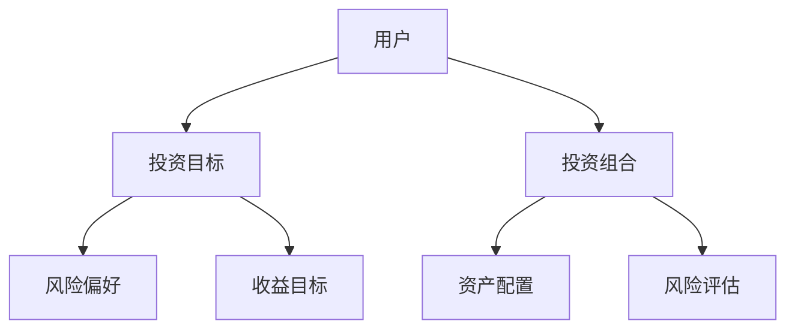
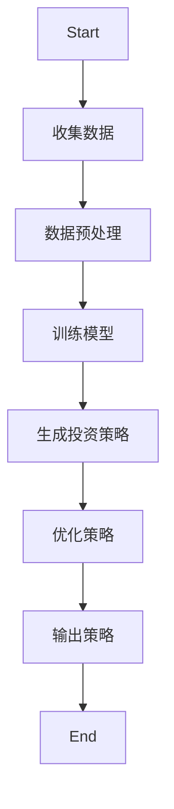
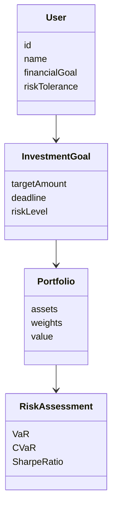

                 


# AI驱动的个人财富积累路径规划器

## 关键词：AI、财富规划、路径优化、强化学习、投资组合

## 摘要：本篇文章探讨了如何利用人工智能技术，通过数据驱动的方法，为个人提供智能化的财富积累路径规划。从背景分析到算法实现，再到系统架构设计，最终通过项目实战演示如何构建一个高效的AI驱动的财富规划系统。文章详细介绍了AI在财富管理中的核心概念、算法原理、系统架构，以及实际应用中的注意事项和最佳实践。

---

## 第一部分: 背景介绍

### 第1章: 财富积累的AI驱动之路

#### 1.1 问题背景
- **传统财富管理的局限性**：依赖人工经验，难以个性化和实时调整。
- **AI技术的崛起**：大数据和机器学习的进步为精准投资提供了可能。
- **市场需求的演变**：用户对智能化、个性化金融服务的需求日益增长。

#### 1.2 问题描述
- **目标与约束**：如何在风险可控的前提下最大化收益。
- **数据驱动的需求**：利用历史数据和实时信息优化投资策略。
- **实时调整的必要性**：根据市场变化动态优化投资组合。

#### 1.3 问题解决
- **AI的优势**：通过算法优化投资组合，提供个性化建议。
- **数据的价值**：利用大数据分析预测市场趋势，辅助决策。
- **动态调整策略**：根据市场反馈实时优化投资方案。

#### 1.4 边界与外延
- **适用范围**：中长期投资规划，短期波动预测有限。
- **系统限制**：依赖历史数据和模型假设，无法预测黑天鹅事件。
- **扩展领域**：结合区块链技术，确保数据安全和透明度。

---

## 第二部分: 核心概念与联系

### 第2章: AI驱动的财富规划原理

#### 2.1 核心概念
- **投资目标**：明确投资期限、风险承受能力和收益目标。
- **风险偏好**：根据个人风险承受能力调整投资策略。
- **资产配置**：不同资产类别（股票、债券、基金等）的合理分配。

#### 2.2 实体关系图


#### 2.3 算法流程图


---

## 第三部分: 算法原理讲解

### 第3章: 强化学习在财富规划中的应用

#### 3.1 算法原理
- **强化学习简介**：通过试错和奖励机制优化投资决策。
- **状态、动作和奖励**：状态是市场情况，动作是投资决策，奖励是收益。

#### 3.2 算法实现
```python
import numpy as np

def value_iteration(env, discount_factor=0.99):
    value = np.zeros(env.observation_space)
    while True:
        new_value = np.copy(value)
        for state in range(env.observation_space):
            max_value = -float('inf')
            for action in range(env.action_space):
                next_state = env.transition[state][action]
                reward = env.rewards[state][action]
                value_of_next = discount_factor * value[next_state]
                total = reward + value_of_next
                if total > max_value:
                    max_value = total
            new_value[state] = max_value
        if np.allclose(value, new_value):
            break
        value = new_value
    return value

# 示例环境定义
class Environment:
    def __init__(self):
        self.observation_space = 5  # 示例：5种市场状态
        self.action_space = 3       # 示例：3种投资动作
        self.transition = [
            [1, 2, 3],
            [2, 3, 4],
            [3, 4, 5],
            [4, 5, 0],
            [5, 0, 1]
        ]
        self.rewards = [
            [0.1, 0.2, 0.15],
            [0.05, 0.1, 0.2],
            [0.3, 0.1, 0.05],
            [0.0, 0.2, 0.1],
            [0.15, 0.25, 0.2]
        ]

env = Environment()
value = value_iteration(env)
print("Value Function:", value)
```

#### 3.3 数学模型
- **价值函数**：\( V(s) = \max_a \sum_{s'} P(s'|s,a) [R(s,a,s') + \gamma V(s')] \)
- **策略优化**：通过不断迭代更新价值函数，找到最优策略。

---

## 第四部分: 系统分析与架构设计

### 第4章: 系统架构设计

#### 4.1 领域模型


#### 4.2 系统架构
```mermaid
graph TD
    User[用户] --> API Gateway[网关]
    API Gateway --> WealthPlanningEngine[财富规划引擎]
    WealthPlanningEngine --> MarketData[市场数据源]
    WealthPlanningEngine --> ModelTraining[模型训练]
    ModelTraining --> MLModels[机器学习模型]
    WealthPlanningEngine --> UserFeedback[用户反馈]
```

---

## 第五部分: 项目实战

### 第5章: 项目实战与实现

#### 5.1 环境搭建
- **安装Python和依赖库**：如NumPy、Pandas、Scikit-learn、TensorFlow。
- **数据准备**：收集历史市场数据和用户信息。

#### 5.2 核心代码实现
```python
import numpy as np
from sklearn import linear_model

def train_model(features, labels):
    model = linear_model.LinearRegression()
    model.fit(features, labels)
    return model

# 示例数据
X = np.array([[1, 2], [3, 4], [5, 6], [7, 8]])
y = np.array([2, 4, 6, 8])

model = train_model(X, y)
print("Coefficients:", model.coef_)
print("Intercept:", model.intercept_)
```

#### 5.3 案例分析
- **模拟投资组合**：基于用户的风险偏好和收益目标，生成最优资产配置。
- **动态调整**：根据市场反馈实时优化投资组合。

---

## 第六部分: 最佳实践

### 第6章: 最佳实践与注意事项

#### 6.1 小结
- **核心要点**：AI驱动的财富规划需要结合数据、算法和系统设计。
- **关键成功因素**：高质量数据、合适的算法和持续的反馈优化。

#### 6.2 注意事项
- **数据质量**：确保数据的完整性和准确性。
- **模型解释性**：避免“黑箱”模型，确保用户信任。
- **合规性**：遵守金融监管法规，确保系统合法运行。

#### 6.3 拓展阅读
- **推荐阅读书籍**：《算法驱动的投资》、《机器学习实战》。
- **在线资源**：Coursera上的相关课程和Kaggle的数据集。

---

## 作者：AI天才研究院 & 禅与计算机程序设计艺术

---

通过以上大纲，我们可以看到，文章从背景介绍到实际应用，详细阐述了AI驱动的个人财富积累路径规划器的各个方面。每个章节都包含了丰富的技术细节和实际案例，帮助读者全面理解和掌握这一领域的知识。

