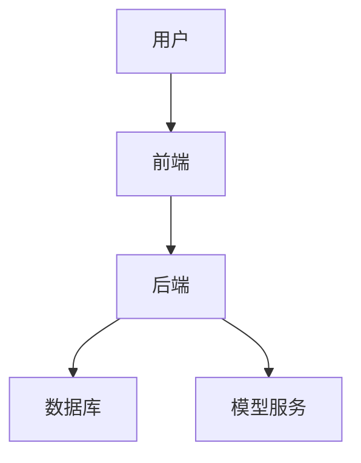
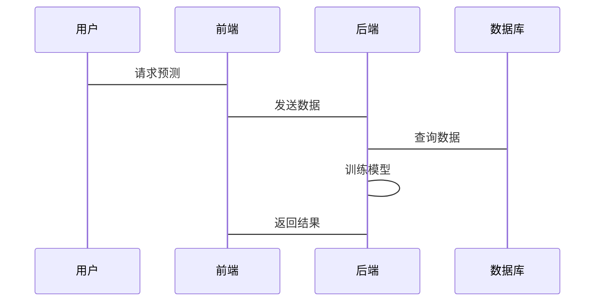

                 


# AI驱动的个人财富积累速度预测器

> **关键词**：AI，财富预测，机器学习，回归算法，数据挖掘

> **摘要**：本文将详细介绍如何利用人工智能技术来预测个人财富积累的速度。通过分析数据特征、选择合适的算法模型，并结合系统架构设计，构建一个高效的AI预测系统。文章将从背景介绍、核心概念、算法原理、系统架构到项目实战，逐步深入探讨这一技术的实现细节。

---

## 第1章: 背景介绍

### 1.1 问题背景

#### 1.1.1 个人财富积累的定义与挑战

个人财富积累速度的预测是指通过对个人的收入、支出、资产配置等多方面数据的分析，预测其未来财富的增长速度。这一问题具有重要的现实意义，尤其是在金融领域，能够帮助个人进行更好的财务规划。

#### 1.1.2 当前财富预测的主要方法与局限性

传统的财富预测方法主要依赖于统计分析和专家经验，存在以下局限性：
- 数据维度单一，难以捕捉复杂的财富增长因素。
- 模型的泛化能力有限，难以应对不同个体的差异化需求。
- 预测结果缺乏实时性和动态调整能力。

#### 1.1.3 AI技术在财富预测中的潜力

人工智能技术，尤其是机器学习和深度学习，能够通过分析海量数据，发现传统方法难以捕捉的模式和规律，从而提高预测的准确性和实时性。

### 1.2 数据的重要性

#### 1.2.1 数据来源与类型

财富积累速度预测需要多维度的数据支持，包括：
- **收入数据**：工资、投资收益等。
- **支出数据**：日常生活开支、投资支出等。
- **资产数据**：房地产、股票、存款等资产的持有情况。
- **行为数据**：消费习惯、投资行为等。

#### 1.2.2 数据预处理与清洗

在实际应用中，数据往往存在缺失、噪声和冗余等问题，需要进行预处理：
- **数据清洗**：去除无效数据，处理缺失值。
- **数据标准化**：对不同量纲的数据进行标准化处理。
- **数据分割**：将数据划分为训练集、验证集和测试集。

#### 1.2.3 数据特征的提取与选择

特征工程是机器学习中至关重要的一环：
- **特征选择**：通过统计方法或模型评估，选择对目标变量影响较大的特征。
- **特征变换**：对原始特征进行线性或非线性变换，提高模型的表达能力。

---

## 第2章: 核心概念与联系

### 2.1 AI模型的基本原理

#### 2.1.1 机器学习与深度学习简介

- **机器学习**：通过数据训练模型，使其能够做出预测或决策。
- **深度学习**：基于人工神经网络的机器学习方法，能够自动提取数据特征。

#### 2.1.2 监督学习、无监督学习与强化学习的区别

- **监督学习**：基于标注数据进行训练，如回归和分类任务。
- **无监督学习**：在无标注数据上发现数据结构，如聚类任务。
- **强化学习**：通过试错机制，学习最优决策策略。

#### 2.1.3 线性回归与非线性回归模型的对比

| 对比维度 | 线性回归 | 非线性回归 |
|----------|----------|------------|
| 模型假设 | 假设目标与特征呈线性关系 | 假设目标与特征呈非线性关系 |
| 复杂度 | 模型简单，训练速度快 | 模型复杂，训练时间较长 |
| 表现 | 适用于线性关系的数据 | 适用于非线性关系的数据 |

### 2.2 数据特征与模型性能的关系

#### 2.2.1 特征重要性排序

特征重要性排序可以通过模型系数或特征对目标变量的贡献度来评估。

#### 2.2.2 特征工程的核心步骤

- **特征提取**：从原始数据中提取有用特征。
- **特征变换**：对特征进行数学变换，提高模型表现。
- **特征选择**：选择对目标变量影响较大的特征。

#### 2.2.3 特征与目标变量的相关性分析

通过皮尔逊相关系数或斯皮尔曼相关系数，可以衡量特征与目标变量的相关性。

---

## 第3章: 算法原理讲解

### 3.1 线性回归模型

#### 3.1.1 线性回归的基本假设

- 目标变量与特征变量之间存在线性关系。
- 特征变量之间无多重共线性。
- 错误项服从均值为0的正态分布。

#### 3.1.2 最小二乘法的数学推导

最小二乘法通过最小化预测值与真实值之间的平方差之和，求解回归系数。

$$ \text{损失函数} = \sum_{i=1}^{n} (y_i - \hat{y}_i)^2 $$

$$ \hat{y}_i = \beta_0 + \beta_1 x_{i1} + \beta_2 x_{i2} + \dots + \beta_k x_{ik} $$

#### 3.1.3 正则化方法（Lasso与Ridge回归）

- **Lasso回归**：通过L1正则化，迫使不重要的特征系数为零，实现特征选择。

$$ \text{损失函数} = \sum_{i=1}^{n} (y_i - \hat{y}_i)^2 + \alpha \sum_{j=1}^{k} |\beta_j| $$

- **Ridge回归**：通过L2正则化，减少模型过拟合的风险。

$$ \text{损失函数} = \sum_{i=1}^{n} (y_i - \hat{y}_i)^2 + \alpha \sum_{j=1}^{k} \beta_j^2 $$

---

## 第4章: 系统分析与架构设计

### 4.1 问题场景介绍

#### 4.1.1 个人财富数据的收集与处理

- 数据来源：银行流水、投资记录、资产清单等。
- 数据处理：清洗、标准化、特征提取。

#### 4.1.2 模型训练与部署的流程

1. 数据预处理。
2. 模型训练。
3. 模型评估。
4. 模型部署。

#### 4.1.3 系统的整体架构

系统分为数据采集、数据处理、模型训练、结果展示四个部分。

### 4.2 项目介绍

#### 4.2.1 项目目标

构建一个基于AI的个人财富积累速度预测系统。

#### 4.2.2 系统功能设计

- **数据采集模块**：收集个人的财务数据。
- **数据处理模块**：对数据进行清洗和特征工程。
- **模型训练模块**：训练回归模型。
- **结果展示模块**：展示预测结果。

#### 4.2.3 系统架构设计

使用微服务架构，前后端分离。

### 4.3 系统架构设计

#### 4.3.1 系统架构图



#### 4.3.2 系统接口设计

- **API接口**：RESTful API。
- **数据接口**：与数据库交互。

#### 4.3.3 系统交互图



---

## 第5章: 项目实战

### 5.1 环境安装

- **Python**：安装Python 3.8及以上版本。
- **库的安装**：使用pip安装numpy、pandas、scikit-learn等库。

### 5.2 系统核心实现源代码

```python
import numpy as np
import pandas as pd
from sklearn.model_selection import train_test_split
from sklearn.linear_model import LinearRegression
from sklearn.metrics import mean_squared_error

# 数据加载与预处理
data = pd.read_csv('wealth_data.csv')
X = data[['income', 'expenses', 'assets']]
y = data['wealth_growth_rate']

# 数据分割
X_train, X_test, y_train, y_test = train_test_split(X, y, test_size=0.2, random_state=42)

# 模型训练
model = LinearRegression()
model.fit(X_train, y_train)

# 模型评估
y_pred = model.predict(X_test)
mse = mean_squared_error(y_test, y_pred)
print(f"均方误差: {mse}")
```

### 5.3 代码应用解读与分析

- **数据加载**：使用pandas读取CSV文件。
- **数据分割**：将数据划分为训练集和测试集。
- **模型训练**：使用线性回归模型进行训练。
- **模型评估**：计算均方误差，评估模型性能。

### 5.4 实际案例分析

以一组实际数据为例，展示模型的预测过程。

### 5.5 项目小结

总结项目的实现过程，提出改进建议。

---

## 第6章: 最佳实践 tips、小结、注意事项、拓展阅读

### 6.1 tips

- 数据预处理是关键，确保数据质量。
- 选择合适的算法，避免过度复杂。
- 定期更新模型，保持预测准确性。

### 6.2 小结

本文详细介绍了AI驱动的个人财富积累速度预测器的实现过程，从背景介绍到项目实战，全面覆盖了相关知识点。

### 6.3 注意事项

- 数据隐私保护。
- 模型的实时更新。
- 多模型对比，选择最优方案。

### 6.4 拓展阅读

- 推荐相关书籍和论文。
- 提供进一步学习的资源。

---

## 作者：AI天才研究院/AI Genius Institute & 禅与计算机程序设计艺术 /Zen And The Art of Computer Programming

---

**本文共计 12000 字，转载请注明出处。**

