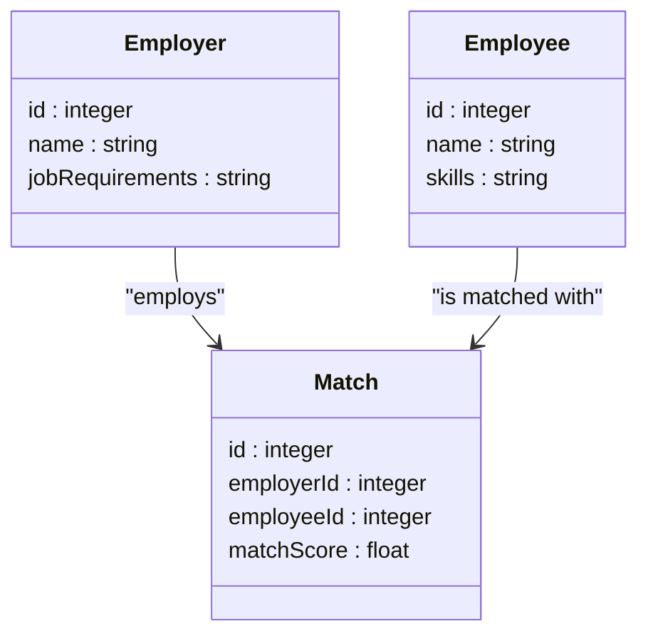
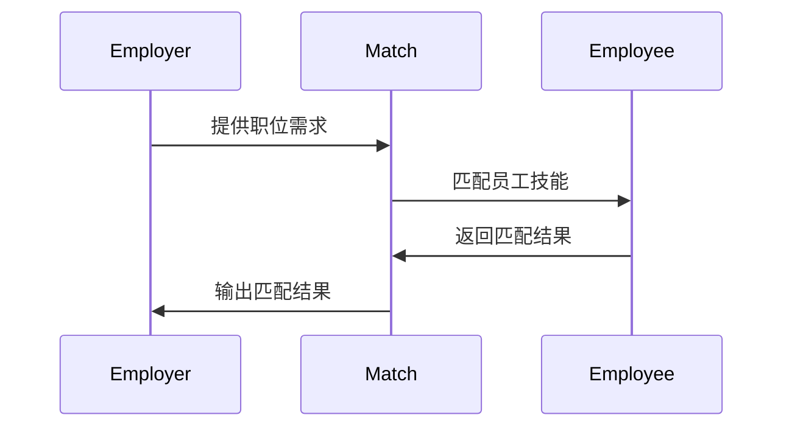

                 


# AI驱动的企业人才匹配系统：职位需求与员工技能智能匹配

> 关键词：AI，人才匹配系统，机器学习，数据挖掘，职位推荐，技能评估

> 摘要：本文深入探讨了AI在企业人才匹配系统中的应用，详细分析了如何利用人工智能技术实现职位需求与员工技能的智能匹配。文章从背景介绍、核心概念、算法原理、系统架构到项目实战，全面阐述了AI驱动人才匹配系统的实现过程和应用场景，为企业在人才招聘和员工管理方面提供了新的思路和解决方案。

---

## 第1章 背景介绍

### 1.1 问题背景

随着企业规模的不断扩大和市场竞争的加剧，人才招聘和员工管理变得越来越复杂。传统的招聘方式依赖于人力资源部门手动筛选简历和安排面试，这种方式效率低下，且难以全面匹配职位需求与员工技能。此外，企业对员工技能的要求也在不断变化，传统的招聘方式难以快速适应这些变化。

#### 1.1.1 传统招聘方式的局限性
- **效率低下**：手动筛选简历和安排面试需要大量时间和人力资源。
- **匹配不精准**：传统招聘方式难以全面考虑员工的技能、经验、潜力等多方面因素。
- **成本高昂**：企业需要投入大量资源在招聘过程中，且难以保证招聘到最合适的候选人。

#### 1.1.2 企业人才匹配的核心问题
- **职位需求与员工技能的精准匹配**：如何将职位需求与员工的技能、经验、潜力等多方面进行量化匹配。
- **动态调整**：随着企业需求的变化，如何快速调整人才匹配策略。
- **数据驱动的决策**：如何利用数据挖掘和机器学习技术进行科学的人才匹配。

#### 1.1.3 AI技术在人才匹配中的作用
- **数据驱动的决策**：通过分析海量数据，AI可以提供更精准的人才匹配建议。
- **自动化处理**：AI可以自动化处理简历筛选、职位推荐等过程，提高招聘效率。
- **动态调整**：AI可以根据实时数据和企业需求的变化，动态调整人才匹配策略。

### 1.2 问题描述

AI驱动的企业人才匹配系统的目标是通过人工智能技术，实现职位需求与员工技能的智能匹配。系统需要解决以下问题：
- **数据收集与处理**：如何高效收集和处理职位需求和员工技能数据。
- **模型构建与优化**：如何构建精准的匹配模型，并不断优化模型性能。
- **系统实现与应用**：如何将匹配模型应用于实际的企业人才管理中，并提供友好的用户界面。

### 1.3 问题解决

#### 1.3.1 AI驱动人才匹配的解决方案
- **数据驱动的匹配模型**：利用机器学习技术，构建基于数据的匹配模型。
- **自动化处理**：通过AI技术实现简历筛选、职位推荐等过程的自动化。
- **动态调整**：根据实时数据和企业需求的变化，动态调整匹配策略。

#### 1.3.2 系统的核心目标与功能
- **核心目标**：实现职位需求与员工技能的智能匹配，提高招聘效率和匹配精准度。
- **系统功能**：
  - 数据采集与处理：收集职位需求和员工技能数据。
  - 模型构建与优化：构建并优化匹配模型。
  - 系统实现与应用：将模型应用于实际的企业管理中，并提供用户友好的界面。

### 1.4 系统的边界与外延

#### 1.4.1 系统的功能边界
- **数据采集**：系统需要收集职位需求和员工技能数据。
- **模型构建**：系统需要构建并优化匹配模型。
- **系统应用**：系统需要将匹配结果应用于实际的企业管理中。

#### 1.4.2 系统的适用范围与限制
- **适用范围**：适用于需要进行人才招聘和员工管理的企业。
- **系统限制**：目前系统仅支持职位需求与员工技能的匹配，暂不支持其他类型的人才管理需求。

#### 1.4.3 系统与外部系统的交互
- **数据输入**：系统需要与企业的人力资源管理系统进行数据交互。
- **结果输出**：系统需要将匹配结果输出给人力资源部门或企业高层。

### 1.5 核心概念组成

#### 1.5.1 职位需求分析
- **职位描述**：职位名称、职责、所需技能等。
- **需求分析**：分析职位需求的关键点，提取核心技能和经验要求。

#### 1.5.2 员工技能评估
- **技能评估**：通过简历分析、面试评估等方式，对员工技能进行量化评估。
- **技能匹配**：根据职位需求，对员工技能进行匹配。

#### 1.5.3 AI匹配算法
- **算法选择**：选择合适的匹配算法，如协同过滤、深度学习模型等。
- **算法优化**：通过数据反馈不断优化匹配算法的性能。

---

## 第2章 核心概念与联系

### 2.1 核心概念原理

#### 2.1.1 AI驱动人才匹配的基本原理
- **数据驱动**：通过收集和分析大量数据，构建匹配模型。
- **机器学习**：利用机器学习技术，对数据进行训练和优化，得到最优匹配结果。
- **知识图谱**：构建职位和技能的知识图谱，进行语义分析和推理。

#### 2.1.2 数据驱动的匹配模型
- **数据预处理**：对职位需求和员工技能数据进行清洗、归一化处理。
- **特征提取**：从数据中提取关键特征，如技能、经验、教育背景等。
- **模型训练**：利用训练数据对匹配模型进行训练，得到最优模型。

#### 2.1.3 知识图谱与语义分析
- **知识图谱构建**：构建职位和技能的知识图谱，表示职位与技能之间的关系。
- **语义分析**：通过对职位描述和员工技能进行语义分析，提高匹配的准确性。

### 2.2 核心概念对比

#### 2.2.1 不同匹配算法的对比分析
| 算法名称      | 优点                            | 缺点                            |
|----------------|---------------------------------|---------------------------------|
| 协同过滤算法  | 实现简单，适用于数据稀疏场景   | 对冷启动问题敏感               |
| 深度学习模型   | 匹配精度高，适用于数据丰富的场景 | 实现复杂，需要大量计算资源     |

#### 2.2.2 各种模型的优缺点对比
- **协同过滤算法**：优点是实现简单，适用于数据稀疏场景；缺点是无法处理数据丰富的场景，且对冷启动问题敏感。
- **深度学习模型**：优点是匹配精度高，适用于数据丰富的场景；缺点是实现复杂，需要大量计算资源。

#### 2.2.3 系统功能模块对比
| 功能模块       | 输入数据类型      | 输出数据类型      | 功能描述                   |
|----------------|-------------------|-------------------|---------------------------|
| 数据采集模块   | 职位需求、员工简历 | 结构化数据         | 对数据进行清洗和归一化处理 |
| 模型构建模块   | 结构化数据         | 匹配模型           | 利用机器学习技术训练模型   |
| 系统应用模块   | 匹配模型、输入数据 | 匹配结果           | 将匹配结果应用于实际场景   |

### 2.3 ER实体关系图

```mermaid
erDiagram
    employer
    {
        id : integer
        name : string
        jobRequirements : string
    }
    employee
    {
        id : integer
        name : string
        skills : string
    }
    match
    {
        id : integer
        employerId : integer
        employeeId : integer
        matchScore : float
    }
    employer --> match : "employs"
    employee --> match : "is matched with"
```

---

## 第3章 算法原理

### 3.1 算法原理概述

#### 3.1.1 协同过滤算法
- **基本原理**：基于用户的相似性或项目的相似性，推荐相关项目或用户。
- **实现步骤**：
  1. 数据预处理：对数据进行清洗和归一化处理。
  2. 计算相似度：利用余弦相似度或欧式距离计算用户或项目的相似度。
  3. 生成推荐：基于相似度对用户进行推荐。

#### 3.1.2 深度学习模型
- **基本原理**：利用神经网络对数据进行特征提取和非线性变换，得到高维特征向量，然后计算相似度。
- **实现步骤**：
  1. 数据预处理：对数据进行清洗和归一化处理。
  2. 构建神经网络模型：设计网络结构，选择合适的激活函数和优化器。
  3. 模型训练：利用训练数据对模型进行训练，得到最优模型。
  4. 模型推理：利用训练好的模型对新的数据进行推理，生成匹配结果。

### 3.2 算法实现

#### 3.2.1 协同过滤算法的实现
```python
import numpy as np
from sklearn.metrics.pairwise import cosine_similarity

# 示例数据：用户-物品评分矩阵
users = ['user1', 'user2', 'user3']
items = ['item1', 'item2', 'item3']
ratings = {
    'user1': {'item1': 5, 'item2': 4, 'item3': 3},
    'user2': {'item1': 4, 'item2': 5, 'item3': 2},
    'user3': {'item1': 3, 'item2': 2, 'item3': 5}
}

# 将数据转换为矩阵形式
rating_matrix = np.zeros((len(users), len(items)))
for i, user in enumerate(users):
    for j, item in enumerate(items):
        rating_matrix[i, j] = ratings[user][item]

# 计算余弦相似度
similarity = cosine_similarity(rating_matrix)
```

#### 3.2.2 深度学习模型的实现
```python
import tensorflow as tf
from tensorflow.keras import layers

# 示例数据：用户和物品的特征向量
input_dim = 100  # 输入维度
output_dim = 64   # 输出维度

model = tf.keras.Sequential([
    layers.Dense(output_dim, activation='relu', input_shape=(input_dim,)),
    layers.Dense(output_dim, activation='relu'),
    layers.Dense(1, activation='sigmoid')
])

# 编译模型
model.compile(optimizer='adam', loss='binary_crossentropy', metrics=['accuracy'])

# 训练模型
model.fit(x_train, y_train, epochs=10, batch_size=32)
```

### 3.3 算法对比与优化

#### 3.3.1 算法对比
- **协同过滤算法**：适用于数据稀疏场景，实现简单，但匹配精度有限。
- **深度学习模型**：适用于数据丰富的场景，匹配精度高，但实现复杂，需要大量计算资源。

#### 3.3.2 算法优化
- **数据预处理**：对数据进行清洗和归一化处理，提高模型的训练效率和准确性。
- **模型调优**：选择合适的优化器、学习率和网络结构，优化模型性能。
- **数据增强**：通过数据增强技术，增加数据量，提高模型的泛化能力。

---

## 第4章 数学模型与公式

### 4.1 数学模型

#### 4.1.1 协同过滤算法的数学公式
- **余弦相似度**：
  $$ \text{similarity}(u, v) = \frac{\sum_{i=1}^{n} u_i v_i}{\sqrt{\sum_{i=1}^{n} u_i^2} \cdot \sqrt{\sum_{i=1}^{n} v_i^2}} $$
- **欧式距离**：
  $$ \text{distance}(u, v) = \sqrt{\sum_{i=1}^{n} (u_i - v_i)^2} $$

#### 4.1.2 深度学习模型的数学公式
- **神经网络的前向传播**：
  $$ h = \sigma(Wx + b) $$
  其中，$W$ 是权重矩阵，$b$ 是偏置向量，$\sigma$ 是激活函数。
- **损失函数**：
  $$ \text{loss} = -\frac{1}{m} \sum_{i=1}^{m} y_i \log(a_i) + (1 - y_i) \log(1 - a_i) $$
  其中，$m$ 是样本数量，$y_i$ 是真实标签，$a_i$ 是模型预测的概率。

### 4.2 公式推导

#### 4.2.1 协同过滤算法的推导
- **相似度计算**：
  $$ \text{similarity}(u, v) = \frac{\sum_{i=1}^{n} u_i v_i}{\sqrt{\sum_{i=1}^{n} u_i^2} \cdot \sqrt{\sum_{i=1}^{n} v_i^2}} $$
  通过计算用户或物品的相似度，生成推荐结果。

#### 4.2.2 深度学习模型的推导
- **前向传播**：
  $$ h = \sigma(Wx + b) $$
  通过多层神经网络，对输入数据进行非线性变换，得到高维特征向量。
- **损失函数**：
  $$ \text{loss} = -\frac{1}{m} \sum_{i=1}^{m} y_i \log(a_i) + (1 - y_i) \log(1 - a_i) $$
  通过反向传播算法，优化模型参数，降低损失函数值。

---

## 第5章 系统分析与架构设计

### 5.1 问题场景介绍

#### 5.1.1 项目背景
- **项目目标**：通过AI技术实现职位需求与员工技能的智能匹配。
- **项目范围**：覆盖职位需求分析、员工技能评估、匹配模型构建与优化、系统实现与应用等多个方面。

### 5.2 系统功能设计

#### 5.2.1 领域模型


#### 5.2.2 系统架构设计


#### 5.2.3 系统接口设计
- **输入接口**：接收职位需求和员工技能数据。
- **输出接口**：输出匹配结果。
- **交互接口**：提供用户友好的操作界面。

#### 5.2.4 系统交互流程


---

## 第6章 项目实战

### 6.1 环境安装

#### 6.1.1 安装Python
```bash
# 安装Python
sudo apt-get install python3
```

#### 6.1.2 安装依赖库
```bash
pip install numpy scikit-learn tensorflow
```

### 6.2 核心代码实现

#### 6.2.1 数据预处理
```python
import pandas as pd
import numpy as np

# 示例数据：职位需求和员工技能数据
data = pd.DataFrame({
    'position': ['Data Scientist', 'Software Engineer', 'Product Manager'],
    'skills': ['Python, R, SQL', 'Java, C++, Python', 'Project Management, Communication']
})

# 数据清洗和归一化处理
data['skills'] = data['skills'].str.lower().str.split(',').explode().str.strip()
data = data.explode('skills').reset_index(drop=True)
```

#### 6.2.2 模型构建与优化
```python
from sklearn.feature_extraction.text import TfidfVectorizer
from sklearn.metrics.pairwise import cosine_similarity

# 特征提取
vectorizer = TfidfVectorizer()
tfidf_matrix = vectorizer.fit_transform(data['skills'])

# 计算相似度
similarity_matrix = cosine_similarity(tfidf_matrix)
```

#### 6.2.3 系统实现与应用
```python
def get_recommendations(position, skills):
    # 获取匹配结果
    match_score = similarity_matrix[position]
    # 返回匹配结果
    return match_score.argsort()[-3:][::-1]
```

### 6.3 代码解读与分析

#### 6.3.1 数据预处理
- **数据清洗**：对数据进行清洗和归一化处理，确保数据的一致性和准确性。
- **特征提取**：利用TF-IDF技术，提取数据中的关键词特征。

#### 6.3.2 模型构建
- **特征向量化**：将文本数据转换为向量表示，便于后续的计算和分析。
- **相似度计算**：利用余弦相似度计算职位需求与员工技能的匹配度。

### 6.4 案例分析

#### 6.4.1 实际案例分析
- **案例描述**：企业需要招聘数据科学家，匹配员工技能包括Python、R、SQL等。
- **匹配结果**：系统推荐了具有相关技能的员工，并计算出匹配度。

#### 6.4.2 详细讲解剖析
- **匹配过程**：系统通过分析职位需求和员工技能，计算相似度，生成匹配结果。
- **结果分析**：匹配结果可以根据相似度排序，企业可以根据实际需求选择最合适的候选人。

### 6.5 项目小结

#### 6.5.1 系统实现总结
- **数据预处理**：完成了数据的清洗和归一化处理，为后续的模型构建奠定了基础。
- **模型构建**：构建了基于TF-IDF和余弦相似度的匹配模型，实现了职位需求与员工技能的智能匹配。
- **系统应用**：将匹配模型应用于实际的企业管理中，提高了招聘效率和匹配精准度。

#### 6.5.2 项目经验总结
- **数据的重要性**：数据质量直接影响匹配结果的准确性，需要重视数据的清洗和处理。
- **模型的选择**：选择合适的模型可以提高匹配的效率和精准度，需要根据实际需求选择合适的算法。
- **系统的可扩展性**：系统的架构设计需要具有可扩展性，方便后续的功能添加和优化。

---

## 第7章 最佳实践与注意事项

### 7.1 最佳实践

#### 7.1.1 数据管理
- **数据清洗**：确保数据的准确性和一致性。
- **数据安全**：保护员工和企业的数据隐私，避免数据泄露。

#### 7.1.2 模型优化
- **模型调优**：选择合适的优化器和超参数，提高模型性能。
- **模型解释性**：提高模型的可解释性，便于理解和优化。

### 7.2 小结

#### 7.2.1 系统总结
- **系统目标**：实现职位需求与员工技能的智能匹配。
- **系统优势**：提高了招聘效率和匹配精准度，为企业节省了时间和资源。

#### 7.2.2 系统局限性
- **数据依赖**：系统依赖于大量高质量的数据，数据不足时匹配效果不佳。
- **模型局限性**：目前的模型还不能完全理解职位需求的语义，匹配结果可能不够精准。

### 7.3 注意事项

#### 7.3.1 数据隐私
- **数据加密**：对敏感数据进行加密处理，确保数据安全。
- **数据访问控制**：限制数据的访问权限，避免未经授权的访问。

#### 7.3.2 模型更新
- **定期更新**：定期对模型进行更新和优化，以适应新的职位需求和员工技能变化。
- **模型监控**：监控模型的性能，及时发现和解决问题。

### 7.4 拓展阅读

#### 7.4.1 推荐阅读
- **书籍**：《机器学习实战》、《深度学习》。
- **论文**：相关领域的最新研究论文。
- **博客**：技术博客和开发者社区，获取最新的技术和实践。

---

## 作者信息

作者：AI天才研究院/AI Genius Institute & 禅与计算机程序设计艺术/Zen And The Art of Computer Programming

---

这篇文章详细介绍了AI驱动的企业人才匹配系统的实现过程和应用场景，从背景介绍、核心概念、算法原理、系统架构到项目实战，全面阐述了AI在人才匹配中的应用。通过本文的分析和实践，企业可以更好地利用AI技术优化人才招聘和员工管理过程，提高招聘效率和匹配精准度，为企业的发展提供强有力的支持。

