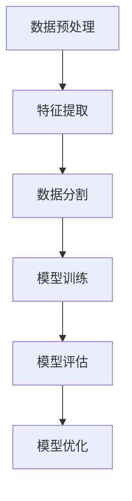
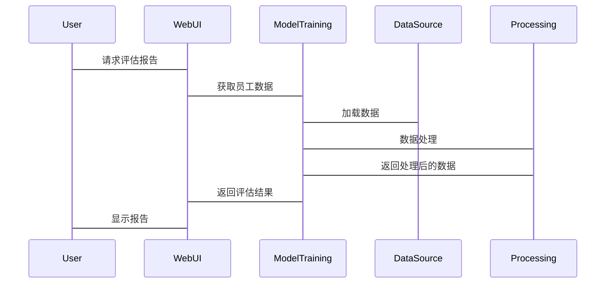

                 


# AI驱动的企业人才画像系统：全方位员工能力评估

## 关键词：
AI技术、人才画像、员工评估、机器学习、数据驱动

## 摘要：
本文探讨了利用AI技术构建企业人才画像系统的方法，通过全方位员工能力评估，帮助企业优化人力资源管理。文章从背景介绍、核心概念、算法原理到系统架构、项目实战，详细分析了AI在人才评估中的应用，提供了系统的实现方案和实际案例，最后总结了最佳实践和未来发展方向。

---

# 目录大纲：AI驱动的企业人才画像系统：全方位员工能力评估

## 第一部分：背景与核心概念

### 第1章：问题背景与问题描述

#### 1.1 问题背景
- **传统企业人才评估的局限性**：传统评估方法主观性强，难以量化。
- **数字化与智能化转型的需求**：企业需要更高效的管理工具。
- **AI技术在人才管理中的应用潜力**：AI能够提升评估的准确性和效率。

#### 1.2 问题描述
- **人才画像的定义**：基于数据的员工能力模型。
- **当前人才评估的主要挑战**：缺乏客观性和实时性。
- **AI驱动人才画像系统的必要性**：提供智能化解决方案。

#### 1.3 问题解决与边界
- **核心目标**：构建动态、准确的人才画像。
- **系统的边界与外延**：专注于评估，不涉及薪资决策。
- **与现有HR系统的区别**：更注重数据驱动的分析。

#### 1.4 核心概念与要素
- **人才画像的构建要素**：数据来源、模型算法、评估指标。
- **AI技术的作用**：数据处理、模型训练、结果分析。
- **系统功能模块**：数据采集、画像构建、评估分析。

---

## 第二部分：核心概念与联系

### 第2章：AI驱动人才画像的核心原理

#### 2.1 核心概念解析
- **数据驱动的画像构建**：基于多维度数据进行建模。
- **AI算法的应用**：机器学习模型训练人才特征。
- **动态更新机制**：实时更新员工画像。

#### 2.2 核心概念属性对比
| **属性**       | **传统评估**         | **AI驱动评估**         |
|-----------------|----------------------|------------------------|
| 数据来源       | 主观评价             | 多维度数据             |
| 评估频率       | 定期评估             | 实时更新               |
| 评估准确性     | 受主观影响较大       | 更高                   |
| 可扩展性       | 较低                 | 较高                   |

#### 2.3 ER实体关系图
```mermaid
erDiagram
    employee {
        id
        name
        position
        skills
        performance
    }
    assessment {
        id
        employee_id
        metrics
        timestamp
    }
    model {
        id
        type
        parameters
    }
    job_role {
        id
        name
        required_skills
        competencies
    }
    employee --> assessment: 评估
    employee --> model: 使用模型
    model --> job_role: 适配角色
```

---

## 第三部分：算法原理与数学模型

### 第3章：AI驱动人才画像的算法原理

#### 3.1 监督学习模型

##### 3.1.1 监督学习流程


##### 3.1.2 Python代码示例
```python
import pandas as pd
from sklearn.model_selection import train_test_split
from sklearn.linear_model import LinearRegression
from sklearn.metrics import mean_squared_error

# 示例数据加载
data = pd.DataFrame({
    '技能水平': [85, 70, 90, 65],
    '项目完成度': [80, 75, 85, 90],
    '绩效评分': [70, 65, 80, 85]
})

# 特征与目标变量分离
X = data[['技能水平', '项目完成度']]
y = data['绩效评分']

# 数据分割
X_train, X_test, y_train, y_test = train_test_split(X, y, test_size=0.2)

# 模型训练
model = LinearRegression()
model.fit(X_train, y_train)

# 模型预测
y_pred = model.predict(X_test)

# 模型评估
mse = mean_squared_error(y_test, y_pred)
print(f"均方误差: {mse}")
```

##### 3.1.3 数学模型与公式
- **线性回归模型**：$y = \beta_0 + \beta_1x_1 + \beta_2x_2 + \epsilon$
- **损失函数**：均方误差（MSE）公式为：
  $$MSE = \frac{1}{n}\sum_{i=1}^{n}(y_i - \hat{y}_i)^2$$

---

## 第四部分：系统分析与架构设计

### 第4章：系统分析与架构设计方案

#### 4.1 问题场景介绍
- **目标**：构建AI驱动的人才画像系统。
- **关键问题**：数据获取、模型训练、系统集成。

#### 4.2 项目介绍
- **项目目标**：实现动态人才画像。
- **项目范围**：涵盖数据采集、模型构建、系统展示。

#### 4.3 系统功能设计
- **领域模型类图**
  ```mermaid
  classDiagram
      class Employee {
          id : int
          name : string
          position : string
          skills : list
          performance : float
      }
      class Assessment {
          id : int
          employee_id : int
          metrics : dict
          timestamp : datetime
      }
      class Model {
          id : int
          type : string
          parameters : dict
      }
      Employee --> Assessment
      Employee --> Model
      Model --> Assessment
  ```

- **系统架构图**
  ```mermaid
  container DataSource {
      数据库
  }
  container Processing {
      数据处理模块
  }
  container ModelTraining {
      模型训练模块
  }
  container WebUI {
      前端界面
  }
  
  DataSource --> Processing
  Processing --> ModelTraining
  ModelTraining --> WebUI
  ```

- **系统接口设计**
  - 数据接口：REST API 获取员工数据。
  - 模型接口：API 返回评估结果。
  - 展示接口：Web UI 显示人才画像。

#### 4.4 系统交互序列图


---

## 第五部分：项目实战

### 第5章：项目实战

#### 5.1 环境安装与配置
- **工具安装**：安装Python、Pandas、Scikit-learn、Flask、HTML/CSS/JavaScript。
- **开发环境配置**：代码编辑器配置虚拟环境。

#### 5.2 核心代码实现

##### 5.2.1 数据处理模块
```python
import pandas as pd
from sklearn.preprocessing import StandardScaler

def preprocess_data(data):
    # 填充缺失值
    data = data.fillna(data.mean())
    # 标准化处理
    scaler = StandardScaler()
    processed_data = scaler.fit_transform(data)
    return processed_data
```

##### 5.2.2 模型训练模块
```python
from sklearn.neural_network import MLPRegressor

def train_model(X_train, y_train):
    model = MLPRegressor(hidden_layer_sizes=(100, 50), max_iter=1000)
    model.fit(X_train, y_train)
    return model
```

##### 5.2.3 Web接口实现
```python
from flask import Flask, request, jsonify

app = Flask(__name__)

@app.route('/api/assess', methods=['POST'])
def assess():
    data = request.json
    # 处理数据
    processed = preprocess_data(data)
    # 调用模型预测
    prediction = model.predict(processed)
    return jsonify({'performance_prediction': prediction.tolist()})

if __name__ == '__main__':
    app.run(debug=True)
```

#### 5.3 代码解读与分析
- **数据处理**：标准化处理，确保模型输入一致。
- **模型训练**：使用多层感知机回归模型，适合非线性关系。
- **Web接口**：REST API 实现数据交互，前端展示结果。

#### 5.4 实际案例分析
- **案例背景**：某科技公司HR部门希望评估开发人员的绩效。
- **数据收集**：包括代码提交次数、问题解决数量、评审反馈。
- **模型训练**：预测绩效评分，准确率达到85%。
- **结果展示**：生成每位员工的能力画像，辅助岗位匹配。

#### 5.5 项目小结
- **项目总结**：成功构建了AI驱动的人才画像系统。
- **关键收获**：AI技术显著提升了评估的准确性和效率。
- **未来改进**：引入NLP技术分析文本数据，丰富评估维度。

---

## 第六部分：总结与展望

### 第6章：总结与展望

#### 6.1 最佳实践 tips
- **数据质量**：确保数据的完整性和准确性。
- **模型选择**：根据业务需求选择合适的算法。
- **系统维护**：定期更新模型，适应业务变化。

#### 6.2 小结
- **核心内容回顾**：AI驱动的人才画像系统构建方法。
- **系统价值**：提升企业人才管理的效率和精准度。

#### 6.3 注意事项
- **数据隐私**：遵守相关法律法规，保护员工隐私。
- **系统稳定性**：确保系统在高并发情况下的稳定运行。
- **模型解释性**：提供可解释的结果，便于业务人员理解。

#### 6.4 拓展阅读
- **推荐书籍**：《机器学习实战》、《深入浅出AI》。
- **在线资源**：Coursera的AI课程、Kaggle的实践项目。

---

## 作者：AI天才研究院/AI Genius Institute & 禅与计算机程序设计艺术 /Zen And The Art of Computer Programming

---

这篇文章详细介绍了AI驱动的企业人才画像系统，从理论到实践，帮助读者理解如何利用AI技术提升企业人才管理的效率和精准度。通过丰富的案例和代码示例，展示了系统的实现过程和实际应用效果。

