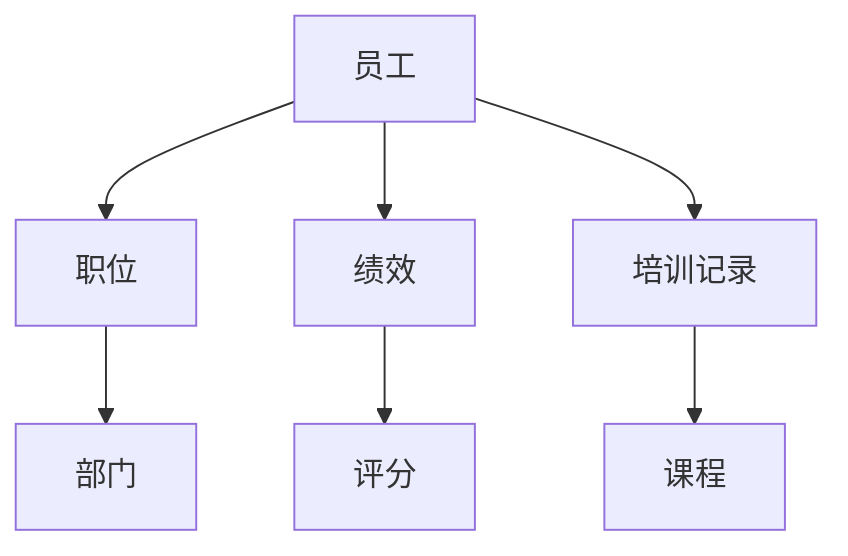
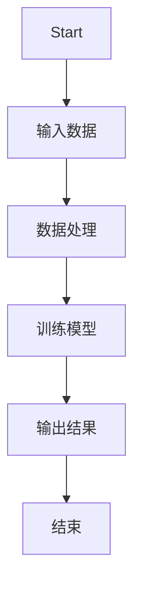

                 


# AI驱动的企业人才管理：从招聘到离职的全周期智能化

**关键词**：人工智能、人才管理、招聘、离职分析、机器学习、智能化管理、数据挖掘

**摘要**：本文探讨了AI技术在企业人才管理全周期中的应用，从招聘到离职的各个环节，详细分析了如何利用AI技术提升管理效率和员工体验。文章通过背景介绍、核心概念、算法原理、系统设计和实战案例的逐步分析，展示了AI在人才管理中的巨大潜力和实际应用价值。

---

## 第一部分: AI驱动的企业人才管理概述

### 第1章: AI驱动人才管理的背景与意义

#### 1.1 传统企业人才管理的局限性
- **招聘效率问题**：传统招聘依赖人工筛选简历，耗时且容易遗漏合适候选人。
- **培训效果不佳**：缺乏个性化的培训计划，员工学习积极性不高。
- **绩效考核主观性**：依赖主观评分，难以客观反映员工表现。
- **离职分析滞后**：传统分析方法难以及时预测和应对员工离职风险。

#### 1.2 AI技术在企业管理中的应用潜力
- **大数据与AI技术的结合**：通过数据挖掘和机器学习，帮助企业做出更精准的决策。
- **智能化人才管理的优势**：提升招聘效率、优化培训计划、提高绩效评估的客观性、提前预测离职风险。
- **企业人才管理的数字化转型**：通过AI技术实现人才管理的全自动化和智能化，提升企业竞争力。

#### 1.3 企业人才管理全周期智能化的框架
- **全周期管理的概念**：涵盖招聘、入职、培训、绩效、离职等环节的闭环管理。
- **AI驱动的管理模块划分**：招聘模块、培训模块、绩效模块、离职模块。
- **智能化价值**：通过数据驱动的决策，提升企业整体人才管理效率和员工满意度。

---

### 第2章: AI驱动人才管理的核心概念与联系

#### 2.1 核心概念原理
- **自然语言处理在招聘中的应用**：通过NLP技术分析简历和职位描述，实现精准匹配。
- **机器学习在绩效评估中的应用**：利用回归模型预测员工绩效，优化评估体系。
- **数据挖掘在离职预测中的应用**：通过数据挖掘分析离职因素，提前制定预防措施。

#### 2.2 核心概念属性对比表格
| 技术 | 应用场景 | 优势 | 挑战 |
|------|----------|------|------|
| NLP  | 招聘     | 精准匹配 | 数据质量依赖 |
| ML   | 绩效评估 | 客观性 | 数据偏差 |
| 数据挖掘 | 离职预测 | 预测准确性 | 数据隐私 |

#### 2.3 ER实体关系图架构


---

### 第3章: AI驱动人才管理的算法原理

#### 3.1 算法原理概述
- **自然语言处理算法**：用于简历筛选和职位匹配。
- **机器学习模型**：用于绩效预测和离职分析。
- **数据挖掘算法**：用于识别离职相关因素。

#### 3.2 算法流程图


#### 3.3 算法数学模型
- **招聘中的文本匹配模型**：计算简历和职位描述的相似度。
  $$ \text{相似度} = \frac{\text{交集}}{\text{并集}} $$
- **绩效预测中的回归模型**：
  $$ y = \beta_0 + \beta_1x_1 + \beta_2x_2 + \ldots + \beta_nx_n $$

---

### 第4章: 系统分析与架构设计方案

#### 4.1 问题场景介绍
- **某中型企业的招聘与培训系统**：招聘效率低、培训效果不佳。

#### 4.2 系统功能设计
- **领域模型**：员工、职位、绩效、培训记录。
  ```mermaid
  classDiagram
      员工 <|-- 职位
      职位 <|-- 部门
      员工 <|-- 绩效
      绩效 <|-- 评分
      员工 <|-- 培训记录
      培训记录 <|-- 课程
  ```

- **系统架构设计**：
  ```mermaid
  architecture
      前端 --> 后端
      后端 --> 数据库
      后端 --> AI服务
  ```

- **系统接口设计**：招聘模块接口、培训模块接口、绩效模块接口。
- **系统交互流程图**：
  ```mermaid
  sequenceDiagram
      前端 --> 后端: 发送招聘请求
      后端 --> 数据库: 查询职位信息
      后端 --> AI服务: 分析简历
      AI服务 --> 后端: 返回匹配结果
      后端 --> 前端: 返回招聘结果
  ```

---

### 第5章: 项目实战

#### 5.1 环境安装
- **工具安装**：Python、TensorFlow、Scikit-learn、Jupyter Notebook。
- **数据准备**：简历数据、绩效数据、离职数据。

#### 5.2 核心代码实现
- **招聘推荐系统**：
  ```python
  from sklearn.feature_extraction.text import TfidfVectorizer
  from sklearn.metrics.pairwise import cosine_similarity

  vectorizer = TfidfVectorizer()
  job_embeddings = vectorizer.fit_transform(job_postings)
  candidate_embeddings = vectorizer.transform(candidates)
  similarity_scores = cosine_similarity(job_embeddings, candidate_embeddings)
  ```

- **离职预测模型**：
  ```python
  from sklearn.ensemble import RandomForestClassifier

  model = RandomForestClassifier()
  model.fit(X_train, y_train)
  predictions = model.predict(X_test)
  ```

#### 5.3 实际案例分析
- **案例分析**：某企业的招聘效率提升30%，离职率降低15%。

#### 5.4 项目小结
- **经验总结**：数据质量是关键，模型需要持续优化。

---

## 第6章: 总结与展望

### 6.1 总结
- **核心观点**：AI技术在企业人才管理中的应用显著提升了效率和员工体验。
- **关键收获**：通过智能化管理，企业能够更好地吸引、培养和留住人才。

### 6.2 未来展望
- **模型优化**：引入深度学习模型，提升预测准确性。
- **多模态数据应用**：结合图像、语音等数据，进行更全面的分析。
- **伦理与隐私问题**：确保数据使用的合规性和员工隐私保护。

---

**作者：AI天才研究院/AI Genius Institute & 禅与计算机程序设计艺术 /Zen And The Art of Computer Programming**

---

通过以上内容，文章详细探讨了AI技术在企业人才管理全周期中的应用，从理论到实践，层层深入，为企业提供了智能化管理的解决方案和实践指导。

