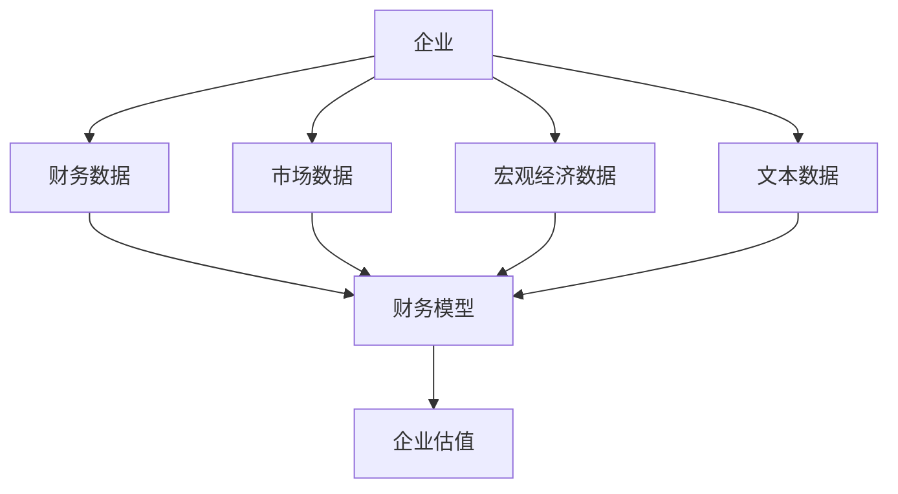
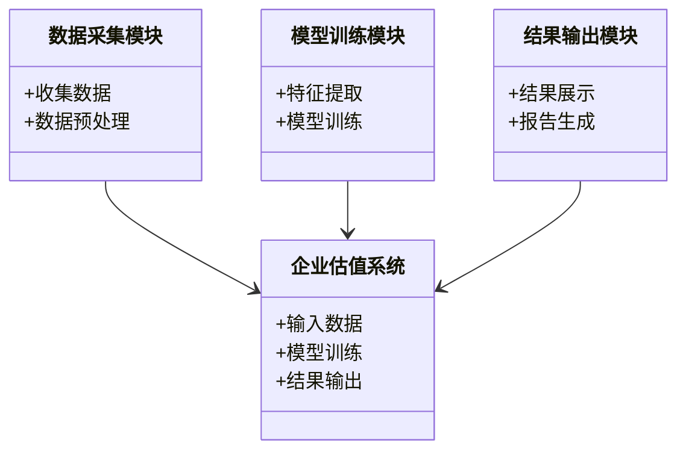

                 


# AI驱动的企业估值模型设计与实现

> 关键词：企业估值，人工智能，机器学习，深度学习，大数据分析，金融建模

> 摘要：本文详细探讨了如何利用人工智能技术构建企业估值模型，从理论基础到实践应用，系统性地分析了AI驱动的企业估值模型的设计与实现过程。文章首先介绍了企业估值的基本概念及其在大数据时代的变革，接着深入讲解了AI在企业估值中的核心概念与算法原理，随后通过实际案例展示了模型的实现过程，并最后总结了最佳实践与未来发展方向。

---

## 第一部分: AI驱动的企业估值模型背景与概述

### 第1章: 企业估值的基本概念与挑战

#### 1.1 企业估值的基本概念

##### 1.1.1 企业估值的定义与作用
企业估值是指通过对企业的财务状况、市场表现、行业地位等多方面因素的综合分析，估算其市场价值或内在价值的过程。传统的企业估值方法主要包括DCF（Discounted Cash Flow，折现现金流法）、市盈率（P/E ratio）和市净率（P/B ratio）等。然而，这些方法在实际应用中存在诸多局限性，尤其是在面对复杂市场环境和大数据时代海量数据时，难以充分挖掘数据价值并捕捉潜在的市场信号。

##### 1.1.2 传统企业估值方法的局限性
传统的企业估值方法主要依赖于财务数据和简单的统计分析，难以应对以下挑战：
- 数据维度有限：传统方法通常只考虑财务数据，忽略了非结构化数据（如社交媒体情绪、新闻数据等）的价值。
- 市场波动性：传统模型难以实时捕捉市场波动和突发事件对企业价值的影响。
- 计算复杂性：复杂的金融模型（如DCF）需要大量假设和手工调整，增加了主观性和计算复杂性。

##### 1.1.3 企业估值的核心要素与边界
企业估值的核心要素包括：
- 财务数据：收入、利润、现金流等。
- 市场数据：股价、成交量、行业指数等。
- 宏观经济因素：GDP增长率、利率、通货膨胀率等。
- 非财务因素：管理团队、创新能力和企业声誉等。

企业估值的边界包括：
- 数据获取的范围和质量。
- 模型的假设条件。
- 市场的不确定性。

#### 1.2 AI在企业估值中的作用

##### 1.2.1 数据驱动的估值新范式
AI技术通过整合和分析海量数据，为企业的估值提供了全新的范式。例如，自然语言处理（NLP）技术可以分析新闻、社交媒体等非结构化数据，提取潜在的市场情绪和行业趋势，从而为估值模型提供更丰富的输入数据。

##### 1.2.2 AI技术在估值中的优势
AI技术在企业估值中的优势主要体现在以下方面：
- 数据处理能力：AI能够处理和分析结构化数据和非结构化数据，提取更多的特征信息。
- 实时性：AI模型可以实时更新，快速响应市场变化。
- 自适应性：AI模型可以根据市场反馈不断优化，提高估值的准确性。

##### 1.2.3 企业估值与AI技术的结合场景
AI技术与企业估值的结合场景包括：
- 利用NLP分析新闻数据，预测企业未来的财务表现。
- 利用机器学习算法预测企业的违约风险。
- 利用深度学习模型分析多维度数据，生成更精确的估值结果。

#### 1.3 AI驱动企业估值的发展趋势

##### 1.3.1 大数据时代的估值创新
在大数据时代，企业估值的创新主要体现在以下几个方面：
- 数据源的多样化：整合财务数据、社交媒体数据、物联网数据等多源数据。
- 分析方法的多样化：结合传统统计方法和AI算法，提升估值的准确性和全面性。

##### 1.3.2 AI技术对企业估值的影响
AI技术的引入显著提升了企业估值的效率和精度，主要体现在：
- 数据处理效率的提升：AI能够快速处理和分析海量数据，缩短估值周期。
- 模型的复杂性增加：AI模型能够捕捉更多的数据特征，提高估值的精度。

##### 1.3.3 未来估值模型的演变方向
未来的企业估值模型将朝着以下几个方向发展：
- 多模态数据融合：整合结构化数据和非结构化数据，提高模型的泛化能力。
- 自适应学习：模型能够根据市场反馈动态调整参数，实现自适应优化。
- 可解释性增强：模型需要具备更高的可解释性，便于决策者理解和应用。

---

## 第2章: AI驱动企业估值的核心概念与联系

### 2.1 核心概念原理

#### 2.1.1 机器学习在估值中的应用

##### 2.1.1.1 机器学习的基本原理
机器学习是一种人工智能技术，通过训练数据模型，使其能够从数据中学习规律并进行预测。在企业估值中，机器学习主要用于以下几个方面：
- 预测企业未来的财务表现。
- 识别企业的财务风险。
- 分类企业所处的行业阶段。

##### 2.1.1.2 机器学习在估值中的应用
机器学习在企业估值中的具体应用包括：
- 利用回归算法预测企业的未来收入。
- 利用聚类算法对企业进行分类，分析行业趋势。
- 利用决策树算法识别企业的关键财务指标。

#### 2.1.2 深度学习与企业估值的关系

##### 2.1.2.1 深度学习的基本原理
深度学习是一种基于人工神经网络的机器学习技术，通过多层非线性变换，能够从数据中提取高维特征。深度学习在企业估值中的应用包括：
- 利用卷积神经网络（CNN）分析图像数据。
- 利用循环神经网络（RNN）分析时间序列数据。
- 利用长短时记忆网络（LSTM）预测企业的未来现金流。

##### 2.1.2.2 深度学习在估值中的应用
深度学习在企业估值中的具体应用包括：
- 利用LSTM预测企业的未来股价。
- 利用CNN分析企业的图像数据，如卫星图像中的工厂规模。
- 利用BERT模型分析企业的文本数据，如财务报告和新闻。

#### 2.1.3 数据特征与估值模型的关联

##### 2.1.3.1 数据特征的提取与选择
在企业估值中，数据特征的提取与选择至关重要。常见的特征包括：
- 财务特征：收入、利润、现金流等。
- 市场特征：股价、成交量、行业指数等。
- 宏观经济特征：GDP增长率、利率、通货膨胀率等。
- 文本特征：新闻标题、社交媒体情绪等。

##### 2.1.3.2 特征工程的重要性
特征工程是指对数据进行处理和转换，以提高模型的性能。在企业估值中，特征工程的具体步骤包括：
- 数据清洗：处理缺失值、异常值等。
- 特征提取：从原始数据中提取有意义的特征。
- 特征选择：选择对估值影响最大的特征。
- 特征变换：对特征进行标准化、归一化等处理。

### 2.2 核心概念对比分析

#### 2.2.1 传统估值方法与AI估值方法对比

##### 2.2.1.1 对比表格
以下是传统估值方法与AI估值方法的对比表格：

| 对比维度        | 传统估值方法                      | AI估值方法                          |
|-----------------|------------------------------------|--------------------------------------|
| 数据来源        | 财务数据为主                      | 结构化数据+非结构化数据            |
| 模型复杂性      | 较低                             | 较高                                 |
| 计算效率        | 较低                             | 较高                                 |
| 可解释性        | 较高                             | 较低                                 |
| 适用场景        | 稳定性较高的市场                  | 复杂多变的市场                      |

##### 2.2.1.2 实体关系图的Mermaid流程图
以下是一个简单的实体关系图的Mermaid流程图：



---

## 第3章: AI驱动企业估值的算法

### 3.1 算法原理讲解

#### 3.1.1 线性回归算法

##### 3.1.1.1 线性回归的定义
线性回归是一种统计学方法，用于建立因变量和自变量之间的线性关系。在企业估值中，线性回归可以用于预测企业的未来股价。

##### 3.1.1.2 线性回归的数学模型
线性回归的数学模型如下：

$$ y = \beta_0 + \beta_1 x + \epsilon $$

其中，$y$ 是因变量（如股价），$x$ 是自变量（如收入），$\beta_0$ 是截距，$\beta_1$ 是回归系数，$\epsilon$ 是误差项。

##### 3.1.1.3 线性回归的实现步骤
线性回归的实现步骤如下：

1. 数据准备：收集企业的财务数据和股价数据。
2. 数据预处理：进行数据清洗和归一化处理。
3. 模型训练：使用最小二乘法训练模型。
4. 模型评估：计算回归系数的显著性，并验证模型的拟合优度。

##### 3.1.1.4 线性回归的Python代码实现
以下是线性回归的Python代码实现：

```python
import pandas as pd
import numpy as np
from sklearn.linear_model import LinearRegression
from sklearn.metrics import mean_squared_error

# 数据准备
data = pd.DataFrame({
    '收入': [100, 200, 300, 400],
    '股价': [50, 100, 150, 200]
})

# 数据预处理
X = data[['收入']]
y = data['股价']

# 模型训练
model = LinearRegression()
model.fit(X, y)

# 模型评估
y_pred = model.predict(X)
mse = mean_squared_error(y, y_pred)
print('均方误差:', mse)
print('回归系数:', model.coef_)
```

#### 3.1.2 随机森林算法

##### 3.1.2.1 随机森林的定义
随机森林是一种基于决策树的集成学习算法，通过构建多个决策树并进行投票或平均，提高模型的准确性和稳定性。

##### 3.1.2.2 随机森林的数学模型
随机森林的数学模型如下：

$$ y = \frac{1}{N} \sum_{i=1}^{N} y_i $$

其中，$y_i$ 是第$i$棵决策树的预测值，$N$ 是决策树的数量。

##### 3.1.2.3 随机森林的实现步骤
随机森林的实现步骤如下：

1. 数据准备：收集企业的多源数据，包括财务数据、市场数据等。
2. 数据预处理：进行数据清洗和特征选择。
3. 模型训练：使用随机森林算法训练模型。
4. 模型评估：计算模型的准确率和F1分数。

##### 3.1.2.4 随机森林的Python代码实现
以下是随机森林的Python代码实现：

```python
import pandas as pd
from sklearn.ensemble import RandomForestRegressor
from sklearn.metrics import mean_absolute_error

# 数据准备
data = pd.DataFrame({
    '收入': [100, 200, 300, 400],
    '利润': [20, 40, 60, 80],
    '股价': [50, 100, 150, 200]
})

# 数据预处理
X = data[['收入', '利润']]
y = data['股价']

# 模型训练
model = RandomForestRegressor(n_estimators=100)
model.fit(X, y)

# 模型评估
y_pred = model.predict(X)
mae = mean_absolute_error(y, y_pred)
print('平均绝对误差:', mae)
```

#### 3.1.3 神经网络算法

##### 3.1.3.1 神经网络的定义
神经网络是一种模拟人脑结构和功能的数学模型，通过多层神经元的连接，实现数据的非线性映射。

##### 3.1.3.2 神经网络的数学模型
神经网络的数学模型如下：

$$ y = f(Wx + b) $$

其中，$W$ 是权重矩阵，$x$ 是输入向量，$b$ 是偏置项，$f$ 是激活函数（如ReLU、Sigmoid等）。

##### 3.1.3.3 神经网络的实现步骤
神经网络的实现步骤如下：

1. 数据准备：收集企业的多源数据，包括财务数据、市场数据、文本数据等。
2. 数据预处理：进行数据清洗、特征提取和归一化处理。
3. 模型训练：使用神经网络算法训练模型。
4. 模型优化：调整网络结构和超参数，提高模型的准确性和稳定性。

##### 3.1.3.4 神经网络的Python代码实现
以下是神经网络的Python代码实现：

```python
import numpy as np
import tensorflow as tf
from tensorflow.keras import layers

# 数据准备
data = np.array([[100, 200], [200, 400], [300, 600], [400, 800]], dtype=np.float32)
labels = np.array([50, 100, 150, 200], dtype=np.float32)

# 模型构建
model = tf.keras.Sequential()
model.add(layers.Dense(64, activation='relu', input_shape=(2,)))
model.add(layers.Dense(1, activation='linear'))

# 模型训练
model.compile(optimizer='adam', loss='mean_squared_error')
model.fit(data, labels, epochs=100, batch_size=4)

# 模型评估
y_pred = model.predict(data)
print('预测结果:', y_pred)
```

---

## 第4章: AI驱动企业估值的系统分析与架构设计

### 4.1 系统功能设计

#### 4.1.1 领域模型的Mermaid类图
以下是一个简单的领域模型的Mermaid类图：



### 4.2 系统架构设计

#### 4.2.1 系统架构的Mermaid架构图
以下是一个简单的系统架构的Mermaid架构图：

```mermaid
container 企业估值系统 {
    数据采集模块
    数据处理模块
    模型训练模块
    结果输出模块
}
```

---

## 第5章: AI驱动企业估值的项目实战

### 5.1 项目环境搭建

#### 5.1.1 环境配置
以下是项目环境的配置要求：

- Python 3.8+
- TensorFlow 2.0+
- Scikit-learn 0.24+
- Pandas 1.3+
- Jupyter Notebook

#### 5.1.2 数据集准备
以下是项目所需的数据集示例：

```python
import pandas as pd

# 创建示例数据集
data = pd.DataFrame({
    '收入': [100, 200, 300, 400],
    '利润': [20, 40, 60, 80],
    '股价': [50, 100, 150, 200]
})

print(data)
```

### 5.2 系统核心实现

#### 5.2.1 数据预处理代码

```python
import pandas as pd
import numpy as np
from sklearn.preprocessing import StandardScaler

# 数据预处理代码
data = pd.DataFrame({
    '收入': [100, 200, 300, 400],
    '利润': [20, 40, 60, 80],
    '股价': [50, 100, 150, 200]
})

# 数据清洗
data.dropna()

# 特征提取
X = data[['收入', '利润']]
y = data['股价']

# 数据归一化
scaler = StandardScaler()
X_normalized = scaler.fit_transform(X)
```

#### 5.2.2 模型训练代码

```python
from sklearn.ensemble import RandomForestRegressor
from sklearn.metrics import mean_absolute_error

# 模型训练代码
model = RandomForestRegressor(n_estimators=100)
model.fit(X_normalized, y)

# 预测结果
y_pred = model.predict(X_normalized)
mae = mean_absolute_error(y, y_pred)
print('平均绝对误差:', mae)
```

### 5.3 项目小结

#### 5.3.1 项目总结
通过本项目，我们成功地利用AI技术构建了一个企业估值模型。该模型能够基于企业的财务数据和市场数据，预测企业的未来股价，并为企业的估值提供了新的思路。

#### 5.3.2 经验与教训
在项目实施过程中，我们积累了以下经验和教训：
- 数据预处理是模型训练的关键，需要高度重视。
- 模型的选择需要根据实际场景和数据特征进行调整。
- 模型的解释性和可维护性需要在设计阶段充分考虑。

---

## 第6章: 最佳实践与未来展望

### 6.1 最佳实践 tips

#### 6.1.1 数据处理的注意事项
- 数据清洗是模型训练的基础，需要处理缺失值、异常值等问题。
- 特征工程是提升模型性能的重要手段，需要结合业务背景选择合适的特征。
- 数据归一化或标准化是模型训练的必要步骤，能够提高模型的收敛速度和准确率。

#### 6.1.2 模型选择的建议
- 根据数据特征选择合适的模型，如线性回归适用于简单的线性关系，随机森林适用于非线性关系。
- 通过交叉验证评估模型的性能，避免过拟合和欠拟合。
- 结合业务需求选择模型的复杂度，避免使用过于复杂的模型。

### 6.2 小结

#### 6.2.1 项目总结
通过本文的详细讲解，我们系统地探讨了AI驱动的企业估值模型的设计与实现过程。从理论基础到实践应用，我们全面分析了AI技术在企业估值中的优势和挑战，并通过实际案例展示了模型的实现过程。

#### 6.2.2 未来展望
随着AI技术的不断发展，企业估值模型将朝着以下几个方向发展：
- 多模态数据融合：整合更多的数据源，提高模型的泛化能力。
- 自适应学习：模型能够根据市场反馈动态调整参数，实现自适应优化。
- 可解释性增强：模型需要具备更高的可解释性，便于决策者理解和应用。

---

## 作者信息

作者：AI天才研究院/AI Genius Institute & 禅与计算机程序设计艺术/Zen And The Art of Computer Programming

---

**文章小结：**
本文系统地探讨了AI驱动的企业估值模型的设计与实现过程，从理论基础到实践应用，全面分析了AI技术在企业估值中的优势和挑战。通过实际案例展示了模型的实现过程，并总结了最佳实践与未来发展方向。

