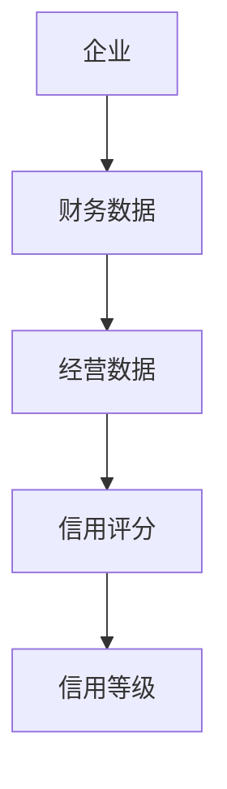
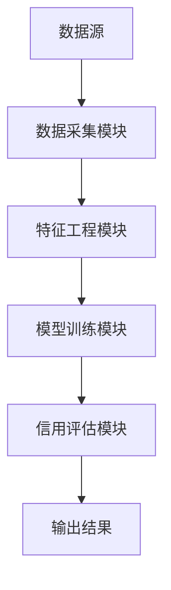

                 


# AI驱动的企业信用评级

> **关键词**: 企业信用评级, AI技术, 机器学习, 深度学习, 自然语言处理, 数据分析, 信用风险

> **摘要**: 随着人工智能技术的快速发展，企业信用评级的传统方法正在被更高效、更准确的AI驱动方法所取代。本文详细介绍了AI技术在企业信用评级中的应用，从核心概念到算法原理，再到系统架构设计，最后通过实战案例分析展示了AI驱动企业信用评级的实际应用。文章内容丰富，结构清晰，语言简洁专业，适合技术从业者和企业管理者阅读。

---

# 第1章: 企业信用评级与AI驱动的概述

## 1.1 企业信用评级的基本概念

### 1.1.1 企业信用评级的定义

企业信用评级是通过对企业的财务状况、经营状况、管理水平、市场环境等多方面因素的综合分析，评估企业在特定时期内履行债务能力的过程。信用评级的结果通常以信用等级的形式呈现，如AAA、AA、A、BBB、BB、B、CCC、CC、C、D等，其中AAA表示信用风险最低，D表示企业已经破产。

### 1.1.2 企业信用评级的核心要素

企业信用评级的核心要素包括：

1. **财务状况**: 包括资产负债表、利润表、现金流等财务数据。
2. **经营状况**: 包括企业的产品竞争力、市场份额、供应链稳定性、管理团队稳定性等。
3. **信用历史**: 包括企业过去的还款记录、违约情况等。

### 1.1.3 企业信用评级的分类与应用场景

企业信用评级可以分为内部评级和外部评级。内部评级通常由企业内部的财务部门或风险管理部门进行，主要用于内部决策。外部评级则由专业的评级机构（如穆迪、标普、惠誉等）进行，用于向外部投资者、债权人等提供信用评估结果。

企业信用评级的应用场景包括银行贷款审批、债券发行、供应链金融、投资决策等。

---

## 1.2 AI在企业信用评级中的作用

### 1.2.1 AI技术在信用评级中的优势

AI技术在企业信用评级中的优势主要体现在以下几个方面：

1. **数据处理能力**: AI能够快速处理大量非结构化数据（如新闻、社交媒体数据等），提取有用的信息。
2. **模式识别能力**: AI能够识别传统方法难以发现的复杂模式和关联性。
3. **实时性**: AI可以实现实时信用评估，而传统方法通常需要定期更新。

### 1.2.2 AI驱动信用评级的典型场景

1. **实时信用评估**: 基于实时数据对企业信用进行动态评估。
2. **风险预警**: 通过异常检测技术识别潜在的信用风险。
3. **自动化决策**: 将AI模型集成到信贷审批系统中，实现自动化决策。

### 1.2.3 AI驱动信用评级的未来趋势

1. **多模态数据融合**: 将结构化数据（如财务数据）与非结构化数据（如文本、图像）相结合，提升信用评级的准确性。
2. **可解释性增强**: 开发更易于解释的AI模型，满足监管要求。
3. **智能化决策支持**: 利用AI技术提供更智能的决策支持工具。

---

## 1.3 本章小结

本章主要介绍了企业信用评级的基本概念、核心要素以及AI技术在信用评级中的作用。通过AI技术的应用，企业信用评级将更加高效、准确和实时，为金融机构和企业提供了更强大的决策支持工具。

---

# 第2章: AI驱动企业信用评级的核心概念

## 2.1 企业信用评级的核心要素

### 2.1.1 企业财务指标分析

企业财务指标是信用评级的重要组成部分，主要包括以下几个方面：

1. **偿债能力指标**: 包括流动比率、速动比率、资产负债率等。
2. **盈利能力指标**: 包括净利润率、毛利率、ROE（净资产收益率）等。
3. **运营能力指标**: 包括存货周转率、应收账款周转率等。

### 2.1.2 企业经营状况评估

企业经营状况评估主要包括以下几个方面：

1. **市场竞争力**: 包括市场份额、产品创新、品牌影响力等。
2. **管理团队稳定性**: 包括管理团队的稳定性、经验、能力等。
3. **供应链稳定性**: 包括供应商的稳定性、供应链的效率等。

### 2.1.3 企业信用风险模型

企业信用风险模型是信用评级的核心工具，主要包括以下几个方面：

1. **违约概率模型**: 用于预测企业违约的概率。
2. **违约损失率模型**: 用于预测企业在违约时的损失率。
3. **信用评分模型**: 用于对企业的信用状况进行评分。

---

## 2.2 AI技术在信用评级中的应用原理

### 2.2.1 机器学习在信用评级中的应用

机器学习在信用评级中的应用主要包括以下几个方面：

1. **分类问题**: 通过监督学习算法（如逻辑回归、支持向量机、随机森林等）对企业的信用等级进行分类。
2. **回归问题**: 通过回归算法（如线性回归）对企业的违约概率进行预测。
3. **聚类问题**: 通过聚类算法（如K均值聚类）对企业的信用状况进行分组。

### 2.2.2 深度学习在信用评级中的应用

深度学习在信用评级中的应用主要包括以下几个方面：

1. **神经网络模型**: 通过卷积神经网络（CNN）或循环神经网络（RNN）对企业的信用状况进行预测。
2. **自动特征提取**: 通过深度学习模型自动提取有用的特征，减少特征工程的工作量。
3. **时间序列分析**: 通过长短期记忆网络（LSTM）对企业的历史数据进行时间序列分析，预测未来的信用状况。

### 2.2.3 自然语言处理在信用评级中的应用

自然语言处理在信用评级中的应用主要包括以下几个方面：

1. **文本情感分析**: 通过自然语言处理技术对企业的新闻、社交媒体等文本数据进行情感分析，评估企业的声誉风险。
2. **文本信息提取**: 通过信息抽取技术从企业的财报、公告等文本中提取结构化数据。

---

## 2.3 核心概念与联系

### 2.3.1 实体关系图（ER图）的 Mermaid 表示



### 2.3.2 核心概念属性对比表

| 概念       | 属性1 | 属性2 | 属性3 |
|------------|-------|-------|-------|
| 企业       | 名称   | 财务状况 | 经营状况 |
| 财务数据   | 收入   | 利润   | 资产负债 |
| 经营数据   | 市场份额 | 供应链稳定性 | 管理层稳定性 |
| 信用评分   | 评分值 | 评分时间 | 评分模型 |
| 信用等级   | 等级名称 | 等级含义 | 等级评定机构 |

---

## 2.4 本章小结

本章详细介绍了企业信用评级的核心要素以及AI技术在信用评级中的应用原理。通过机器学习、深度学习和自然语言处理技术，可以显著提升信用评级的准确性和效率。

---

# 第3章: AI驱动企业信用评级的算法原理

## 3.1 机器学习算法在信用评级中的应用

### 3.1.1 线性回归模型

线性回归模型是一种常用的回归算法，适用于预测企业的违约概率。其基本原理是通过最小化预测值与实际值之间的平方差之和来找到最佳拟合直线。

$$
\text{损失函数} = \sum_{i=1}^{n}(y_i - \hat{y}_i)^2
$$

其中，$y_i$ 是实际值，$\hat{y}_i$ 是预测值。

### 3.1.2 支持向量机（SVM）模型

支持向量机是一种常用的分类算法，适用于企业的信用等级分类。其基本原理是通过找到一个超平面，将数据点分为两类，使得两类数据点之间的距离最大化。

### 3.1.3 随机森林模型

随机森林是一种集成学习算法，适用于企业的信用等级分类。其基本原理是通过构建多棵决策树，并对结果进行投票或平均，从而提高模型的准确性和稳定性。

---

## 3.2 深度学习算法在信用评级中的应用

### 3.2.1 神经网络模型

神经网络模型是一种常用的深度学习算法，适用于企业的信用状况预测。其基本原理是通过多层感知机对输入数据进行非线性变换，提取高维特征。

$$
\hat{y} = \sigma(Wx + b)
$$

其中，$W$ 是权重矩阵，$x$ 是输入向量，$b$ 是偏置项，$\sigma$ 是激活函数。

### 3.2.2 长短期记忆网络（LSTM）

长短期记忆网络是一种时间序列分析算法，适用于企业的历史数据预测。其基本原理是通过记忆单元和遗忘门来捕捉时间序列中的长期依赖关系。

### 3.2.3 自注意力机制

自注意力机制是一种用于自然语言处理的算法，适用于从企业文本数据中提取信息。其基本原理是通过计算文本中每个词与其他词之间的注意力权重，提取有用的特征。

---

## 3.3 本章小结

本章详细介绍了机器学习和深度学习算法在企业信用评级中的应用原理，包括线性回归、SVM、随机森林、神经网络、LSTM和自注意力机制等算法。

---

# 第4章: AI驱动企业信用评级的系统架构设计

## 4.1 系统功能设计

### 4.1.1 数据采集模块

数据采集模块负责从多种数据源（如财务数据、经营数据、文本数据等）获取数据。

### 4.1.2 特征工程模块

特征工程模块负责对数据进行预处理、特征提取和特征选择。

### 4.1.3 模型训练模块

模型训练模块负责对数据进行建模、训练和优化。

### 4.1.4 信用评估模块

信用评估模块负责对企业的信用状况进行评估和预测。

---

## 4.2 系统架构设计

### 4.2.1 系统架构图的 Mermaid 表示



### 4.2.2 系统接口设计

系统接口设计主要包括数据接口、模型接口和结果接口。

### 4.2.3 系统交互设计

系统交互设计主要包括用户输入、模型处理和结果输出。

---

## 4.3 本章小结

本章详细介绍了AI驱动企业信用评级系统的功能设计和架构设计，包括数据采集、特征工程、模型训练和信用评估等模块。

---

# 第5章: AI驱动企业信用评级的实战案例分析

## 5.1 数据准备与清洗

### 5.1.1 数据来源

数据来源包括企业财务数据、经营数据、文本数据等。

### 5.1.2 数据清洗

数据清洗包括处理缺失值、异常值和重复值。

---

## 5.2 模型训练与评估

### 5.2.1 模型训练

模型训练包括选择算法、划分训练集和测试集、训练模型等步骤。

### 5.2.2 模型评估

模型评估包括计算准确率、召回率、F1分数等指标。

---

## 5.3 信用评分与分析

### 5.3.1 信用评分

信用评分是通过模型对企业的信用状况进行评分。

### 5.3.2 信用分析

信用分析是通过对评分结果进行分析，找出影响信用评级的关键因素。

---

## 5.4 本章小结

本章通过一个实战案例分析，详细介绍了AI驱动企业信用评级的整个流程，包括数据准备、模型训练、信用评分和信用分析等步骤。

---

# 第6章: 项目实战与经验总结

## 6.1 项目环境配置

### 6.1.1 环境要求

环境要求包括操作系统、Python版本、依赖库版本等。

### 6.1.2 依赖库安装

依赖库安装包括安装Python库（如pandas、numpy、scikit-learn等）。

---

## 6.2 系统核心实现源代码

### 6.2.1 数据采集与处理

```python
import pandas as pd
import numpy as np

# 数据采集
data = pd.read_csv('企业数据.csv')

# 数据清洗
data.dropna(inplace=True)
data.drop_duplicates(inplace=True)

# 特征工程
from sklearn.preprocessing import StandardScaler

scaler = StandardScaler()
X = scaler.fit_transform(data.drop('信用等级', axis=1))
y = data['信用等级']
```

### 6.2.2 模型训练与优化

```python
from sklearn.ensemble import RandomForestClassifier
from sklearn.model_selection import GridSearchCV

# 参数调优
param_grid = {
    'n_estimators': [100, 200],
    'max_depth': [None, 10, 20],
    'min_samples_split': [2, 5, 10]
}

rf = RandomForestClassifier()
grid_search = GridSearchCV(rf, param_grid, cv=5)
grid_search.fit(X, y)

# 最优模型
best_model = grid_search.best_estimator_
```

### 6.2.3 信用评分与分析

```python
from sklearn.metrics import classification_report

# 模型预测
y_pred = best_model.predict(X)

# 模型评估
print(classification_report(y, y_pred))
```

---

## 6.3 实际案例分析与详细解读

### 6.3.1 案例背景

假设我们有一家企业的财务数据和经营数据，我们需要对其信用状况进行评估。

### 6.3.2 数据分析

通过对企业的财务数据和经营数据进行分析，我们可以提取出一些关键指标，如流动比率、速动比率、净利润率等。

### 6.3.3 模型预测

通过模型对企业的信用状况进行预测，得出企业的信用等级。

---

## 6.4 经验总结与注意事项

### 6.4.1 经验总结

1. 数据清洗和特征工程是模型训练的关键步骤。
2. 参数调优和模型评估是提高模型准确性的有效方法。
3. 可视化分析是理解模型结果的重要工具。

### 6.4.2 注意事项

1. 数据隐私和安全问题需要高度重视。
2. 模型的可解释性需要满足监管要求。
3. 模型的实时性和稳定性需要通过持续监控来保证。

---

## 6.5 本章小结

本章通过一个实战案例分析，详细介绍了AI驱动企业信用评级的整个流程，并总结了项目实施的经验和注意事项。

---

# 第7章: 项目总结与未来展望

## 7.1 项目总结

本项目通过AI技术实现了企业信用评级的自动化和智能化，显著提升了信用评级的准确性和效率。

## 7.2 未来展望

未来，随着AI技术的不断发展，企业信用评级将更加智能化和个性化。同时，多模态数据融合和可解释性增强将是未来研究的重点方向。

---

# 作者：AI天才研究院/AI Genius Institute & 禅与计算机程序设计艺术 /Zen And The Art of Computer Programming

---

以上是《AI驱动的企业信用评级》的完整目录和部分章节内容的详细描述。通过本文，读者可以全面了解AI技术在企业信用评级中的应用，从理论到实践，从算法到系统架构，再到实战案例，内容详实且结构清晰。

