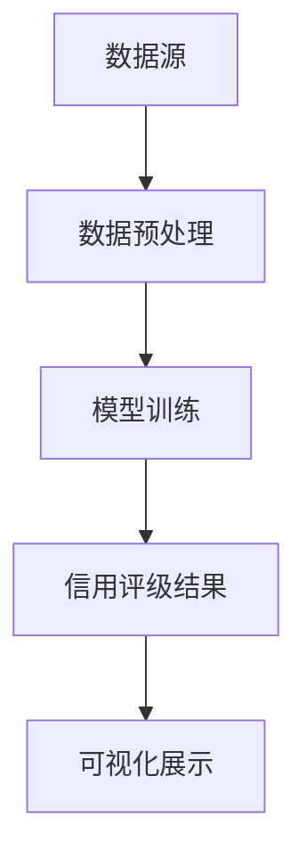

                 


# AI驱动的企业信用评级模型可解释性动态优化系统

> 关键词：AI驱动、企业信用评级、可解释性、动态优化、系统架构、算法原理

> 摘要：本文探讨了AI驱动的企业信用评级模型的可解释性动态优化系统，分析了传统信用评级模型的局限性，提出了一种结合层次分析法（AHP）和SHAP值的解释性评估方法，以及基于遗传算法和深度强化学习的动态优化算法。文章详细阐述了系统的架构设计、功能实现和实际案例，旨在为信用评级领域提供一种高效、透明且动态优化的解决方案。

---

# 第一部分: 背景与挑战

## 第1章: 企业信用评级模型的背景与挑战

### 1.1 企业信用评级的核心概念

#### 1.1.1 企业信用评级的定义与作用
企业信用评级是通过对企业的财务状况、经营能力、市场表现等多维度数据进行分析，评估其信用风险的过程。信用评级结果通常用于银行贷款审批、投资决策等领域，是企业融资的重要依据。

#### 1.1.2 传统信用评级模型的局限性
传统信用评级模型主要依赖财务指标和静态数据分析，存在以下问题：
- 数据维度有限，难以全面反映企业风险。
- 模型缺乏动态调整能力，无法及时捕捉市场变化。
- 可解释性差，难以向企业解释评级结果的依据。

#### 1.1.3 AI驱动信用评级的必要性
随着大数据和AI技术的发展，企业信用评级需要更高效、动态和可解释的解决方案。AI可以通过处理多维数据，构建更精准的模型，并通过动态优化提升评级结果的准确性。

---

## 第2章: 可解释性动态优化系统的重要性

### 2.1 可解释性在信用评级中的价值
信用评级结果需要满足监管要求和企业需求，可解释性是模型透明性和公信力的关键。通过可解释性动态优化系统，用户可以理解评级结果的依据，增强信任。

### 2.2 动态优化在信用评级中的意义
企业经营状况和外部环境不断变化，信用评级模型需要动态调整以反映最新信息。动态优化系统能够实时更新模型参数，确保评级结果的及时性和准确性。

### 2.3 系统化解决方案的优势
通过系统化的可解释性动态优化，信用评级模型不仅提高了准确性，还增强了用户对结果的理解和信任，为金融机构和企业提供更可靠的决策支持。

---

# 第二部分: 核心概念与算法原理

## 第3章: 解释性评估方法

### 3.1 层次分析法（AHP）在信用评级中的应用

#### 3.1.1 层次分析法的基本原理
层次分析法是一种用于结构化决策问题的方法，通过构建层次结构和计算权重，确定各因素的重要性。

#### 3.1.2 AHP在信用评级中的权重计算
在企业信用评级中，AHP用于确定财务指标、经营能力等各因素的权重，帮助模型更准确地反映企业信用状况。

#### 3.1.3 示例计算与结果分析
通过AHP计算企业信用评级的权重，例如：财务指标权重为40%，经营能力权重为30%，市场表现权重为20%，管理能力权重为10%。

---

## 第4章: 动态优化算法

### 4.1 遗传算法在信用评级中的应用

#### 4.1.1 遗传算法的基本原理
遗传算法是一种基于生物进化论的优化算法，通过选择、交叉和变异操作，逐步优化解的质量。

#### 4.1.2 遗传算法在信用评级中的应用
将遗传算法应用于信用评级模型的参数优化，通过不断迭代和变异，找到最优模型参数组合。

#### 4.1.3 优化步骤
1. 初始化种群。
2. 计算适应度。
3. 选择适应度高的个体。
4. 进行交叉和变异操作。
5. 重复迭代，直至收敛。

---

## 第5章: 深度强化学习在动态优化中的应用

### 5.1 深度强化学习的基本原理
深度强化学习结合了深度学习和强化学习的优势，通过神经网络学习策略，并通过与环境互动优化策略。

### 5.2 深度强化学习在信用评级中的应用
将深度强化学习应用于信用评级模型的动态优化，通过不断与市场数据互动，优化模型的预测能力。

### 5.3 动态优化的数学模型
$$ V(s) = \max_{a} [ r(s,a) + \gamma V(s') ] $$
其中，$V(s)$表示状态$s$的价值，$r(s,a)$表示在状态$s$下采取行动$a$的奖励，$\gamma$表示折扣因子，$s'$表示下一步的状态。

---

# 第三部分: 系统架构与实现

## 第6章: 系统架构设计

### 6.1 系统功能设计
- 数据采集与预处理
- 模型训练与优化
- 信用评级预测
- 可视化展示

### 6.2 系统架构图


### 6.3 核心模块实现
- 数据预处理模块：负责清洗和特征工程。
- 模型训练模块：基于AI算法构建信用评级模型。
- 动态优化模块：实时更新模型参数。
- 可视化模块：展示评级结果和优化过程。

---

## 第7章: 项目实战

### 7.1 环境安装
- 安装Python和相关库（如scikit-learn、tensorflow、keras）。
- 配置开发环境（如Jupyter Notebook）。

### 7.2 核心代码实现

#### 7.2.1 层次分析法（AHP）实现
```python
import numpy as np
from scipy.cluster import hierarchy

# 示例数据
data = np.array([[4,3,2,1], [3,2,1,4], [2,1,4,3], [1,4,3,2]])

# 计算层次分析法权重
def calculate_weights(data):
    # 计算距离矩阵
    dist_matrix = np.zeros((4,4))
    for i in range(4):
        for j in range(4):
            dist_matrix[i][j] = np.sqrt(np.sum((data[i] - data[j])**2))
    # 计算相似性矩阵
    similarity_matrix = 1 / (dist_matrix + 1e-8)
    # 计算权重
    row_sums = similarity_matrix.sum(axis=1)
    weights = similarity_matrix / row_sums[:, np.newaxis]
    return weights.sum(axis=0)

weights = calculate_weights(data)
print(weights)
```

#### 7.2.2 遗传算法实现
```python
import random

def fitness(individual):
    # 计算适应度函数
    return sum(individual)

def genetic_algorithm(population_size, num_generations):
    population = [random.choices([0,1], k=5) for _ in range(population_size)]
    for _ in range(num_generations):
        fitness_list = [fitness(individual) for individual in population]
        # 选择
        selected = [population[i] for i in sorted(range(population_size), key=lambda x: -fitness_list[x])[:2]]
        # 交叉
        new_population = selected * 2
        # 变异
        for i in range(len(new_population)):
            if random.random() < 0.1:
                new_population[i] = random.choices([0,1], k=5)
        population = new_population
    return population

result = genetic_algorithm(10, 10)
print(result)
```

---

## 第8章: 总结与展望

### 8.1 最佳实践 tips
- 数据质量是模型准确性的关键，确保数据清洗和特征工程。
- 结合多种算法，提高模型的多样性和鲁棒性。
- 定期更新模型，适应市场变化。

### 8.2 小结
本文详细介绍了AI驱动的企业信用评级模型可解释性动态优化系统，从理论到实践，探讨了系统的架构设计和算法实现，为信用评级领域提供了新的思路。

### 8.3 注意事项
- 模型的可解释性需要与准确性平衡。
- 动态优化需要实时数据支持，确保模型及时更新。
- 系统设计需要考虑扩展性和可维护性。

### 8.4 拓展阅读
- 《机器学习实战》
- 《深度学习》
- 《强化学习》

---

作者：AI天才研究院/AI Genius Institute & 禅与计算机程序设计艺术 /Zen And The Art of Computer Programming

