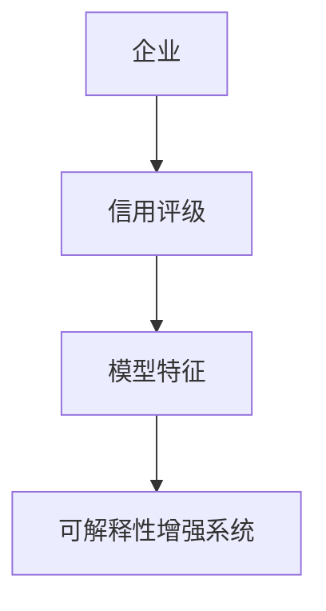
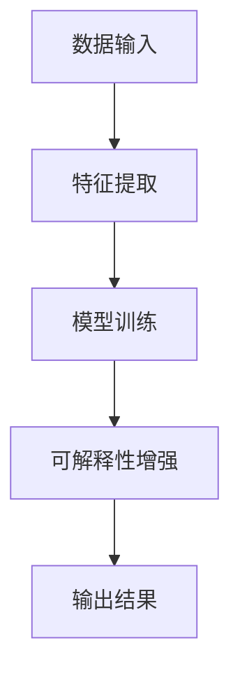
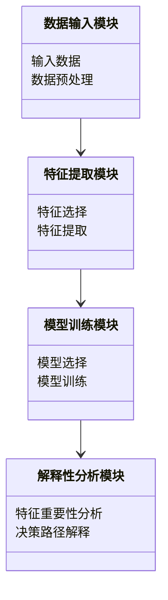
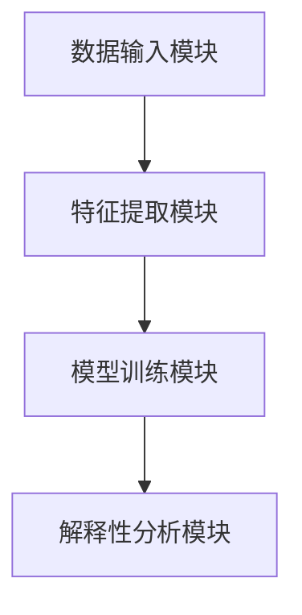
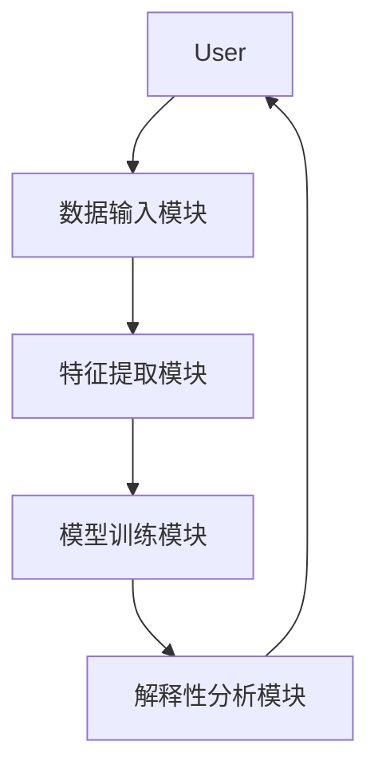

                 


# AI驱动的企业信用评级模型可解释性增强系统

## 关键词
AI驱动、企业信用评级、可解释性增强系统、机器学习、模型可解释性

## 摘要
随着人工智能技术的快速发展，企业信用评级模型的复杂性不断增加，导致其可解释性问题日益突出。本文提出了一种基于AI的可解释性增强系统，旨在提升企业信用评级模型的透明度和可信度。通过分析模型的核心概念、算法原理和系统架构，本文详细探讨了如何在保持高精度的同时，增强模型的可解释性。文章还通过实际案例分析，展示了该系统的应用效果和优势。

---

# 第一部分: AI驱动的企业信用评级模型可解释性增强系统概述

## 第1章: 背景介绍与问题背景

### 1.1 问题背景

#### 1.1.1 企业信用评级的传统方法与局限性
传统的企业信用评级方法主要依赖于经验丰富的分析师和复杂的评分标准。然而，这种方法存在以下问题：
- **主观性**：分析师的判断可能受到个人经验和主观因素的影响。
- **效率低下**：人工评估耗时长，难以应对大量企业的评级需求。
- **不透明性**：企业难以理解评级结果背后的逻辑。

#### 1.1.2 AI技术在信用评级中的应用潜力
人工智能技术，特别是机器学习和深度学习，能够处理大量数据，发现传统方法难以捕捉的模式。然而，AI模型的“黑箱”特性使得其决策过程难以解释，这在金融领域尤为重要。

#### 1.1.3 可解释性在企业信用评级中的重要性
在金融领域，可解释性是信任和合规的关键。企业需要了解评级结果的原因，以便采取相应的措施。同时，监管机构也要求金融机构能够解释其决策过程。

### 1.2 问题描述

#### 1.2.1 传统信用评级模型的可解释性挑战
传统信用评级模型通常基于统计方法，虽然有一定的可解释性，但其复杂性和局限性限制了其应用范围。

#### 1.2.2 AI模型在信用评级中的黑箱问题
AI模型（如深度神经网络）虽然在精度上表现优异，但其决策过程往往难以解释，这使得其在企业信用评级中的应用受到限制。

#### 1.2.3 可解释性增强的必要性与目标
可解释性增强的目标是在保持或提升模型性能的同时，使其决策过程更加透明和可解释。这有助于提升模型的可信度和实用性。

### 1.3 问题解决与边界

#### 1.3.1 可解释性增强的目标与范围
本系统的目标是通过引入可解释性增强技术，使AI驱动的企业信用评级模型更加透明。其范围包括数据预处理、特征提取、模型训练和结果解释。

#### 1.3.2 系统边界与功能外延
系统边界包括企业信用评级的输入数据、模型训练和结果输出。功能外延包括对模型的解释性分析和优化。

#### 1.3.3 核心问题与解决方案框架
核心问题是如何在保持高精度的同时，增强模型的可解释性。解决方案框架包括数据预处理、特征选择、模型训练和可解释性增强模块的设计。

## 第2章: 核心概念与理论基础

### 2.1 可解释性增强系统的核心概念

#### 2.1.1 可解释性在AI模型中的定义与分类
可解释性是指模型的决策过程能够被人类理解。根据解释的层次，可解释性可以分为局部可解释性和全局可解释性。

#### 2.1.2 企业信用评级模型的特征与属性
企业信用评级模型的特征包括财务指标、市场表现、管理团队等。属性包括稳定性、准确性、可扩展性。

#### 2.1.3 可解释性增强系统的构成要素
可解释性增强系统的构成要素包括数据预处理模块、特征选择模块、模型训练模块和解释性分析模块。

### 2.2 核心概念的属性对比

#### 2.2.1 不同信用评级模型的特征对比表格
| 模型类型 | 数据需求 | 可解释性 | 精度 |
|---------|----------|----------|------|
| 传统统计模型 | 中等 | 高 | 中等 |
| 支持向量机 | 高 | 中等 | 高 |
| 深度神经网络 | 高 | 低 | 高 |

#### 2.2.2 模型可解释性与性能的权衡分析
高精度模型通常可解释性较低，而可解释性高的模型精度可能较低。因此，在设计模型时需要权衡这两方面的表现。

#### 2.2.3 系统架构的模块化与可扩展性
系统的模块化设计使其能够灵活扩展。各模块之间的接口清晰，便于维护和优化。

### 2.3 实体关系与系统架构

#### 2.3.1 ER实体关系图


---

# 第3章: 可解释性增强系统的算法原理

## 第3章: 可解释性增强系统的算法原理

### 3.1 算法原理概述

#### 3.1.1 基于规则的可解释性增强方法
基于规则的可解释性增强方法通过预定义的规则来解释模型的决策过程。例如，使用决策树规则来解释模型的决策。

#### 3.1.2 基于模型的可解释性增强方法
基于模型的可解释性增强方法通过分析模型的内部结构来解释其决策过程。例如，使用线性模型或树模型来解释模型的特征重要性。

#### 3.1.3 混合型可解释性增强方法
混合型方法结合了基于规则和基于模型的方法，能够在保持高精度的同时，提供更加全面的解释。

### 3.2 算法实现流程

#### 3.2.1 数据预处理与特征提取
数据预处理包括数据清洗、特征标准化和特征选择。特征提取则是从原始数据中提取有用的特征，以便后续模型训练。

#### 3.2.2 模型训练与优化
模型训练包括选择合适的算法、调整超参数和优化模型性能。训练过程中需要监控模型的精度和可解释性。

#### 3.2.3 可解释性增强模块的设计与实现
可解释性增强模块包括特征重要性分析、决策路径解释和模型解释性评估。

### 3.3 算法流程图



---

## 第4章: 数学模型与公式解析

### 4.1 模型训练的数学基础

#### 4.1.1 损失函数的定义与优化
损失函数用于衡量模型预测值与真实值之间的差距。常用的损失函数包括均方误差（MSE）和交叉熵损失。

$$ \text{MSE} = \frac{1}{n}\sum_{i=1}^{n}(y_i - \hat{y}_i)^2 $$

其中，$y_i$是真实值，$\hat{y}_i$是预测值，$n$是样本数量。

#### 4.1.2 优化方法的选择与实现
常用的优化方法包括随机梯度下降（SGD）和Adam优化器。Adam优化器结合了动量和自适应学习率的优点，通常表现更优。

$$ \text{Adam优化器} = \frac{\beta_1 \cdot g_t + (1-\beta_1)g_t}{1-\beta_1^t} $$

其中，$\beta_1$是动量系数，$g_t$是梯度，$t$是时间步。

---

## 第5章: 系统分析与架构设计方案

### 5.1 问题场景介绍

#### 5.1.1 企业信用评级的流程
企业信用评级的流程包括数据收集、特征提取、模型训练和结果解释。每个步骤都需要精确设计以确保模型的可解释性。

#### 5.1.2 系统的功能需求
系统需要实现数据预处理、特征选择、模型训练和解释性分析等功能。

### 5.2 系统功能设计

#### 5.2.1 系统功能模块
系统功能模块包括数据输入模块、特征提取模块、模型训练模块和解释性分析模块。

#### 5.2.2 系统功能模块设计
使用领域模型的类图展示系统功能模块的设计。



### 5.3 系统架构设计

#### 5.3.1 系统架构图
系统架构图展示了各模块之间的关系和交互。



#### 5.3.2 系统接口设计
系统接口设计包括模块之间的数据传递和控制流设计。

#### 5.3.3 系统交互流程图
系统交互流程图展示了用户与系统之间的交互流程。



---

## 第6章: 项目实战

### 6.1 环境安装与配置

#### 6.1.1 环境要求
系统运行需要Python 3.6及以上版本，安装必要的库如scikit-learn、xgboost和shap。

#### 6.1.2 安装依赖
使用pip安装必要的库：

```bash
pip install scikit-learn xgboost shap
```

### 6.2 系统核心实现

#### 6.2.1 核心代码实现

```python
import numpy as np
import pandas as pd
from sklearn.model_selection import train_test_split
from xgboost import XGBClassifier
from sklearn.metrics import accuracy_score
import shap

# 数据加载与预处理
data = pd.read_csv('企业信用数据.csv')
X = data.drop('信用评级', axis=1)
y = data['信用评级']

# 数据分割
X_train, X_test, y_train, y_test = train_test_split(X, y, test_size=0.2, random_state=42)

# 模型训练
model = XGBClassifier()
model.fit(X_train, y_train)

# 模型预测
y_pred = model.predict(X_test)
print("模型精度:", accuracy_score(y_test, y_pred))

# 可解释性分析
explainer = shap.TreeExplainer(model)
shap_values = explainer.shap_values(X_test)

# 特征重要性分析
importance = model.feature_importances_
feature_names = X.columns
feature_importance = pd.DataFrame({'特征': feature_names, '重要性': importance})
print(feature_importance)
```

#### 6.2.2 代码功能解读与分析
上述代码实现了数据加载、预处理、模型训练和可解释性分析。使用XGBoost模型进行信用评级预测，并通过SHAP值分析特征的重要性。

#### 6.2.3 实际案例分析
通过实际案例分析，展示模型的预测结果和可解释性分析。例如，分析某个企业的信用评级结果及其影响因素。

### 6.3 项目小结

#### 6.3.1 项目成果
项目成功实现了基于AI的可解释性增强系统，提升了企业信用评级模型的透明度和可信度。

#### 6.3.2 项目经验总结
项目中需要注意数据质量、模型选择和可解释性分析的结合。同时，系统的模块化设计使其具有良好的可扩展性。

---

## 第7章: 最佳实践与小结

### 7.1 最佳实践

#### 7.1.1 数据预处理的注意事项
数据预处理是模型性能的关键。需要注意数据清洗、特征选择和数据标准化。

#### 7.1.2 模型调优的技巧
模型调优可以通过调整超参数和选择合适的算法来优化模型性能。

#### 7.1.3 可解释性增强的注意事项
可解释性增强需要平衡模型的性能和解释性。在实际应用中，可以根据具体需求选择合适的方法。

### 7.2 小结

本文详细探讨了AI驱动的企业信用评级模型可解释性增强系统的构建与应用。通过理论分析和实际案例，展示了如何在保持高精度的同时，增强模型的可解释性。系统的模块化设计和最佳实践为实际应用提供了重要参考。

---

## 作者：AI天才研究院/AI Genius Institute & 禅与计算机程序设计艺术 /Zen And The Art of Computer Programming

---

以上是《AI驱动的企业信用评级模型可解释性增强系统》的技术博客文章。通过系统化的分析和实践，本文为读者提供了从理论到实践的全面指导，帮助他们理解和应用AI驱动的可解释性增强系统。

