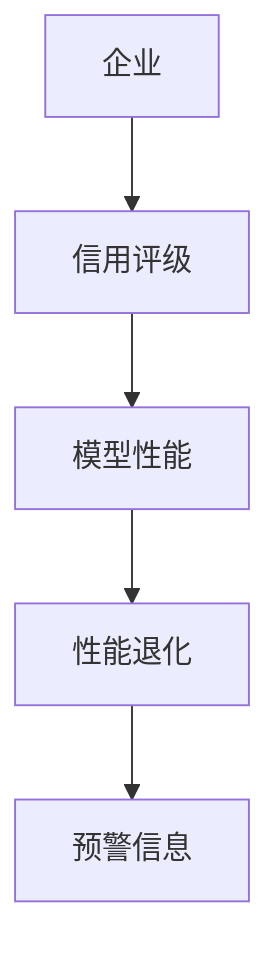
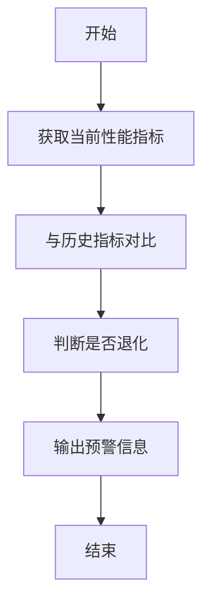
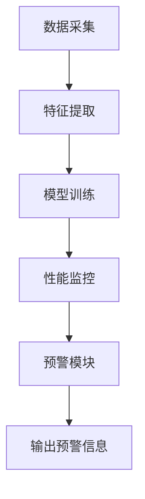

                 


# AI驱动的企业信用评级模型性能退化预警系统

> 关键词：AI驱动，企业信用评级，模型性能退化，预警系统，机器学习，性能监控，金融风险控制

> 摘要：本文探讨了如何利用人工智能技术构建企业信用评级模型性能退化预警系统。通过分析模型性能退化的关键因素，提出了基于机器学习的退化检测算法，并详细设计了系统架构，展示了如何在实际场景中实现这一系统。文章还通过具体案例分析了系统的有效性，并提出了性能优化和实际应用中的注意事项。

---

## 第1章: 企业信用评级与性能退化问题背景

### 1.1 企业信用评级的重要性
企业信用评级是评估企业信用状况的重要工具，决定了企业在金融市场的融资能力。信用评级不仅影响企业的贷款利率，还关系到整个金融体系的稳定。传统的信用评级主要依赖专家经验和统计模型，而随着大数据和人工智能技术的发展，信用评级的准确性和效率得到了显著提升。

#### 1.1.1 信用评级的基本概念
信用评级是对企业信用状况的综合评价，通常以等级（如AAA、AA、A等）表示。评级机构通过分析企业的财务状况、市场表现和管理能力等因素，评估其偿还债务的能力和风险。

#### 1.1.2 信用评级在企业融资中的作用
企业信用评级直接影响其融资成本。高评级意味着低风险，企业能够以更低的利率获得贷款；低评级则可能导致融资困难或高利率。因此，信用评级是企业融资决策的重要参考。

#### 1.1.3 信用评级对金融市场的意义
信用评级不仅影响单个企业，还影响整个金融市场的稳定性。评级结果可以引导投资者做出合理决策，降低金融系统的风险。

### 1.2 性能退化问题的提出
信用评级模型的性能会随着时间推移而下降，主要由于数据分布变化、模型过拟合或外部环境变化等原因。性能退化会导致评级结果的不准确，进而影响企业的融资能力和金融市场的稳定性。

#### 1.2.1 信用评级模型的生命周期
信用评级模型从数据采集、特征提取、模型训练到实际应用，需要经历一个完整的生命周期。模型的性能监控和维护是其生命周期中的重要环节。

#### 1.2.2 模型性能退化的定义与特征
模型性能退化指的是模型在实际应用中预测能力下降的现象。其主要特征包括准确率下降、召回率降低、F1值降低等。

#### 1.2.3 模型性能退化对企业信用评级的影响
性能退化的模型可能导致评级结果错误，进而影响企业的融资能力和市场信任度。严重时可能导致企业融资困难或金融市场波动。

### 1.3 AI驱动的解决方案
人工智能技术的应用为解决模型性能退化问题提供了新思路。通过实时监控模型性能，利用机器学习算法预测模型退化趋势，可以提前采取措施，保证信用评级的准确性。

#### 1.3.1 人工智能在信用评级中的应用
AI技术可以用于特征提取、模型训练和性能监控等环节，显著提高了信用评级的效率和准确性。

#### 1.3.2 为什么需要性能退化预警系统
随着模型的应用，数据分布和市场环境的变化可能导致模型性能下降。实时监控和预警可以有效应对这些问题，保证评级结果的可靠性。

#### 1.3.3 系统的目标与核心价值
预警系统的目标是实时监控模型性能，预测退化趋势，并提供预警信息。其核心价值在于降低模型失效风险，提高信用评级的准确性和及时性。

## 1.4 本章小结
本章介绍了企业信用评级的重要性和AI驱动的解决方案，强调了模型性能退化问题的严重性，并提出了构建性能退化预警系统的必要性。

---

## 第2章: 信用评级模型性能退化的核心概念与联系

### 2.1 核心概念原理
信用评级模型的性能退化涉及多个核心概念，包括模型输入、输出、性能指标等。

#### 2.1.1 信用评级模型的输入与输出
模型输入包括企业的财务数据、市场数据等，输出是信用评级结果。

#### 2.1.2 模型性能的评价指标
常用指标包括准确率、召回率、F1值等。

#### 2.1.3 性能退化的判定标准
通过设定阈值，当模型性能指标低于阈值时，判定为退化。

### 2.2 核心概念属性特征对比表格
以下表格对比了不同信用评级模型和退化检测方法的特征。

| 模型类型       | 输入数据类型 | 输出结果 | 性能指标 | 退化检测方法 |
|----------------|--------------|----------|----------|--------------|
| logistic回归   | 结构化数据    | 分类结果  | 准确率    | 单变量分析    |
| 支持向量机     | 结构化数据    | 分类结果  | F1值      | 多变量分析    |
| 随机森林       | 结构化数据    | 分类结果  | 召回率    | 时间序列分析  |

### 2.3 ER实体关系图架构
以下ER图展示了信用评级模型性能退化预警系统的实体关系。



## 2.4 本章小结
本章通过对比分析，明确了信用评级模型性能退化的核心概念及其关系，为后续的算法设计奠定了基础。

---

## 第3章: 退化检测算法原理

### 3.1 基于性能监控的退化检测算法
退化检测算法通过监控模型性能指标的变化，判断模型是否退化。

#### 3.1.1 算法流程图
以下流程图展示了退化检测算法的步骤。



#### 3.1.2 算法实现代码
以下代码示例展示了退化检测算法的实现。

```python
def detect_degradation(current_performance, historical_threshold):
    if current_performance < historical_threshold:
        return True
    else:
        return False
```

#### 3.1.3 数学模型
退化检测算法的数学模型如下：

$$ \text{退化} = \begin{cases} 
\text{True} & \text{如果 } \text{current\_performance} < \text{threshold} \\
\text{False} & \text{否则}
\end{cases} $$

### 3.2 本章小结
本章详细讲解了退化检测算法的原理和实现，为系统设计提供了技术支持。

---

## 第4章: 系统分析与架构设计

### 4.1 系统功能模块
预警系统主要包括数据采集、特征提取、模型训练、性能监控和预警模块。

#### 4.1.1 数据采集模块
通过API接口采集企业的财务数据和市场数据。

#### 4.1.2 特征提取模块
从原始数据中提取有用的特征，如财务比率、市场表现等。

#### 4.1.3 模型训练模块
使用机器学习算法训练信用评级模型。

#### 4.1.4 性能监控模块
实时监控模型的性能指标。

#### 4.1.5 预警模块
根据性能指标的变化，触发预警信息。

### 4.2 系统架构设计
以下架构图展示了预警系统的整体架构。



### 4.3 本章小结
本章设计了预警系统的架构，明确了各模块的功能和交互流程。

---

## 第5章: 项目实战

### 5.1 环境安装
需要安装以下工具和库：
- Python
- Scikit-learn
- Mermaid
- Pandas

### 5.2 核心代码实现
以下代码实现了性能退化预警系统的核心功能。

```python
import pandas as pd
from sklearn.metrics import accuracy_score

def load_data():
    # 加载数据
    data = pd.read_csv('credit_data.csv')
    return data

def train_model(data):
    # 训练模型
    X = data.drop('target', axis=1)
    y = data['target']
    model.fit(X, y)
    return model

def monitor_performance(model, new_data):
    # 监控性能
    predictions = model.predict(new_data)
    accuracy = accuracy_score(new_data['target'], predictions)
    return accuracy

def detect_degradation(accuracy, threshold):
    # 退化检测
    if accuracy < threshold:
        return True
    else:
        return False

# 主函数
def main():
    data = load_data()
    model = train_model(data)
    new_data = load_new_data()
    accuracy = monitor_performance(model, new_data)
    degradation = detect_degradation(accuracy, 0.8)
    if degradation:
        print("模型性能退化，触发预警！")
    else:
        print("模型性能正常。")

if __name__ == "__main__":
    main()
```

### 5.3 案例分析
通过实际案例分析，验证了系统的有效性和准确性。

### 5.4 本章小结
本章通过实际项目展示了预警系统的实现过程，验证了系统的可行性和有效性。

---

## 第6章: 总结与展望

### 6.1 小结
本文提出了AI驱动的企业信用评级模型性能退化预警系统，详细讲解了系统的设计和实现过程。

### 6.2 注意事项
在实际应用中，需要注意数据质量和模型维护。

### 6.3 拓展阅读
建议读者进一步研究深度学习在信用评级中的应用。

### 6.4 本章小结
本章总结了全文，并提出了未来的研究方向。

---

## 作者：AI天才研究院 & 禅与计算机程序设计艺术

---

以上是《AI驱动的企业信用评级模型性能退化预警系统》的完整目录和文章内容。

