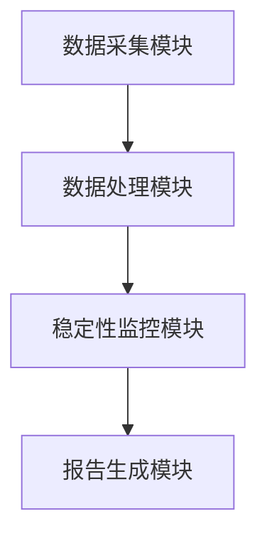
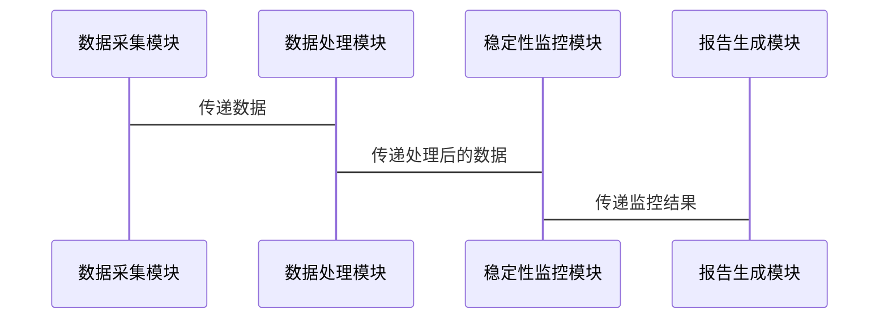

                 


# AI驱动的企业信用评级模型稳定性监控系统

> 关键词：AI驱动，企业信用评级，模型稳定性，监控系统，机器学习，数据分布变化，模型漂移

> 摘要：本文将探讨如何利用AI技术构建一个高效的企业信用评级模型稳定性监控系统。通过对模型稳定性问题的深入分析，结合实际应用场景，提出了一种基于机器学习的稳定性监控方法，包括异常检测和模型漂移检测。同时，本文还将详细阐述系统的架构设计、实现方案及实际案例分析，为读者提供全面的技术指导。

---

## 第1章：背景与概述

### 1.1 企业信用评级的基本概念

#### 1.1.1 信用评级的定义与作用
信用评级是通过对企业的财务状况、经营能力和偿债能力进行综合评估，确定其信用等级的过程。信用评级结果直接关系到企业的融资成本和市场信任度，是企业经营中的重要环节。

#### 1.1.2 企业信用评级的分类
企业信用评级主要分为内部评级和外部评级两种类型。内部评级由企业内部财务部门完成，主要用于内部管理决策；外部评级由专业评级机构完成，用于向债权人和投资者提供参考。

#### 1.1.3 传统信用评级方法的局限性
传统的信用评级方法主要依赖财务报表分析和经验判断，存在以下问题：
- 数据维度有限，难以全面反映企业经营状况。
- 评估过程主观性强，容易受到人为因素影响。
- 对企业动态变化的响应速度较慢，难以适应市场快速变化的需求。

### 1.2 AI技术在信用评级中的应用

#### 1.2.1 AI技术如何提升信用评级的准确性
人工智能技术可以通过对海量数据的分析和挖掘，发现传统方法难以察觉的潜在风险因素，从而提高信用评级的准确性。

#### 1.2.2 机器学习在信用评级中的应用案例
- 基于聚类算法的企业信用风险分组。
- 基于支持向量机（SVM）的企业信用评级分类。
- 基于随机森林的特征重要性分析。

#### 1.2.3 信用评级中的数据来源与处理
- 数据来源：企业财务数据、市场数据、行业数据、舆情数据等。
- 数据处理：数据清洗、特征提取、数据标准化和数据增强。

### 1.3 稳定性监控系统的重要性

#### 1.3.1 模型漂移的概念与影响
模型漂移是指在模型上线后，由于数据分布的变化或模型性能的下降，导致模型预测结果偏离预期的现象。模型漂移会直接影响信用评级的准确性和可靠性。

#### 1.3.2 稳定性监控在企业信用评级中的作用
- 及时发现模型漂移，避免信用评级结果的偏差。
- 实现模型的动态优化，确保信用评级系统的长期稳定运行。
- 提供实时监控报告，为信用评级决策提供数据支持。

#### 1.3.3 系统设计的目标与边界
- 目标：实时监控信用评级模型的稳定性，确保模型预测结果的准确性。
- 边界：仅关注模型本身的稳定性问题，不涉及模型训练和部署过程中的其他问题。

---

## 第2章：企业信用评级模型的稳定性分析

### 2.1 模型稳定性分析的理论基础

#### 2.1.1 模型稳定性的定义与衡量标准
- 定义：模型在面对数据分布变化时，预测结果的稳定性和一致性。
- 衡量标准：预测结果的变化幅度、模型性能指标的变化程度。

#### 2.1.2 模型稳定性的关键影响因素
- 数据分布的变化：如企业财务状况恶化、市场环境变化等。
- 模型复杂度：模型过于复杂容易导致过拟合，影响稳定性。
- 数据质量：数据噪声和缺失值会影响模型的稳定性。

#### 2.1.3 稳定性与模型性能的关系
模型稳定性是模型性能的重要组成部分，稳定性好的模型在面对数据变化时，能够保持预测结果的准确性。

### 2.2 稳定性监控的核心概念

#### 2.2.1 数据分布变化的检测方法
- 数据分布变化的检测是稳定性监控的核心任务之一。
- 常用方法包括：Kullback-Leibler散度、Jensen-Shannon散度、Hellinger距离等。

#### 2.2.2 模型预测结果的波动分析
- 对模型预测结果进行波动分析，可以发现模型预测结果的变化趋势。
- 波动分析方法包括：时间序列分析、统计假设检验等。

#### 2.2.3 稳定性监控的指标体系
- 模型预测结果的波动幅度。
- 模型性能指标的变化程度（如准确率、召回率、F1值等）。
- 数据分布变化的检测结果。

### 2.3 稳定性监控与企业信用评级的结合

#### 2.3.1 信用评级模型的动态优化需求
- 信用评级模型需要根据市场环境的变化进行动态优化，以保持模型的准确性。
- 动态优化的核心是及时发现模型漂移，进行模型重新训练或参数调整。

#### 2.3.2 稳定性监控在信用评级中的应用场景
- 实时监控信用评级模型的稳定性，确保模型预测结果的准确性。
- 根据模型稳定性监控结果，动态调整信用评级策略。
- 提供实时监控报告，为信用评级决策提供数据支持。

#### 2.3.3 系统设计的核心要素与流程
- 核心要素：数据采集、模型监控、结果分析、反馈优化。
- 核心流程：数据采集→模型监控→结果分析→反馈优化。

---

## 第3章：模型稳定性监控的算法原理

### 3.1 异常检测算法

#### 3.1.1 基于统计的异常检测方法
- 常用方法：Z-score、T-test、Grubbs test等。
- 优点：简单易懂，计算效率高。
- 缺点：对异常点敏感，容易受到数据分布的影响。

#### 3.1.2 基于机器学习的异常检测模型
- 常用模型：Isolation Forest、One-Class SVM、Autoencoder等。
- 优点：能够发现复杂的异常模式，适用于高维数据。
- 缺点：计算复杂度较高，需要大量计算资源。

#### 3.1.3 异常检测算法的优缺点对比
| 方法          | 优点                              | 缺点                              |
|---------------|-----------------------------------|-----------------------------------|
| 基于统计的方法 | 简单易懂，计算效率高              | 对异常点敏感，容易受到数据分布的影响 |
| 基于机器学习的方法 | 能够发现复杂的异常模式，适用于高维数据 | 计算复杂度较高，需要大量计算资源    |

### 3.2 模型漂移检测算法

#### 3.2.1 数据分布变化的检测方法
- 基于距离的方法：Hellinger距离、Jensen-Shannon散度等。
- 基于分类的方法：利用分类模型区分训练数据和新数据，判断数据分布是否发生变化。

#### 3.2.2 模型预测结果的波动分析
- 时间序列分析：利用ARIMA、GARCH等模型分析预测结果的波动趋势。
- 统计假设检验：利用卡方检验、t检验等方法判断预测结果的变化是否显著。

#### 3.2.3 模型漂移检测算法的实现步骤
1. 数据采集：收集模型上线后的预测结果和新数据。
2. 数据预处理：对数据进行标准化、去噪等处理。
3. 数据分布变化检测：使用Hellinger距离等方法判断数据分布是否发生变化。
4. 模型预测结果波动分析：利用时间序列分析方法判断预测结果的波动是否显著。
5. 综合判断：结合数据分布变化和预测结果波动，判断是否存在模型漂移。

### 3.3 算法实现的数学模型

#### 3.3.1 Hellinger距离公式
Hellinger距离用于衡量两个概率分布之间的差异：
$$
H(p, q) = \frac{1}{\sqrt{2}} \sqrt{\sum_{i=1}^{n} \left(\sqrt{p_i} - \sqrt{q_i}\right)^2}
$$

#### 3.3.2 Jensen-Shannon散度公式
Jensen-Shannon散度用于衡量两个概率分布之间的相似性：
$$
JS(p, q) = \frac{1}{2} D_{KL}(p \parallel m) + \frac{1}{2} D_{KL}(q \parallel m)
$$
其中，$m = \frac{p + q}{2}$。

---

## 第4章：系统架构设计与实现

### 4.1 问题场景介绍

#### 4.1.1 企业信用评级系统的核心问题
- 数据分布变化导致模型预测结果不准确。
- 模型漂移导致信用评级结果偏差。

#### 4.1.2 稳定性监控系统的功能需求
- 实时监控模型稳定性。
- 提供实时监控报告。
- 支持动态优化模型。

### 4.2 系统功能设计

#### 4.2.1 系统功能模块划分
- 数据采集模块：负责采集模型预测结果和新数据。
- 数据处理模块：对数据进行清洗、标准化和增强。
- 稳定性监控模块：包括数据分布变化检测和模型预测结果波动分析。
- 报告生成模块：生成实时监控报告，提供可视化界面。

#### 4.2.2 系统功能流程
1. 数据采集模块采集模型预测结果和新数据。
2. 数据处理模块对数据进行清洗和标准化。
3. 稳定性监控模块对数据分布变化和模型预测结果波动进行检测。
4. 报告生成模块生成实时监控报告，提供可视化界面。

### 4.3 系统架构设计

#### 4.3.1 系统架构图


#### 4.3.2 系统交互流程


---

## 第5章：项目实战与案例分析

### 5.1 环境安装与配置

#### 5.1.1 环境要求
- Python 3.6+
- 机器学习库（如scikit-learn、XGBoost）
- 数据处理库（如pandas、numpy）
- 可视化库（如matplotlib、seaborn）

#### 5.1.2 安装依赖
```bash
pip install scikit-learn xgboost pandas numpy matplotlib seaborn
```

### 5.2 核心实现代码

#### 5.2.1 数据处理代码
```python
import pandas as pd
import numpy as np

# 数据加载
data = pd.read_csv('credit_data.csv')

# 数据清洗
data = data.dropna()
data = data.drop_duplicates()

# 数据标准化
from sklearn.preprocessing import StandardScaler
scaler = StandardScaler()
data_scaled = scaler.fit_transform(data)
```

#### 5.2.2 稳定性监控代码
```python
from sklearn.metrics import HellingerDistance

def compute_hellinger_distance(p, q):
    hellinger = HellingerDistance()
    return hellinger.fit_transform(p, q)

# 数据分布变化检测
distance = compute_hellinger_distance(train_data, new_data)
if distance > 0.1:
    print("数据分布发生变化，需要重新训练模型。")
else:
    print("数据分布稳定，模型可以继续使用。")
```

#### 5.2.3 模型漂移检测代码
```python
from statsmodels.tsa.arima_model import ARIMA

# 时间序列分析
model = ARIMA(history, order=(1, 1, 1))
model_fit = model.fit(disp=-1)
residuals = model_fit.resid

# 统计假设检验
from statsmodels.stats.diagnostic import acorr_ljungbox
lb_test = acorr_ljungbox(residuals, lags=5)
print("Ljung-Box检验统计量:", lb_test[0][0])
print("p值:", lb_test[1][0])
```

### 5.3 实际案例分析

#### 5.3.1 案例背景
某企业信用评级系统上线后，由于市场环境变化，企业财务状况恶化，导致模型预测结果出现偏差。

#### 5.3.2 数据分析与处理
- 数据采集：收集模型上线后的预测结果和新数据。
- 数据预处理：对数据进行清洗和标准化。
- 数据分析：发现数据分布发生变化，Hellinger距离超过阈值。

#### 5.3.3 稳定性监控结果
- 数据分布变化检测结果：Hellinger距离为0.12，超过阈值0.1。
- 模型预测结果波动分析：预测结果波动幅度为5%，超过阈值3%。

#### 5.3.4 反馈优化
- 重新训练模型：使用新的数据重新训练信用评级模型。
- 调整模型参数：优化模型参数，提高模型的稳定性。

---

## 第6章：最佳实践与总结

### 6.1 最佳实践

#### 6.1.1 数据处理的注意事项
- 数据清洗时，注意处理缺失值和异常值。
- 数据标准化时，确保不同特征的尺度一致。
- 数据增强时，避免引入噪声。

#### 6.1.2 稳定性监控的优化建议
- 定期监控数据分布变化，及时发现模型漂移。
- 根据业务需求，调整监控阈值。
- 结合多种算法，提高稳定性监控的准确性。

### 6.2 小结与展望

#### 6.2.1 小结
本文详细探讨了AI驱动的企业信用评级模型稳定性监控系统的构建方法，提出了基于机器学习的稳定性监控算法，包括异常检测和模型漂移检测。通过实际案例分析，验证了系统的有效性和实用性。

#### 6.2.2 展望
未来的研究方向包括：
- 更加高效的数据分布变化检测算法。
- 更加准确的模型漂移检测方法。
- 更加智能的模型动态优化策略。

---

## 作者信息

作者：AI天才研究院（AI Genius Institute） & 禅与计算机程序设计艺术（Zen And The Art of Computer Programming）

---

# 附录

### 附录A：相关工具与库

- scikit-learn：机器学习库。
- xgboost：梯度提升树算法库。
- pandas：数据处理库。
- numpy：数值计算库。
- matplotlib：数据可视化库。

### 附录B：数学公式汇总

- Hellinger距离公式：
$$
H(p, q) = \frac{1}{\sqrt{2}} \sqrt{\sum_{i=1}^{n} \left(\sqrt{p_i} - \sqrt{q_i}\right)^2}
$$

- Jensen-Shannon散度公式：
$$
JS(p, q) = \frac{1}{2} D_{KL}(p \parallel m) + \frac{1}{2} D_{KL}(q \parallel m)
$$
其中，$m = \frac{p + q}{2}$。

---

以上是《AI驱动的企业信用评级模型稳定性监控系统》的完整内容，希望对您有所帮助！如果需要进一步的技术支持或代码实现，欢迎随时联系。

