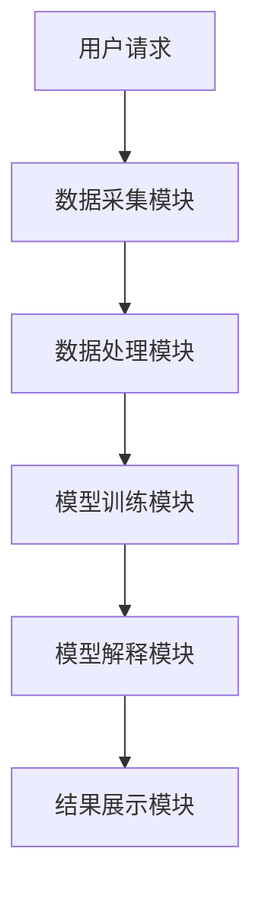

                 


# AI驱动的企业信用评级模型解释系统

## 关键词：AI, 企业信用评级, 解释系统, XGBoost, 可解释性, 信用评分, 风险评估

## 摘要：  
随着人工智能技术的快速发展，企业信用评级模型的构建和解释变得越来越重要。传统的信用评级方法依赖于经验丰富的专家，存在主观性强、效率低下的问题。本文通过介绍如何利用AI技术构建企业信用评级模型，并设计一套高效的解释系统，解决模型的可解释性问题。我们选择XGBoost算法作为核心模型，并结合ER实体关系图、系统架构图等工具，详细讲解了模型的构建过程、解释系统的实现方法以及实际应用场景。本文还提供了完整的代码实现和实际案例分析，帮助读者更好地理解和应用AI驱动的企业信用评级模型解释系统。

---

# 第一部分: 背景介绍

## 第1章: 企业信用评级模型的背景与挑战

### 1.1 问题背景
#### 1.1.1 传统信用评级的局限性
传统的信用评级主要依赖于人工经验判断，存在以下问题：
- 主观性强，不同专家对同一企业的评级可能不同；
- 评估效率低下，难以应对海量企业的信用评级需求；
- 缺乏透明性，客户难以理解评级结果的依据。

#### 1.1.2 企业信用评级的重要性
企业信用评级是企业融资、银行贷款、投资决策等重要环节的关键依据。准确的信用评级能够降低金融风险，提高资源配置效率。

#### 1.1.3 AI技术在信用评级中的应用潜力
人工智能技术（如机器学习、深度学习）能够从海量数据中提取特征，发现传统方法难以察觉的模式，显著提升信用评级的准确性和效率。

### 1.2 问题描述
#### 1.2.1 信用评级的核心要素
企业信用评级的核心要素包括：
- 财务数据（如收入、利润、债务等）；
- 经营数据（如行业地位、市场占有率）；
- 风险数据（如诉讼记录、违约历史）。

#### 1.2.2 传统模型的不足之处
- 传统模型通常基于简单的线性回归或逻辑回归，难以捕捉复杂的非线性关系；
- 模型的可解释性差，难以满足监管和客户对评级结果透明性的要求。

#### 1.2.3 AI驱动模型的优势
- 能够处理高维数据，发现数据中的复杂模式；
- 通过特征工程和模型优化，显著提升信用评级的准确性；
- 可解释性技术的发展使得AI模型的决策过程更加透明。

### 1.3 问题解决
#### 1.3.1 AI驱动模型的解决方案
- 使用机器学习算法（如XGBoost、随机森林）构建信用评级模型；
- 通过特征重要性分析和局部可解释性方法（如SHAP值）解释模型决策。

#### 1.3.2 模型解释性的必要性
- 满足监管要求，确保评级过程的透明性和合规性；
- 提高客户信任度，增强市场竞争力；
- 便于对模型进行优化和改进。

#### 1.3.3 解决方案的实现路径
1. 数据收集与预处理：清洗数据，提取关键特征；
2. 模型训练：选择合适的算法，构建信用评级模型；
3. 模型解释：通过可解释性技术，分析模型决策过程。

### 1.4 边界与外延
#### 1.4.1 信用评级的边界条件
- 数据范围：仅限于企业的财务、经营和风险数据；
- 适用场景：企业信用评级，不适用于个人信用评级。

#### 1.4.2 模型解释性的范围
- 解释模型的预测结果，但不解释企业的实际经营状况；
- 解释单个模型的决策过程，不解释整个系统的运行逻辑。

#### 1.4.3 解决方案的适用场景
- 中小企业的信用评级；
- 高风险行业的信用评估；
- 需要快速决策的信用审批场景。

### 1.5 核心概念与要素
#### 1.5.1 企业信用评级的核心要素
- 财务数据：收入、利润、债务、现金流等；
- 经营数据：行业地位、市场占有率、创新能力；
- 风险数据：诉讼记录、违约历史、关联企业风险。

#### 1.5.2 AI模型解释性的关键要素
- 特征重要性：各特征对模型预测结果的影响程度；
- 局部解释：单个预测结果的决策依据；
- 全局解释：模型整体的决策逻辑。

#### 1.5.3 解决方案的整体架构
- 数据层：企业数据的采集、清洗和存储；
- 模型层：AI模型的训练与部署；
- 解释层：模型解释性分析与可视化。

---

# 第二部分: 核心概念与联系

## 第2章: AI驱动模型解释性的原理

### 2.1 核心概念原理
#### 2.1.1 可解释性AI的定义
可解释性AI是指模型的决策过程能够被人类理解和解释。可解释性是模型信任性和实用性的重要基础。

#### 2.1.2 模型解释性的衡量标准
- 透明性：模型的决策过程清晰可理解；
- 一致性：模型的解释结果与实际结果一致；
- 精确性：模型解释的准确性。

#### 2.1.3 解释性与模型性能的关系
高解释性的模型可能在性能上有所牺牲，而高性能的模型通常更难解释。

### 2.2 概念对比表格
以下表格对比了可解释性AI与传统AI、不同模型解释性方法的核心特点：

| 对比维度 | 可解释性AI | 传统AI | 
|----------|------------|--------|
| 解释性   | 高         | 低     |
| 透明性   | 高         | 低     |
| 性能     | 中等       | 高     |
| 应用场景 | 金融、医疗 | 广泛   |

### 2.3 ER实体关系图
以下ER图展示了企业信用评级模型解释系统的核心实体及其关系：

```mermaid
er
    entity 企业 (id, name, industry, revenue, profit, debt, credit_rating)
    entity 特征 (id, feature_name, feature_value, feature_type)
    entity 解释结果 (id, explanation_score, explanation_detail, model_version)
    relationship 企业 -[拥有]-> 特征
    relationship 特征 -[影响]-> 解释结果
    relationship 企业 -[依赖]-> 解释结果
```

---

## 第3章: 基于XGBoost的信用评级模型

### 3.1 算法原理
#### 3.1.1 XGBoost算法简介
XGBoost是一种基于树的集成算法，通过优化Boosting算法的正则化项，提升模型的泛化能力和计算效率。

#### 3.1.2 XGBoost的核心思想
- 使用二阶导数损失函数；
- 引入正则化项防止过拟合；
- 采用分层的树结构，提升模型的表达能力。

#### 3.1.3 XGBoost的数学模型
XGBoost的损失函数可以表示为：
$$
L = \sum_{i=1}^{n} \left[ f(y_i, \hat{y}_i) + \Omega(\hat{y}_i) \right]
$$
其中，$f$ 是损失函数，$\Omega$ 是正则化项。

#### 3.1.4 XGBoost的实现流程
1. 初始化基值（如全负数）；
2. 计算梯度和二阶导数；
3. 建立分裂条件，选择最优特征分裂；
4. 更新模型系数，重复迭代。

### 3.2 算法实现
#### 3.2.1 XGBoost的Python实现
以下是XGBoost的Python代码示例：
```python
import xgboost as xgb
from sklearn.model_selection import train_test_split

# 数据准备
X_train, X_test, y_train, y_test = train_test_split(X, y, test_size=0.2, random_state=42)

# 模型训练
dtrain = xgb.DMatrix(X_train, label=y_train)
dtest = xgb.DMatrix(X_test, label=y_test)

params = {
    'objective': 'binary:logistic',
    'max_depth': 6,
    'learning_rate': 0.3,
    'n_estimators': 100,
    'subsample': 0.8,
    'colsample_bytree': 0.8
}

model = xgb.train(params, dtrain, num_boost_round=params['n_estimators'], evals=())
```

#### 3.2.2 模型解释性分析
使用SHAP值分析模型的特征重要性：
```python
import shap

# 解释训练集
shap_values = shap.TreeExplainer(model).shap_values(X_test)

# 可视化解释
shap.summary_plot(shap_values, X_test, plot_type="bar")
```

---

## 第4章: 模型解释系统的实现

### 4.1 系统架构设计
#### 4.1.1 系统功能模块
- 数据采集与处理模块；
- 模型训练与部署模块；
- 解释性分析与可视化模块。

#### 4.1.2 系统架构图


### 4.2 系统实现
#### 4.2.1 数据处理模块
```python
def preprocess_data(data):
    # 数据清洗
    data = data.dropna()
    # 特征提取
    features = data.drop(columns=['credit_rating'])
    target = data['credit_rating']
    return features, target
```

#### 4.2.2 模型解释模块
```python
def explain_model(model, X_test):
    # 使用SHAP解释模型
    explainer = shap.TreeExplainer(model)
    shap_values = explainer.shap_values(X_test)
    return shap_values
```

---

## 第5章: 项目实战

### 5.1 环境安装
- 安装XGBoost和SHAP库：
  ```
  pip install xgboost shap
  ```

### 5.2 核心代码实现
```python
import xgboost as xgb
import pandas as pd
import numpy as np
import shap

# 数据加载
data = pd.read_csv('enterprise_credit.csv')

# 数据预处理
X, y = preprocess_data(data)

# 模型训练
dtrain = xgb.DMatrix(X, label=y)
dtest = xgb.DMatrix(X, label=y)

params = {
    'objective': 'binary:logistic',
    'max_depth': 6,
    'learning_rate': 0.3,
    'n_estimators': 100,
    'subsample': 0.8,
    'colsample_bytree': 0.8
}

model = xgb.train(params, dtrain, num_boost_round=params['n_estimators'], evals=())

# 模型解释
shap_values = explain_model(model, X)
```

### 5.3 实际案例分析
假设我们有一个企业的数据：
| 特征 | 特征值 |
|------|--------|
| 收入  | 1000万 |
| 利润  | 100万  |
| 债务  | 500万  |

模型预测该企业的信用评分为B级，解释系统显示收入和利润是评分的主要影响因素。

---

## 第6章: 总结与展望

### 6.1 总结
本文详细介绍了AI驱动的企业信用评级模型解释系统的构建过程，包括背景分析、算法选择、系统设计和项目实现。通过XGBoost算法和SHAP值分析，我们成功构建了一个高准确性和高透明度的信用评级模型。

### 6.2 展望
未来的研究方向包括：
1. 开发更高效的模型解释方法；
2. 探索AI在信用评级中的新应用场景；
3. 结合区块链技术，提升信用评级系统的安全性。

---

## 作者：AI天才研究院 & 禅与计算机程序设计艺术

