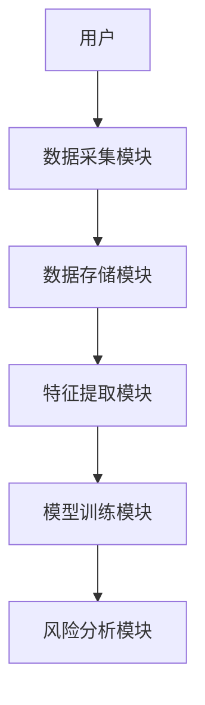

                 


# AI驱动的企业信用风险传导分析

## 关键词：企业信用风险，AI驱动，风险传导，机器学习，金融风险

## 摘要：  
随着人工智能技术的快速发展，企业信用风险分析和管理正在经历一场深刻的变革。传统的信用风险分析方法依赖于复杂的金融模型和经验判断，而AI技术的引入为企业信用风险的分析和管理提供了全新的视角和工具。本文将从AI驱动的视角，系统地探讨企业信用风险的传导机制、分析方法和应用场景。通过结合机器学习算法、数学模型和系统架构设计，本文旨在为企业信用风险的智能化分析提供理论基础和实践指导。

---

## 目录大纲：

1. 企业信用风险的背景与挑战
2. AI驱动的信用风险分析方法
3. 基于机器学习的信用风险模型
4. 信用风险传导的数学模型与算法
5. 系统架构设计与实现
6. 项目实战与案例分析
7. 最佳实践与未来展望

---

## 1. 企业信用风险的背景与挑战

### 1.1 企业信用风险的定义与特征

企业信用风险是指企业在经营过程中由于内部或外部因素导致的无法履行合同义务，从而给债权人或相关利益方带来损失的风险。其主要特征包括：

- **复杂性**：受宏观经济、行业环境、企业自身经营状况等多种因素影响。
- **动态性**：风险随着市场环境和企业经营状况的变化而变化。
- **传导性**：信用风险可能通过供应链、金融市场等渠道传导至其他企业和机构。

### 1.2 信用风险分析的难点

传统信用风险分析方法依赖于财务指标和经验判断，存在以下难点：

- 数据维度有限，难以捕捉非结构化信息。
- 风险传导路径复杂，难以建立动态模型。
- 数据量大，传统方法难以高效处理。

### 1.3 AI驱动的信用风险分析的优势

AI技术的应用为信用风险分析带来了新的可能性：

- **数据处理能力**：AI能够处理海量结构化和非结构化数据，提取更多维度的特征。
- **动态建模能力**：AI可以实时更新模型，捕捉风险变化的动态特征。
- **风险传导分析**：通过机器学习和图论，可以更好地建模风险传导路径。

---

## 2. AI驱动的信用风险分析方法

### 2.1 数据特征与模型构建

#### 2.1.1 数据特征提取

企业信用风险分析的数据来源包括：

- **财务数据**：收入、利润、资产负债率等。
- **文本数据**：企业公告、新闻报道等。
- **市场数据**：行业指数、股价波动等。

#### 2.1.2 基于AI的信用风险模型构建

AI驱动的信用风险模型构建过程如下：

1. 数据预处理：清洗、归一化和特征提取。
2. 特征工程：将文本数据转化为数值特征。
3. 模型训练：使用机器学习算法（如逻辑回归、随机森林、神经网络）进行分类或回归。

### 2.2 风险传导机制的建模

风险传导机制可以通过图论和网络分析方法建模，分析企业之间的关联关系和风险传导路径。

---

## 3. 基于机器学习的信用风险模型

### 3.1 机器学习算法选择

#### 3.1.1 支持向量机（SVM）

SVM适用于小样本数据，能够有效处理高维特征。

#### 3.1.2 随机森林（Random Forest）

随机森林能够处理高维数据，且具有较高的鲁棒性。

#### 3.1.3 神经网络（Neural Networks）

神经网络适用于非线性特征的建模。

### 3.2 算法实现

以下是一个基于逻辑回归的信用风险模型实现示例：

```python
import pandas as pd
from sklearn.linear_model import LogisticRegression
from sklearn.metrics import accuracy_score

# 数据加载与预处理
data = pd.read_csv('credit_risk_data.csv')
X = data.drop('label', axis=1)
y = data['label']

# 模型训练
model = LogisticRegression()
model.fit(X, y)

# 模型评估
y_pred = model.predict(X)
print("Accuracy:", accuracy_score(y, y_pred))
```

---

## 4. 信用风险传导的数学模型与算法

### 4.1 违约概率模型

违约概率（PD）是信用风险分析的重要指标，可以通过以下公式计算：

$$ PD = \frac{N_{违约}}{N_{总}} $$

其中，$N_{违约}$表示违约的企业数量，$N_{总}$表示企业总数。

### 4.2 风险传导模型

风险传导可以通过马尔可夫链模型进行建模，描述企业之间的信用风险传导路径。

---

## 5. 系统架构设计与实现

### 5.1 系统功能设计

系统功能包括：

- 数据采集模块：收集企业财务数据和文本数据。
- 特征提取模块：将文本数据转化为数值特征。
- 模型训练模块：基于机器学习算法训练信用风险模型。
- 风险传导分析模块：分析企业之间的风险传导路径。

### 5.2 系统架构设计

系统架构如下：



---

## 6. 项目实战与案例分析

### 6.1 环境安装与配置

安装Python和相关库：

```bash
pip install pandas scikit-learn
```

### 6.2 核心代码实现

以下是一个简单的信用风险模型实现：

```python
import pandas as pd
from sklearn.ensemble import RandomForestClassifier
from sklearn.metrics import accuracy_score

# 数据加载
data = pd.read_csv('credit_risk.csv')
X = data.drop('label', axis=1)
y = data['label']

# 模型训练
model = RandomForestClassifier()
model.fit(X, y)

# 模型预测
y_pred = model.predict(X)
print("Accuracy:", accuracy_score(y, y_pred))
```

### 6.3 案例分析

以某行业为例，分析企业信用风险的变化趋势。

---

## 7. 最佳实践与未来展望

### 7.1 最佳实践

- 数据质量是模型性能的基础，需重视数据清洗和特征工程。
- 风险传导分析需结合行业特点，建立动态模型。
- 模型部署需考虑实时性和可解释性。

### 7.2 未来展望

- AI技术将进一步提升信用风险分析的精准度。
- 多模态数据的融合将成为研究热点。
- 区块链技术将提升信用风险数据的安全性和可信度。

---

## 作者：AI天才研究院/AI Genius Institute & 禅与计算机程序设计艺术 /Zen And The Art of Computer Programming

---

本文从AI驱动的视角，系统地探讨了企业信用风险的分析与管理。通过结合机器学习算法、数学模型和系统架构设计，为企业信用风险的智能化分析提供了理论基础和实践指导。

