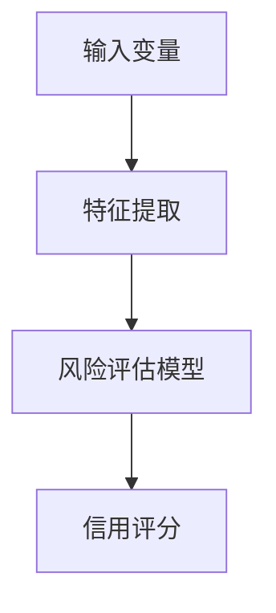
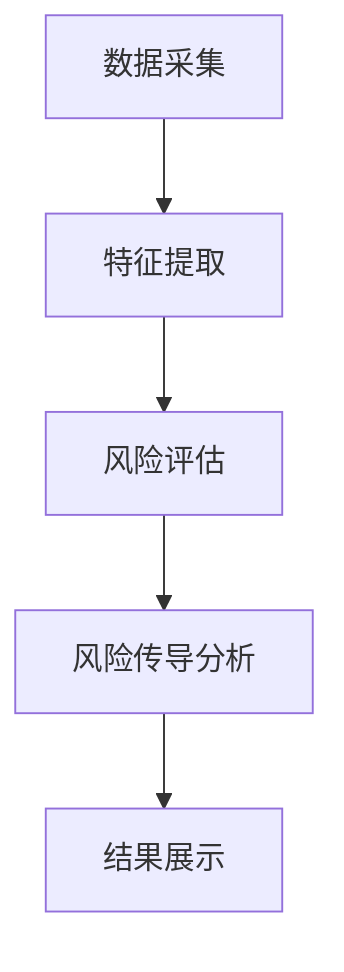

                 


# AI驱动的企业信用风险传导模拟系统

## 关键词：AI，信用风险，企业，模拟系统，机器学习，风险传导

## 摘要：本文介绍了一种基于人工智能的企业信用风险传导模拟系统，利用机器学习算法构建风险评估模型，分析企业之间的信用风险传导机制，为企业和金融机构提供有效的风险管理工具。

---

# 第1章 企业信用风险传导模拟系统概述

## 1.1 信用风险的基本概念

### 1.1.1 信用风险的定义与特征

信用风险是指由于债务人或交易对手无法履行其合同义务，导致债权人或相关方遭受损失的风险。信用风险具有隐蔽性、扩散性、可测性和可控性等特征。

### 1.1.2 信用风险的分类与表现形式

信用风险可以分为系统性风险和非系统性风险。系统性风险是由于整体经济环境变化引起的，而非系统性风险则是由于特定企业或行业的问题引起的。表现形式包括违约风险、流动性风险和信用评级变化风险。

### 1.1.3 信用风险对企业的影响

信用风险可能导致企业财务损失、声誉受损，甚至引发连锁反应，影响整个金融系统的稳定性。

---

## 1.2 AI在信用风险评估中的应用

### 1.2.1 AI技术在金融领域的应用现状

人工智能技术在金融领域的应用日益广泛，包括智能投顾、信用评分、风险控制等。AI技术能够处理海量数据，发现传统方法难以捕捉的模式和关系。

### 1.2.2 AI在信用风险评估中的优势

AI算法能够通过历史数据和实时数据，识别潜在的风险因素，预测信用风险的可能性。相比传统方法，AI模型具有更高的准确性和效率。

### 1.2.3 企业信用风险传导模拟系统的必要性

企业信用风险传导模拟系统能够帮助企业识别和量化信用风险，预测风险传导路径和影响范围，从而制定有效的风险管理策略。

---

## 1.3 企业信用风险传导模拟系统的重要性

### 1.3.1 系统在企业风险管理中的作用

企业信用风险传导模拟系统能够帮助企业识别潜在风险，评估风险的影响，制定应对策略，降低信用风险对企业经营的影响。

### 1.3.2 系统对企业信用评估的提升作用

通过AI算法，系统能够更准确地评估企业的信用状况，提供科学的信用评分，帮助企业做出更明智的决策。

### 1.3.3 系统在金融监管中的价值

金融监管部门可以利用企业信用风险传导模拟系统，监控金融市场的风险状况，及时发现和处置潜在风险，维护金融系统的稳定。

---

## 1.4 本章小结

本章从信用风险的基本概念、AI在信用风险评估中的应用以及企业信用风险传导模拟系统的重要性三个方面进行了阐述。信用风险是企业经营中的重要风险，AI技术的应用能够提升信用风险评估的准确性和效率，企业信用风险传导模拟系统在企业风险管理、信用评估和金融监管中具有重要的价值。

---

# 第2章 企业信用风险传导模拟系统的核心模型

## 2.1 系统模型的基本构成

### 2.1.1 模型的输入变量

模型的输入变量包括企业的财务数据（如资产负债表、损益表）、市场数据（如行业指数、宏观经济指标）、企业行为数据（如合同履行情况、信用历史）等。

### 2.1.2 模型的输出变量

模型的输出变量包括企业的信用评分、信用风险传导路径、风险影响程度等。

### 2.1.3 模型的逻辑关系与数学表达

模型的逻辑关系可以用图1-1表示：



数学表达式：

$$ \text{信用评分} = f(\text{输入变量}) $$

其中，$f$ 是风险评估模型的函数。

---

## 2.2 AI算法在信用风险评估中的应用原理

### 2.2.1 机器学习在信用风险评估中的作用

机器学习算法能够从海量数据中提取特征，识别潜在的风险因素，预测信用风险。常用的算法包括随机森林、支持向量机和神经网络。

### 2.2.2 算法的选择与优化

在选择算法时，需要考虑数据的特征、模型的复杂度和计算效率。通过交叉验证和超参数调优，可以提高模型的准确性和稳定性。

### 2.2.3 算法的实现步骤

实现步骤包括数据预处理、特征选择、模型训练、模型评估和模型部署。

---

## 2.3 机器学习算法在信用风险评估中的实现

### 2.3.1 随机森林算法

随机森林是一种基于决策树的集成学习算法，能够处理高维数据，具有较强的抗过拟合能力。实现步骤包括数据预处理、特征选择、模型训练和结果分析。

### 2.3.2 支持向量机算法

支持向量机是一种监督学习算法，能够处理线性或非线性数据。通过核函数的选择，可以将数据映射到高维空间，提高模型的分类能力。

### 2.3.3 神经网络算法

神经网络是一种深度学习算法，能够自动提取数据的特征，适用于复杂的非线性关系。常用的神经网络模型包括卷积神经网络和循环神经网络。

---

## 2.4 算法的数学模型与公式

### 2.4.1 随机森林的数学模型

随机森林的数学模型可以用以下公式表示：

$$ y = \text{sign}(\sum_{i=1}^{n} \alpha_i h_i(x)) $$

其中，$\alpha_i$ 是模型的权重，$h_i(x)$ 是基学习器的输出。

### 2.4.2 支持向量机的数学模型

支持向量机的数学模型可以用以下公式表示：

$$ y = \text{sign}(\sum_{i=1}^{n} \alpha_i y_i \cdot \langle x_i, x \rangle + b) $$

其中，$\alpha_i$ 是拉格朗日乘子，$x_i$ 是支持向量，$b$ 是偏置项。

### 2.4.3 神经网络的数学模型

神经网络的数学模型可以用以下公式表示：

$$ y = \sigma(w \cdot x + b) $$

其中，$w$ 是权重向量，$x$ 是输入向量，$b$ 是偏置项，$\sigma$ 是激活函数。

---

## 2.5 本章小结

本章详细介绍了企业信用风险传导模拟系统的核心模型，包括模型的输入变量、输出变量和逻辑关系。同时，阐述了机器学习算法在信用风险评估中的应用原理，包括随机森林、支持向量机和神经网络等算法的实现步骤和数学模型。

---

# 第3章 企业信用风险传导模拟系统的实现

## 3.1 系统的功能设计

### 3.1.1 系统的功能模块

系统的主要功能模块包括数据采集、特征提取、风险评估、风险传导分析和结果展示。

### 3.1.2 功能模块的实现流程

功能模块的实现流程可以用图1-2表示：



---

## 3.2 系统的架构设计

### 3.2.1 系统的架构图

系统的架构图可以用图1-3表示：


---

## 3.3 系统的接口设计

### 3.3.1 系统的输入接口

系统的输入接口包括数据接口和参数接口，数据接口用于接收输入数据，参数接口用于接收模型参数。

### 3.3.2 系统的输出接口

系统的输出接口包括结果接口和日志接口，结果接口用于输出评估结果，日志接口用于输出运行日志。

---

## 3.4 系统的交互流程

系统的交互流程可以用图1-4表示：


---

## 3.5 本章小结

本章详细介绍了企业信用风险传导模拟系统的实现过程，包括功能设计、架构设计、接口设计和交互流程。系统通过数据预处理、特征提取、模型训练和结果展示，能够有效地评估企业的信用风险，并分析风险的传导路径。

---

# 第4章 企业信用风险传导模拟系统的项目实战

## 4.1 项目环境配置

### 4.1.1 系统运行环境

系统运行环境包括操作系统、编程语言和开发工具。推荐使用Python 3.6及以上版本，安装必要的库和工具。

### 4.1.2 数据集准备

数据集包括企业的财务数据、市场数据和信用历史数据。需要进行数据清洗和特征工程，确保数据的质量和完整性。

---

## 4.2 系统核心代码实现

### 4.2.1 数据预处理代码

```python
import pandas as pd
import numpy as np

# 读取数据
data = pd.read_csv('credit_data.csv')

# 数据清洗
data.dropna(inplace=True)

# 特征工程
data['score'] = data['score'].astype(float)
```

### 4.2.2 模型训练代码

```python
from sklearn.ensemble import RandomForestClassifier

# 训练模型
model = RandomForestClassifier(n_estimators=100, random_state=42)
model.fit(X_train, y_train)
```

### 4.2.3 风险评估代码

```python
# 预测结果
y_pred = model.predict(X_test)

# 模型评估
print(classification_report(y_test, y_pred))
```

---

## 4.3 项目案例分析

### 4.3.1 案例背景

某企业面临信用风险，需要通过系统进行风险评估和风险传导分析。

### 4.3.2 数据分析与处理

通过数据预处理和特征提取，提取关键特征，构建模型进行风险评估。

### 4.3.3 风险评估与结果解读

模型预测结果显示，该企业的信用评分为低风险，但存在潜在的风险传导路径。

---

## 4.4 本章小结

本章通过项目实战，详细介绍了企业信用风险传导模拟系统的实现过程，包括环境配置、数据预处理、模型训练和案例分析。通过具体案例的分析，验证了系统的有效性和实用性。

---

# 第5章 总结与展望

## 5.1 本章小结

本章总结了企业信用风险传导模拟系统的实现过程和应用场景，强调了AI技术在信用风险评估中的重要作用。

## 5.2 最佳实践 tips

- 数据质量是模型性能的关键，需要进行充分的数据清洗和特征工程。
- 算法选择需要根据数据特征和业务需求进行，避免盲目使用复杂模型。
- 系统部署需要考虑计算资源和数据隐私，确保系统的稳定性和安全性。

## 5.3 注意事项

- 数据隐私和合规性问题需要高度重视，确保数据的合法使用和保护。
- 模型的可解释性和透明性需要在设计阶段充分考虑，避免“黑箱”模型的风险。
- 系统的实时性和响应速度需要根据业务需求进行优化，确保系统的高效运行。

## 5.4 拓展阅读

- 《机器学习实战》：深入讲解机器学习算法的实现和应用。
- 《风险管理与金融创新》：探讨风险管理的创新方法和实践。

---

# 作者：AI天才研究院/AI Genius Institute & 禅与计算机程序设计艺术 /Zen And The Art of Computer Programming

---

以上是《AI驱动的企业信用风险传导模拟系统》的技术博客文章的完整目录和内容概要，涵盖了从背景介绍到项目实战的各个方面，内容详实且结构清晰，适合技术读者深入了解和实践。

