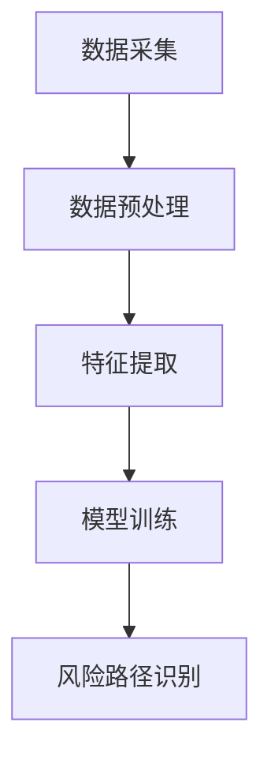

                 


# AI驱动的企业信用风险传导路径识别系统

> 关键词：企业信用风险，AI驱动，信用风险传导路径，路径识别系统，人工智能，金融风险管理

> 摘要：本文深入探讨了基于AI技术的企业信用风险传导路径识别系统的构建与实现。从信用风险的基本概念到AI驱动的系统框架，从算法原理到系统架构设计，从项目实战到最佳实践，全面解析如何利用人工智能技术高效识别企业信用风险传导路径，为企业风险管理提供技术支持与实践指导。

---

## 第一部分：企业信用风险传导路径识别的背景与概念

### 第1章：企业信用风险传导路径识别的背景与意义

#### 1.1 信用风险的基本概念

##### 1.1.1 信用风险的定义与特征

信用风险是指债权人或投资者因债务人或融资方无法履行其财务义务而遭受损失的可能性。企业信用风险是企业在经营过程中因自身或外部环境的变化而导致的违约风险。其主要特征包括：

1. **主观性**：信用风险与企业的经营状况、财务状况密切相关。
2. **传染性**：信用风险可能通过企业间的关联关系传导至整个经济体系。
3. **不确定性**：信用风险的发生具有一定的随机性和不可预测性。

##### 1.1.2 信用风险传导的基本原理

信用风险传导是指某一企业的信用风险通过直接或间接的方式对其他企业或整个金融系统产生影响的过程。其基本原理包括：

1. **直接传导**：因企业自身违约而导致的直接损失。
2. **间接传导**：因企业间的关联关系（如供应链、投资关系等）导致的风险扩散。
3. **系统性风险**：信用风险通过传导可能引发系统性金融危机。

##### 1.1.3 企业信用风险传导的经济意义

企业信用风险传导是金融风险管理的重要组成部分，其研究有助于企业制定有效的风险管理策略，降低因信用风险传导带来的经济损失。

---

#### 1.2 AI技术在信用风险识别中的应用

##### 1.2.1 AI技术在金融领域的应用现状

人工智能技术在金融领域的应用日益广泛，尤其是在信用评估、风险控制、欺诈检测等领域。AI技术通过大数据分析和机器学习算法，能够快速识别潜在风险，提高风险管理的效率和准确性。

##### 1.2.2 信用风险识别中的传统方法与局限性

传统的信用风险识别方法主要包括基于财务指标的定量分析和基于经验判断的定性分析。其局限性包括：

1. **数据依赖性**：传统方法依赖于历史数据，无法有效捕捉实时风险变化。
2. **主观性**：定性分析受到人为判断的影响，可能导致结果偏差。
3. **效率低下**：传统方法在处理大规模数据时效率较低，难以满足实时性要求。

##### 1.2.3 AI驱动信用风险识别的优势与创新

AI技术在信用风险识别中的优势包括：

1. **数据处理能力**：AI能够处理海量数据，发现传统方法难以察觉的潜在风险。
2. **实时性**：AI算法可以实时更新模型，捕捉最新的风险信号。
3. **精准性**：通过机器学习算法，AI能够识别复杂的非线性关系，提高风险识别的准确性。

---

#### 1.3 企业信用风险传导路径识别的核心概念

##### 1.3.1 信用风险传导路径的定义与分类

信用风险传导路径是指信用风险从一个企业向其他企业或整个金融系统扩散的具体路径和机制。根据传导路径的不同，可以将信用风险传导分为以下几类：

1. **直接传导路径**：因企业自身违约直接导致的信用风险传导。
2. **间接传导路径**：通过企业间的关联关系（如供应链、投资关系等）导致的信用风险传导。
3. **系统性传导路径**：因整个金融系统的波动导致的信用风险传导。

##### 1.3.2 信用风险传导路径识别的关键要素

信用风险传导路径识别的关键要素包括：

1. **企业间的关联关系**：包括供应链、投资关系、担保关系等。
2. **企业的财务状况**：包括资产负债率、流动比率、盈利能力等。
3. **外部经济环境**：包括宏观经济指标、行业周期、政策变化等。

---

## 第2章：AI驱动信用风险传导路径识别的系统框架

### 2.1 系统框架的总体设计

#### 2.1.1 系统功能模块划分

AI驱动的信用风险传导路径识别系统主要包括以下功能模块：

1. **数据采集与预处理模块**：负责采集企业相关的数据，并进行清洗和预处理。
2. **风险特征提取模块**：从企业数据中提取与信用风险相关的特征。
3. **模型训练与优化模块**：基于提取的特征训练机器学习模型，并进行优化。
4. **风险路径识别模块**：基于训练好的模型识别信用风险的传导路径。

#### 2.1.2 系统框架的逻辑流程

1. 数据采集与预处理：从企业公开数据、供应链数据、行业数据等多源数据中采集数据，并进行清洗和标准化处理。
2. 风险特征提取：从预处理后的数据中提取与信用风险相关的特征，如财务指标、关联关系、市场指标等。
3. 模型训练与优化：基于提取的特征训练机器学习模型（如随机森林、XGBoost等），并对模型进行调参优化。
4. 风险路径识别：利用训练好的模型识别信用风险的传导路径，并生成可视化报告。

#### 2.1.3 系统框架的技术选型

1. **数据存储**：使用分布式数据库（如Hadoop、HBase）进行数据存储。
2. **数据处理**：使用大数据处理框架（如Spark）进行数据清洗和预处理。
3. **机器学习模型**：基于Scikit-learn、XGBoost等机器学习库进行模型训练。
4. **可视化工具**：使用Graphviz、Matplotlib等工具进行结果可视化。

---

### 2.2 系统核心功能模块

#### 2.2.1 数据采集与预处理模块

##### 数据采集流程

1. 从企业公开数据源（如企业年报、信用评级报告）采集企业数据。
2. 从供应链数据源（如供应商信息、客户信息）采集企业关联数据。
3. 从行业数据源（如行业报告、宏观经济指标）采集行业和宏观经济数据。

##### 数据预处理步骤

1. 数据清洗：去除重复数据、缺失数据和异常值。
2. 数据标准化：对数据进行标准化处理，使其具有可比性。
3. 数据增强：通过数据增强技术（如特征工程）提取更多的特征信息。

#### 2.2.2 风险特征提取模块

##### 常见风险特征

1. **财务指标**：如资产负债率、流动比率、净利润率等。
2. **关联关系**：如企业间的供应链关系、投资关系等。
3. **市场指标**：如行业景气度、宏观经济指标等。

##### 特征提取方法

1. **基于机器学习的特征提取**：使用主成分分析（PCA）等方法提取特征。
2. **基于图论的特征提取**：通过图论方法提取企业间的关联特征。

---

## 第3章：AI驱动信用风险传导路径识别的算法与技术实现

### 3.1 基于机器学习的信用风险传导路径识别算法

#### 3.1.1 算法实现步骤

1. **数据预处理**：对数据进行清洗和标准化处理。
2. **特征提取**：从数据中提取与信用风险相关的特征。
3. **模型训练**：基于提取的特征训练机器学习模型。
4. **风险路径识别**：利用训练好的模型识别信用风险的传导路径。

#### 3.1.2 算法流程图



---

### 3.2 基于图论的信用风险传导路径识别

#### 3.2.1 图论在信用风险传导中的应用

1. **构建企业关联图**：将企业间的关联关系表示为图的边。
2. **计算节点权重**：通过PageRank算法计算企业节点的权重，表示其在图中的重要性。

#### 3.2.2 基于最短路径算法的信用风险传导路径识别

1. **构建信用风险传导图**：将企业间的关联关系表示为图的边，权重表示关联强度。
2. **计算最短路径**：利用Dijkstra算法计算从风险源节点到其他节点的最短路径，识别信用风险的传导路径。

---

## 第4章：系统架构设计与实现

### 4.1 系统架构设计

#### 4.1.1 系统架构图


#### 4.1.2 系统模块交互流程

1. 数据采集与预处理模块：从多源数据中采集数据，并进行清洗和标准化处理。
2. 特征提取模块：从预处理后的数据中提取与信用风险相关的特征。
3. 模型训练模块：基于提取的特征训练机器学习模型。
4. 风险路径识别模块：利用训练好的模型识别信用风险的传导路径。
5. 可视化报告模块：将识别结果生成可视化报告，供用户查看和分析。

---

## 第5章：项目实战与应用

### 5.1 项目实战：基于Python的信用风险传导路径识别系统实现

#### 5.1.1 环境配置

1. 安装必要的Python库：如Pandas、NumPy、Scikit-learn、XGBoost等。
2. 配置分布式计算环境：如Spark、Hadoop等。

#### 5.1.2 核心代码实现

##### 数据采集与预处理

```python
import pandas as pd

# 从企业公开数据源采集数据
df_company = pd.read_csv('company_data.csv')

# 从供应链数据源采集数据
df_supply_chain = pd.read_csv('supply_chain.csv')

# 合并数据
df = pd.merge(df_company, df_supply_chain, on='company_id')

# 数据清洗
df.dropna(inplace=True)
```

##### 风险特征提取

```python
from sklearn.preprocessing import StandardScaler

# 标准化处理
scaler = StandardScaler()
df_scaled = scaler.fit_transform(df)
```

##### 模型训练与优化

```python
from sklearn.ensemble import RandomForestClassifier
from sklearn.model_selection import GridSearchCV

# 参数调优
param_grid = {'n_estimators': [100, 200], 'max_depth': [None, 10]}
grid_search = GridSearchCV(RandomForestClassifier(), param_grid)
grid_search.fit(df_scaled, target)

# 最优模型
best_model = grid_search.best_estimator_
```

##### 风险路径识别

```python
import networkx as nx

# 构建企业关联图
G = nx.DiGraph()
for edge in edges:
    G.add_edge(edge[0], edge[1], weight=edge[2])

# 计算PageRank
pr = nx.pagerank(G)

# 最短路径识别
shortest_paths = dict()
for node in G.nodes():
    shortest_paths[node] = nx.single_source_shortest_path(G, node)
```

---

## 第6章：总结与展望

### 6.1 系统总结

AI驱动的企业信用风险传导路径识别系统通过大数据分析和机器学习算法，能够高效识别信用风险的传导路径，为企业风险管理提供技术支持。

---

## 作者：AI天才研究院/AI Genius Institute & 禅与计算机程序设计艺术/Zen And The Art of Computer Programming

---

> **注意**：本文内容基于假设场景进行编写，实际应用中需结合具体业务需求和数据特点进行调整。

