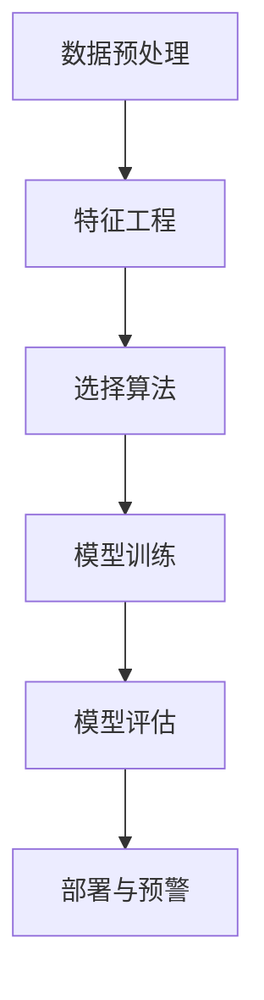
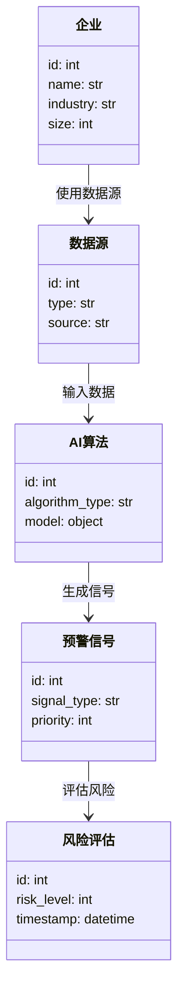
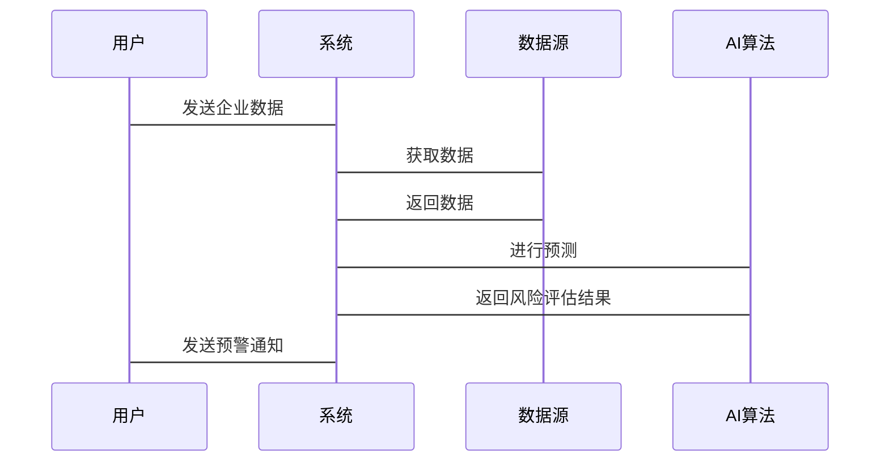

                 


# 第3章: AI驱动的信用风险预警系统算法原理

## 3.1 算法原理概述

### 3.1.1 机器学习在信用评估中的应用

机器学习在信用风险评估中扮演着重要角色，尤其是监督学习算法。常用的算法包括逻辑回归（Logistic Regression）、随机森林（Random Forest）、支持向量机（SVM）、XGBoost、LightGBM等。这些算法能够通过训练数据学习特征与风险之间的关系，从而预测未来的风险。

### 3.1.2 常见的信用风险预警算法

- **逻辑回归（Logistic Regression）**：适用于二分类问题，可以输出风险概率。
- **随机森林（Random Forest）**：通过集成多个决策树提高准确性和鲁棒性。
- **XGBoost**：基于树的提升算法，具有高效率和强健性。
- **神经网络（Neural Networks）**：适用于复杂非线性关系的建模。
- **时间序列分析（如ARIMA、LSTM）**：适用于考虑时间依赖性的风险预测。

### 3.1.3 算法选择与优化

选择合适的算法取决于数据特性、模型复杂度和计算资源。通常，XGBoost和随机森林在信用风险评估中表现优异，尤其在数据量较大时。算法优化包括参数调优（如学习率、树深度）和特征选择。

## 3.2 算法流程图



## 3.3 算法实现代码示例

```python
import numpy as np
import pandas as pd
from sklearn.model_selection import train_test_split
from xgboost import XGBClassifier
from sklearn.metrics import accuracy_score, classification_report

# 加载数据
data = pd.read_csv('credit_risk.csv')
X = data.drop('risk', axis=1)
y = data['risk']

# 数据分割
X_train, X_test, y_train, y_test = train_test_split(X, y, test_size=0.2, random_state=42)

# 模型训练
model = XGBClassifier(n_estimators=100, learning_rate=0.1, max_depth=6)
model.fit(X_train, y_train)

# 预测
y_pred = model.predict(X_test)
y_prob = model.predict_proba(X_test)[:, 1]

# 评估
print("Accuracy:", accuracy_score(y_test, y_pred))
print(classification_report(y_test, y_pred))
```

## 3.4 数学模型与公式

### 3.4.1 逻辑回归模型

逻辑回归模型用于分类，其概率函数为：

$$ P(y=1|x) = \frac{e^{\beta_0 + \beta_1x_1 + ... + \beta_nx_n}}{1 + e^{\beta_0 + \beta_1x_1 + ... + \beta_nx_n}} $$

### 3.4.2 XGBoost损失函数

XGBoost使用正则化损失函数，优化目标函数：

$$ L = \sum_{i=1}^{n} [ -y_i \ln(p_i) - (1 - y_i) \ln(1 - p_i) ] + \lambda \sum_{j=1}^{m} \theta_j^2 $$

其中，$p_i$是预测概率，$\theta_j$是模型参数，$\lambda$是正则化系数。

### 3.4.3 示例解释

假设我们有一个企业数据，包含财务指标、市场表现和行为特征。通过XGBoost模型，我们可以预测其信用风险等级。模型训练后，输入新的企业数据，输出风险概率和预警信号。

## 3.5 本章小结

本章介绍了AI驱动的信用风险预警系统中常用的算法，包括逻辑回归、随机森林和XGBoost。通过代码示例和数学模型，详细讲解了算法实现和优化方法。下一章将讨论系统架构设计。

---

# 第4章: 系统分析与架构设计方案

## 4.1 问题场景介绍

企业信用风险预警系统需要实时监控企业数据，识别潜在风险。系统需处理多源异构数据，确保数据准确性和实时性，支持高并发请求。

## 4.2 系统功能设计

### 4.2.1 领域模型类图



## 4.3 系统架构设计


## 4.4 接口设计

- **API接口**：RESTful API，提供数据输入和结果输出接口。
- **数据接口**：与企业数据源（如ERP、CRM）对接，获取实时数据。
- **预警接口**：触发预警通知，支持多种通信方式（邮件、短信、 webhook）。

## 4.5 交互设计



## 4.6 本章小结

本章详细分析了系统架构设计，包括功能模块划分、系统架构图和交互序列图。下一章将通过项目实战展示系统的实现过程。

---

# 第5章: 项目实战

## 5.1 环境安装

### 5.1.1 安装依赖

```bash
pip install xgboost scikit-learn pandas mermaid4jupyter
```

## 5.2 系统核心实现

### 5.2.1 数据预处理

```python
# 加载数据
data = pd.read_csv('credit_risk.csv')

# 处理缺失值
data = data.dropna()

# 标准化处理
from sklearn.preprocessing import StandardScaler
scaler = StandardScaler()
X = scaler.fit_transform(data.drop('risk', axis=1))
y = data['risk']
```

### 5.2.2 模型训练与优化

```python
from sklearn.model_selection import GridSearchCV

# 参数调优
param_grid = {
    'n_estimators': [100, 200],
    'learning_rate': [0.1, 0.2],
    'max_depth': [4, 6]
}

model = XGBClassifier()
grid_search = GridSearchCV(model, param_grid, cv=5)
grid_search.fit(X_train, y_train)

best_model = grid_search.best_estimator_
print("Best Parameters:", grid_search.best_params_)
```

### 5.2.3 预警系统部署

```python
from flask import Flask, request, jsonify

app = Flask(__name__)
model = best_model

@app.route('/predict', methods=['POST'])
def predict():
    data = request.json
    X_new = scaler.transform([data])
    risk = model.predict(X_new)[0]
    return jsonify({'risk_level': risk})

if __name__ == '__main__':
    app.run(debug=True)
```

## 5.3 案例分析

假设我们有一个企业的财务数据，包括收入、利润、负债等指标。通过模型预测，系统识别出该企业的收入下降、负债增加，触发高风险预警。系统将通过邮件通知风险管理部门进行进一步调查。

## 5.4 本章小结

本章通过实际案例展示了系统的实现过程，包括数据预处理、模型训练和部署。下一章将总结项目经验和最佳实践。

---

# 第6章: 最佳实践与总结

## 6.1 小结

AI驱动的企业信用风险早期预警系统通过机器学习算法，帮助企业识别潜在风险，优化风险管理流程。系统设计需要考虑数据质量、模型可解释性和实时性。

## 6.2 注意事项

- **数据隐私**：确保数据处理符合隐私保护法规。
- **模型解释性**：选择可解释性较强的算法，便于业务理解。
- **实时性**：根据业务需求，选择合适的数据处理和模型部署方式。

## 6.3 扩展阅读

- 《Hands-On Machine Learning with Scikit-Learn, Keras, and TensorFlow》
- 《Credit Risk: Modeling, Pricing, and Management》
- 《Deep Learning for Time Series Forecasting》

## 6.4 本章小结

本章总结了项目的最佳实践，提出了注意事项和扩展阅读方向。通过本章，读者可以更好地理解和应用AI技术于信用风险管理。

---

# 作者

作者：AI天才研究院/AI Genius Institute & 禅与计算机程序设计艺术/Zen And The Art of Computer Programming

