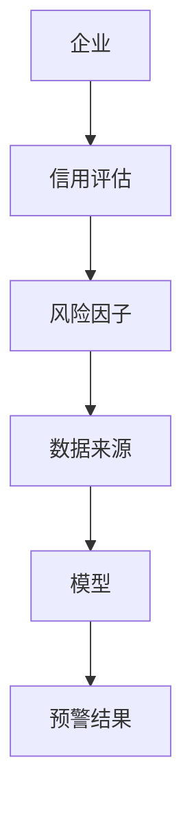
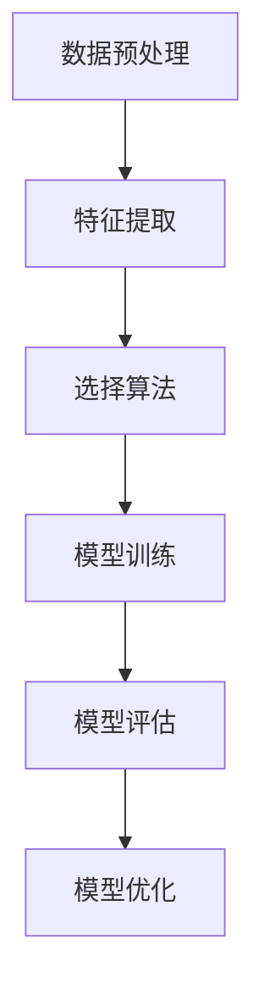
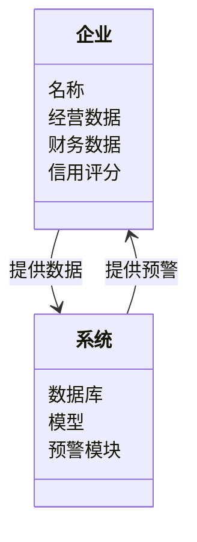
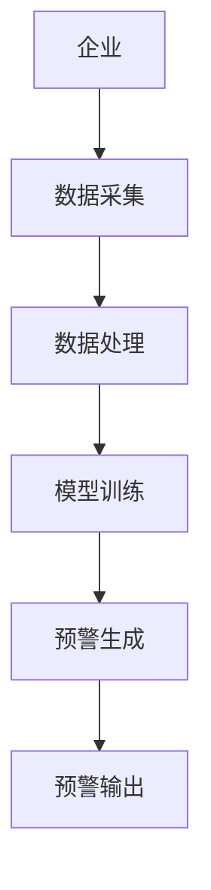
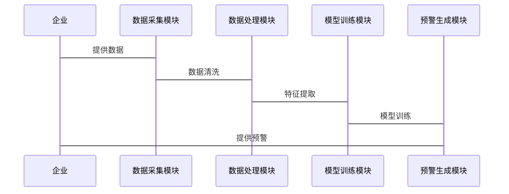

                 


# AI驱动的企业信用风险早期预警系统

## 关键词：AI, 信用风险, 早期预警, 机器学习, 风险评估

## 摘要：本文探讨了如何利用人工智能技术构建企业信用风险早期预警系统。通过分析信用风险的定义、传统评估方法的局限性以及AI技术的应用潜力，本文详细介绍了系统的核心概念、算法原理、架构设计、项目实现及最佳实践。旨在为企业提供一种高效、精准的信用风险评估方法，帮助金融机构在风险发生前采取有效措施。

---

# 第一部分: 企业信用风险早期预警系统概述

## 第1章: 企业信用风险早期预警系统背景

### 1.1 问题背景

#### 1.1.1 信用风险的定义与重要性
信用风险是指企业或个人在赊销交易中，由于交易对手方未能履行合同义务而可能遭受的损失。在企业经营中，信用风险是影响财务健康和稳定性的关键因素之一。及时识别和预警信用风险，可以帮助企业提前采取措施，降低损失。

#### 1.1.2 传统信用风险评估的局限性
传统信用评估方法主要依赖于财务报表分析和人工审核，存在以下问题：
- 数据维度有限：仅依赖财务数据，无法全面反映企业的经营状况。
- 评估周期长：人工审核耗时较长，难以实时响应。
- 主观性较强：人工审核受主观因素影响，可能导致评估偏差。

#### 1.1.3 AI技术在信用风险评估中的应用潜力
人工智能技术，特别是机器学习和自然语言处理，能够从海量数据中提取有价值的信息，帮助提升信用风险评估的准确性和效率。

### 1.2 问题描述

#### 1.2.1 企业信用风险的主要来源
企业信用风险主要来源于以下几个方面：
1. **企业基本面恶化**：如销售收入下降、利润减少、资产负债率上升等。
2. **外部经济环境变化**：如行业衰退、政策调整等。
3. **管理问题**：如管理层变更、内部腐败等。
4. **融资问题**：如资金链断裂、无法偿还债务等。

#### 1.2.2 早期预警的重要性
早期预警可以帮助企业及时发现潜在风险，采取相应的措施，如调整经营策略、优化财务结构等，从而避免或降低风险损失。

#### 1.2.3 当前信用风险评估的主要挑战
当前信用风险评估面临以下挑战：
- 数据分散：信用风险相关数据分布在多个系统中，难以整合。
- 数据维度不足：传统评估方法仅依赖财务数据，缺乏其他维度的信息。
- 数据质量参差不齐：数据可能存在缺失、错误或不完整的情况。

### 1.3 问题解决思路

#### 1.3.1 利用AI技术实现信用风险早期预警的目标
通过AI技术，构建一个实时、动态的信用风险评估系统，能够从多源数据中提取信息，实现对企业信用风险的实时监测和预警。

#### 1.3.2 AI驱动信用风险评估的核心优势
- **数据处理能力强**：能够处理结构化和非结构化数据，提取更多有价值的信息。
- **实时性**：能够实时监测企业经营状况，及时发现潜在风险。
- **准确性**：通过机器学习模型，提高信用风险评估的准确性。

#### 1.3.3 系统设计的基本思路与框架
系统设计的基本思路包括以下几个方面：
1. **数据收集与预处理**：收集企业相关的多源数据，进行清洗和特征提取。
2. **模型构建与训练**：基于机器学习算法，构建信用风险评估模型。
3. **系统部署与集成**：将模型部署到实际系统中，实现对企业信用风险的实时监测和预警。

### 1.4 边界与外延

#### 1.4.1 系统的边界与适用范围
系统适用于企业信用风险的早期预警，能够处理企业经营中的财务、市场、管理等多方面数据，帮助金融机构和企业及时发现潜在风险。

#### 1.4.2 系统的外延与扩展可能性
系统可以通过引入更多的数据源和模型算法，进一步提升信用风险评估的准确性和实时性。例如，引入自然语言处理技术，分析企业的新闻报道、社交媒体信息等，进一步丰富数据维度。

#### 1.4.3 与其他系统的接口与集成
系统需要与企业财务系统、信贷管理系统、数据管理系统等进行接口集成，确保数据的实时性和完整性。

### 1.5 核心要素组成

#### 1.5.1 数据来源与处理
数据来源包括企业的财务数据、市场数据、行业数据、管理数据等。数据处理包括数据清洗、特征提取、数据标注等。

#### 1.5.2 模型构建与训练
基于机器学习算法，构建信用风险评估模型，如逻辑回归、随机森林、XGBoost等。

#### 1.5.3 系统部署与维护
将模型部署到实际系统中，实现对企业信用风险的实时监测和预警，并进行系统的维护和优化。

---

## 第2章: 核心概念与联系

### 2.1 AI驱动信用风险预警的核心概念

#### 2.1.1 数据驱动的信用评估
通过收集和分析企业的多源数据，利用数据驱动的方法进行信用评估，能够提高评估的准确性和全面性。

#### 2.1.2 机器学习在信用风险中的应用
机器学习算法能够从海量数据中提取特征，建立信用风险评估模型，帮助预测企业的信用风险。

#### 2.1.3 自然语言处理在信用评估中的作用
自然语言处理技术可以分析企业的新闻、公告等文本信息，提取潜在的风险信号，丰富数据维度。

### 2.2 核心概念的属性特征对比

| 核心概念       | 数据特征 | 模型特征 | 系统功能 |
|----------------|----------|----------|----------|
| 信用风险评估   | 结构化数据、非结构化数据 | 逻辑回归、随机森林 | 实时监测、预警 |
| AI技术应用     | 多源数据、实时数据 | 神经网络、深度学习 | 智能分析、自动化 |

### 2.3 ER实体关系图架构



---

## 第3章: 算法原理与实现

### 3.1 算法原理概述

#### 3.1.1 机器学习在信用风险中的应用
机器学习算法可以用于信用风险评估中的分类、回归和聚类任务。例如，使用逻辑回归进行二分类，预测企业是否违约。

#### 3.1.2 常见算法选择与比较
常用的算法包括逻辑回归、随机森林、XGBoost等。这些算法各有优缺点，适用于不同的数据场景。

#### 3.1.3 算法流程图



### 3.2 算法实现

#### 3.2.1 逻辑回归算法

##### 3.2.1.1 算法原理
逻辑回归是一种用于分类任务的算法，通过构建损失函数，优化模型参数，实现对信用风险的预测。

##### 3.2.1.2 损失函数
$$ L(\theta) = -\frac{1}{m}\sum_{i=1}^{m} [y_i \cdot \ln(h(x_i)) + (1 - y_i) \cdot \ln(1 - h(x_i))] $$
其中，$$ h(x_i) = \frac{1}{1 + e^{-\theta^T x_i}} $$

##### 3.2.1.3 梯度下降
通过梯度下降优化损失函数：
$$ \theta := \theta - \alpha \cdot \frac{\partial L}{\partial \theta} $$

##### 3.2.1.4 优缺点
- **优点**：简单易懂，计算效率高。
- **缺点**：对数据分布假设较强，适合线性可分数据。

#### 3.2.2 随机森林算法

##### 3.2.2.1 算法原理
随机森林是一种基于决策树的集成算法，通过构建多个决策树，取其预测结果的平均值，提高模型的准确性和稳定性。

##### 3.2.2.2 优缺点
- **优点**：能够处理高维数据，鲁棒性好。
- **缺点**：计算复杂度较高，适合中小规模数据。

#### 3.2.3 XGBoost算法

##### 3.2.3.1 算法原理
XGBoost是一种基于梯度提升的算法，通过构建多个弱分类器，逐步优化模型。

##### 3.2.3.2 优缺点
- **优点**：模型表达能力强，适合复杂数据。
- **缺点**：容易过拟合，需要调整参数。

---

## 第4章: 系统分析与架构设计

### 4.1 系统分析

#### 4.1.1 问题场景介绍
企业信用风险早期预警系统需要实时监测企业的经营状况，及时发现潜在风险，提供预警信息。

#### 4.1.2 系统功能设计

##### 4.1.2.1 领域模型


#### 4.1.2.2 系统架构


#### 4.1.2.3 系统接口设计
系统接口包括数据输入接口、模型调用接口、预警结果输出接口等。

#### 4.1.2.4 系统交互


---

## 第5章: 项目实战

### 5.1 环境安装

#### 5.1.1 安装Python
```bash
# 安装Python
# 根据操作系统选择合适的安装方式
```

#### 5.1.2 安装依赖库
```bash
pip install numpy pandas scikit-learn xgboost
```

### 5.2 核心代码实现

#### 5.2.1 数据预处理
```python
import pandas as pd

# 读取数据
data = pd.read_csv('credit.csv')

# 数据清洗
data.dropna(inplace=True)

# 特征提取
X = data.drop('target', axis=1)
y = data['target']
```

#### 5.2.2 模型训练
```python
from sklearn.model_selection import train_test_split
from xgboost import XGBClassifier

# 数据分割
X_train, X_test, y_train, y_test = train_test_split(X, y, test_size=0.2)

# 模型训练
model = XGBClassifier()
model.fit(X_train, y_train)
```

#### 5.2.3 模型评估
```python
from sklearn.metrics import accuracy_score

# 预测
y_pred = model.predict(X_test)

# 计算准确率
print(accuracy_score(y_test, y_pred))
```

### 5.3 案例分析

#### 5.3.1 数据来源与特征
- 数据来源：企业财务数据、市场数据、行业数据。
- 特征包括：销售收入、净利润、资产负债率、应收账款、应付账款等。

#### 5.3.2 模型选择与训练
选择XGBoost算法，基于企业财务数据进行模型训练，预测企业的信用风险。

#### 5.3.3 模型评估
通过准确率、召回率、F1分数等指标评估模型性能，优化模型参数，提升预测精度。

---

## 第6章: 最佳实践与总结

### 6.1 最佳实践

#### 6.1.1 数据处理
- 数据清洗：处理缺失值、异常值。
- 数据增强：引入更多数据源，丰富数据维度。
- 数据标注：根据历史数据，标注企业的信用风险等级。

#### 6.1.2 模型优化
- 参数调优：通过网格搜索等方法，优化模型参数。
- 模型融合：结合多种算法，提升预测准确率。

#### 6.1.3 系统维护
- 定期更新模型：根据最新数据，重新训练模型。
- 监控系统性能：实时监控系统运行状态，及时发现和解决问题。

### 6.2 小结

通过本文的探讨，我们可以看到，利用AI技术构建企业信用风险早期预警系统，能够显著提升信用风险评估的准确性和效率。通过多源数据的整合、先进算法的应用，系统能够实时监测企业的经营状况，及时发现潜在风险，帮助企业做出更明智的决策。

### 6.3 注意事项

- 数据隐私：在处理企业数据时，需要注意数据隐私保护，遵守相关法律法规。
- 模型解释性：在实际应用中，需要关注模型的可解释性，便于企业理解和使用。
- 系统稳定性：确保系统的稳定性和安全性，避免因系统故障导致数据泄露或服务中断。

### 6.4 拓展阅读

- 《机器学习实战》：深入理解机器学习算法及其应用。
- 《Python数据分析与挖掘》：学习如何利用Python进行数据分析和挖掘。
- 《信用风险评估与管理》：了解信用风险评估的理论与实践。

---

# 作者：AI天才研究院/AI Genius Institute & 禅与计算机程序设计艺术 /Zen And The Art of Computer Programming

