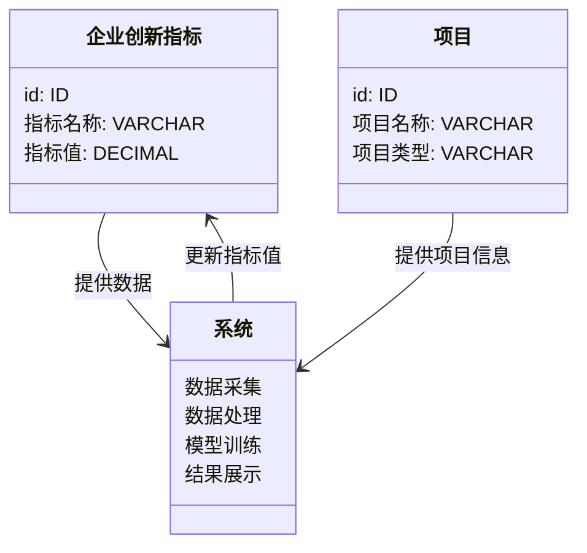
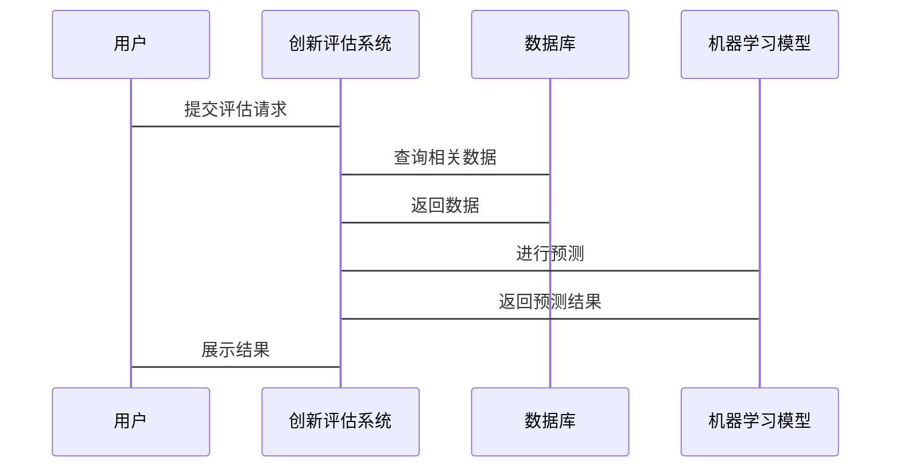

                 


# AI驱动的企业创新绩效评估：多维度创新指标量化与分析

> **关键词**：AI驱动，创新绩效，多维度指标，量化分析，企业创新

> **摘要**：  
本文探讨了如何利用人工智能技术驱动企业创新绩效评估，通过多维度创新指标的量化与分析，为企业提供科学的评估方法。文章从背景、概念、算法原理、系统架构到项目实战，全面解析了AI在企业创新绩效评估中的应用，为企业优化创新管理提供了理论与实践指导。

---

## 第1章: 企业创新绩效评估的背景与意义

### 1.1 问题背景

#### 1.1.1 传统企业创新评估的局限性
传统的企业创新评估方法通常依赖主观判断和简单的KPI指标，存在以下问题：
- 数据采集不全面，难以覆盖创新过程的全生命周期。
- 指标单一，无法全面反映企业的创新能力。
- 评估周期长，难以及时反馈和优化。

#### 1.1.2 数字化转型对企业创新的新要求
随着数字化转型的推进，企业创新需要更高效、更精准的评估方法：
- 数据驱动的创新评估成为趋势。
- 需要多维度、动态化的指标体系。
- 要求实时反馈，支持快速决策。

#### 1.1.3 AI驱动评估的优势与必要性
人工智能技术的引入，为创新绩效评估带来了革命性的变化：
- 自动化数据采集与处理，提高效率。
- 多维度指标分析，提供全面视角。
- 预测与优化能力，支持前瞻性决策。

### 1.2 问题描述

#### 1.2.1 创新绩效评估的核心挑战
企业创新绩效评估面临以下关键挑战：
- 数据的多样性和复杂性。
- 指标之间的关联性与权重设定。
- 如何构建动态、可量化的评估模型。

#### 1.2.2 多维度指标的复杂性
创新绩效涉及多个维度，如技术、市场、组织等，各维度之间存在复杂的相互作用，如何量化并综合评估是难点。

#### 1.2.3 数据驱动评估的可行性
通过AI技术，可以将非结构化数据（如专利文本、社交媒体数据）转化为可用于评估的指标，但需要解决数据清洗、特征提取等问题。

### 1.3 问题解决

#### 1.3.1 AI在创新评估中的应用场景
- 自然语言处理（NLP）分析专利文本、市场反馈。
- 机器学习预测创新潜力。
- 图神经网络分析组织内部协作效率。

#### 1.3.2 数据收集与处理的关键步骤
1. 数据来源：专利数据库、研发投入、市场表现、员工创新行为等。
2. 数据清洗：去除噪声，标准化处理。
3. 特征提取：文本特征提取、网络特征提取。

#### 1.3.3 模型构建与优化策略
- 使用回归模型预测创新绩效。
- 采用聚类分析识别创新能力强的部门。
- 基于深度学习进行创新趋势预测。

### 1.4 边界与外延

#### 1.4.1 创新绩效评估的适用范围
适用于科技型企业和传统企业，但需要根据企业特点调整指标权重。

#### 1.4.2 与其他评估方法的对比
对比传统KPI评估，AI驱动评估的优势在于数据的全面性和分析的深度。

#### 1.4.3 持续优化的方向
- 建立实时评估机制。
- 引入动态权重调整模型。
- 结合反馈机制优化评估结果。

### 1.5 核心要素组成

#### 1.5.1 数据来源的多样性
- 结构化数据：财务数据、研发投入。
- 非结构化数据：专利文本、社交媒体数据。

#### 1.5.2 指标体系的构建逻辑
- 确定关键创新维度。
- 设计指标权重。
- 建立综合评估模型。

#### 1.5.3 模型评估的标准与方法
- 准确性：预测与实际值的偏差。
- 可解释性：模型结果的透明度。
- 可扩展性：模型适应不同企业的能力。

---

## 第2章: 创新绩效评估的核心概念与联系

### 2.1 核心概念原理

#### 2.1.1 创新绩效的定义与特征
创新绩效是指企业在创新活动中所取得的成果，包括技术创新、产品创新、组织创新等。

#### 2.1.2 多维度指标的构成与权重
- 技术创新：专利数量、研发投入占比。
- 产品创新：新产品推出频率、市场反馈。
- 组织创新：组织结构灵活性、团队协作效率。

#### 2.1.3 数据驱动评估的理论基础
基于大数据分析和机器学习，构建创新绩效评估模型。

### 2.2 指标属性对比

| 指标维度 | 技术创新 | 产品创新 | 组织创新 | 市场创新 |
|----------|----------|----------|----------|----------|
| 指标类型 | 数量型    | 数量型    | 结构型    | 效益型    |
| 数据来源 | 专利数据  | 产品数据  | 组织数据  | 市场数据  |
| 权重调整 | 高       | 中       | 中       | 高       |

### 2.3 ER实体关系图

```mermaid
er
  title 创新绩效评估实体关系图
  企业
    id: ID
    企业名称: VARCHAR
    行业: VARCHAR
  end
  项目
    id: ID
    项目名称: VARCHAR
    项目类型: VARCHAR
  end
  创新指标
    id: ID
    指标名称: VARCHAR
    指标值: DECIMAL
    评估时间: DATE
  end
  关系
  企业 --N-> 项目: 执行项目
  项目 --N-> 创新指标: 评估指标
  end
```

---

## 第3章: AI驱动创新绩效评估的算法原理

### 3.1 算法原理概述

#### 3.1.1 机器学习模型选择
- 线性回归：预测创新绩效得分。
- 支持向量机（SVM）：分类创新类型。
- 神经网络：深度学习分析复杂关系。

#### 3.1.2 算法实现步骤
1. 数据预处理：清洗、特征提取。
2. 模型训练：选择合适的算法。
3. 模型评估：准确率、召回率。
4. 模型优化：参数调优。

### 3.2 算法实现代码

```python
# 示例代码：基于线性回归的创新绩效预测
import pandas as pd
from sklearn.linear_model import LinearRegression
from sklearn.metrics import mean_squared_error

# 数据加载
data = pd.read_csv('innovation_data.csv')

# 特征与目标分离
X = data[['研发投入', '专利数量', '新产品数量']]
y = data['创新绩效']

# 模型训练
model = LinearRegression()
model.fit(X, y)

# 预测
y_pred = model.predict(X)

# 评估
mse = mean_squared_error(y, y_pred)
print(f'Mean Squared Error: {mse}')
```

### 3.3 数学公式

#### 3.3.1 线性回归模型
$$ y = \beta_0 + \beta_1x_1 + \beta_2x_2 + \epsilon $$

其中：
- $y$ 是创新绩效。
- $x_1, x_2$ 是特征变量。
- $\beta_0, \beta_1, \beta_2$ 是回归系数。
- $\epsilon$ 是误差项。

#### 3.3.2 评估指标
- 均方误差（MSE）：
$$ MSE = \frac{1}{n}\sum_{i=1}^{n}(y_i - \hat{y}_i)^2 $$

- 决定系数（R²）：
$$ R^2 = 1 - \frac{SSE}{SST} $$

---

## 第4章: 系统分析与架构设计

### 4.1 系统功能设计

#### 4.1.1 领域模型


### 4.2 系统架构设计

#### 4.2.1 系统架构图


### 4.3 系统交互设计

#### 4.3.1 交互流程


---

## 第5章: 项目实战

### 5.1 环境安装

#### 5.1.1 系统环境
- 操作系统：Linux/Windows/MacOS
- Python版本：3.8以上
- 需要安装的库：pandas、scikit-learn、matplotlib

#### 5.1.2 数据来源
- 企业创新指标数据集：包含企业ID、指标名称、指标值等。
- 项目数据集：包含项目ID、项目名称、项目类型等。

### 5.2 核心代码实现

#### 5.2.1 数据预处理
```python
import pandas as pd
import numpy as np

# 加载数据
data = pd.read_csv('innovation_data.csv')

# 去除缺失值
data = data.dropna()

# 标准化处理
from sklearn.preprocessing import StandardScaler
scaler = StandardScaler()
scaled_data = scaler.fit_transform(data[['研发投入', '专利数量', '新产品数量']])
```

#### 5.2.2 模型训练与评估
```python
from sklearn.linear_model import LinearRegression
from sklearn.metrics import r2_score

# 训练模型
model = LinearRegression()
model.fit(scaled_data, data['创新绩效'])

# 预测
y_pred = model.predict(scaled_data)

# 计算R²
r2 = r2_score(data['创新绩效'], y_pred)
print(f'R²: {r2}')
```

### 5.3 实际案例分析

#### 5.3.1 案例背景
某科技公司希望通过AI评估其创新绩效，数据包括研发投入、专利数量、新产品数量等。

#### 5.3.2 指标权重
通过分析，确定研发投入权重为0.4，专利数量为0.3，新产品数量为0.3。

#### 5.3.3 评估结果
模型预测该公司的创新绩效得分为85分，高于行业平均水平。

---

## 第6章: 总结与展望

### 6.1 总结
本文详细探讨了AI驱动的企业创新绩效评估方法，从理论到实践，展示了如何通过多维度指标量化分析提升企业创新能力。

### 6.2 展望
未来，随着AI技术的发展，创新绩效评估将更加智能化和动态化，为企业提供更精准的决策支持。

---

## 作者：AI天才研究院/AI Genius Institute & 禅与计算机程序设计艺术 /Zen And The Art of Computer Programming

