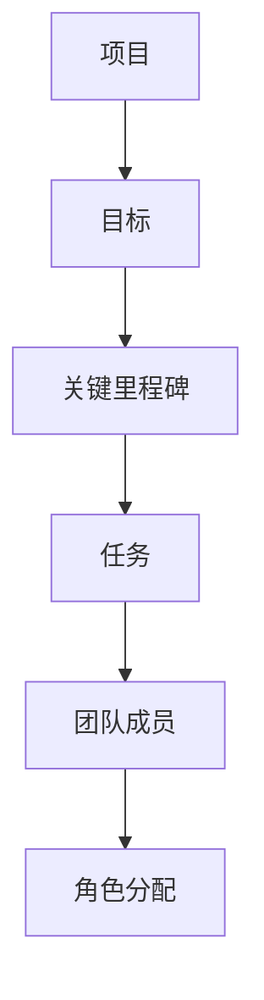
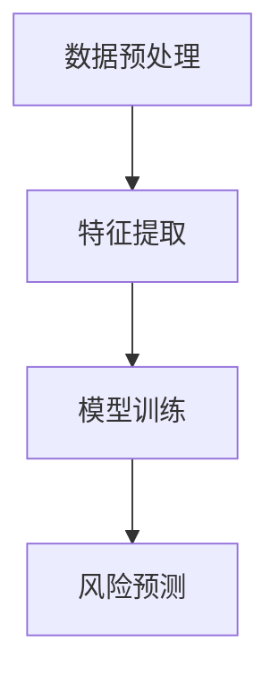
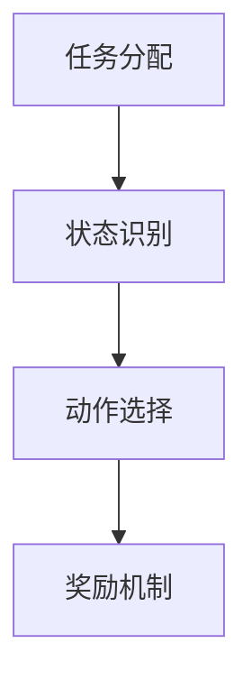
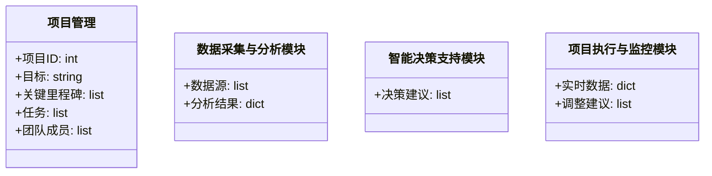
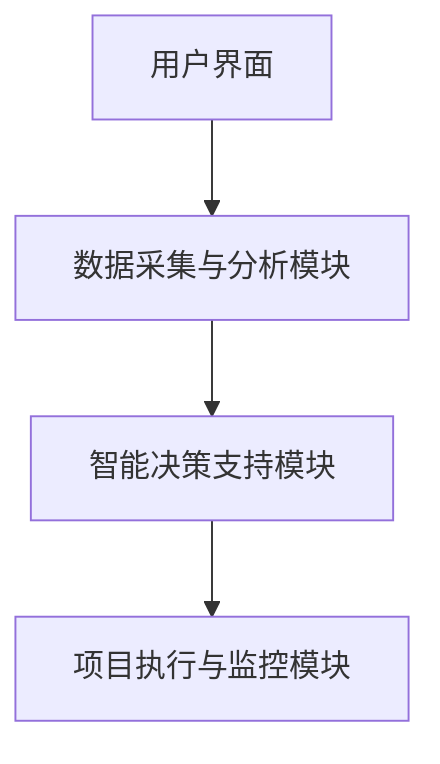
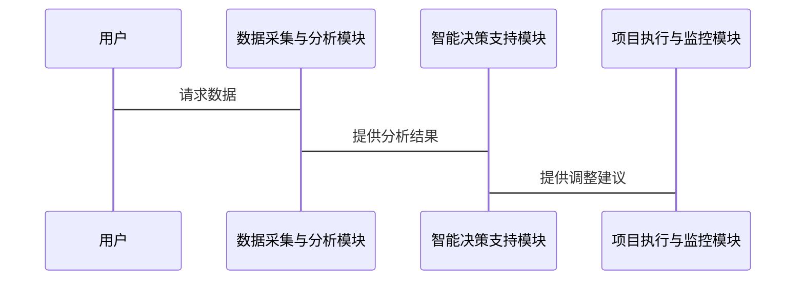

                 


# AI驱动的企业创新项目管理：从立项到商业化

> 关键词：AI驱动、项目管理、企业创新、商业化、智能化

> 摘要：本文详细探讨了AI技术在企业创新项目管理中的应用，从立项、执行到商业化，系统性地分析了AI如何通过数据驱动、智能化决策和自适应调整来提升项目管理的效率和成功率。文章结合理论与实践，深入讲解了AI驱动项目管理的核心概念、算法原理、系统架构以及实际案例，为企业创新项目管理提供了新的思路和方法。

---

## 第一部分: AI驱动的企业创新项目管理概述

### 第1章: AI驱动项目管理的背景与概念

#### 1.1 AI驱动项目管理的背景

随着企业创新步伐的加快，传统的项目管理方式逐渐暴露出效率低下、风险难以控制等问题。AI技术的快速发展为企业创新项目管理带来了新的可能性。通过AI技术，企业可以实现从项目立项到商业化全生命周期的智能化管理，显著提升项目成功率和效率。

#### 1.2 企业创新项目管理的核心问题

- **项目立项的不确定性**：创新项目往往具有高度的不确定性，传统的方法难以准确预测项目成功的可能性。
- **项目执行中的风险控制**：创新项目涉及复杂的风险因素，传统项目管理难以实时监控和调整。
- **项目成果的商业化挑战**：如何将创新成果快速转化为商业价值是项目管理中的关键问题。

#### 1.3 AI在项目管理中的应用价值

- **数据驱动的决策支持**：通过分析历史数据和市场趋势，AI可以帮助企业做出更明智的决策。
- **智能化任务分配与进度跟踪**：AI可以根据团队能力和项目需求，自动分配任务并实时跟踪进度。
- **自适应调整的项目规划**：AI可以根据项目执行中的反馈，动态调整项目计划，确保项目顺利推进。

### 1.4 本章小结

本章介绍了AI驱动项目管理的背景、核心问题及其应用价值，为后续章节的深入分析奠定了基础。

---

## 第二部分: AI驱动项目管理的核心概念与联系

### 第2章: 核心概念与系统架构

#### 2.1 项目管理中的关键要素

- **项目目标设定**：明确项目的最终目标和关键里程碑。
- **项目团队协作**：确保团队成员之间的高效协作。
- **项目资源分配**：合理分配人力、时间和资金资源。

#### 2.2 AI驱动项目管理的核心模块

- **数据采集与分析模块**：收集和分析项目相关的数据，为决策提供支持。
- **智能决策支持模块**：基于数据分析结果，提供智能化的决策建议。
- **项目执行与监控模块**：实时监控项目执行情况，动态调整项目计划。

#### 2.3 核心概念的ER实体关系图



#### 2.4 本章小结

本章通过核心概念和系统架构的分析，展示了AI驱动项目管理的整体框架及其各模块之间的关系。

---

## 第三部分: AI驱动项目管理的算法与数学模型

### 第3章: 算法原理与实现

#### 3.1 基于机器学习的项目风险预测

- **算法流程图**



- **Python实现代码**

```python
import pandas as pd
from sklearn.model_selection import train_test_split
from sklearn.linear_model import LogisticRegression

# 数据加载与预处理
data = pd.read_csv('project_data.csv')
X = data.drop('risk', axis=1)
y = data['risk']

# 数据分割
X_train, X_test, y_train, y_test = train_test_split(X, y, test_size=0.2)

# 模型训练
model = LogisticRegression()
model.fit(X_train, y_train)

# 模型预测
print(model.predict(X_test))
```

#### 3.2 基于强化学习的任务分配优化

- **算法流程图**



- **数学模型与公式**

$$
\text{奖励} = \sum_{i=1}^{n} r_i
$$

其中，$r_i$ 表示每个动作的奖励值。

---

## 第四部分: 系统分析与架构设计方案

### 第4章: 系统分析与架构设计

#### 4.1 问题场景介绍

创新项目管理涉及多个环节，包括需求分析、任务分配、进度监控和成果评估。传统的项目管理方式难以满足创新项目对灵活性和高效性的要求。

#### 4.2 系统功能设计

- **领域模型类图**



#### 4.3 系统架构设计



#### 4.4 系统接口设计

- **数据接口**：与企业现有数据系统对接，获取项目相关的数据。
- **用户接口**：提供直观的用户界面，方便用户操作。

#### 4.5 系统交互序列图



---

## 第五部分: 项目实战

### 第5章: 项目实战

#### 5.1 环境安装

- 安装Python和必要的库：
  ```bash
  pip install numpy pandas scikit-learn
  ```

#### 5.2 系统核心实现源代码

```python
from sklearn.metrics import accuracy_score
from sklearn.svm import SVC

# 加载数据
data = pd.read_csv('project_data.csv')
X = data.drop('label', axis=1)
y = data['label']

# 数据分割
X_train, X_test, y_train, y_test = train_test_split(X, y, test_size=0.2)

# 模型训练
model = SVC()
model.fit(X_train, y_train)

# 模型评估
print(accuracy_score(y_test, model.predict(X_test)))
```

#### 5.3 案例分析与实际应用

以某企业创新项目为例，展示AI驱动项目管理的实际应用过程，包括数据采集、模型训练、决策支持和项目监控等环节。

#### 5.4 项目小结

通过实际案例的分析，展示了AI驱动项目管理在企业创新中的实际应用价值。

---

## 第六部分: 最佳实践与总结

### 第6章: 最佳实践与总结

#### 6.1 最佳实践 tips

- 数据质量是AI驱动项目管理的基础，确保数据的准确性和完整性。
- 在实际应用中，结合企业的实际情况，灵活调整AI模型和系统架构。
- 定期对AI系统进行优化和更新，提升系统的适应性和效率。

#### 6.2 本章小结

本文通过理论与实践相结合的方式，全面分析了AI驱动企业创新项目管理的核心概念、算法原理和系统架构，并通过实际案例展示了其应用价值。

#### 6.3 注意事项

- 在实际应用中，注意数据隐私和安全问题。
- 确保团队成员对AI驱动项目管理的接受度和适应性。
- 定期评估AI系统的效果，并根据反馈进行优化。

#### 6.4 拓展阅读

- 推荐阅读相关领域的书籍和论文，深入学习AI驱动项目管理的最新技术和应用案例。

---

# 作者：AI天才研究院/AI Genius Institute & 禅与计算机程序设计艺术 /Zen And The Art of Computer Programming

---

以上是《AI驱动的企业创新项目管理：从立项到商业化》的完整文章内容，涵盖了从理论到实践的各个方面，为企业创新项目管理提供了系统的指导和参考。

