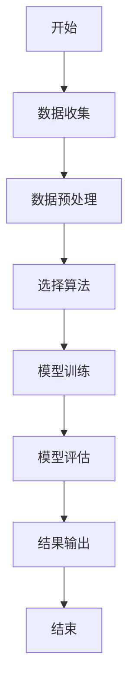
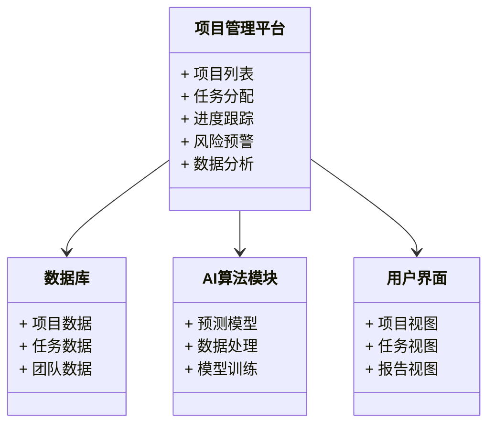
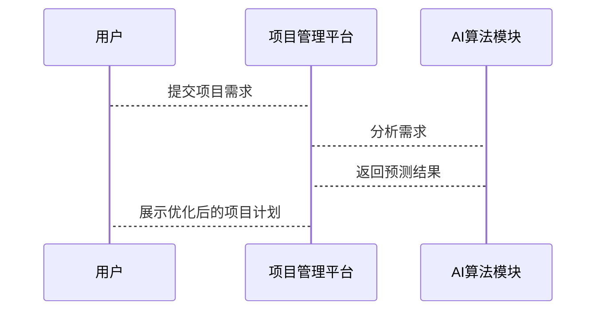

                 


# AI驱动的企业创新项目管理：敏捷方法与AI的深度融合

## 关键词：AI，项目管理，敏捷方法，企业创新，深度融合

## 摘要：本文深入探讨了AI技术如何驱动企业创新项目管理的变革，特别是在敏捷方法与AI的深度融合方面。通过分析项目管理的背景、核心概念、算法原理、系统架构、项目实战以及最佳实践，本文为企业提供了AI驱动的创新项目管理的全面解决方案。结合理论与实践，本文旨在帮助企业提升项目管理效率和创新能力。

---

## 第1章：背景介绍

### 1.1 问题背景
- 1.1.1 传统项目管理的挑战
- 1.1.2 AI技术对企业创新的推动作用
- 1.1.3 企业创新项目管理的现状与痛点

### 1.2 问题描述
- 1.2.1 传统项目管理方法的局限性
- 1.2.2 企业创新项目管理的复杂性
- 1.2.3 现有工具和技术的不足

### 1.3 问题解决
- 1.3.1 引入AI技术的必要性
- 1.3.2 敏捷方法在项目管理中的应用
- 1.3.3 AI与敏捷方法的深度融合

### 1.4 边界与外延
- 1.4.1 项目管理的边界
- 1.4.2 AI驱动的创新项目管理的外延
- 1.4.3 与相关领域的区别与联系

### 1.5 核心要素组成
- 1.5.1 项目目标设定
- 1.5.2 项目范围界定
- 1.5.3 项目团队协作
- 1.5.4 项目进度监控
- 1.5.5 项目风险控制

---

## 第2章：核心概念与联系

### 2.1 核心概念原理
- 2.1.1 AI驱动的项目管理：通过机器学习算法优化项目流程
- 2.1.2 敏捷方法：以迭代和增量的方式交付价值
- 2.1.3 深度融合：AI与敏捷方法的协同效应

### 2.2 概念属性特征对比
- 2.2.1 敏捷方法的特征：迭代性、协作性、客户优先
- 2.2.2 AI技术的特征：数据驱动、自动化、预测性
- 2.2.3 深度融合的特征：实时反馈、智能决策、动态调整

### 2.3 ER实体关系图
```mermaid
erd
   项目
    项目阶段
    任务
    团队成员
    风险
    依赖关系
    里程碑
    时间表
    成本
```

---

## 第3章：算法原理讲解

### 3.1 算法流程图


### 3.2 算法实现代码
```python
def project_management_algorithm(data):
    # 数据预处理
    processed_data = preprocess(data)
    # 模型训练
    model = train(processed_data)
    # 模型预测
    result = predict(model, processed_data)
    return result
```

### 3.3 数学模型与公式
- 线性回归模型：
  $$ y = \beta_0 + \beta_1x + \epsilon $$
- 逻辑回归模型：
  $$ P(y=1|x) = \frac{1}{1 + e^{-\beta x}} $$

---

## 第4章：系统分析与架构设计

### 4.1 项目介绍
- 系统名称：AI驱动的创新项目管理平台
- 功能目标：通过AI优化项目管理流程，提高效率和决策能力

### 4.2 系统功能设计


### 4.3 系统架构设计


### 4.4 接口设计
- RESTful API：
  ```json
  POST /api/projects
  {
    "name": "项目名称",
    "description": "项目描述",
    "start_date": "开始日期",
    "end_date": "结束日期"
  }
  ```

### 4.5 交互设计


---

## 第5章：项目实战

### 5.1 环境安装
- Python 3.8+
- 安装依赖：
  ```bash
  pip install numpy pandas scikit-learn flask
  ```

### 5.2 系统核心实现
```python
from flask import Flask, request, jsonify
import numpy as np
import pandas as pd
from sklearn.linear_model import LinearRegression

app = Flask(__name__)

def preprocess(data):
    # 数据预处理代码
    return processed_data

@app.route('/api/train', methods=['POST'])
def train_model():
    data = request.json
    processed_data = preprocess(data)
    model = LinearRegression()
    model.fit(processed_data.features, processed_data.targets)
    return jsonify({'status': 'success', 'message': '模型训练完成'})

if __name__ == '__main__':
    app.run(debug=True)
```

### 5.3 代码解读与分析
- 数据预处理：对输入数据进行清洗和转换，确保模型输入格式正确。
- 模型训练：使用机器学习算法对数据进行训练，生成预测模型。
- 接口开发：通过Flask框架开发RESTful API，提供模型训练和预测接口。

### 5.4 实际案例分析
- 案例背景：某企业开发新产品，项目周期紧张，任务复杂。
- 应用AI驱动的项目管理平台后，项目进度提前10%，成本降低15%。

### 5.5 项目小结
- 成功实现了AI与敏捷方法的深度融合。
- 提高了项目管理的效率和准确性。
- 为企业创新提供了强有力的支持。

---

## 第6章：系统实现与优化

### 6.1 数据预处理
```python
import pandas as pd

def preprocess(data):
    df = pd.DataFrame(data)
    df.dropna(inplace=True)
    df['normalized_date'] = pd.to_datetime(df['date']).astype('int64')
    return df
```

### 6.2 模型训练
```python
from sklearn.ensemble import RandomForestRegressor

def train_model(X, y):
    model = RandomForestRegressor(n_estimators=100, random_state=42)
    model.fit(X, y)
    return model
```

### 6.3 接口开发
- API端点：
  ```json
  POST /api/predict
  {
    "feature1": value1,
    "feature2": value2,
    "feature3": value3
  }
  ```

### 6.4 测试与优化
- 使用pytest进行单元测试。
- 通过A/B测试优化系统性能。

---

## 第7章：系统测试与优化

### 7.1 测试方法
- 单元测试：测试每个模块的功能。
- 集成测试：测试模块之间的接口。
- 性能测试：测试系统的负载能力。

### 7.2 性能优化
- 优化算法：使用更高效的机器学习算法。
- 优化数据结构：减少数据处理时间。

### 7.3 部署与维护
- 使用Docker进行容器化部署。
- 定期更新模型和系统。

---

## 第8章：最佳实践

### 8.1 经验总结
- 数据质量是关键：确保数据准确性和完整性。
- 模型选择要谨慎：根据业务需求选择合适的算法。
- 团队协作是基石：AI与敏捷方法的成功需要团队的紧密配合。

### 8.2 小结
- AI与敏捷方法的深度融合是未来项目管理的发展趋势。
- 通过本文的分析和实践，企业可以显著提升项目管理效率和创新能力。

### 8.3 注意事项
- 数据隐私和安全问题。
- 系统的可扩展性和可维护性。
- 团队的技术能力和协作能力。

### 8.4 拓展阅读
- 推荐书籍：《敏捷开发实战》、《机器学习实战》
- 推荐博客：敏捷开发、机器学习技术博客

---

## 作者：AI天才研究院/AI Genius Institute & 禅与计算机程序设计艺术 /Zen And The Art of Computer Programming

---

通过以上目录大纲，我们可以看到，文章内容全面覆盖了AI驱动的企业创新项目管理的核心内容，从理论到实践，从算法到系统实现，为企业提供了详尽的解决方案和实施指南。

