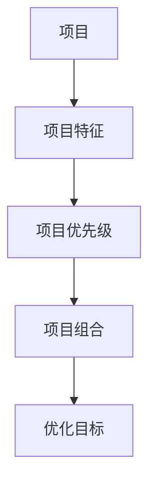
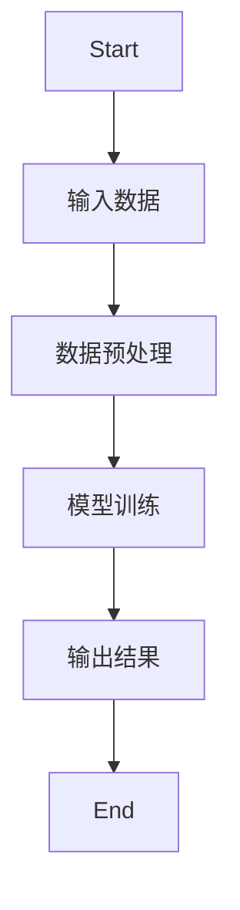
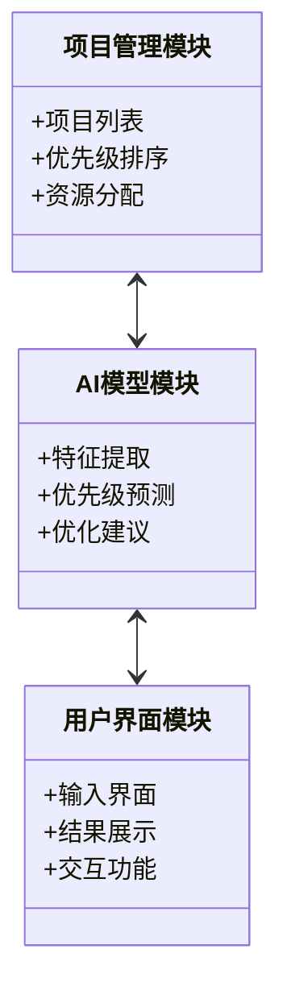
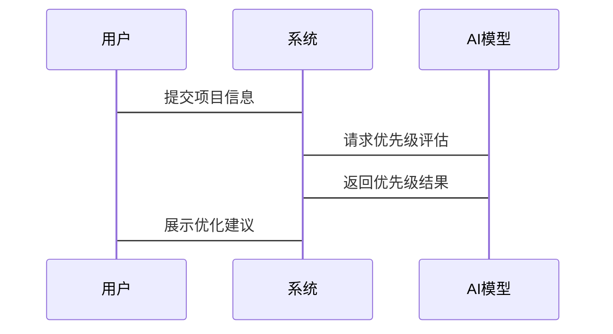

                 


好的，我将按照您的要求创作《AI驱动的企业创新项目组合管理》这篇文章。让我们先列出文章的完整目录结构：

```markdown
# AI驱动的企业创新项目组合管理

> 关键词：AI驱动、企业创新、项目组合管理、AI模型、算法原理、系统架构、项目实战

> 摘要：本文系统性地探讨了AI技术在企业创新项目组合管理中的应用，从核心概念、算法原理、系统架构到项目实战，全面分析了AI驱动的项目组合管理的优势、挑战与实现路径。文章通过详细的案例分析和代码实现，展示了如何利用AI技术优化企业创新项目的筛选、评估与组合优化过程。

---

## 目录

### 第一部分: AI驱动的企业创新项目组合管理概述

#### 第1章: 企业创新项目组合管理概述

##### 1.1 问题背景与定义
###### 1.1.1 企业创新项目管理的背景
###### 1.1.2 项目组合管理的核心概念
###### 1.1.3 传统项目组合管理的局限性

##### 1.2 AI驱动的创新
###### 1.2.1 AI在企业创新中的作用
###### 1.2.2 AI驱动的项目组合管理的优势
###### 1.2.3 企业创新与AI的结合趋势

#### 第2章: AI驱动的项目组合管理的核心要素

##### 2.1 项目组合管理的关键维度
###### 2.1.1 项目目标与战略一致性
###### 2.1.2 项目风险与收益平衡
###### 2.1.3 资源分配与优先级排序

##### 2.2 AI在项目组合管理中的应用
###### 2.2.1 数据驱动的决策支持
###### 2.2.2 智能化项目筛选与排序
###### 2.2.3 动态调整与优化

#### 第3章: 主流AI模型与工具介绍

##### 3.1 常见AI模型概述
###### 3.1.1 大语言模型（如GPT系列）
###### 3.1.2 分析型模型（如BERT）
###### 3.1.3 综合型模型（如PaLM）

##### 3.2 AI工具与平台
###### 3.2.1 开源工具（如Hugging Face）
###### 3.2.2 商业化平台（如Palantir）
###### 3.2.3 企业定制化工具

---

### 第二部分: AI驱动的项目组合管理核心概念与联系

#### 第4章: AI驱动的项目组合管理原理

##### 4.1 核心概念与模型
###### 4.1.1 项目特征提取与表示
###### 4.1.2 项目优先级预测模型
###### 4.1.3 项目组合优化算法

##### 4.2 核心概念对比表
###### 4.2.1 传统项目组合管理 vs AI驱动管理
###### 4.2.2 不同AI模型的优劣势对比
###### 4.2.3 项目特征与模型性能的关系

##### 4.3 ER实体关系图


---

### 第三部分: AI驱动的项目组合管理算法原理

#### 第5章: 基于生成式AI的项目筛选算法

##### 5.1 算法原理与流程


##### 5.2 算法实现代码
```python
# 示例代码：基于GPT的项目描述生成
import transformers

model = transformers.GPT2LMHeadModel.from_pretrained('gpt2')
tokenizer = transformers.GPT2Tokenizer.from_pretrained('gpt2')

def generate_project_description(prompt):
    inputs = tokenizer.encode(prompt, return_tensors='np')
    outputs = model.generate(inputs, max_length=50, do_sample=True)
    return tokenizer.decode(outputs[0], skip_special_tokens=True)
```

##### 5.3 数学模型与公式
```latex
$$
\text{损失函数} = \text{交叉熵损失}(y_{\text{pred}}, y_{\text{true}})
$$

$$
\text{优化目标} = \min_{\theta} \mathbb{E}_{(x,y)}[\text{损失函数}]
$$
```

---

### 第四部分: AI驱动的项目组合管理系统架构设计

#### 第6章: 系统分析与架构设计方案

##### 6.1 问题场景介绍
###### 6.1.1 项目需求收集与分析
###### 6.1.2 项目优先级评估
###### 6.1.3 项目组合优化与资源分配

##### 6.2 系统功能设计


##### 6.3 系统架构设计
```mermaid
graph TD
    Client[客户端] --> API Gateway
    API Gateway --> Service1[服务1]
    Service1 --> Service2[服务2]
    Service2 --> DB[数据库]
    DB --> Cache[缓存]
```

##### 6.4 系统接口设计
###### 6.4.1 API接口定义
###### 6.4.2 数据交互流程
###### 6.4.3 接口安全设计

##### 6.5 系统交互流程


---

### 第五部分: 项目实战与优化建议

#### 第7章: 项目实战

##### 7.1 环境安装与配置
###### 7.1.1 安装Python与相关库
###### 7.1.2 配置AI模型环境
###### 7.1.3 设置开发环境

##### 7.2 系统核心功能实现
###### 7.2.1 项目特征提取
###### 7.2.2 优先级预测
###### 7.2.3 组合优化

##### 7.3 代码实现与解读
```python
# 示例代码：优先级预测模型
import pandas as pd
from sklearn.model import LinearRegression

data = pd.DataFrame({
    '项目特征': [0.5, 0.7, 0.6, 0.8],
    '优先级': [0.8, 0.9, 0.7, 0.95]
})

model = LinearRegression()
model.fit(data[['项目特征']], data['优先级'])
```

##### 7.4 实际案例分析
###### 7.4.1 案例背景
###### 7.4.2 数据准备
###### 7.4.3 模型训练
###### 7.4.4 结果分析

#### 第8章: 最佳实践与小结

##### 8.1 实践中的注意事项
###### 8.1.1 数据质量的重要性
###### 8.1.2 模型调优的技巧
###### 8.1.3 系统维护与更新

##### 8.2 项目总结
###### 8.2.1 成功经验总结
###### 8.2.2 未来改进方向
###### 8.2.3 价值与意义

---

## 参考文献
（此处可以列出相关的技术文献、书籍和在线资源）

---

## 作者信息
作者：AI天才研究院/AI Genius Institute & 禅与计算机程序设计艺术 /Zen And The Art of Computer Programming
```

现在让我们逐步完成文章的撰写。首先，我会按照上述目录结构，逐步展开每一章的内容，详细阐述每个部分的核心观点、技术细节和实际案例。

