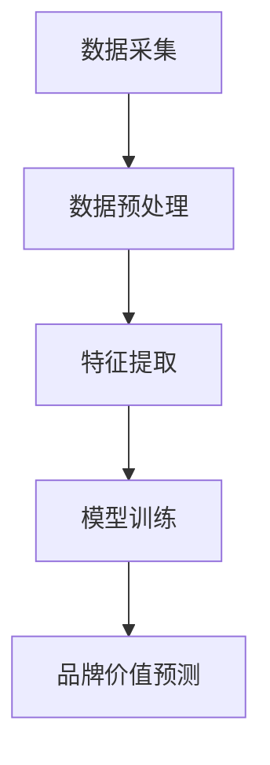
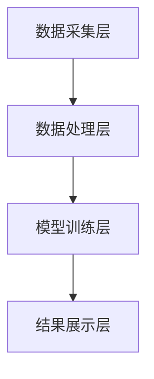

                 


# AI驱动的企业品牌价值动态量化系统

> 关键词：企业品牌价值，AI驱动，动态量化，系统架构，算法实现，项目实战

> 摘要：本文介绍了一种基于AI技术的企业品牌价值动态量化系统。该系统能够实时采集和分析品牌相关的多源数据，利用先进的算法模型对企业品牌价值进行动态评估和预测。文章从系统背景、核心概念、算法原理、系统架构、项目实战等多个维度展开详细论述，旨在为企业提供一种高效、准确的品牌价值评估方法。

---

# 第一部分: AI驱动的企业品牌价值动态量化系统概述

## 第1章: 问题背景与核心概念

### 1.1 问题背景介绍

#### 1.1.1 传统品牌价值评估的局限性
传统的品牌价值评估方法通常依赖于财务数据、市场调研和专家判断，这种方法存在以下局限性：
- 数据采集范围有限，无法覆盖全渠道的实时信息。
- 评估结果更新周期长，难以适应市场变化。
- 主观因素较多，评估结果可能存在偏差。

#### 1.1.2 数字化时代品牌价值的变化
在数字化时代，品牌价值的评估需要考虑更多维度的数据，例如社交媒体上的用户评价、新闻媒体的报道、搜索引擎的相关性等。这些数据的变化具有实时性和动态性，传统的评估方法难以满足需求。

#### 1.1.3 AI技术在品牌价值评估中的作用
AI技术可以通过自然语言处理（NLP）、机器学习（ML）等方法，实时采集和分析多源数据，快速生成品牌价值评估结果。这种技术能够显著提高评估的准确性和实时性。

### 1.2 核心概念与系统架构

#### 1.2.1 系统核心概念的定义
企业品牌价值动态量化系统是一个基于AI技术的实时监测和分析系统，旨在通过多源数据的采集与分析，动态评估企业的品牌价值。其核心概念包括：
- 数据来源：包括社交媒体、新闻媒体、电商平台等。
- 数据特征：包括情感分析、关键词提取、用户互动频率等。
- 评估模型：基于机器学习的回归模型，用于品牌价值的预测。

#### 1.2.2 系统核心要素的对比分析
| 对比维度 | 传统方法 | AI驱动方法 |
|----------|----------|------------|
| 数据来源 | 单一来源 | 多源数据     |
| 数据处理 | 离线处理 | 实时处理     |
| 评估结果 | 周期性更新 | 实时更新     |

#### 1.2.3 系统的ER实体关系图
```mermaid
er
    %% ER图
    entity(品牌) {
        id: string
        名称: string
    }
    entity(数据源) {
        id: string
        类型: string
    }
    entity(数据特征) {
        id: string
        类型: string
    }
    brand -- belongsTo -> dataSource
    dataSource -- contains -> dataFeature
    brand -- assessedBy -> model
```

---

## 第2章: AI驱动的品牌价值动态量化原理

### 2.1 数据采集与特征工程

#### 2.1.1 数据来源与采集方式
品牌相关的数据来源主要包括：
- **社交媒体数据**：包括微博、Twitter、Facebook等平台的用户评论、点赞、转发等数据。
- **新闻媒体数据**：包括主流媒体对品牌的报道和评论。
- **电商平台数据**：包括用户对产品的评价和销量数据。

#### 2.1.2 特征提取与数据预处理
数据预处理包括：
- **文本清洗**：去除停用词、标点符号等无关信息。
- **情感分析**：利用NLP技术对文本进行情感分类，提取情感特征。
- **关键词提取**：通过TF-IDF算法提取文本中的关键词。

#### 2.1.3 数据清洗与标准化
标准化过程包括：
- **数据格式统一**：将不同来源的数据转换为统一格式。
- **异常值处理**：剔除明显错误的数据点。

### 2.2 系统核心算法原理

#### 2.2.1 算法原理的数学模型
品牌价值评估模型可以表示为一个多元回归模型：
$$ V = \beta_0 + \beta_1x_1 + \beta_2x_2 + ... + \beta_nx_n + \epsilon $$
其中：
- $V$ 表示品牌价值
- $x_i$ 表示各个特征变量
- $\beta_i$ 表示回归系数
- $\epsilon$ 表示误差项

#### 2.2.2 算法流程的mermaid图


#### 2.2.3 算法实现的Python代码示例
```python
import pandas as pd
from sklearn.model_selection import train_test_split
from sklearn.linear_model import LinearRegression

# 数据加载
data = pd.read_csv('brand_data.csv')

# 特征提取
X = data[['情感得分', '关键词数量', '互动频率']]
y = data['品牌价值']

# 数据分割
X_train, X_test, y_train, y_test = train_test_split(X, y, test_size=0.2, random_state=42)

# 模型训练
model = LinearRegression()
model.fit(X_train, y_train)

# 预测结果
y_pred = model.predict(X_test)
```

---

## 第3章: 系统功能与架构设计

### 3.1 系统功能模块划分

#### 3.1.1 数据采集模块
- 负责从社交媒体、新闻媒体等多渠道采集数据。

#### 3.1.2 数据处理模块
- 负责数据的清洗、预处理和特征提取。

#### 3.1.3 模型训练模块
- 负责训练品牌价值评估模型。

#### 3.1.4 结果展示模块
- 负责将模型输出结果以可视化形式展示。

### 3.2 系统架构设计

#### 3.2.1 系统架构的分层设计
系统分为数据采集层、数据处理层、模型训练层和结果展示层。

#### 3.2.2 系统架构的mermaid图


#### 3.2.3 系统组件之间的交互关系
- 数据采集层与数据处理层之间通过API进行数据传输。
- 数据处理层与模型训练层之间通过队列进行交互。
- 模型训练层的结果通过数据库传递给结果展示层。

---

## 第4章: 系统实现与项目实战

### 4.1 环境搭建与数据准备

#### 4.1.1 开发环境的安装与配置
- 安装Python、Jupyter Notebook、Pandas、Scikit-learn等工具。

#### 4.1.2 数据集的获取与预处理
- 数据集可以从社交媒体API、新闻爬虫等途径获取。
- 数据清洗和特征提取是数据预处理的关键步骤。

### 4.2 核心算法的实现

#### 4.2.1 数据特征工程的实现
- 使用NLP技术进行情感分析和关键词提取。
- 对数据进行标准化和归一化处理。

#### 4.2.2 模型训练与调优
- 使用机器学习算法（如线性回归、随机森林）进行模型训练。
- 通过交叉验证和网格搜索进行模型调优。

#### 4.2.3 系统接口的开发
- 使用Flask或Django框架开发API接口。
- 接口设计包括数据采集、模型调用和结果返回三个部分。

### 4.3 系统测试与优化

#### 4.3.1 系统功能测试
- 测试数据采集、处理和展示功能是否正常。
- 测试模型预测的准确性和实时性。

#### 4.3.2 系统性能优化
- 优化数据处理流程，提高系统运行效率。
- 使用分布式计算框架（如Spark）进行大规模数据处理。

#### 4.3.3 系统的可扩展性设计
- 设计模块化架构，便于后续功能扩展。
- 使用容器化技术（如Docker）进行部署和管理。

---

## 第5章: 系统应用与案例分析

### 5.1 系统应用场景分析

#### 5.1.1 企业品牌价值的实时监控
- 实时监测品牌在社交媒体、新闻媒体等渠道的声誉变化。

#### 5.1.2 品牌舆情的智能化分析
- 利用NLP技术分析用户评论，识别品牌舆情的关键点。

#### 5.1.3 品牌价值的动态预测
- 基于历史数据和实时数据，预测未来品牌价值的变化趋势。

### 5.2 实际案例分析

#### 5.2.1 某行业标杆企业的应用案例
- 以某互联网公司为例，介绍系统在品牌价值评估中的具体应用。

#### 5.2.2 案例中的系统实现细节
- 描述数据采集、处理、模型训练和结果展示的具体实现步骤。

---

# 结语

## 作者：AI天才研究院/AI Genius Institute & 禅与计算机程序设计艺术 /Zen And The Art of Computer Programming

---

通过本文的介绍，我们详细阐述了AI驱动的企业品牌价值动态量化系统的背景、核心概念、算法原理、系统架构和项目实战等内容。希望本文能够为企业的品牌价值评估提供新的思路和方法，帮助企业更好地应对数字化时代的挑战。

