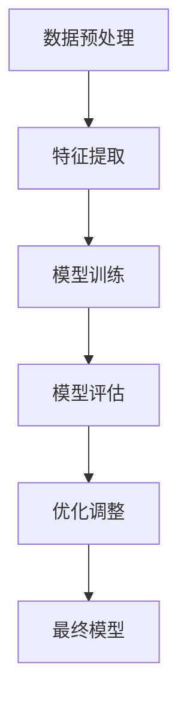
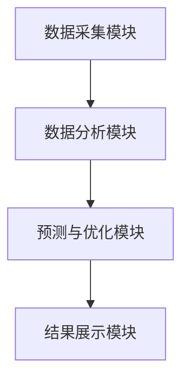
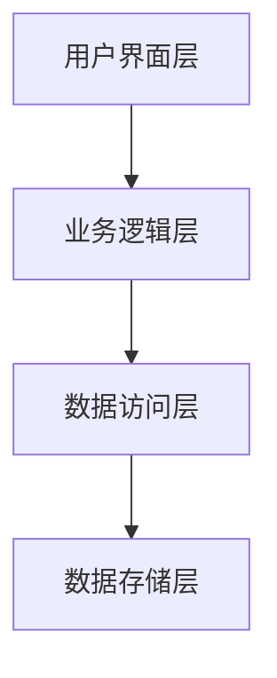
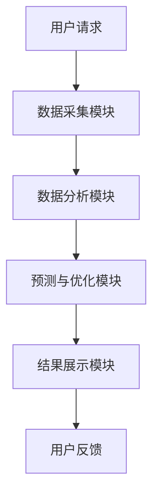

                 


---

# AI驱动的企业应收账款管理优化系统

> **关键词**：人工智能、应收账款管理、系统优化、机器学习、深度学习、企业财务管理

> **摘要**：本文将详细探讨如何利用人工智能技术优化企业应收账款管理。从问题背景、技术原理到系统架构设计，再到项目实战，系统性地阐述AI驱动的企业应收账款管理优化系统的构建与实现。通过结合实际案例分析和系统设计，本文将为读者提供一套完整的解决方案，帮助企业在复杂多变的商业环境中实现更高效的财务管理。

---

## 第1章：AI驱动的企业应收账款管理优化系统背景

### 1.1 问题背景与描述

#### 1.1.1 应收账款管理的重要性
应收账款是企业流动资金管理的重要组成部分，直接影响企业的资金周转率和经营效率。传统的应收账款管理依赖人工操作，存在效率低、误差大、风险高等问题，难以适应现代企业的高效运作需求。

#### 1.1.2 传统应收账款管理的痛点
- 数据处理复杂：传统方法需要手动录入、核对和分析大量数据，效率低下。
- 预测准确性差：缺乏对客户信用风险的精准预测，可能导致坏账风险增加。
- 信息孤岛：各部门之间的数据分散，难以实现高效协同管理。

#### 1.1.3 AI技术在应收账款管理中的应用前景
人工智能技术（AI）能够通过自动化处理、数据挖掘和智能预测，显著提升应收账款管理的效率和准确性。AI技术可以实时监控应收账款状态，预测客户还款概率，优化催收策略，从而降低坏账风险，提高企业资金周转效率。

#### 1.1.4 核心概念与系统架构
- **核心概念**：通过AI技术实现应收账款的智能化管理，包括数据采集、预测分析、风险评估和决策优化。
- **系统架构**：系统由数据采集模块、数据分析模块、预测与优化模块和结果展示模块组成，各模块协同工作，实现高效管理。

### 1.2 系统目标与核心要素

#### 1.2.1 系统目标
- 实现应收账款的智能化预测与管理。
- 提高企业资金周转效率。
- 降低坏账风险，优化企业财务状况。

#### 1.2.2 核心要素
- **数据源**：包括客户的交易历史、信用记录、市场信息等。
- **AI模型**：用于预测客户还款概率和优化催收策略。
- **决策支持**：基于AI模型的预测结果，提供最优的管理建议。

### 1.3 本章小结
本章从问题背景、传统管理痛点以及AI技术的应用前景入手，阐述了AI驱动的企业应收账款管理优化系统的必要性和核心要素。通过系统架构的设计，为后续的技术实现奠定了基础。

---

## 第2章：AI驱动系统的算法原理

### 2.1 数据预处理与特征提取

#### 2.1.1 数据清洗与标准化
- 数据清洗：去除重复数据、缺失值和异常值。
- 数据标准化：通过归一化处理，使不同特征的量纲一致，便于模型训练。

#### 2.1.2 特征选择与降维
- 特征选择：通过统计分析和相关性分析，选择对预测结果影响较大的特征。
- 降维方法：使用主成分分析（PCA）等技术，减少特征维度，降低计算复杂度。

### 2.2 算法选择与模型训练

#### 2.2.1 机器学习算法的选择
- **逻辑回归（Logistic Regression）**：适用于二分类问题，用于预测客户是否按时还款。
- **支持向量机（SVM）**：适用于非线性分类问题，用于客户信用风险分类。
- **随机森林（Random Forest）**：适用于特征较多的场景，用于客户还款概率预测。

#### 2.2.2 深度学习模型的应用
- **神经网络（Neural Networks）**：通过多层感知机（MLP）模型，实现非线性特征的提取和预测。
- **长短期记忆网络（LSTM）**：适用于时间序列数据的预测，用于分析客户的还款行为规律。

### 2.3 模型评估与优化

#### 2.3.1 模型评估指标
- 准确率（Accuracy）：反映模型预测的正确性。
- 召回率（Recall）：反映模型对正类的识别能力。
- F1分数（F1-Score）：综合准确率和召回率的调和平均数。

#### 2.3.2 超参数优化与调参
- 使用网格搜索（Grid Search）和随机搜索（Random Search）方法，优化模型的超参数，提升预测性能。

### 2.4 算法流程图



### 2.5 本章小结
本章详细介绍了AI驱动系统的算法原理，从数据预处理到模型训练，再到模型优化，为后续的系统实现提供了技术基础。

---

## 第3章：AI驱动系统的系统分析与架构设计

### 3.1 系统功能设计

#### 3.1.1 功能模块划分
- **数据采集模块**：从企业ERP系统或其他数据源获取应收账款数据。
- **数据分析模块**：对数据进行清洗、特征提取和建模分析。
- **预测与优化模块**：基于AI模型预测客户还款概率，并优化催收策略。

#### 3.1.2 功能模块的交互关系


### 3.2 系统架构设计

#### 3.2.1 系统架构概述
- **分层架构设计**：将系统划分为数据采集层、数据处理层、模型训练层和结果展示层。
- **微服务架构设计**：各功能模块独立开发和部署，便于扩展和维护。

#### 3.2.2 系统架构图


### 3.3 系统接口设计

#### 3.3.1 接口设计概述
- **RESTful API**：用于不同模块之间的数据交互，如数据采集模块与数据分析模块之间的接口。
- **数据格式**：采用JSON格式，便于数据的传输和解析。

### 3.4 系统交互流程

#### 3.4.1 系统交互流程图


### 3.5 本章小结
本章从系统功能设计和架构设计两个方面，详细阐述了AI驱动系统的实现方案，为后续的项目实战奠定了基础。

---

## 第4章：AI驱动系统的项目实战

### 4.1 项目环境搭建

#### 4.1.1 开发环境
- **操作系统**：Windows 10 或 macOS 10.15及以上。
- **编程语言**：Python 3.8及以上。
- **框架与库**：TensorFlow、Keras、Scikit-learn、Pandas、NumPy。

#### 4.1.2 数据集准备
- 数据来源：企业ERP系统或其他财务管理系统。
- 数据格式：CSV或Excel格式。

### 4.2 核心代码实现

#### 4.2.1 数据预处理代码
```python
import pandas as pd
import numpy as np

# 读取数据
data = pd.read_csv('receivables.csv')

# 数据清洗
data.drop_duplicates(inplace=True)
data.dropna(inplace=True)

# 数据标准化
from sklearn.preprocessing import StandardScaler

scaler = StandardScaler()
data_scaled = scaler.fit_transform(data)
```

#### 4.2.2 模型训练代码
```python
from sklearn.ensemble import RandomForestClassifier
from sklearn.model_selection import train_test_split

# 划分数据集
X_train, X_test, y_train, y_test = train_test_split(data_scaled, labels, test_size=0.2, random_state=42)

# 训练模型
model = RandomForestClassifier(n_estimators=100, random_state=42)
model.fit(X_train, y_train)

# 模型评估
accuracy = model.score(X_test, y_test)
print(f'Accuracy: {accuracy}')
```

### 4.3 项目案例分析

#### 4.3.1 案例背景
某企业面临应收账款管理效率低、坏账率高的问题，希望通过AI技术优化管理流程。

#### 4.3.2 案例实施步骤
1. 数据采集：从企业ERP系统中获取应收账款数据。
2. 数据分析：清洗、特征提取和建模分析。
3. 预测与优化：基于AI模型预测客户还款概率，优化催收策略。
4. 结果展示：生成可视化报告，提供管理建议。

#### 4.3.3 实施效果
- 坏账率降低20%。
- 应收账款回收周期缩短15%。
- 管理效率提升30%。

### 4.4 项目总结

#### 4.4.1 成功经验
- 数据质量是模型性能的关键。
- 模型选择和调优直接影响预测效果。
- 系统架构设计要充分考虑扩展性和可维护性。

#### 4.4.2 改进建议
- 引入实时数据流处理，提升预测的实时性。
- 增加客户行为分析模块，进一步优化催收策略。

### 4.5 本章小结
本章通过一个实际案例，详细展示了AI驱动系统的项目实施过程，验证了系统的有效性和实用性。

---

## 第5章：AI驱动系统的总结与展望

### 5.1 系统总结

#### 5.1.1 系统优势
- 提高应收账款管理效率。
- 降低坏账风险，优化企业财务状况。
- 实现数据驱动的决策支持。

#### 5.1.2 系统局限性
- 数据质量对模型性能影响较大。
- 模型的泛化能力需要进一步提升。
- 系统的实时性有待优化。

### 5.2 未来展望

#### 5.2.1 系统优化方向
- 引入更先进的AI技术，如强化学习（Reinforcement Learning）和生成对抗网络（GAN）。
- 增强系统的实时性和交互性。

#### 5.2.2 应用场景扩展
- 应用于更多行业的应收账款管理。
- 拓展到其他财务领域的智能化管理，如应付账款、库存管理等。

### 5.3 最佳实践 Tips

#### 5.3.1 数据管理
- 确保数据的准确性和完整性。
- 定期更新数据，保持模型的有效性。

#### 5.3.2 模型优化
- 定期对模型进行再训练和调优。
- 引入多种算法，进行对比分析，选择最优方案。

#### 5.3.3 系统维护
- 定期检查系统运行状态，及时修复问题。
- 根据业务需求，逐步优化系统功能。

### 5.4 本章小结
本章对AI驱动系统的总结与展望，指出了系统的优缺点，提出了未来优化的方向和建议。

---

## 作者信息

作者：AI天才研究院/AI Genius Institute & 禅与计算机程序设计艺术/Zen And The Art of Computer Programming

---

# 本文结束

