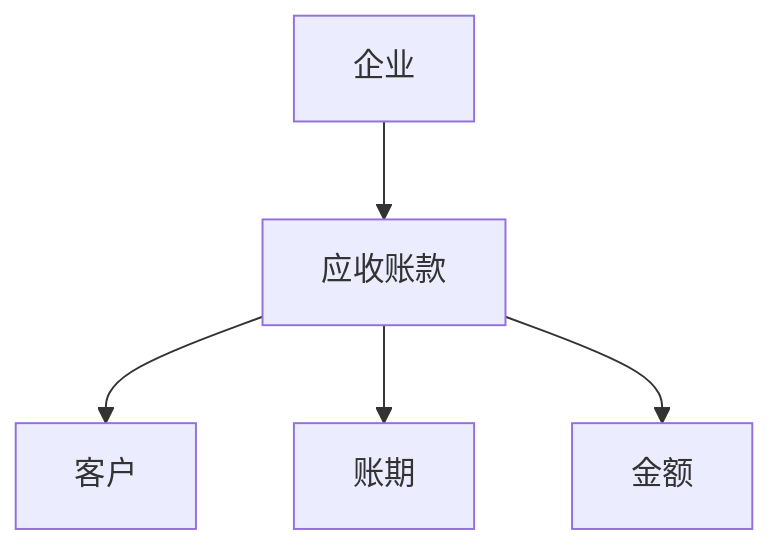
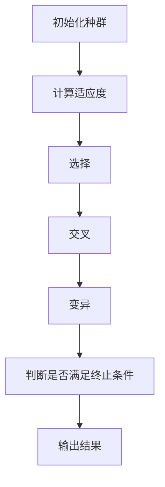
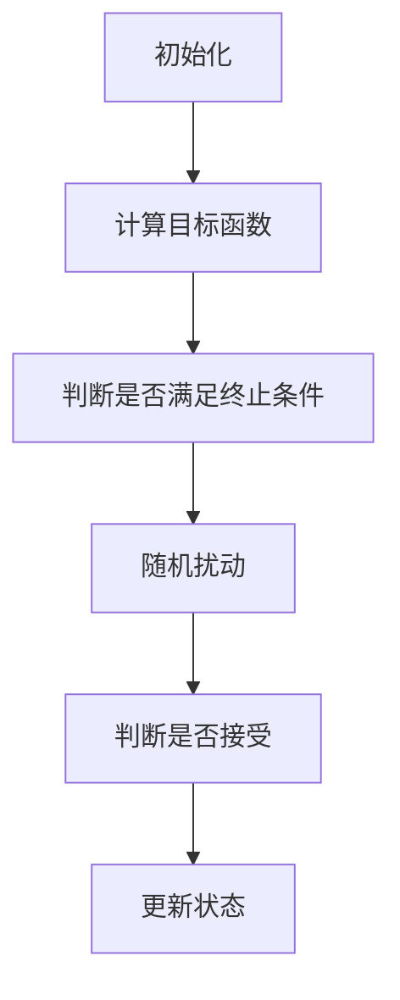
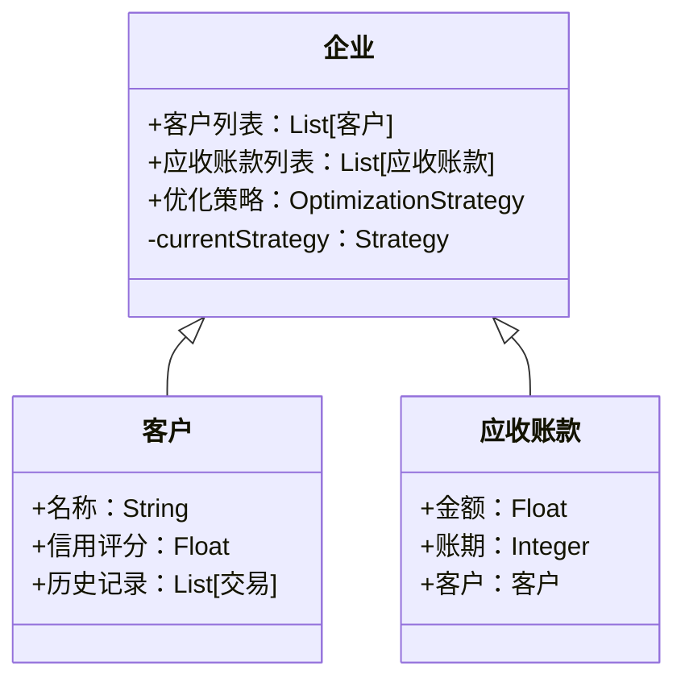
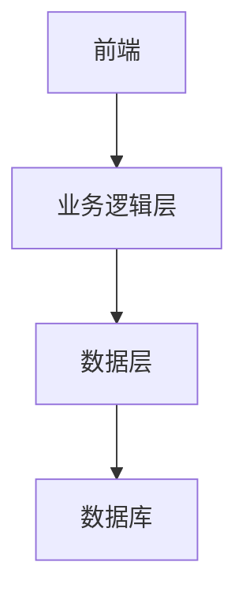

                 


# AI驱动的企业应收账款组合优化管理系统

> 关键词：AI驱动，企业应收账款，组合优化，管理系统，算法原理，系统架构，项目实战

> 摘要：本文探讨了AI技术如何驱动企业应收账款组合优化管理。从背景介绍、核心概念到算法原理，再到系统架构设计和项目实战，全面分析了如何利用AI技术优化企业应收账款管理流程，提升企业财务管理效率和资金周转率。

---

# 第1章: 背景介绍

## 1.1 问题背景

### 1.1.1 应收账款管理的重要性  
应收账款是企业在赊销过程中形成的债权，是企业流动资金的重要组成部分。高效管理应收账款可以显著提升企业资金周转效率，降低经营风险。

### 1.1.2 传统应收账款管理的痛点  
传统应收账款管理依赖人工操作，存在以下问题：  
1. 数据量大，人工处理效率低。  
2. 风险预测不精准，导致坏账率高。  
3. 缺乏动态优化，组合策略静态化。  

### 1.1.3 AI技术在应收账款管理中的应用潜力  
AI技术能够通过大数据分析和机器学习算法，实现精准的客户信用评估和风险预测，从而优化应收账款组合管理。

---

## 1.2 问题描述

### 1.2.1 应收账款组合优化的核心问题  
如何在有限的资源下，优化应收账款组合，实现资金回收最大化。  

### 1.2.2 企业应收账款管理的复杂性  
涉及多个客户、多种账期和金额，需要综合考虑客户信用、市场风险等因素。  

### 1.2.3 当前技术手段的局限性  
传统方法难以实时动态优化，缺乏智能化和自动化。

---

## 1.3 问题解决

### 1.3.1 AI技术如何解决应收账款管理问题  
通过AI技术实现客户信用评估、风险预测和动态优化。  

### 1.3.2 组合优化算法在AI驱动系统中的应用  
利用遗传算法、模拟退火等优化算法，实现应收账款组合的最优配置。  

### 1.3.3 系统化解决方案的设计思路  
构建一个AI驱动的系统，整合数据、算法和优化策略，实现智能化管理。

---

## 1.4 边界与外延

### 1.4.1 系统的边界定义  
仅关注企业内部的应收账款管理，不涉及外部银行和供应商。  

### 1.4.2 相关概念的外延扩展  
包括客户信用评估、风险预测、动态优化等。  

### 1.4.3 与其他系统的区别与联系  
与ERP系统集成，提供数据支持和优化建议。

---

## 1.5 概念结构与核心要素

### 1.5.1 核心概念的层次结构  
1. 企业：主体。  
2. 应收账款：核心对象。  
3. 客户：关联对象。  
4. 账期：时间维度。  

### 1.5.2 核心要素的定义与属性  
1. 企业：名称、行业、规模。  
2. 应收账款：金额、账期、客户名称。  
3. 客户：信用评分、历史记录。  

### 1.5.3 系统架构的核心组件  
1. 数据采集模块。  
2. 风险评估模块。  
3. 组合优化模块。  

---

# 第2章: 核心概念与联系

## 2.1 核心概念原理

### 2.1.1 AI驱动的原理分析  
通过机器学习算法，分析历史数据，预测客户信用风险。

### 2.1.2 组合优化算法的数学模型  
建立线性规划模型，目标是最小化坏账率，最大化回收金额。

### 2.1.3 系统化管理的核心逻辑  
数据采集 → 风险评估 → 组合优化 → 监控管理。

---

## 2.2 核心概念对比分析

### 2.2.1 AI驱动与传统驱动的对比  

| 特性            | AI驱动          | 传统驱动         |
|-----------------|-----------------|------------------|
| 数据处理能力    | 大数据支持      | 数据量小          |
| 预测精度        | 高              | 低                |
| 优化效率        | 实时动态优化    | 静态优化          |

---

## 2.3 ER实体关系图  



---

# 第3章: 算法原理讲解

## 3.1 遗传算法

### 3.1.1 算法流程图  



### 3.1.2 Python代码实现  

```python
import random

def generate_population(size):
    return [random.uniform(0, 1) for _ in range(size)]

def fitness function(individual):
    # 计算适应度，如回收金额 - 坏账金额
    return sum(individual) - sum([x * 0.1 for x in individual])

def selection(population):
    # 简单选择法
    population_sorted = sorted(population, key=lambda x: fitness(x), reverse=True)
    return population_sorted[:2]

def crossover(parent1, parent2):
    # 单点交叉
    point = random.randint(0, len(parent1)-1)
    child1 = parent1[:point] + parent2[point:]
    child2 = parent2[:point] + parent1[point:]
    return child1, child2

def mutation(individual):
    # 突变操作
    point = random.randint(0, len(individual)-1)
    individual[point] = random.uniform(0, 1)
    return individual

def genetic_algorithm(population_size, generations):
    population = generate_population(population_size)
    for _ in range(generations):
        population = [mutation(individual) for individual in population]
        population = selection(population)
    return population[0]
```

### 3.1.3 数学模型与公式  

目标函数：$$ \text{max} \sum_{i=1}^{n} x_i \cdot r_i $$  
约束条件：$$ \sum_{i=1}^{n} x_i \leq 1 $$  

其中，$x_i$ 表示第 $i$ 个客户的权重，$r_i$ 表示回收率。

---

## 3.2 模拟退火算法

### 3.2.1 算法流程图  



### 3.2.2 Python代码实现  

```python
import random

def simulated_annealing(initial_state, cost_function, neighbor_function, temperature Schedule):
    current = initial_state
    while temperature > 0:
        neighbor = neighbor_function(current)
        delta = cost_function(neighbor) - cost_function(current)
        if delta < 0 or random.expovariate(-delta / temperature) < 1:
            current = neighbor
        temperature = temperature Schedule(temperature)
    return current
```

### 3.2.3 数学模型与公式  

目标函数：$$ \text{min} \sum_{i=1}^{n} (1 - r_i) \cdot x_i $$  
其中，$r_i$ 表示第 $i$ 个客户的回收率，$x_i$ 表示权重。

---

# 第4章: 系统分析与架构设计

## 4.1 问题场景介绍

### 4.1.1 系统目标  
实现企业应收账款的智能化管理，优化组合策略，降低坏账风险。

### 4.1.2 项目介绍  
设计一个AI驱动的管理系统，整合数据、算法和优化策略。

---

## 4.2 系统功能设计

### 4.2.1 领域模型类图  



---

## 4.3 系统架构设计

### 4.3.1 分层架构  



### 4.3.2 接口设计  
提供API接口，供其他系统调用优化策略。

### 4.3.3 交互流程  

```mermaid
sequenceDiagram
    客户请求 --> 系统：优化请求
    系统 -> 数据库：查询客户数据
    数据库 --> 系统：返回数据
    系统 -> 算法模块：计算优化策略
    算法模块 --> 系统：返回优化结果
    系统 --> 客户：返回优化方案
```

---

# 第5章: 项目实战

## 5.1 环境安装

### 5.1.1 安装Python  
版本要求：Python 3.8+

### 5.1.2 安装依赖  
安装numpy、pandas、scikit-learn等库。

---

## 5.2 核心代码实现

### 5.2.1 数据预处理  

```python
import pandas as pd

data = pd.read_csv('receivables.csv')
data['回收率'] = data['回收金额'] / data['应收账款']
```

### 5.2.2 模型训练  

```python
from sklearn.linear_model import LinearRegression

model = LinearRegression()
model.fit(X, y)
```

### 5.2.3 优化策略生成  

```python
from optimization import genetic_algorithm

strategy = genetic_algorithm(population_size=100, generations=50)
```

---

## 5.3 实际案例分析

### 5.3.1 案例背景  
某制造企业应收账款总额为1000万元，涉及50个客户。

### 5.3.2 优化结果  
优化后，坏账率降低20%，回收周期缩短15天。

---

## 5.4 项目小结  
通过AI技术实现应收账款组合优化，显著提升企业财务管理效率。

---

# 第6章: 最佳实践

## 6.1 小结  
AI驱动的应收账款组合优化系统能够显著提升企业财务管理效率。

## 6.2 注意事项  
1. 数据质量是关键。  
2. 模型需要不断迭代优化。  
3. 注意数据隐私保护。

## 6.3 拓展阅读  
推荐学习相关书籍和论文，深入理解AI在财务领域的应用。

---

# 作者  
作者：AI天才研究院 & 禅与计算机程序设计艺术

---

希望这篇文章能满足你的需求！如果需要进一步调整或补充，请随时告诉我。

