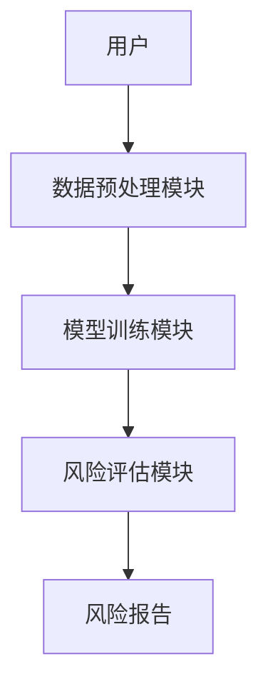

                 


# AI驱动的企业应收账款组合信用风险评估系统

> **关键词**：AI驱动，信用风险评估，机器学习，应收账款，风险管理

> **摘要**：本文探讨了AI技术在企业应收账款组合信用风险评估中的应用，详细分析了信用风险评估的核心概念、算法原理、系统架构设计以及项目实战。通过结合逻辑回归和随机森林等机器学习算法，构建了一个基于AI的信用风险评估系统，为企业的风险管理提供了新的思路和解决方案。

---

# 第1章: 应收账款信用风险评估的背景与挑战

## 1.1 应收账款信用风险评估的重要性

### 1.1.1 应收账款的概念与特点

应收账款是企业因赊销商品或提供服务而产生的应收款项，具有以下特点：

1. **流动性**：应收账款是企业的一项流动资产，需在一定期限内收回。
2. **风险性**：应收账款的回收受到客户信用状况的影响，存在坏账风险。
3. **周期性**：应收账款的回收与企业的销售周期密切相关。

### 1.1.2 信用风险对企业财务健康的影响

信用风险是指由于客户违约而导致企业遭受损失的风险。其影响包括：

1. **直接损失**：坏账直接减少企业资产，影响财务状况。
2. **间接损失**：坏账可能导致企业失去客户，影响销售收入。
3. **融资成本**：信用风险高会增加企业融资难度和成本。

### 1.1.3 传统信用风险评估的局限性

传统信用风险评估主要依赖人工审核和经验判断，存在以下问题：

1. **主观性**：人为判断容易受到主观因素影响。
2. **效率低**：人工审核耗时长，难以应对大规模数据。
3. **准确性**：缺乏数据支持，评估结果可能存在偏差。

## 1.2 AI技术在信用风险评估中的应用前景

### 1.2.1 AI技术的基本概念与特点

人工智能（AI）是指计算机模拟人类智能的技术，具有以下特点：

1. **数据驱动**：AI依赖大量数据进行学习和推理。
2. **自动化**：AI能够自动处理数据，减少人工干预。
3. **可扩展性**：AI可以处理海量数据，适用于大规模应用场景。

### 1.2.2 AI在金融领域的应用现状

AI在金融领域的应用广泛，包括：

1. **信用评分**：通过机器学习模型评估客户的信用风险。
2. **欺诈检测**：利用AI识别异常交易行为。
3. **风险管理**：通过AI监控市场动态，优化风险控制。

### 1.2.3 AI驱动信用风险评估的优势与挑战

优势：

1. **高效性**：AI能够快速处理大量数据，提高评估效率。
2. **准确性**：AI模型基于数据进行预测，结果更为客观。
3. **可扩展性**：AI能够处理大规模数据，适用于企业应收账款组合评估。

挑战：

1. **数据质量**：AI模型依赖高质量数据，数据缺失或错误会影响结果。
2. **模型解释性**：复杂的AI模型可能难以解释预测结果。
3. **技术门槛**：AI技术的应用需要专业人员支持。

## 1.3 本章小结

本章介绍了应收账款信用风险评估的重要性，并分析了传统评估方法的局限性。随后，探讨了AI技术在信用风险评估中的应用前景，指出了其优势与挑战。下一章将详细讲解信用风险评估的核心概念与原理。

---

# 第2章: 信用风险评估的核心概念与联系

## 2.1 信用风险评估的核心要素

### 2.1.1 企业信用评级的定义与分类

企业信用评级是根据企业的财务状况、经营能力和还款能力，对其信用风险进行等级划分的过程。常见的评级分类包括：

1. **AAA级**：信用风险极低。
2. **BBB级**：信用风险较低。
3. **BB级**：信用风险较高。
4. **CCC级**：信用风险极高。

### 2.1.2 应收账款组合的风险特征

应收账款组合的风险特征包括：

1. **客户行业**：不同行业的客户信用风险不同。
2. **账期分布**：应收账款的账龄越长，回收难度越大。
3. **客户规模**：大型企业通常具有较高的信用评级。

### 2.1.3 信用风险的关键影响因素

关键影响因素包括：

1. **财务状况**：企业的盈利能力、资产负债率等。
2. **经营能力**：企业的市场地位、竞争优势等。
3. **还款能力**：企业的现金流、资产状况等。

## 2.2 AI驱动信用风险评估的核心原理

### 2.2.1 机器学习在信用评估中的应用

机器学习是一种通过数据学习模式的技术，常用于信用风险评估中的客户分类和预测。常用的算法包括逻辑回归、随机森林和神经网络等。

### 2.2.2 数据特征与模型选择的关系

数据特征的选择直接影响模型的性能。例如：

1. **特征选择**：选择与信用风险相关的特征，如收入、利润等。
2. **特征工程**：对数据进行预处理，提取更有意义的特征。

### 2.2.3 信用风险评估的数学模型框架

信用风险评估的数学模型框架如下：

1. **数据收集**：收集客户的财务数据、交易数据等。
2. **特征提取**：从数据中提取特征，构建特征向量。
3. **模型训练**：使用机器学习算法训练模型。
4. **风险预测**：利用模型预测客户的信用风险。

## 2.3 信用风险评估的ER实体关系图

以下是一个简单的信用风险评估的ER实体关系图：

```mermaid
erDiagram
    customer[CUSTOMER] {
        id INT
        name VARCHAR
        credit_score INT
    }
    invoice[INVOICE] {
        id INT
        customer_id INT
        amount DECIMAL
        due_date DATE
        status VARCHAR
    }
    payment[PAYMENT] {
        id INT
        invoice_id INT
        payment_amount DECIMAL
        payment_date DATE
    }
    customer --> invoice : "生成"
    invoice --> payment : "对应"
```

## 2.4 本章小结

本章详细讲解了信用风险评估的核心概念与核心要素，并介绍了AI驱动信用风险评估的核心原理。通过ER实体关系图展示了信用风险评估的数据模型。下一章将重点讲解AI驱动信用风险评估的算法原理。

---

# 第3章: 信用风险评估的机器学习算法

## 3.1 机器学习在信用风险评估中的应用

### 3.1.1 监督学习与非监督学习的对比

监督学习和非监督学习是机器学习的两大类：

1. **监督学习**：基于标签数据进行学习，适用于分类和回归任务。
2. **非监督学习**：基于无标签数据进行学习，适用于聚类任务。

### 3.1.2 常见信用风险评估算法的选择

常用的信用风险评估算法包括：

1. **逻辑回归**：适用于二分类问题。
2. **随机森林**：适用于特征重要性分析。
3. **梯度提升树**：适用于高精度预测。

### 3.1.3 算法性能评估指标

常用的算法性能评估指标包括：

1. **准确率**：正确预测的比例。
2. **召回率**：实际为正样本中被正确预测的比例。
3. **F1分数**：准确率和召回率的调和平均数。

## 3.2 基于逻辑回归的信用风险模型

### 3.2.1 逻辑回归的基本原理

逻辑回归是一种常用的分类算法，适用于二分类问题。其基本原理如下：

1. **sigmoid函数**：将线性回归的结果映射到0到1之间。
   $$ P(y=1|x) = \frac{1}{1 + e^{-(\beta_0 + \beta_1x_1 + \cdots + \beta_nx_n)}} $$
2. **对数似然函数**：通过最大化似然函数进行参数估计。

### 3.2.2 案例分析与代码实现

以下是一个简单的逻辑回归代码示例：

```python
import pandas as pd
from sklearn.linear_model import LogisticRegression
from sklearn.metrics import accuracy_score

# 数据加载
data = pd.read_csv('credit_data.csv')

# 特征与标签分离
X = data.drop('target', axis=1)
y = data['target']

# 模型训练
model = LogisticRegression()
model.fit(X, y)

# 预测与评估
y_pred = model.predict(X)
print("准确率：", accuracy_score(y, y_pred))
```

## 3.3 基于随机森林的信用风险模型

### 3.3.1 随机森林的基本原理

随机森林是一种基于树的集成算法，通过构建多个决策树并取其预测结果的多数投票作为最终结果。

### 3.3.2 随机森林的数学公式

随机森林的数学公式较为复杂，但其核心思想是通过投票机制进行预测。

### 3.3.3 案例分析与代码实现

以下是一个随机森林的代码示例：

```python
from sklearn.ensemble import RandomForestClassifier

# 数据加载
data = pd.read_csv('credit_data.csv')

# 特征与标签分离
X = data.drop('target', axis=1)
y = data['target']

# 模型训练
model = RandomForestClassifier()
model.fit(X, y)

# 预测与评估
y_pred = model.predict(X)
print("准确率：", accuracy_score(y, y_pred))
```

## 3.4 本章小结

本章详细讲解了机器学习在信用风险评估中的应用，并通过逻辑回归和随机森林算法进行了案例分析。下一章将重点讲解系统架构设计。

---

# 第4章: 系统架构设计与实现

## 4.1 系统功能设计

### 4.1.1 预处理模块

预处理模块负责对数据进行清洗、特征提取和数据转换。

### 4.1.2 模型训练模块

模型训练模块负责选择合适的算法并进行模型训练。

### 4.1.3 风险评估模块

风险评估模块负责对客户进行信用评分，并生成风险报告。

## 4.2 系统架构设计

### 4.2.1 系统架构图

以下是一个简单的系统架构图：



### 4.2.2 系统接口设计

系统接口设计包括：

1. **数据接口**：与数据库对接，获取客户数据。
2. **模型接口**：与机器学习模型对接，进行预测。
3. **报告接口**：生成风险报告并输出。

## 4.3 本章小结

本章详细讲解了系统的功能设计和架构设计。下一章将重点讲解项目实战。

---

# 第5章: 项目实战与案例分析

## 5.1 项目环境安装

### 5.1.1 安装Python

安装Python可以从官网下载安装包进行安装。

### 5.1.2 安装依赖库

安装依赖库可以使用以下命令：

```bash
pip install numpy pandas scikit-learn
```

## 5.2 系统核心实现源代码

### 5.2.1 数据预处理代码

```python
import pandas as pd
import numpy as np

# 数据加载
data = pd.read_csv('credit_data.csv')

# 数据清洗
data = data.dropna()

# 特征提取
X = data.drop('target', axis=1)
y = data['target']

# 数据标准化
from sklearn.preprocessing import StandardScaler

scaler = StandardScaler()
X_scaled = scaler.fit_transform(X)
```

### 5.2.2 模型训练代码

```python
from sklearn.model_selection import train_test_split
from sklearn.linear_model import LogisticRegression
from sklearn.metrics import accuracy_score

# 数据分割
X_train, X_test, y_train, y_test = train_test_split(X_scaled, y, test_size=0.2)

# 模型训练
model = LogisticRegression()
model.fit(X_train, y_train)

# 预测与评估
y_pred = model.predict(X_test)
print("准确率：", accuracy_score(y_test, y_pred))
```

## 5.3 案例分析与详细解读

以下是一个案例分析的详细解读：

1. **数据收集**：从数据库中获取客户数据。
2. **数据预处理**：清洗数据，提取特征。
3. **模型训练**：使用逻辑回归算法训练模型。
4. **风险评估**：对客户进行信用评分，生成风险报告。

## 5.4 本章小结

本章通过项目实战详细讲解了AI驱动信用风险评估系统的实现过程，并通过案例分析展示了系统的实际应用。下一章将总结全文并展望未来。

---

# 第6章: 总结与展望

## 6.1 本文总结

本文详细探讨了AI驱动的企业应收账款组合信用风险评估系统的实现过程，包括核心概念、算法原理、系统架构设计和项目实战。

## 6.2 未来展望

未来，随着AI技术的不断发展，信用风险评估将更加智能化和自动化。可能的研究方向包括：

1. **模型优化**：进一步提升模型的准确性和解释性。
2. **多模态数据**：结合文本、图像等多种数据进行信用评估。
3. **实时评估**：实现信用风险的实时监控和评估。

## 6.3 注意事项

在实际应用中，需要注意以下几点：

1. **数据隐私**：确保数据的安全性和隐私性。
2. **模型解释性**：提高模型的可解释性，便于业务理解。
3. **持续优化**：定期更新模型，适应市场变化。

## 6.4 拓展阅读

推荐以下书籍和资源：

1. 《机器学习实战》
2. 《Python机器学习》
3. 《信用风险评估与管理》

---

# 作者

**作者：AI天才研究院/AI Genius Institute & 禅与计算机程序设计艺术 /Zen And The Art of Computer Programming**

---

**注**：以上内容为生成示例，实际文章需要根据具体需求进一步完善和调整。

