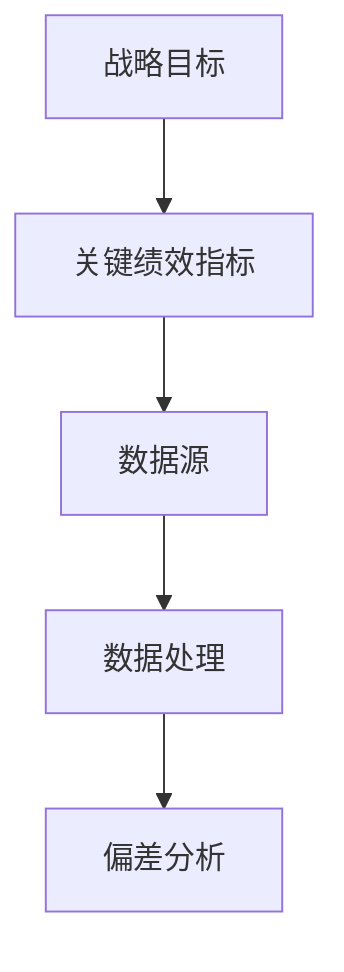
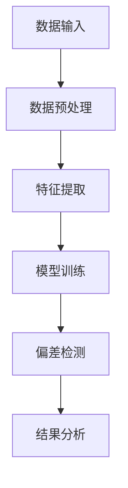
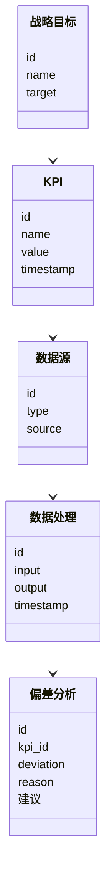
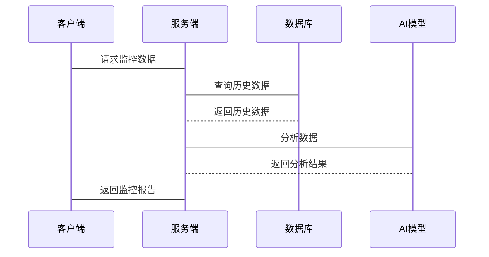

                 


# AI驱动的企业战略执行监控：KPI智能跟踪与偏差分析

> 关键词：企业战略执行监控, AI驱动, KPI智能跟踪, 偏差分析, 数据驱动决策, 人工智能, 企业绩效管理

> 摘要：本文探讨了如何利用人工智能技术实现企业战略执行监控的智能化，重点分析了KPI智能跟踪与偏差分析的核心原理、算法实现、系统架构设计及实际应用案例。文章从背景、概念、算法、系统架构、项目实战等多个维度展开，为企业管理者和技术开发者提供了一套完整的解决方案。

---

# 第一部分: AI驱动的企业战略执行监控概述

## 第1章: 企业战略执行监控的背景与挑战

### 1.1 问题背景

#### 1.1.1 传统企业战略执行监控的局限性
传统的企业战略执行监控依赖于人工数据录入和定期报告，这种方式效率低、滞后性强，且容易受到主观因素的影响。企业在面对复杂多变的市场环境时，往往难以及时发现战略执行中的偏差，导致资源浪费和目标偏离。

#### 1.1.2 数字化转型对企业战略执行监控的新要求
随着数字化转型的推进，企业需要更加实时、精准的监控工具来支持决策。传统的监控方法已经无法满足企业对数据驱动决策的需求，尤其是在数据量大、业务复杂的情况下。

#### 1.1.3 AI技术在企业战略执行监控中的潜力
人工智能技术的快速发展为企业战略执行监控提供了新的可能性。通过AI技术，企业可以实现KPI的智能跟踪和自动化的偏差分析，从而提高监控的效率和准确性。

### 1.2 问题描述

#### 1.2.1 企业战略执行监控的核心目标
企业战略执行监控的核心目标是通过实时跟踪关键绩效指标（KPI），及时发现战略执行中的偏差，并采取相应的调整措施，确保企业战略目标的顺利实现。

#### 1.2.2 KPI智能跟踪的关键问题
KPI智能跟踪的关键问题包括数据的实时性、准确性以及如何从海量数据中提取有效的信息。此外，如何将KPI与企业战略目标紧密关联也是一个重要挑战。

#### 1.2.3 偏差分析的难点与挑战
偏差分析的难点在于如何准确识别偏差、分析偏差的原因，并提出有效的纠正措施。传统的方法往往依赖于经验丰富的管理人员，而AI技术可以通过数据分析提供更加客观和科学的决策支持。

### 1.3 问题解决

#### 1.3.1 AI驱动的战略执行监控解决方案
AI驱动的战略执行监控解决方案包括数据采集、数据预处理、特征提取、模型训练和结果分析等步骤。通过AI技术，企业可以实现KPI的智能跟踪和偏差的自动识别。

#### 1.3.2 数据驱动的偏差分析方法
数据驱动的偏差分析方法利用机器学习和统计分析技术，从海量数据中提取有用的信息，帮助企业管理者更好地理解偏差的原因，并制定相应的对策。

#### 1.3.3 智能化KPI跟踪的实现路径
智能化KPI跟踪的实现路径包括数据采集与整合、数据清洗与预处理、特征工程、模型训练与优化、结果分析与可视化等步骤。

### 1.4 边界与外延

#### 1.4.1 AI驱动的战略执行监控的边界
AI驱动的战略执行监控的边界包括数据的范围、监控的范围以及模型的应用范围。企业需要明确监控的目标和范围，以确保AI技术的有效应用。

#### 1.4.2 与传统监控方法的区别
与传统监控方法相比，AI驱动的战略执行监控更加智能化、自动化和实时化。它能够处理更大的数据量，提供更精准的分析结果，并且能够实时跟踪KPI的变化。

#### 1.4.3 与其他企业智能化工具的关系
AI驱动的战略执行监控与其他企业智能化工具（如CRM、ERP等）密切相关。这些工具提供了数据来源，而战略执行监控则利用这些数据进行分析和决策支持。

### 1.5 概念结构与核心要素

#### 1.5.1 核心概念的层次结构
核心概念的层次结构包括战略目标、KPI、数据源、数据处理、偏差分析等层次。这些层次相互关联，共同构成了企业战略执行监控的核心框架。

#### 1.5.2 核心要素的特征对比
核心要素的特征对比包括战略目标的长期性、KPI的量化性、数据源的多样性、数据处理的实时性以及偏差分析的准确性等。

#### 1.5.3 概念之间的关系
概念之间的关系可以通过ER实体关系图来展示，图中包括战略目标、KPI、数据源、数据处理和偏差分析等实体及其关系。

---

## 第2章: 核心概念与联系

### 2.1 核心概念原理

#### 2.1.1 数据采集与预处理
数据采集与预处理是战略执行监控的第一步，包括数据的收集、清洗和转换等步骤。数据预处理的目的是确保数据的准确性和一致性。

#### 2.1.2 KPI特征提取
KPI特征提取是从海量数据中提取与企业战略目标相关的特征，这些特征能够更好地反映战略执行的状况。

#### 2.1.3 基于AI的KPI预测模型
基于AI的KPI预测模型利用机器学习算法对KPI进行预测，并通过模型的输出结果进行偏差分析。

### 2.2 概念属性特征对比

#### 2.2.1 不同KPI类型的特点对比
不同KPI类型的特点可以通过对比分析表来展示，例如财务类KPI和非财务类KPI的区别。

#### 2.2.2 数据源的特征分析
数据源的特征分析包括数据的来源、数据的类型、数据的时序性等。

#### 2.2.3 偏差分析的维度对比
偏差分析的维度对比包括偏差的大小、偏差的频率、偏差的影响程度等。

### 2.3 ER实体关系图
以下是ER实体关系图：



---

## 第3章: 偏差分析的算法原理

### 3.1 算法原理

#### 3.1.1 基于机器学习的偏差检测
基于机器学习的偏差检测方法包括监督学习、无监督学习和半监督学习等。这些方法可以通过训练模型来检测数据中的异常值。

#### 3.1.2 时间序列分析方法
时间序列分析方法适用于对时序数据进行偏差检测，例如ARIMA模型和LSTM网络等。

#### 3.1.3 异常检测算法
异常检测算法包括基于统计的方法、基于机器学习的方法和基于深度学习的方法等。

### 3.2 算法流程图



### 3.3 算法实现代码

```python
import pandas as pd
from sklearn.ensemble import IsolationForest

# 示例数据加载
data = pd.read_csv('kpi_data.csv')

# 数据预处理
data_processed = data.dropna()

# 特征提取
features = data_processed[['kpi1', 'kpi2', 'kpi3']]

# 模型训练
model = IsolationForest(n_estimators=100, contamination=0.05)
model.fit(features)

# 偏差检测
outliers = model.predict(features)
outliers[outliers == -1] = 1
outliers[outliers == 1] = 0
```

### 3.4 数学模型与公式

#### 3.4.1 异常检测的数学模型
异常检测的数学模型可以表示为：
$$
f(x) = \begin{cases}
0 & \text{如果 } x \text{ 是正常数据} \\
1 & \text{如果 } x \text{ 是异常数据}
\end{cases}
$$

#### 3.4.2 时间序列分析的数学公式
时间序列分析的数学公式可以表示为：
$$
y_t = \alpha y_{t-1} + \beta \epsilon_t
$$

---

## 第4章: 系统分析与架构设计

### 4.1 问题场景介绍
系统需要实现对企业战略执行的实时监控，包括KPI的智能跟踪和偏差分析。

### 4.2 系统功能设计

#### 4.2.1 领域模型设计
以下是领域模型设计：



### 4.3 系统架构设计

#### 4.3.1 分层架构设计
以下是分层架构设计：


### 4.4 接口设计与交互流程

#### 4.4.1 系统交互流程图
以下是系统交互流程图：



---

## 第5章: 项目实战

### 5.1 环境安装

```bash
pip install pandas scikit-learn isolation-forest
```

### 5.2 系统核心实现代码

```python
import pandas as pd
from sklearn.ensemble import IsolationForest

# 加载数据
data = pd.read_csv('kpi_data.csv')

# 数据预处理
data_processed = data.dropna()

# 特征提取
features = data_processed[['kpi1', 'kpi2', 'kpi3']]

# 训练模型
model = IsolationForest(n_estimators=100, contamination=0.05)
model.fit(features)

# 检测异常
outliers = model.predict(features)
outliers[outliers == -1] = 1
outliers[outliers == 1] = 0

# 保存结果
results = pd.DataFrame({'timestamp': data_processed['timestamp'], 'is_outlier': outliers})
results.to_csv('outliers.csv', index=False)
```

### 5.3 实际案例分析与解读

#### 5.3.1 案例背景
某企业希望监控其销售额和利润的KPI，确保其战略目标的实现。

#### 5.3.2 数据分析与解读
通过AI模型分析，发现销售额在某些时间段存在异常，进一步分析发现是由于市场竞争加剧导致的销售额下降。

#### 5.3.3 偏差分析与纠正措施
根据偏差分析结果，企业采取了调整市场策略和优化产品结构等措施，最终实现了战略目标。

### 5.4 项目小结
通过AI驱动的战略执行监控，企业能够实时跟踪KPI，快速发现偏差，并采取有效的纠正措施，从而提高战略执行的效率和准确性。

---

## 第6章: 最佳实践与总结

### 6.1 小结
本文详细介绍了AI驱动的企业战略执行监控的核心概念、算法原理、系统架构设计及实际应用案例。通过AI技术，企业能够实现KPI的智能跟踪和偏差分析，从而提高战略执行的效率和准确性。

### 6.2 注意事项
企业在应用AI技术时，需要注意数据的准确性和完整性，同时需要定期对模型进行更新和优化，以确保模型的有效性。

### 6.3 拓展阅读
建议读者进一步阅读相关领域的书籍和论文，例如《机器学习实战》和《时间序列分析与应用》等。

---

## 作者：AI天才研究院 & 禅与计算机程序设计艺术

