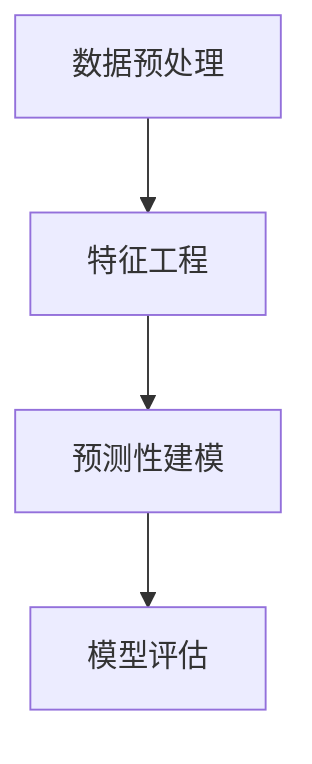
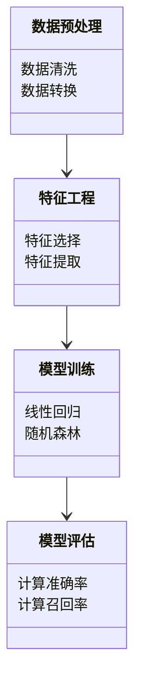
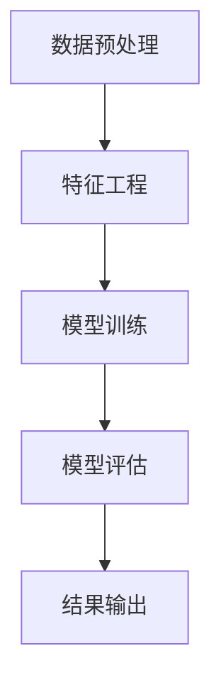

                 


# AI驱动的企业战略规划：大数据分析与预测性建模的融合

> 关键词：AI, 企业战略规划, 大数据分析, 预测性建模, 机器学习, 数据驱动决策

> 摘要：本文探讨了AI如何驱动企业战略规划，重点分析了大数据分析与预测性建模的融合。通过详细讲解核心概念、算法原理、系统架构设计、项目实战和最佳实践，本文旨在为企业提供一种基于AI的高效战略规划方法。

---

## 第一部分: AI驱动的企业战略规划概述

### 第1章: AI驱动企业战略规划的背景

#### 1.1 问题背景与挑战

##### 1.1.1 传统企业战略规划的局限性
传统的战略规划依赖于经验判断和主观决策，难以应对数据量庞大、复杂多变的市场环境。企业往往面临以下挑战：
- 数据孤岛问题：各部门数据分散，难以整合。
- 预测准确性低：基于历史经验和简单分析，预测结果不够精确。
- 响应速度慢：面对市场变化，决策周期长，难以快速调整。

##### 1.1.2 数据驱动决策的必要性
随着数字化转型的推进，企业积累了大量的数据，包括销售数据、客户行为数据、市场趋势等。通过分析这些数据，企业可以更准确地识别市场机会和风险，优化资源配置，提高决策效率。

##### 1.1.3 AI在企业战略规划中的作用
AI技术的引入，为企业战略规划提供了新的可能性。AI可以通过大数据分析和预测性建模，帮助企业在复杂环境中快速识别趋势、优化决策，并制定更具前瞻性的战略。

---

#### 1.2 技术演变与融合

##### 1.2.1 大数据分析的兴起
大数据分析的兴起源于企业对海量数据的处理需求。通过大数据技术，企业可以实时处理和分析大量数据，提取有价值的信息。

##### 1.2.2 预测性建模的发展
预测性建模是一种基于历史数据预测未来趋势的技术。随着机器学习算法的不断发展，预测性建模在企业中的应用越来越广泛。

##### 1.2.3 AI与企业战略规划的结合
AI的引入，使得企业战略规划从传统的经验驱动转变为数据驱动。通过AI技术，企业可以更高效地分析数据，优化模型，制定更科学的战略。

---

#### 1.3 价值创造与应用场景

##### 1.3.1 企业战略规划的核心价值
企业战略规划的核心价值在于帮助企业明确发展方向，优化资源配置，提高竞争力。

##### 1.3.2 AI在战略规划中的应用场景
- 市场趋势预测：通过分析市场数据，预测未来市场趋势。
- 客户行为分析：通过分析客户数据，了解客户需求，优化产品和服务。
- 风险管理：通过分析风险数据，制定风险管理策略。

##### 1.3.3 企业级AI系统的潜力
企业级AI系统的潜力在于其能够整合企业内外部数据，提供全面的决策支持，帮助企业实现智能化转型。

---

### 第2章: 大数据分析与预测性建模的融合

#### 2.1 大数据分析的原理与方法

##### 2.1.1 数据预处理与清洗
数据预处理是大数据分析的第一步，主要包括数据清洗、数据转换和数据标准化。

##### 2.1.2 数据特征工程
特征工程是通过提取和选择特征，提高模型的性能。常见的特征工程方法包括特征选择、特征提取和特征变换。

##### 2.1.3 数据分析与可视化
数据分析与可视化是通过可视化工具，将数据转化为直观的图表，帮助决策者更好地理解数据。

---

#### 2.2 预测性建模的核心要素

##### 2.2.1 模型选择与评估
模型选择是根据数据特点和业务需求，选择合适的模型。模型评估是通过指标（如准确率、召回率）评估模型的性能。

##### 2.2.2 模型训练与优化
模型训练是通过训练数据，优化模型参数。模型优化是通过调整超参数，提高模型的性能。

##### 2.2.3 模型部署与监控
模型部署是将模型应用于实际业务中。模型监控是通过监控模型的性能，及时发现和解决问题。

---

#### 2.3 数据分析与建模的融合

##### 2.3.1 数据分析与建模的协同作用
数据分析与建模的协同作用体现在数据预处理、特征工程和模型优化等方面。

##### 2.3.2 数据驱动的预测性建模
数据驱动的预测性建模是通过分析数据，构建预测模型，帮助企业预测未来趋势。

##### 2.3.3 模型解释性与可解释性
模型解释性是指模型能够解释其预测结果的能力。可解释性是模型在实际应用中的重要特性。

---

### 第3章: AI驱动企业战略规划的核心概念

#### 3.1 核心概念与联系

##### 3.1.1 数据预处理与特征工程
数据预处理是数据清洗、转换和标准化的过程。特征工程是通过提取和选择特征，提高模型性能的过程。

##### 3.1.2 预测性建模与模型评估
预测性建模是通过模型预测未来趋势的过程。模型评估是通过指标评估模型性能的过程。

##### 3.1.3 AI在战略规划中的应用
AI在战略规划中的应用包括市场趋势预测、客户行为分析和风险管理等方面。

---

#### 3.2 核心概念原理

##### 3.2.1 数据预处理的流程
数据预处理的流程包括数据清洗、数据转换和数据标准化。

##### 3.2.2 特征工程的关键步骤
特征工程的关键步骤包括特征选择、特征提取和特征变换。

##### 3.2.3 预测性建模的数学基础
预测性建模的数学基础包括线性回归、决策树和随机森林等算法。

---

#### 3.3 概念对比与ER关系图



---

## 第二部分: 核心算法与数学模型

### 第4章: 核心算法原理

#### 4.1 线性回归算法

##### 4.1.1 线性回归的基本原理
线性回归是一种统计学方法，用于建立自变量和因变量之间的线性关系。其数学公式为：
$$ y = \beta_0 + \beta_1x + \epsilon $$

##### 4.1.2 线性回归的实现步骤
1. 数据准备：收集和整理数据。
2. 模型训练：使用最小二乘法优化参数。
3. 模型评估：计算R²值，评估模型性能。

##### 4.1.3 线性回归的优缺点
优点：简单易懂，计算速度快。缺点：只能处理线性关系，对非线性关系表现不佳。

#### 4.2 随机森林算法

##### 4.2.1 随机森林的基本原理
随机森林是一种基于决策树的集成算法，通过构建多棵决策树，提高模型的泛化能力。

##### 4.2.2 随机森林的实现步骤
1. 数据准备：收集和整理数据。
2. 模型训练：通过随机采样和特征随机选择，构建多棵决策树。
3. 模型评估：通过投票或加权方式，得到最终预测结果。

##### 4.2.3 随机森林的优缺点
优点：能够处理非线性关系，抗过拟合能力强。缺点：计算复杂度高，对数据量要求大。

---

### 第5章: 数学模型与公式

#### 5.1 线性回归的数学模型

$$ y = \beta_0 + \beta_1x + \epsilon $$

其中：
- \( y \) 是因变量
- \( x \) 是自变量
- \( \beta_0 \) 是截距
- \( \beta_1 \) 是回归系数
- \( \epsilon \) 是误差项

#### 5.2 随机森林的数学模型

随机森林通过构建多棵决策树，并将每棵决策树的结果进行集成，最终得到预测结果。其数学表达式可以表示为：
$$ y = \sum_{i=1}^{n} \frac{1}{n} \sum_{j=1}^{m} T_j(x) $$
其中：
- \( T_j(x) \) 是第 \( j \) 棵决策树的预测结果
- \( n \) 是决策树的数量

---

## 第三部分: 系统架构与项目实战

### 第6章: 系统架构设计

#### 6.1 问题场景介绍
假设我们是一家互联网公司，希望通过AI技术预测未来季度的销售额。

#### 6.2 系统功能设计



#### 6.3 系统架构设计



---

### 第7章: 项目实战

#### 7.1 环境安装
- Python 3.8+
- Scikit-learn库
- Pandas库
- Matplotlib库

#### 7.2 核心实现代码

```python
import pandas as pd
import numpy as np
from sklearn.model_selection import train_test_split
from sklearn.linear_model import LinearRegression
from sklearn.ensemble import RandomForestRegressor
from sklearn.metrics import mean_squared_error

# 数据加载
data = pd.read_csv('sales.csv')

# 数据预处理
data = data.dropna()
data['date'] = pd.to_datetime(data['date'])
data['month'] = data['date'].dt.month
data['year'] = data['date'].dt.year

# 特征工程
X = data[['month', 'year', 'price']]
y = data['sales']

# 模型训练
X_train, X_test, y_train, y_test = train_test_split(X, y, test_size=0.2, random_state=42)

# 线性回归模型
lr_model = LinearRegression()
lr_model.fit(X_train, y_train)
lr_predictions = lr_model.predict(X_test)
lr_rmse = mean_squared_error(y_test, lr_predictions, squared=False)

# 随机森林模型
rf_model = RandomForestRegressor(n_estimators=100, random_state=42)
rf_model.fit(X_train, y_train)
rf_predictions = rf_model.predict(X_test)
rf_rmse = mean_squared_error(y_test, rf_predictions, squared=False)

print(f'线性回归 RMSE: {lr_rmse}')
print(f'随机森林 RMSE: {rf_rmse}')
```

#### 7.3 代码应用解读与分析
通过上述代码，我们可以看到线性回归和随机森林在销售额预测中的表现。线性回归适用于线性关系，而随机森林适用于非线性关系。通过比较两种模型的RMSE，我们可以选择性能更好的模型。

---

## 第四部分: 最佳实践与未来展望

### 第8章: 最佳实践

#### 8.1 小结
通过本文的介绍，我们可以看到AI在企业战略规划中的巨大潜力。通过大数据分析和预测性建模的融合，企业可以更高效地制定战略，优化决策。

#### 8.2 注意事项
- 数据质量：确保数据的准确性和完整性。
- 模型选择：根据业务需求选择合适的模型。
- 模型监控：定期监控模型性能，及时优化。

#### 8.3 未来展望
随着AI技术的不断发展，企业战略规划将更加智能化。未来，我们可以期待更多基于AI的创新应用，帮助企业实现更高效的管理。

---

## 作者：AI天才研究院/AI Genius Institute & 禅与计算机程序设计艺术 /Zen And The Art of Computer Programming

