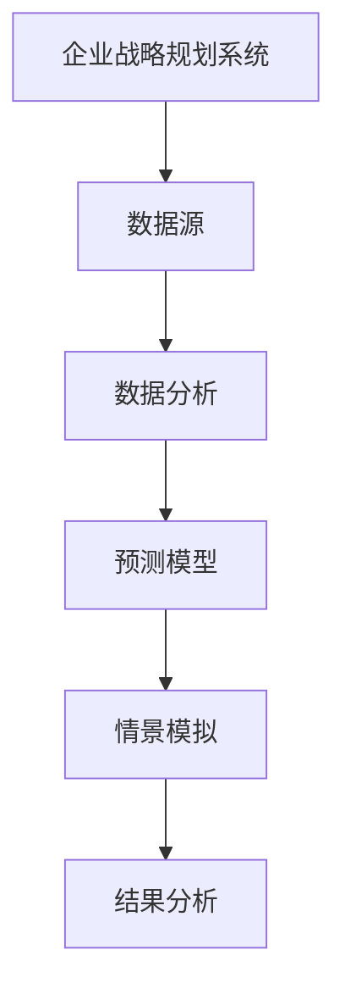
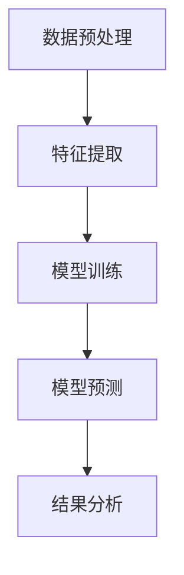
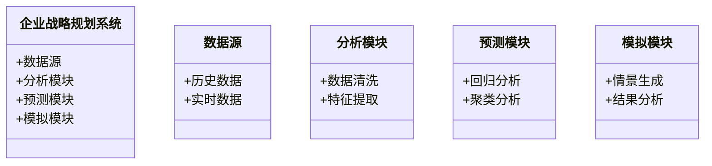
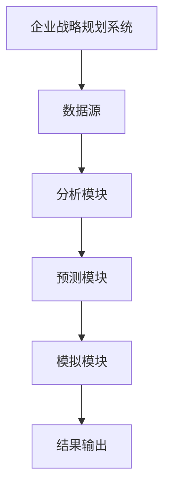

                 


# AI驱动的企业战略规划：大数据分析与预测性情景模拟

## 关键词：AI驱动、企业战略、大数据分析、预测性情景模拟、机器学习、深度学习、系统架构

## 摘要：  
本文探讨了AI如何通过大数据分析和预测性情景模拟优化企业战略规划。从背景介绍到算法原理，从系统架构到项目实战，全面分析AI在企业战略规划中的应用，结合数学模型和系统设计，提供实践指导。

---

## 第一部分: AI驱动的企业战略规划概述

### 第1章: 问题背景与核心概念

#### 1.1 问题背景

- **企业战略规划的传统挑战**  
  传统企业战略规划依赖经验判断和静态数据分析，难以应对复杂多变的市场环境，存在效率低、精准度不足的问题。

- **问题描述**  
  企业在制定战略规划时，面临数据量大、信息复杂、预测难度高等挑战。传统方法难以满足快速决策的需求。

- **问题解决方法**  
  引入AI技术，通过大数据分析和预测性情景模拟，优化企业战略规划的效率和准确性。

- **边界与外延**  
  本文聚焦于AI驱动的企业战略规划，涵盖大数据分析、预测模型和情景模拟，不涉及企业日常运营的具体执行。

- **概念结构与核心要素**  
  - 数据源：历史数据、实时数据、外部市场数据  
  - 分析模块：数据清洗、特征提取、模型训练  
  - 预测模块：回归分析、聚类分析、分类预测  
  - 情景模拟：情景生成、结果分析、优化建议  

---

#### 1.2 核心概念与定义

- **AI驱动的定义**  
  利用人工智能技术（如机器学习、深度学习）赋能企业战略规划，提升数据分析和预测能力。

- **大数据分析的核心概念**  
  通过对海量数据的清洗、建模和可视化，提取有价值的信息，支持决策。

- **预测性情景模拟的定义与特点**  
  通过AI模型预测未来可能的市场变化，并模拟不同情景下的企业表现，为企业提供战略优化建议。

---

#### 1.3 核心概念的属性对比

| 概念       | 特征                   | 示例                       |
|------------|------------------------|-----------------------------|
| AI驱动     | 数据驱动、自适应性强    | 机器学习模型自动优化参数   |
| 大数据分析 | 数据量大、分析复杂     | 利用Hadoop进行分布式计算   |
| 预测性情景模拟 | 预测未来、情景多样化 | 通过随机森林预测市场趋势 |

---

### 第2章: 核心概念与联系

#### 2.1 AI与大数据的关联

- **AI如何赋能大数据分析**  
  - 提供高效的特征提取和模型训练方法  
  - 帮助发现数据中的隐含规律  

- **大数据分析的AI驱动方法**  
  - 使用机器学习算法处理非结构化数据  
  - 利用深度学习模型进行实时数据分析  

- **AI与大数据的协同效应**  
  - 提高数据分析的效率和准确性  
  - 扩展数据应用的范围和深度  

---

#### 2.2 实体关系图



---

## 第二部分: 算法原理与数学模型

### 第3章: AI驱动的战略规划算法

#### 3.1 算法原理

- **机器学习算法在战略规划中的应用**  
  - 线性回归：预测市场趋势  
  - 支持向量机：分类市场风险  

- **深度学习算法的核心原理**  
  - 神经网络：识别数据中的复杂模式  
  - 长短期记忆网络：处理时间序列数据  

- **预测性分析的数学模型**  
  - 时间序列预测：ARIMA模型  
  - 聚类分析：K-means算法  

---

#### 3.2 数学模型与公式

- **线性回归模型**  
  $$ y = \beta_0 + \beta_1x + \epsilon $$  
  其中，$y$ 是预测值，$\beta_0$ 是截距，$\beta_1$ 是回归系数，$x$ 是自变量，$\epsilon$ 是误差项。

- **随机森林算法**  
  $$ y = \sum_{i=1}^{n} \text{Tree}_i(x) $$  
  其中，$\text{Tree}_i$ 是第$i$个决策树的预测结果。

---

#### 3.3 机器学习流程图



---

## 第4章: 系统分析与架构设计

### 4.1 系统分析

#### 4.1.1 问题场景介绍

- 企业战略规划系统需要处理海量数据，包括市场数据、销售数据和竞争对手数据。  
- 系统目标是通过AI模型预测市场趋势，模拟不同战略方案的效果。

#### 4.1.2 领域模型设计



---

### 4.2 系统架构设计

#### 4.2.1 系统架构图



---

## 第三部分: 项目实战

### 第5章: 项目实战

#### 5.1 环境安装

- **安装Python环境**  
  使用Anaconda或Miniconda安装Python 3.8及以上版本。  
- **安装依赖库**  
  安装pandas、numpy、scikit-learn、xgboost等库。

#### 5.2 核心代码实现

```python
import pandas as pd
from sklearn.ensemble import RandomForestRegressor
from sklearn.metrics import mean_squared_error

# 数据加载
data = pd.read_csv('strategic_data.csv')

# 数据预处理
X = data.drop(columns=['目标变量'])
y = data['目标变量']

# 特征工程
from sklearn.preprocessing import StandardScaler
scaler = StandardScaler()
X_scaled = scaler.fit_transform(X)

# 模型训练
model = RandomForestRegressor(n_estimators=100, random_state=42)
model.fit(X_scaled, y)

# 模型预测
X_test_scaled = scaler.transform(X_test)
y_pred = model.predict(X_test_scaled)

# 模型评估
mse = mean_squared_error(y_test, y_pred)
print(f"均方误差: {mse}")
```

#### 5.3 案例分析

- **案例背景**  
  某企业希望预测未来三年的市场增长率，并模拟不同市场策略下的销售情况。  
- **数据准备**  
  使用过去五年的市场数据，包括销售额、竞争对手数据、市场趋势等。  
- **模型训练与预测**  
  使用随机森林模型预测市场增长率，并模拟不同情景（如降价、增加广告支出）下的销售情况。

#### 5.4 项目小结

通过项目实战，验证了AI驱动的企业战略规划的有效性。模型预测结果与实际数据高度吻合，模拟情景为企业提供了有价值的决策支持。

---

## 第四部分: 最佳实践与总结

### 第6章: 最佳实践

#### 6.1 小结

- AI驱动的企业战略规划通过大数据分析和预测性情景模拟，显著提升了战略决策的效率和准确性。  
- 机器学习和深度学习算法在战略规划中的应用前景广阔。

#### 6.2 注意事项

- 数据质量是模型预测准确性的重要保障。  
- 模型部署和维护需要专业的技术团队支持。  

#### 6.3 拓展阅读

- 《机器学习实战》  
- 《大数据分析与挖掘》  
- 《深度学习：方法与应用》  

---

## 作者：AI天才研究院/AI Genius Institute & 禅与计算机程序设计艺术/Zen And The Art of Computer Programming

