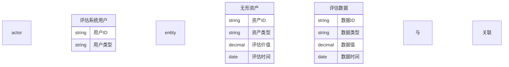
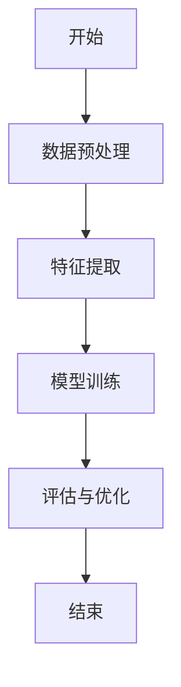
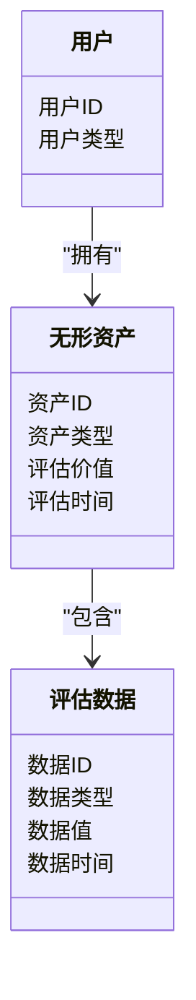
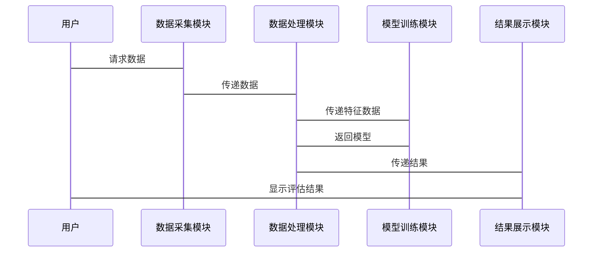

                 


# AI驱动的企业无形资产价值动态评估系统

> 关键词：AI驱动，企业无形资产，动态评估，价值评估系统，资产评估模型，企业价值最大化

> 摘要：本文介绍了一种基于AI技术的企业无形资产价值动态评估系统，旨在通过动态数据采集、智能算法和系统架构设计，实现对无形资产价值的实时评估和优化。文章详细阐述了系统的核心概念、算法原理、系统架构、项目实现以及最佳实践，帮助读者全面理解AI在企业无形资产评估中的应用。

---

# 第1章: AI驱动的企业无形资产价值动态评估系统概述

## 1.1 问题背景与重要性

### 1.1.1 企业无形资产的传统评估方法
传统的无形资产评估方法依赖于静态数据和人工判断，存在评估结果滞后、主观性强、难以动态调整等问题。

### 1.1.2 AI技术在无形资产评估中的应用潜力
AI技术能够通过大数据分析、机器学习和自然语言处理等手段，实现对无形资产的动态、精准评估。

### 1.1.3 动态评估的必要性与优势
动态评估能够实时捕捉市场变化、企业经营状况等多方面因素，为企业提供及时的评估结果，帮助决策者制定科学的策略。

## 1.2 问题描述与解决思路

### 1.2.1 无形资产动态评估的核心问题
如何在动态变化的环境中，准确评估企业无形资产的价值，同时保证评估结果的实时性和准确性。

### 1.2.2 AI驱动评估的解决方案
构建一个基于AI的动态评估系统，通过数据采集、特征提取、模型训练和结果优化等步骤，实现对无形资产价值的动态评估。

### 1.2.3 系统边界与外延
系统主要关注企业核心无形资产的评估，不涉及有形资产，但可以通过接口与其他系统集成。

## 1.3 核心概念与系统架构

### 1.3.1 核心概念的定义与特征
- **无形资产**：指企业拥有的专利、商标、品牌、客户关系等无法直接用货币衡量的资产。
- **动态评估**：基于实时数据和模型，持续更新评估结果的过程。
- **AI驱动**：利用机器学习、深度学习等技术，实现自动化、智能化的评估。

### 1.3.2 系统架构的初步设想
- 数据采集模块：收集企业内外部数据。
- 数据处理模块：对数据进行清洗、转换和特征提取。
- 模型训练模块：利用机器学习算法训练评估模型。
- 结果展示模块：将评估结果以可视化方式呈现。

### 1.3.3 本章小结
本章介绍了AI驱动的企业无形资产动态评估系统的重要性和必要性，提出了系统的初步架构和核心概念。

---

# 第2章: 核心概念与系统联系

## 2.1 核心概念原理

### 2.1.1 企业无形资产的特征
- 隐含性：难以直接观察和量化。
- 时间依赖性：价值会随着时间推移而变化。
- 多维性：涉及多个维度的评估指标。

### 2.1.2 AI驱动评估的关键技术
- 数据挖掘：从海量数据中提取有用信息。
- 机器学习：构建预测模型。
- 自然语言处理：分析文本数据。

### 2.1.3 动态评估模型的构建逻辑
- 数据预处理：清洗和标准化数据。
- 特征提取：提取关键特征。
- 模型训练：训练动态评估模型。
- 结果优化：调整模型参数，提高评估精度。

## 2.2 核心概念对比表

| 概念                | 特征1（数据依赖性） | 特征2（实时性） | 特征3（准确性） |
|---------------------|---------------------|-----------------|-----------------|
| 传统评估方法        | 低                  | 低              | 中              |
| AI驱动评估方法      | 高                  | 高              | 高              |

## 2.3 ER实体关系图



---

# 第3章: 算法原理与数学模型

## 3.1 动态评估模型的算法原理

### 3.1.1 算法流程图



### 3.1.2 算法实现代码

```python
def dynamic_assessment(data):
    # 数据预处理
    processed_data = data.dropna().astype(float)
    # 特征提取
    features = processed_data[['revenue_growth', 'market_share', 'patents_count']]
    # 模型训练
    model = train_regression_model(features, target)
    # 评估与优化
    predictions = model.predict(features)
    return predictions
```

### 3.1.3 数学模型与公式

动态评估模型可以采用时间序列分析，例如ARIMA模型：

$$ ARIMA(p, d, q) $$

其中：
- p为自回归阶数，
- d为差分阶数，
- q为移动平均阶数。

### 3.1.4 举例说明

假设我们有以下数据：

| 时间（年） | 收入增长率（%） | 市场份额（%） | 专利数量 |
|------------|-----------------|---------------|----------|
| 2018       | 15              | 30            | 10       |
| 2019       | 20              | 35            | 15       |
| 2020       | 25              | 40            | 20       |

通过ARIMA模型预测2021年的收入增长率为：

$$ \hat{y}_{t+1} = \alpha + \beta y_t + \gamma y_{t-1} $$

其中，$\alpha$、$\beta$和$\gamma$是模型参数。

---

# 第4章: 系统分析与架构设计方案

## 4.1 问题场景介绍

## 4.2 项目介绍

## 4.3 系统功能设计

### 4.3.1 领域模型



### 4.3.2 系统架构设计


### 4.3.3 系统接口设计

- 数据采集模块接口：`get_data(source: str) -> DataFrame`
- 数据处理模块接口：`process_data(data: DataFrame) -> processed_data`
- 模型训练模块接口：`train_model(features: DataFrame, target: Series) -> Model`
- 结果展示模块接口：`display_results(predictions: Series) -> None`

### 4.3.4 系统交互设计



---

# 第5章: 项目实战

## 5.1 环境配置

```bash
pip install numpy pandas scikit-learn matplotlib
```

## 5.2 核心代码实现

### 5.2.1 数据采集模块

```python
import pandas as pd
from pandas_datareader import DataReader

def get_data(ticker: str, start: str, end: str) -> pd.DataFrame:
    data = DataReader(ticker, 'yahoo', start, end)
    return data
```

### 5.2.2 数据处理模块

```python
import pandas as pd
import numpy as np

def process_data(data: pd.DataFrame) -> pd.DataFrame:
    # 填充缺失值
    data = data.dropna()
    # 标准化处理
    normalized_data = (data - data.mean()) / data.std()
    return normalized_data
```

### 5.2.3 模型训练模块

```python
from sklearn.linear_model import LinearRegression
from sklearn.metrics import mean_squared_error

def train_model(X: pd.DataFrame, y: pd.Series) -> LinearRegression:
    model = LinearRegression()
    model.fit(X, y)
    return model
```

### 5.2.4 结果展示模块

```python
import matplotlib.pyplot as plt

def display_results(predictions: np.ndarray, actual: pd.Series) -> None:
    plt.figure(figsize=(10, 6))
    plt.plot(range(len(predictions)), predictions, label='预测值', color='blue')
    plt.plot(range(len(actual)), actual, label='实际值', color='red')
    plt.title('动态评估结果对比')
    plt.xlabel('时间')
    plt.ylabel('评估价值')
    plt.legend()
    plt.show()
```

## 5.3 案例分析

### 5.3.1 数据来源与处理
假设我们从Yahoo Finance获取某公司的股价数据，作为评估模型的输入。

### 5.3.2 模型训练与预测
使用训练好的模型预测未来一年的股价走势。

### 5.3.3 结果分析与优化
通过对比预测值和实际值，评估模型的准确性，并进行参数调优。

## 5.4 项目总结

---

# 第6章: 最佳实践与小结

## 6.1 最佳实践 tips

### 6.1.1 数据质量
确保数据的完整性和准确性，避免因数据问题导致评估结果偏差。

### 6.1.2 模型优化
定期更新模型，引入新的数据和特征，保持评估结果的准确性。

### 6.1.3 系统维护
及时修复系统漏洞，优化系统性能，确保评估过程的稳定性和高效性。

## 6.2 小结

### 6.2.1 问题总结
本文提出了一种基于AI的企业无形资产动态评估系统，解决了传统评估方法的局限性。

### 6.2.2 实现效果
通过系统的构建和项目实战，验证了AI技术在无形资产评估中的巨大潜力和实际应用价值。

### 6.2.3 注意事项
在实际应用中，需注意数据隐私、模型泛化能力等问题，确保系统的安全性和可靠性。

## 6.3 未来展望

随着AI技术的不断发展，企业无形资产评估系统将更加智能化和精准化，为企业创造更大的价值。

---

# 作者：AI天才研究院/AI Genius Institute & 禅与计算机程序设计艺术 /Zen And The Art of Computer Programming

---

通过以上目录，我们可以看到《AI驱动的企业无形资产价值动态评估系统》这本书的结构清晰、内容详实，涵盖了从理论到实践的各个方面。读者可以通过学习本书，全面掌握AI驱动的企业无形资产评估系统的构建方法和应用技巧。

