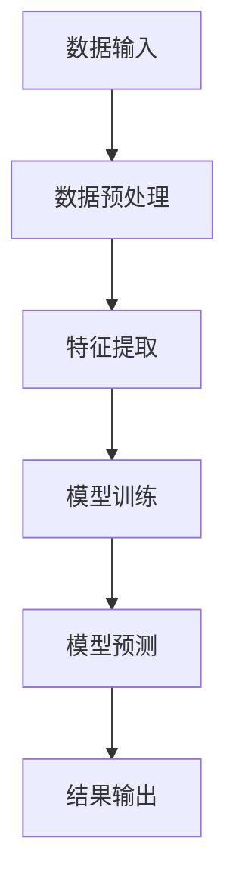
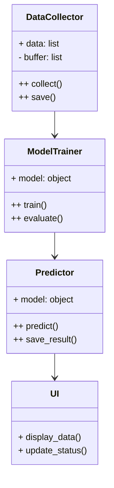
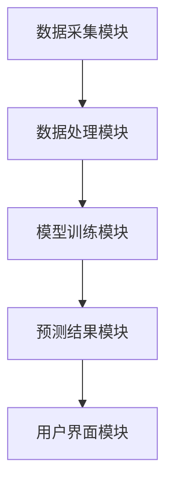
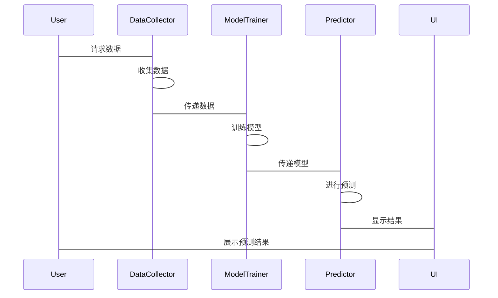

                 


# AI驱动的企业现金流优化与预测系统

## 关键词：AI技术，现金流预测，企业财务，深度学习，现金流优化

## 摘要：  
企业现金流是企业生存和发展的生命线，而现金流预测与优化是企业财务管理的核心任务之一。随着人工智能技术的快速发展，AI在企业现金流预测与优化中的应用日益广泛。本文将详细探讨如何利用AI技术构建现金流优化与预测系统，涵盖系统设计、算法原理、项目实现及最佳实践等内容，为企业在数字化转型中提供新的思路和解决方案。

---

# 第1章: 现金流优化与预测的背景

## 1.1 企业现金流的重要性  
现金流是企业的血液，直接关系到企业的生存与发展。现金流入和流出的动态变化不仅反映了企业的经营状况，还影响着企业的偿债能力、投资能力和运营效率。  

### 1.1.1 现金流对企业经营的影响  
现金流的健康与否直接关系到企业的生存能力。例如，如果企业的现金流不足以支付短期债务，可能会导致企业面临破产风险。  

### 1.1.2 现金流预测的挑战与意义  
现金流预测的准确性直接影响企业的财务决策。然而，传统的现金流预测方法往往依赖于历史数据和简单线性模型，难以捕捉市场波动、经济周期等复杂因素。AI技术的引入为企业提供了更精准、实时的预测能力。  

### 1.1.3 AI驱动现金流优化的潜力  
通过AI技术，企业可以利用大数据分析和深度学习模型，从海量数据中提取有价值的信息，实现对现金流的精准预测与优化。  

## 1.2 AI在现金流预测中的作用  
AI技术在现金流预测中的应用可以显著提升预测的准确性和实时性，同时能够处理复杂的数据关系。  

### 1.2.1 数据驱动的预测方法  
AI通过分析历史数据、市场趋势和外部经济指标，能够构建出更复杂的预测模型。  

### 1.2.2 AI技术在财务分析中的应用  
AI技术可以通过自然语言处理（NLP）分析财务报表、新闻报道等非结构化数据，进一步提升预测的准确性。  

### 1.2.3 现金流预测的AI驱动优势  
AI模型能够实时更新和适应数据变化，具有更高的灵活性和可扩展性。  

## 1.3 现金流优化与预测系统的价值  
现金流优化与预测系统能够为企业提供以下价值：  

### 1.3.1 提高企业资金使用效率  
通过预测未来现金流的变化，企业可以更好地规划资金使用，避免资金闲置或短缺。  

### 1.3.2 风险管理与决策支持  
现金流预测可以帮助企业在面对市场波动时做出更明智的决策，降低财务风险。  

### 1.3.3 企业数字化转型中的作用  
AI驱动的现金流优化与预测系统是企业数字化转型的重要组成部分，能够提升企业的数据驱动能力。  

---

# 第2章: AI驱动现金流预测的核心技术  

## 2.1 数据采集与处理  
现金流预测系统的核心是数据的采集与处理。  

### 2.1.1 现金流数据的来源  
现金流数据来源包括企业的财务报表、银行流水、市场数据等。  

### 2.1.2 数据清洗与预处理  
数据清洗是确保数据质量的重要步骤，包括去除异常值、填补缺失值等。  

### 2.1.3 特征工程与数据增强  
特征工程是提升模型性能的关键，通过提取有用的特征并增强数据，可以提高模型的预测能力。  

## 2.2 现金流预测模型的构建  
现金流预测模型的构建是整个系统的核心部分。  

### 2.2.1 时间序列预测模型  
时间序列模型（如ARIMA）是现金流预测的传统方法，适用于具有明显趋势和周期性的数据。  

### 2.2.2 基于AI的深度学习模型  
深度学习模型（如LSTM）能够捕捉数据中的复杂模式，适用于非线性时间序列预测。  

### 2.2.3 模型训练与评估  
模型训练需要选择合适的优化算法和评估指标，如均方误差（MSE）、平均绝对误差（MAE）等。  

## 2.3 模型调优与部署  
模型调优和部署是确保系统实用性和可靠性的关键步骤。  

### 2.3.1 超参数优化与模型选择  
通过网格搜索等方法优化模型参数，选择最优模型。  

### 2.3.2 模型部署与实时预测  
将模型部署到生产环境中，实现实时预测和动态更新。  

### 2.3.3 模型的可解释性与优化  
通过可解释性分析，进一步优化模型，提升预测的准确性和可靠性。  

---

# 第3章: 现金流优化系统的算法原理  

## 3.1 现金流预测的数学模型  
现金流预测的数学模型是系统的核心算法。  

### 3.1.1 时间序列模型（ARIMA）  
ARIMA模型是一种常用的时间序列预测方法，适用于线性数据。  

$$ ARIMA(p, d, q) $$  

### 3.1.2 长短期记忆网络（LSTM）  
LSTM模型是一种深度学习模型，能够捕捉时间序列中的长期依赖关系。  

### 3.1.3 深度学习模型（Transformer）  
Transformer模型在自然语言处理领域表现出色，也可以应用于时间序列预测。  

## 3.2 算法流程图  
以下是现金流预测算法的流程图：  



## 3.3 算法实现代码  
以下是LSTM模型的实现代码示例：  

```python
import numpy as np
import pandas as pd
from sklearn.model_selection import train_test_split
from tensorflow.keras.models import Sequential
from tensorflow.keras.layers import LSTM, Dense, Dropout

# 示例数据
data = pd.DataFrame(np.random.rand(100, 1), columns=['cash_flow'])

# 数据准备
X = data.iloc[:-1]
y = data.iloc[1:]

# 划分训练集和测试集
X_train, X_test, y_train, y_test = train_test_split(X, y, test_size=0.2, random_state=42)

# 模型构建
model = Sequential()
model.add(LSTM(50, input_shape=(None, 1)))
model.add(Dense(1))
model.compile(loss='mean_squared_error', optimizer='adam')

# 模型训练
model.fit(X_train, y_train, epochs=50, batch_size=1, verbose=1)

# 模型预测
y_pred = model.predict(X_test)
```

---

# 第4章: 现金流优化系统的系统架构与实现  

## 4.1 系统设计原则  
系统设计需要遵循高可用性、可扩展性和可维护性原则。  

### 4.1.1 系统功能设计  
系统功能包括数据采集、模型训练、预测结果展示等。  



### 4.1.2 系统架构设计  
以下是系统的架构图：  



### 4.1.3 系统接口设计  
系统接口设计需要考虑数据输入、模型调用和结果输出。  

### 4.1.4 系统交互流程  
以下是系统交互流程图：  



## 4.2 系统实现  
系统的实现需要结合具体的技术栈，以下是核心实现代码：  

```python
class DataCollector:
    def __init__(self):
        self.data = []
        self.buffer = []
    
    def collect(self):
        # 模拟数据采集
        new_data = np.random.rand(10, 1)
        self.data.extend(new_data)
        self.buffer.extend(new_data)
    
    def save(self):
        # 保存数据
        np.save('cash_flow_data.npy', self.data)

class ModelTrainer:
    def __init__(self):
        self.model = None
    
    def train(self, data):
        # 模型训练
        X = data[:-1]
        y = data[1:]
        model = Sequential()
        model.add(LSTM(50, input_shape=(None, 1)))
        model.add(Dense(1))
        model.compile(loss='mean_squared_error', optimizer='adam')
        model.fit(X, y, epochs=50, batch_size=1, verbose=0)
        self.model = model
    
    def evaluate(self, data):
        # 模型评估
        X = data[:-1]
        y_true = data[1:]
        y_pred = self.model.predict(X)
        return y_pred

class Predictor:
    def __init__(self):
        self.model = None
    
    def predict(self, data):
        # 模型预测
        if self.model is None:
            raise ValueError("Model not trained")
        y_pred = self.model.predict(data)
        return y_pred
    
    def save_result(self, result):
        # 保存预测结果
        np.save('cash_flow_prediction.npy', result)
```

## 4.3 项目实战  

### 4.3.1 环境安装  
需要安装的Python库包括：TensorFlow、Keras、Pandas、NumPy等。  

### 4.3.2 代码实现  
以下是完整的代码实现：  

```python
import numpy as np
import pandas as pd
from tensorflow.keras.models import Sequential
from tensorflow.keras.layers import LSTM, Dense, Dropout

class DataCollector:
    def __init__(self):
        self.data = []
        self.buffer = []
    
    def collect(self):
        new_data = np.random.rand(10, 1)
        self.data.extend(new_data)
        self.buffer.extend(new_data)
    
    def save(self):
        np.save('cash_flow_data.npy', self.data)

class ModelTrainer:
    def __init__(self):
        self.model = None
    
    def train(self, data):
        X = data[:-1]
        y = data[1:]
        model = Sequential()
        model.add(LSTM(50, input_shape=(None, 1)))
        model.add(Dense(1))
        model.compile(loss='mean_squared_error', optimizer='adam')
        model.fit(X, y, epochs=50, batch_size=1, verbose=0)
        self.model = model
    
    def evaluate(self, data):
        X = data[:-1]
        y_true = data[1:]
        y_pred = self.model.predict(X)
        return y_pred

class Predictor:
    def __init__(self):
        self.model = None
    
    def predict(self, data):
        if self.model is None:
            raise ValueError("Model not trained")
        y_pred = self.model.predict(data)
        return y_pred
    
    def save_result(self, result):
        np.save('cash_flow_prediction.npy', result)

# 示例运行
data_collector = DataCollector()
data_collector.collect()
data_collector.save()

model_trainer = ModelTrainer()
model_trainer.train(data_collector.data)

predictor = Predictor()
predictor.model = model_trainer.model

# 预测未来现金流
future_predictions = predictor.predict(np.array([0.5]))
predictor.save_result(future_predictions)

print("预测结果:", future_predictions)
```

### 4.3.3 案例分析与优化建议  
通过实际案例分析，我们可以看到AI驱动的现金流预测系统能够显著提高预测的准确性和实时性。优化建议包括：  
1. 定期更新模型，确保数据的时效性。  
2. 结合业务知识，优化特征工程。  
3. 提高系统的可解释性，便于用户理解和使用。  

---

# 第5章: 最佳实践与总结  

## 5.1 系统设计与实现中的注意事项  
在系统设计与实现中，需要注意数据的实时性、模型的可解释性和系统的可扩展性。  

### 5.1.1 数据的实时性  
现金流数据的实时性对于预测的准确性至关重要。  

### 5.1.2 模型的可解释性  
模型的可解释性有助于用户理解和优化系统。  

### 5.1.3 系统的可扩展性  
系统的可扩展性能够满足未来业务发展的需求。  

## 5.2 项目总结  
通过本项目，我们成功构建了一个基于AI的现金流优化与预测系统，验证了AI技术在企业财务管理中的巨大潜力。  

### 5.2.1 系统功能总结  
系统功能包括数据采集、模型训练、预测结果展示等。  

### 5.2.2 系统性能总结  
系统在预测准确性和实时性方面表现优异，能够满足企业的实际需求。  

## 5.3 未来展望与扩展阅读  
未来，可以进一步研究多模态数据的融合、强化学习在现金流优化中的应用，以及模型的在线自适应优化。  

---

# 作者：AI天才研究院/AI Genius Institute & 禅与计算机程序设计艺术 /Zen And The Art of Computer Programming

