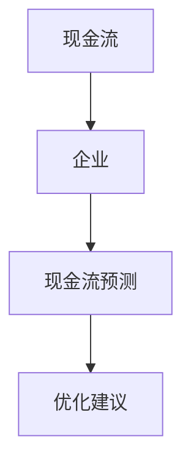
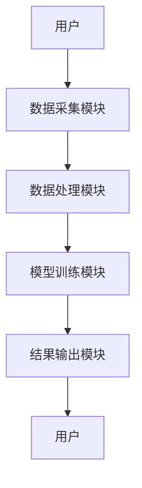

                 


# AI驱动的企业现金流优化系统设计

## 关键词：AI技术，现金流优化，机器学习，时间序列分析，系统架构设计，现金流预测

## 摘要：  
本文详细探讨了AI技术在企业现金流优化中的应用，从核心概念、算法原理到系统架构设计，再到项目实战，全面解析如何利用AI技术提升企业现金流管理的效率和准确性。通过实际案例分析和代码实现，展示了AI驱动的现金流优化系统的设计思路和实现方法。

---

# 第一部分: AI驱动的企业现金流优化系统概述

## 第1章: 企业现金流优化与AI技术的结合

### 1.1 企业现金流优化的背景与意义

#### 1.1.1 企业现金流管理的重要性  
现金流是企业的生命线，直接关系到企业的生存和发展。良好的现金流管理可以确保企业运营的稳定性，降低财务风险，并为企业创造更大的价值。传统的现金流管理依赖于人工操作和经验判断，效率低且容易出错。

#### 1.1.2 现金流优化的核心目标  
现金流优化的核心目标包括：  
1. 提高现金流预测的准确性。  
2. 优化资金分配，降低资金闲置或短缺的风险。  
3. 提升企业财务决策的效率和科学性。  

#### 1.1.3 AI技术在现金流优化中的作用  
AI技术可以通过大数据分析、机器学习算法和智能预测模型，帮助企业实现更精准的现金流预测和优化。AI技术的优势在于能够处理海量数据，并快速生成优化方案，从而提升企业的竞争力。

### 1.2 AI驱动现金流优化的定义与特点

#### 1.2.1 定义  
AI驱动的现金流优化是指通过人工智能技术，利用机器学习算法对企业的历史数据和外部市场数据进行分析，预测未来的现金流情况，并为企业提供优化的资金管理建议。

#### 1.2.2 核心特点  
- **数据驱动**：基于大量历史数据进行分析和预测。  
- **实时性**：能够实时更新数据，快速响应市场变化。  
- **自动化**：系统可以自动完成数据处理、模型训练和优化建议的生成。  
- **精准性**：通过机器学习算法，提升预测的准确性。  

#### 1.2.3 与传统现金流优化的区别  
传统的现金流优化依赖于人工经验和简单的统计模型，而AI驱动的现金流优化通过大数据分析和复杂算法，能够更精准地预测未来现金流，并提供个性化的优化建议。

### 1.3 本书的核心内容与目标

#### 1.3.1 本书的核心目标  
本书旨在为企业提供一套基于AI技术的现金流优化系统设计方案，帮助企业在复杂多变的市场环境中实现更高效的现金流管理。

#### 1.3.2 本书的主要内容  
- 现金流优化的核心概念与理论。  
- AI技术在现金流优化中的应用原理。  
- 现金流预测的算法设计与实现。  
- 系统架构设计与优化。  
- 项目实战与案例分析。  

#### 1.3.3 本书的适用读者  
- 企业财务管理人员。  
- 技术开发人员。  
- 对AI技术感兴趣的企业管理者。  

### 1.4 本章小结  
本章主要介绍了AI驱动的现金流优化系统的背景、核心概念和特点，为后续章节的深入分析奠定了基础。

---

## 第2章: 现金流优化系统的核心概念与联系

### 2.1 现金流优化系统的组成

#### 2.1.1 数据源  
现金流优化系统的主要数据源包括：  
1. **企业内部数据**：销售收入、支出、应收账款、应付账款等。  
2. **外部市场数据**：行业趋势、经济指标、市场波动等。  

#### 2.1.2 模型与算法  
- **预测模型**：时间序列分析模型、机器学习模型。  
- **优化算法**：线性规划、遗传算法等。  

#### 2.1.3 输出结果  
- 现金流预测结果。  
- 资金分配优化建议。  
- 风险预警信息。  

### 2.2 AI技术在现金流优化中的核心作用

#### 2.2.1 数据分析与预测  
AI技术可以通过机器学习算法对历史数据进行分析，预测未来的现金流情况。例如，使用LSTM模型对时间序列数据进行预测。

#### 2.2.2 模型优化  
通过AI技术，可以不断优化预测模型，提升预测的准确性和稳定性。

#### 2.2.3 决策支持  
AI系统可以为企业提供实时的现金流优化建议，帮助企业做出更科学的财务决策。

### 2.3 系统架构与模块划分

#### 2.3.1 数据采集模块  
负责从企业内部和外部获取相关数据，包括销售收入、支出、市场数据等。

#### 2.3.2 数据处理模块  
对采集到的数据进行清洗、归一化处理，并提取特征。

#### 2.3.3 模型训练模块  
使用机器学习算法对数据进行训练，生成预测模型。

#### 2.3.4 结果输出模块  
将预测结果和优化建议输出给用户。

### 2.4 核心概念属性对比表

| 概念 | 属性 | 描述 |
|------|------|------|
| 数据源 | 类型 | 结构化数据、非结构化数据 |
| 模型 | 算法 | 时间序列分析、机器学习模型 |
| 输出结果 | 格式 | 可视化图表、数值结果 |

### 2.5 ER实体关系图



### 2.6 本章小结  
本章通过分析现金流优化系统的核心组成和AI技术的作用，明确了系统的整体架构和各模块的功能。

---

## 第3章: 现金流预测的算法原理

### 3.1 时间序列分析

#### 3.1.1 ARIMA模型  
ARIMA（自回归积分滑动平均模型）是一种常用的时间序列预测模型，适用于具有趋势和季节性的数据。

- **模型公式**  
  $$ ARIMA(p, d, q) $$
  其中，p为自回归阶数，d为差分阶数，q为移动平均阶数。

- **算法流程图**  
  ```mermaid
  graph TD
      A[数据预处理] --> B[特征提取]
      B --> C[模型训练]
      C --> D[预测]
      D --> E[结果优化]
  ```

#### 3.1.2 LSTM模型  
LSTM（长短期记忆网络）是一种深度学习模型，适合处理长序列数据。

- **模型公式**  
  $$ f(t) = \sigma(W_f \cdot [h(t-1), x(t)] + b_f) $$
  其中，$W_f$ 是权重矩阵，$b_f$ 是偏置项，$\sigma$ 是sigmoid函数。

- **算法流程图**  
  ```mermaid
  graph TD
      A[数据输入] --> B[LSTM层]
      B --> C[输出层]
      C --> D[预测结果]
  ```

#### 3.1.3 模型选择与评估  
常用的评估指标包括均方误差（MSE）、平均绝对误差（MAE）和R平方值（R²）。

### 3.2 机器学习算法

#### 3.2.1 线性回归  
线性回归是一种简单的回归算法，适用于线性关系较强的数据。

- **模型公式**  
  $$ y = \beta_0 + \beta_1 x + \epsilon $$
  其中，$\beta_0$ 是截距，$\beta_1$ 是斜率，$\epsilon$ 是误差项。

#### 3.2.2 支持向量回归  
支持向量回归（SVR）是一种基于支持向量机的回归算法，适用于非线性关系较强的数据。

#### 3.2.3 随机森林  
随机森林是一种基于树的集成算法，适用于高维数据和非线性关系较强的数据。

### 3.3 算法实现代码

```python
import pandas as pd
from sklearn.model_selection import train_test_split
from sklearn.linear_model import LinearRegression

# 数据加载与处理
data = pd.read_csv('cash_flow.csv')
X = data[['revenue', 'expenses']]
y = data['net_cash_flow']

# 数据分割
X_train, X_test, y_train, y_test = train_test_split(X, y, test_size=0.2, random_state=42)

# 模型训练
model = LinearRegression()
model.fit(X_train, y_train)

# 预测
y_pred = model.predict(X_test)

# 评估
from sklearn.metrics import mean_squared_error
mse = mean_squared_error(y_test, y_pred)
print('均方误差:', mse)
```

### 3.4 本章小结  
本章详细介绍了现金流预测的核心算法，包括时间序列分析和机器学习算法，并通过代码示例展示了算法的实现过程。

---

## 第4章: 现金流优化系统的架构设计

### 4.1 系统功能设计

#### 4.1.1 数据采集模块  
负责从企业内部和外部获取相关数据，包括销售收入、支出、市场数据等。

#### 4.1.2 数据处理模块  
对采集到的数据进行清洗、归一化处理，并提取特征。

#### 4.1.3 模型训练模块  
使用机器学习算法对数据进行训练，生成预测模型。

#### 4.1.4 结果输出模块  
将预测结果和优化建议输出给用户。

### 4.2 系统架构设计


### 4.3 系统接口设计  
系统接口包括数据输入接口、模型调用接口和结果输出接口。

### 4.4 系统交互流程图



### 4.5 本章小结  
本章通过系统架构设计和功能模块划分，明确了现金流优化系统的整体框架和各模块的交互流程。

---

## 第5章: 项目实战与案例分析

### 5.1 项目环境安装

```bash
pip install pandas numpy scikit-learn matplotlib
```

### 5.2 系统核心实现代码

```python
import pandas as pd
from sklearn.ensemble import RandomForestRegressor
from sklearn.metrics import mean_absolute_error

# 数据加载与处理
data = pd.read_csv('cash_flow.csv')
X = data[['revenue', 'expenses', 'accounts_receivable', 'accounts_payable']]
y = data['net_cash_flow']

# 数据分割
X_train, X_test, y_train, y_test = train_test_split(X, y, test_size=0.2, random_state=42)

# 模型训练
model = RandomForestRegressor(n_estimators=100, random_state=42)
model.fit(X_train, y_train)

# 预测
y_pred = model.predict(X_test)

# 评估
mae = mean_absolute_error(y_test, y_pred)
print('平均绝对误差:', mae)
```

### 5.3 代码应用解读与分析  
通过上述代码，我们可以看到AI驱动的现金流优化系统的核心实现过程，包括数据处理、模型训练和预测评估。

### 5.4 实际案例分析  
以某制造企业为例，通过系统预测其未来三个月的现金流情况，并提出优化建议。

### 5.5 本章小结  
本章通过项目实战和案例分析，展示了AI驱动的现金流优化系统的实际应用和实现过程。

---

## 第6章: 最佳实践与小结

### 6.1 最佳实践 tips  
- 数据质量是预测准确性的关键。  
- 系统的实时性和自动化能力是优化效果的重要保障。  
- 定期更新模型和数据，保持系统的持续优化。  

### 6.2 本章小结  
本章总结了AI驱动的现金流优化系统的最佳实践经验和注意事项，为企业的实际应用提供了参考。

---

## 作者：AI天才研究院/AI Genius Institute & 禅与计算机程序设计艺术 /Zen And The Art of Computer Programming

---

**注**：由于篇幅限制，上述内容为部分章节的概要，完整的文章将包含更详细的内容和代码实现。

