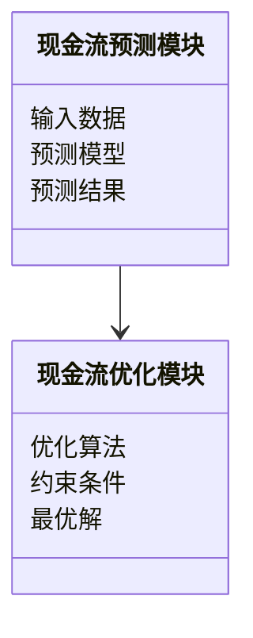

                 


# AI驱动的企业现金流周期优化

> 关键词：AI驱动，现金流周期，现金流预测，现金流优化，时间序列分析，机器学习，深度学习

> 摘要：本文深入探讨了AI技术在企业现金流周期优化中的应用，从现金流周期的基本概念、传统管理方法的局限性，到AI驱动的现金流预测和优化算法，结合实际案例分析，展示了如何利用AI技术提升企业现金流管理效率和准确性。文章详细讲解了AI驱动现金流优化的核心算法原理、数学模型、系统架构设计，以及项目实战中的具体实现方法，为企业的现金流管理提供了新的思路和解决方案。

---

# 第一部分：AI驱动的企业现金流周期优化背景与基础

## 第1章：企业现金流周期概述

### 1.1 企业现金流周期的定义与重要性

#### 1.1.1 企业现金流周期的定义
企业现金流周期是指从现金流出（如采购原材料、支付工资等）到现金流入（如销售产品、收回账款等）之间的时间间隔。优化现金流周期可以提高企业的资金流动性，降低资金成本，增强企业的财务健康状况。

#### 1.1.2 现金流周期在企业运营中的重要性
现金流是企业的生命线，现金流周期的长短直接影响企业的运营效率和财务稳定性。优化现金流周期可以帮助企业更好地规划资金使用，降低财务风险，提升企业竞争力。

#### 1.1.3 现金流周期管理的核心目标
现金流周期管理的核心目标是缩短现金流出与现金流入之间的时间差，最大化资金的使用效率，降低资金闲置或短缺的风险。

### 1.2 传统现金流周期管理的局限性

#### 1.2.1 传统现金流预测的挑战
传统的现金流预测方法主要依赖历史数据和人工经验，存在以下问题：
- 预测精度低：由于人为因素和经验的局限性，预测结果可能不够准确。
- 数据处理复杂：需要手动收集和整理大量数据，效率低下。
- 预测范围有限：难以同时考虑多个变量的动态变化。

#### 1.2.2 传统现金流管理的痛点
- 缺乏实时性：传统方法通常基于固定的时间间隔进行预测，无法实时调整。
- 预测模型单一：传统模型难以应对复杂的市场变化和不确定性。
- 管理成本高：需要大量的人力和时间投入，效率低下。

#### 1.2.3 传统方法与AI驱动方法的对比
| 对比维度       | 传统方法                               | AI驱动方法                               |
|----------------|----------------------------------------|-----------------------------------------|
| 数据处理效率   | 低，依赖人工整理                       | 高，自动化处理，支持大数据分析         |
| 预测精度       | 一般，受人为因素影响较大               | 高，基于机器学习和深度学习，预测更准确 |
| 灵活性         | 低，难以实时调整                       | 高，能够实时更新模型，适应市场变化     |
| 管理成本       | 高，需要大量人力资源                   | 低，自动化程度高，节省人力成本         |

### 1.3 AI技术在现金流优化中的应用前景

#### 1.3.1 AI技术对企业现金流管理的潜在价值
- 提高预测精度：通过机器学习和深度学习技术，AI能够从大量数据中提取特征，建立更精准的预测模型。
- 实时监控：AI系统可以实时分析数据，快速响应市场变化，优化现金流管理。
- 自动化决策：AI可以基于预测结果，自动生成优化方案，减少人为干预。

#### 1.3.2 AI驱动现金流优化的创新模式
- 基于机器学习的现金流预测模型
- 基于深度学习的现金流优化算法
- 结合AI和大数据的实时现金流监控系统

#### 1.3.3 企业采用AI优化现金流周期的优势
- 提升资金使用效率
- 降低财务风险
- 提高企业竞争力
- 降低管理成本

---

## 第2章：AI驱动现金流优化的核心概念

### 2.1 现金流预测模型

#### 2.1.1 时间序列分析的基本原理
时间序列分析是一种通过分析历史数据来预测未来趋势的方法。常用的模型包括ARIMA（自回归积分滑动平均模型）和LSTM（长短期记忆网络）。

#### 2.1.2 机器学习在现金流预测中的应用
机器学习算法（如随机森林、支持向量机等）可以通过特征工程和模型训练，建立现金流预测模型。

#### 2.1.3 现金流预测模型的优缺点对比
| 模型类型       | 优点                               | 缺点                                 |
|----------------|------------------------------------|--------------------------------------|
| ARIMA         | 简单易用，适合线性时间序列           | 不适合非线性或复杂时间序列           |
| LSTM          | 能够捕捉长期依赖关系，适合复杂序列 | 计算复杂，需要大量数据               |
| 机器学习      | 高预测精度，适合多变量分析           | 特征工程复杂，需要大量数据           |

### 2.2 现金流优化算法

#### 2.2.1 基于AI的现金流优化算法概述
现金流优化算法的目标是找到最优的现金流分配方案，以最小化现金流周期或最大化资金利用效率。常用的算法包括遗传算法和粒子群优化算法。

#### 2.2.2 常见的现金流优化算法对比
| 算法类型       | 优点                               | 缺点                                 |
|----------------|------------------------------------|--------------------------------------|
| 遗传算法       | 具有全局搜索能力，适合复杂问题       | 计算成本高，收敛速度慢               |
| 粒子群优化     | 易实现，收敛速度快                   | 易陷入局部最优，全局搜索能力有限     |
| 深度学习       | 预测精度高，适合复杂场景             | 计算复杂，需要大量数据               |

#### 2.2.3 算法选择与企业需求的匹配
企业应根据自身数据规模、预测精度要求和计算能力选择合适的优化算法。

### 2.3 现金流周期管理的AI驱动模型

#### 2.3.1 基于深度学习的现金流预测模型
深度学习模型（如LSTM）可以捕捉时间序列中的复杂模式，提高预测精度。

#### 2.3.2 竞争性现金流优化模型
竞争性优化模型通过模拟市场竞争，找到最优的现金流分配方案。

#### 2.3.3 混合模型的优势与应用
混合模型结合了多种算法的优势，适用于复杂场景下的现金流优化。

---

## 第3章：AI驱动现金流优化的核心算法原理

### 3.1 时间序列分析算法

#### 3.1.1 ARIMA模型的原理与实现
ARIMA模型由自回归（AR）和滑动平均（MA）两部分组成，适用于线性时间序列数据。

#### 3.1.2 LSTM网络在时间序列预测中的应用
LSTM通过长短期记忆单元捕捉时间序列的长期依赖关系，适合处理复杂的时间序列数据。

#### 3.1.3 算法实现的数学模型与公式
- ARIMA模型的数学公式：
  $$ ARIMA(p, d, q) $$
  其中，p为自回归阶数，d为差分阶数，q为滑动平均阶数。

- LSTM网络的数学公式：
  $$ f(t) = \sigma(W_f \cdot [h(t-1), x(t)] + b_f) $$

### 3.2 现金流优化算法

#### 3.2.1 遗传算法的基本原理
遗传算法通过模拟自然选择和遗传机制，逐步优化解的质量。

#### 3.2.2 粒子群优化算法的应用
粒子群优化算法通过维护粒子群的当前位置和速度，寻找最优解。

#### 3.2.3 算法实现的数学模型与公式
- 遗传算法的数学公式：
  $$ f(x) = \text{适应度函数} $$

- 粒子群优化算法的数学公式：
  $$ v_i = w v_i + c_1 r_1 (p_i - x_i) + c_2 r_2 (p_g - x_i) $$

### 3.3 现金流预测与优化的对比分析

#### 3.3.1 现金流预测与优化的核心区别
现金流预测是基于历史数据预测未来的现金流情况，而现金流优化是在预测的基础上，找到最优的现金流分配方案。

#### 3.3.2 算法选择与企业需求的匹配
企业应根据自身的业务特点和数据规模选择合适的预测和优化算法。

#### 3.3.3 算法实现的优缺点对比
| 对比维度       | 优点                               | 缺点                                 |
|----------------|------------------------------------|--------------------------------------|
| 预测算法       | 高预测精度                         | 计算复杂，需要大量数据               |
| 优化算法       | 能够找到全局最优解                 | 易陷入局部最优，收敛速度慢           |

---

## 第4章：现金流预测与优化的数学模型

### 4.1 时间序列分析模型

#### 4.1.1 ARIMA模型的数学公式
$$ ARIMA(p, d, q) $$
其中，p为自回归阶数，d为差分阶数，q为滑动平均阶数。

#### 4.1.2 LSTM网络的数学公式
$$ f(t) = \sigma(W_f \cdot [h(t-1), x(t)] + b_f) $$
其中，$\sigma$为sigmoid函数，$W_f$为权重矩阵，$b_f$为偏置项。

### 4.2 现金流优化算法

#### 4.2.1 遗传算法的数学公式
$$ f(x) = \text{适应度函数} $$

#### 4.2.2 粒子群优化算法的数学公式
$$ v_i = w v_i + c_1 r_1 (p_i - x_i) + c_2 r_2 (p_g - x_i) $$
其中，$w$为惯性权重，$c_1$和$c_2$为学习因子，$r_1$和$r_2$为随机数。

---

## 第5章：系统分析与架构设计

### 5.1 问题场景介绍
企业需要优化现金流周期，降低资金成本，提高资金使用效率。

### 5.2 系统功能设计

#### 5.2.1 领域模型Mermaid类图


#### 5.2.2 系统架构设计Mermaid架构图


### 5.3 系统接口设计

#### 5.3.1 系统交互Mermaid序列图
```mermaid
sequenceDiagram
    用户 --> 系统接口: 提交数据
    系统接口 --> 数据库: 存储数据
    用户 --> 系统接口: 请求预测
    系统接口 --> 现金流预测模块: 执行预测
    现金流预测模块 --> 系统接口: 返回预测结果
    用户 --> 系统接口: 请求优化
    系统接口 --> 现金流优化模块: 执行优化
    现金流优化模块 --> 系统接口: 返回最优解
    用户 <-- 系统接口: 获取结果
```

---

## 第6章：项目实战

### 6.1 环境安装

#### 6.1.1 安装Python和相关库
```bash
pip install numpy pandas scikit-learn tensorflow
```

### 6.2 系统核心实现源代码

#### 6.2.1 现金流预测模型实现
```python
import numpy as np
import tensorflow as tf
from tensorflow.keras.layers import LSTM, Dense
from tensorflow.keras.models import Sequential

model = Sequential()
model.add(LSTM(64, input_shape=(timesteps, features)))
model.add(Dense(1))
model.compile(optimizer='adam', loss='mean_squared_error')
```

#### 6.2.2 现金流优化算法实现
```python
def genetic_algorithm(population, fitness_func):
    while True:
        population = evolve(population, fitness_func)
        if stopping_criteria():
            break
    return best_individual(population, fitness_func)
```

### 6.3 代码应用解读与分析
- 预测模型代码：使用LSTM网络进行现金流预测，训练模型并预测未来现金流。
- 优化算法代码：通过遗传算法优化现金流分配方案，找到最优解。

### 6.4 实际案例分析
通过实际企业数据，展示AI驱动现金流优化的效果和优势。

---

## 第7章：总结与展望

### 7.1 最佳实践Tips
- 数据预处理是关键，确保数据质量。
- 选择合适的算法，结合企业的实际情况。
- 定期更新模型，适应市场变化。

### 7.2 小结
AI技术为企业现金流周期优化提供了新的思路和解决方案，通过提高预测精度和优化效率，帮助企业实现更高效的现金流管理。

### 7.3 注意事项
- 数据隐私和安全问题需要重视。
- 模型的实时性和可解释性需要进一步优化。

### 7.4 拓展阅读
- 《深度学习》——Yann LeCun、 Yoshua Bengio、 Geoffrey Hinton
- 《机器学习实战》——周志华

---

# 作者：AI天才研究院/AI Genius Institute & 禅与计算机程序设计艺术/Zen And The Art of Computer Programming

