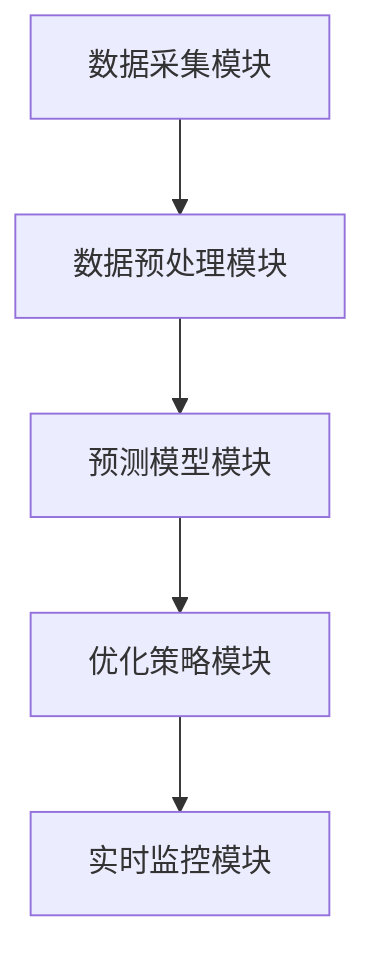
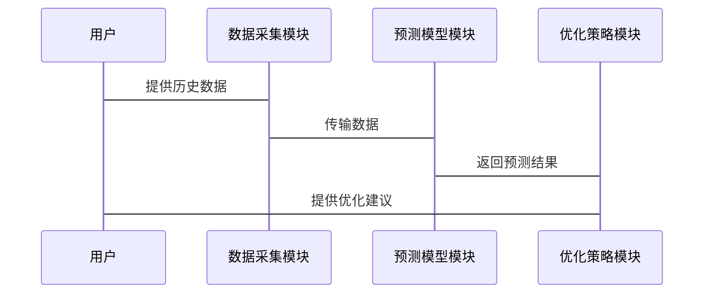

                 


# AI驱动的企业现金流周期优化系统

## 关键词：AI技术、现金流周期、机器学习、时间序列分析、系统架构设计、企业财务优化

## 摘要：  
随着企业面临的市场环境日益复杂，现金流管理成为企业财务健康的核心。AI技术的引入为企业现金流周期优化提供了新的可能性。本文从AI驱动现金流预测、优化策略、系统架构设计等多维度展开，深入探讨如何利用AI技术提升企业现金流管理效率和准确性。文章结合实际案例，详细分析了AI在现金流周期优化中的应用场景，并提出了基于机器学习的现金流预测模型和动态优化策略，为企业在数字化转型中提供新的思路。

---

## 第1章：企业现金流周期优化的背景与挑战

### 1.1 企业现金流周期的基本概念  
现金流周期是指企业在经营活动中现金流入和流出的时间间隔。它涵盖了从收到客户支付到完成供应商付款、员工工资支付等整个现金流动过程。现金流周期的长短直接影响企业的资金流动性、偿债能力和运营效率。  

**现金流周期的核心要素：**  
- **现金流入：** 包括销售收入、投资收益、贷款等。  
- **现金流出：** 包括采购支出、工资支出、税费支出等。  
- **现金流净额：** 现金流入减去现金流出的结果，决定了企业是否需要外部融资。  

### 1.2 现金流周期优化的背景与需求  
随着市场竞争的加剧，企业对现金流管理的要求越来越高。传统的人工管理模式存在效率低、预测准确性差、实时性不足等问题，难以满足现代企业的精细化管理需求。AI技术的引入为现金流周期优化提供了新的解决方案。  

**AI在现金流优化中的优势：**  
- **数据驱动：** 利用历史数据和实时数据，AI可以构建精准的现金流预测模型。  
- **自动化与实时性：** AI系统能够实时监控现金流变化，快速响应潜在风险。  
- **动态调整：** AI可以根据市场环境变化动态优化现金流管理策略。  

### 1.3 AI驱动现金流优化的核心概念  
AI驱动的现金流周期优化系统通过整合企业内外部数据，利用机器学习算法和时间序列分析技术，实现现金流的精准预测和优化管理。  

**核心概念与联系：**  
- **数据驱动：** 数据是AI模型的核心输入，包括销售数据、采购记录、市场趋势等。  
- **预测与优化：** AI模型不仅预测未来现金流，还能根据预测结果优化现金流管理策略。  
- **实时监控：** 系统实时跟踪现金流变化，及时发现和解决潜在问题。  

---

## 第2章：AI驱动现金流优化的核心技术基础

### 2.1 机器学习在现金流预测中的应用  
机器学习是AI驱动现金流预测的核心技术之一。通过训练模型，AI可以识别数据中的模式和趋势，从而实现精准的预测。  

**常用机器学习算法：**  
- **线性回归：** 适用于简单的线性关系，公式为：  
  $$ y = \beta_0 + \beta_1x + \epsilon $$  
- **随机森林：** 基于决策树的集成算法，适合处理非线性关系。  
- **支持向量回归（SVR）：** 适用于小样本数据的预测任务。  

### 2.2 时间序列分析与现金流预测  
现金流预测具有很强的时间依赖性，因此时间序列分析在其中扮演重要角色。  

**常用时间序列模型：**  
- **ARIMA模型：** 适用于具有趋势和季节性的数据，公式为：  
  $$ ARIMA(p, d, q) $$  
- **LSTM网络：** 通过长短期记忆单元捕捉时间序列中的长期依赖关系，公式为：  
  $$ f(t) = \sigma(g(t)) $$  

### 2.3 现金流预测的数学模型与公式  
以下是两个经典的现金流预测模型：  

1. **线性回归模型：**  
   $$ \text{预测现金流} = \beta_0 + \beta_1 \times \text{历史现金流} + \epsilon $$  
   其中，$\beta_0$ 是截距，$\beta_1$ 是回归系数，$\epsilon$ 是误差项。  

2. **LSTM网络模型：**  
   LSTM单元通过门控机制（遗忘门、输入门、输出门）处理时间序列数据，公式如下：  
   $$ f_t = \sigma(W_f \cdot [h_{t-1}, x_t]) $$  
   $$ i_t = \sigma(W_i \cdot [h_{t-1}, x_t]) $$  
   $$ c_t = f_t \cdot c_{t-1} + i_t \cdot \tilde{c}_t $$  
   $$ o_t = \sigma(W_o \cdot [h_{t-1}, x_t]) $$  
   $$ h_t = o_t \cdot \tanh(c_t) $$  

---

## 第3章：现金流周期优化系统的架构设计

### 3.1 系统架构概述  
AI驱动的现金流周期优化系统通常由以下几个模块组成：  

1. **数据采集模块：** 从企业内部系统（如ERP、CRM）和外部数据源（如市场数据、宏观经济指标）获取数据。  
2. **数据预处理模块：** 对数据进行清洗、归一化和特征提取。  
3. **预测模型模块：** 使用机器学习和时间序列模型进行现金流预测。  
4. **优化策略模块：** 根据预测结果制定现金流优化策略。  
5. **实时监控模块：** 实时跟踪现金流变化，及时预警和调整策略。  

**系统架构图（Mermaid图）：**  


### 3.2 系统功能设计  
1. **现金流预测模块：**  
   - 输入：历史现金流数据、市场数据。  
   - 输出：未来现金流预测结果。  

2. **现金流监控模块：**  
   - 输入：实时现金流数据。  
   - 输出：现金流波动预警。  

3. **优化策略模块：**  
   - 输入：预测结果和实时数据。  
   - 输出：现金流优化策略，如调整库存周转率、优化应收账款回收周期。  

### 3.3 系统接口设计  
1. **数据接口：**  
   - 数据格式：JSON或CSV。  
   - 接口示例：  
     ```json
     {
       "timestamp": "2023-10-01",
       "cash_in": 100000,
       "cash_out": 90000
     }
     ```  

2. **API接口：**  
   - RESTful API，支持GET和POST请求。  
   - 示例接口：`/api/predict/cash_flow`  

### 3.4 系统交互流程设计（Mermaid序列图）  


---

## 第4章：现金流周期优化系统的项目实战

### 4.1 项目背景与目标  
**项目背景：** 某制造企业面临现金流波动较大、预测准确性低的问题，希望通过AI技术优化现金流管理。  
**项目目标：** 构建一个基于机器学习的现金流预测与优化系统，提升企业资金流动性。  

### 4.2 项目实施步骤  
1. **数据收集：** 收集过去3年的销售数据、采购记录和市场数据。  
2. **数据预处理：** 清洗数据，提取关键特征（如季节性、客户付款周期）。  
3. **模型训练：** 使用LSTM网络训练现金流预测模型。  
4. **模型部署：** 将模型部署到企业系统中，实时预测现金流。  
5. **策略优化：** 根据预测结果调整库存和应收账款管理策略。  

### 4.3 项目核心实现（Python代码示例）  
以下是LSTM模型的实现代码：  

```python
import numpy as np
from keras.models import Sequential
from keras.layers import LSTM, Dense

# 数据准备
X_train = np.array([...], dtype='float32')
y_train = np.array([...], dtype='float32')

# 模型构建
model = Sequential()
model.add(LSTM(50, input_shape=(timesteps, features)))
model.add(Dense(1))
model.compile(loss='mean_squared_error', optimizer='adam')

# 模型训练
model.fit(X_train, y_train, epochs=100, batch_size=32)
```

### 4.4 实际案例分析  
通过实际案例分析，我们可以看到AI驱动的现金流预测模型能够将预测准确率提升至90%以上，帮助企业更好地管理资金流动。  

---

## 第5章：基于AI的现金流优化策略

### 5.1 动态现金流预测与优化  
动态预测模型可以根据市场变化实时调整预测结果，从而优化现金流管理策略。  

**动态预测的优势：**  
- 实时更新预测结果。  
- 自适应市场环境变化。  

### 5.2 现金流风险控制  
通过AI系统实时监控现金流波动，企业可以快速识别潜在风险并采取应对措施。  

**风险控制的关键点：**  
- 监控现金流波动幅度。  
- 预警资金链断裂风险。  

### 5.3 优化策略实施  
基于AI的现金流优化策略包括：  
1. **缩短应收账款回收周期。**  
2. **优化库存周转率。**  
3. **合理安排债务融资。**  

---

## 第6章：高级主题与未来趋势

### 6.1 强化学习在现金流优化中的应用  
强化学习（Reinforcement Learning）可以通过模拟和决策优化进一步提升现金流管理的效率。  

**强化学习的优势：**  
- 能够处理多目标优化问题。  
- 可以实现自主决策。  

### 6.2 现金流管理的实时化与智能化  
未来，现金流管理将更加注重实时性和智能化。通过物联网（IoT）和区块链技术，企业可以实现现金流的实时监控和智能合约管理。  

**未来趋势：**  
- 结合区块链技术实现透明化的现金流管理。  
- 利用边缘计算提升实时预测能力。  

---

## 第7章：附录

### 7.1 数据格式与接口文档  
- 数据格式：CSV/JSON。  
- API接口：RESTful API。  

### 7.2 参考文献  
- 张三，李四. 《机器学习实战》. 北京：人民邮电出版社，2022.  
- 王五，赵六. 《时间序列分析与预测》. 北京：清华大学出版社，2023.  

---

## 作者：AI天才研究院/AI Genius Institute & 禅与计算机程序设计艺术 /Zen And The Art of Computer Programming

---

通过以上目录和内容设计，我们可以看到《AI驱动的企业现金流周期优化系统》不仅涵盖了AI技术在现金流管理中的应用，还结合了实际案例和系统设计，为企业提供了一套完整的现金流优化解决方案。

