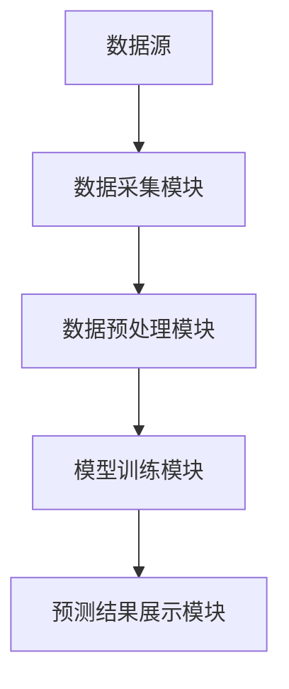
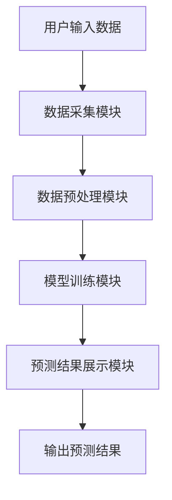

                 


# 《AI驱动的企业现金流预测》

---

## 关键词
- 人工智能（AI）
- 现金流预测
- 机器学习
- 深度学习
- 时间序列分析
- LSTM模型

---

## 摘要
本文探讨了如何利用人工智能技术，特别是机器学习和深度学习，来优化企业现金流预测。通过详细分析传统预测方法的局限性，本文引入了AI驱动的预测模型，如ARIMA、LSTM和XGBoost，并通过实际案例展示了这些模型在企业中的应用。文章还介绍了系统设计、项目实战和未来发展趋势，为读者提供了从理论到实践的全面指南。

---

# 第1章: 企业现金流预测的背景与挑战

## 1.1 企业现金流预测的定义与作用
### 1.1.1 现金流预测的定义
现金流预测是指对企业未来一定时期内的现金流入和流出进行估计和预测的过程，是企业财务管理和决策的重要工具。

### 1.1.2 现金流预测的作用
现金流预测帮助企业进行财务规划、风险管理和投资决策，确保企业资金链的健康与稳定。

### 1.1.3 现金流预测的关键指标
- 现金流入：销售收入、投资收益等
- 现金流出：采购支出、运营成本等
- 现金净流量：现金流入减去现金流出

---

## 1.2 传统现金流预测方法的局限性
### 1.2.1 传统方法的分类
- 时间序列分析
- 回归分析
- 专家判断法

### 1.2.2 传统方法的优缺点
| 方法 | 优点 | 缺点 |
|------|------|------|
| 时间序列分析 | 易操作，适用于历史数据清晰 | 无法捕捉复杂模式 |
| 回归分析 | 能识别变量间的关系 | 易受数据噪声影响 |
| 专家判断法 | 结合专家经验 | 主观性强，难量化 |

---

## 1.3 AI驱动现金流预测的核心优势
### 1.3.1 数据驱动的优势
AI能够处理大量数据，发现传统方法难以识别的模式和趋势。

### 1.3.2 高精度预测能力
通过机器学习和深度学习，AI模型能够实现更高的预测准确率。

### 1.3.3 实时更新与动态调整
AI系统能够根据实时数据不断优化预测模型，提供动态调整的现金流预测。

---

# 第2章: 现金流预测的数学模型与算法

## 2.1 时间序列分析模型
### 2.1.1 ARIMA模型
ARIMA（自回归积分滑动平均模型）是一种广泛应用于时间序列预测的经典算法。

#### ARIMA模型的公式
$$ ARIMA(p, d, q) $$
其中：
- p：自回归阶数
- d：差分阶数
- q：移动平均阶数

### 2.1.2 LSTM模型
LSTM（长短期记忆网络）是一种特殊的RNN，能够有效处理时间序列数据中的长期依赖关系。

#### LSTM模型的公式
$$ f(t) = \text{LSTM}(x_t, h_{t-1}) $$

---

## 2.2 回归分析模型
### 2.2.1 线性回归
线性回归是一种简单而有效的预测方法，适用于线性关系明显的数据。

### 2.2.2 非线性回归
非线性回归用于捕捉数据中的复杂关系，如多项式回归、逻辑回归等。

---

## 2.3 集成学习模型
### 2.3.1 随机森林
随机森林通过构建多个决策树并进行投票或平均，提高预测的准确性和鲁棒性。

### 2.3.2 XGBoost
XGBoost是一种高效的梯度提升算法，广泛应用于金融领域的预测任务。

---

# 第3章: 基于AI的现金流预测系统设计

## 3.1 系统架构设计
### 3.1.1 系统组成
- 数据采集模块
- 数据预处理模块
- 模型训练模块
- 预测结果展示模块

### 3.1.2 系统架构图


---

## 3.2 数据流与接口设计
### 3.2.1 数据流设计


### 3.2.2 接口设计
- 数据接口：API用于数据输入和输出
- 模型接口：API用于模型加载和预测

---

# 第4章: 项目实战与代码实现

## 4.1 环境搭建
### 4.1.1 安装必要的库
```bash
pip install numpy pandas scikit-learn tensorflow
```

## 4.2 数据准备
### 4.2.1 数据清洗与预处理
```python
import pandas as pd
import numpy as np

# 读取数据
data = pd.read_csv('cash_flow.csv')

# 处理缺失值
data = data.dropna()

# 标准化处理
from sklearn.preprocessing import StandardScaler
scaler = StandardScaler()
data_scaled = scaler.fit_transform(data)
```

## 4.3 模型训练
### 4.3.1 使用LSTM模型训练
```python
from tensorflow.keras.models import Sequential
from tensorflow.keras.layers import LSTM, Dense

model = Sequential()
model.add(LSTM(50, input_shape=(timesteps, features)))
model.add(Dense(1))
model.compile(optimizer='adam', loss='mean_squared_error')
model.fit(X_train, y_train, epochs=50, batch_size=32)
```

## 4.4 模型部署与预测
### 4.4.1 部署模型到云平台
使用Docker将模型打包成容器，部署到云服务器上，提供API接口供其他系统调用。

---

# 第5章: 实际案例分析与优化

## 5.1 案例背景
以某制造企业为例，通过AI驱动的现金流预测优化库存管理和资金分配。

## 5.2 解决方案
### 5.2.1 数据收集与清洗
### 5.2.2 模型选择与训练
### 5.2.3 模型部署与监控

## 5.3 实验结果与分析
通过对比传统方法和AI方法的预测结果，验证AI模型在准确率和实时性上的优势。

---

# 第6章: 未来展望与最佳实践

## 6.1 未来发展趋势
### 6.1.1 多模态预测
结合文本、图像等多种数据源进行现金流预测。

### 6.1.2 自适应模型
开发能够自适应调整参数的模型，提高预测的灵活性和适应性。

---

## 6.2 最佳实践与注意事项
- 数据质量是预测准确性的基础
- 模型选择应结合企业的实际需求
- 定期更新模型以适应市场变化

---

## 6.3 小结与总结
通过本文的探讨，读者可以全面了解AI驱动的企业现金流预测的方法和应用，掌握从理论到实践的完整流程。

---

## 作者
作者：AI天才研究院  
地址：[AI天才研究院](https://aiguru.top)  
邮箱：contact@aiguru.top

