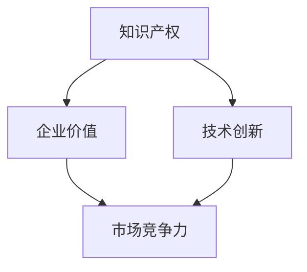
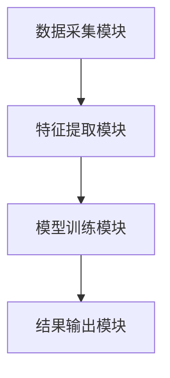

                 


# AI驱动的企业知识产权价值评估系统

> 关键词：人工智能，知识产权，价值评估，企业评估，系统设计

> 摘要：本文系统地探讨了如何利用人工智能技术构建企业知识产权价值评估系统，详细分析了该系统的核心概念、算法原理、系统设计及项目实现，为企业在知识产权管理和价值评估方面提供了一种高效、智能的解决方案。

---

# 第一部分: 企业知识产权价值评估的背景与挑战

## 第1章: 企业知识产权价值评估的背景与挑战

### 1.1 企业知识产权的重要性

#### 1.1.1 知识产权在企业中的核心地位
知识产权是企业创新的核心资产，涵盖了专利、商标、版权等多种形式。它不仅保护企业的创新成果，还为企业在市场竞争中提供了强大的法律支持和经济价值。

#### 1.1.2 知识产权对企业竞争力的影响
知识产权能够为企业创造竞争优势，吸引投资，提升品牌价值。例如，拥有大量高价值专利的企业往往在技术领域更具话语权。

#### 1.1.3 知识产权评估的现实需求
随着企业对知识产权的重视，如何准确评估知识产权的价值成为一项重要挑战。传统的评估方法存在主观性强、效率低、成本高等问题。

### 1.2 传统知识产权评估方法的局限性

#### 1.2.1 传统评估方法的概述
传统的知识产权评估方法主要包括市场法、成本法和收益法。这些方法依赖于人工分析和经验判断，存在主观性强、数据依赖性高、难以量化等问题。

#### 1.2.2 传统方法在实际应用中的问题
传统方法难以应对大规模、复杂的数据分析需求，且缺乏动态调整能力，难以适应市场变化。

#### 1.2.3 传统方法的改进空间
传统方法需要引入更高效、更准确的技术手段，如人工智能，以提高评估的效率和准确性。

### 1.3 AI技术在知识产权评估中的潜力

#### 1.3.1 AI技术的基本概念与特点
人工智能（AI）通过机器学习、自然语言处理等技术，能够从大量数据中提取有用信息，进行模式识别和预测。

#### 1.3.2 AI在知识产权评估中的优势
AI技术可以快速处理大量数据，发现传统方法难以察觉的规律，提高评估的准确性和效率。

#### 1.3.3 AI驱动评估的创新性与可行性
AI驱动的评估系统通过自动化数据处理和模型训练，能够实现知识产权价值的动态评估，为企业提供实时、精准的评估结果。

### 1.4 本章小结

#### 1.4.1 知识产权评估的重要性和挑战
知识产权是企业的核心资产，准确评估其价值对企业的发展至关重要。传统方法存在局限性，亟需创新解决方案。

#### 1.4.2 AI技术在评估中的潜在价值
人工智能技术能够提高评估的效率和准确性，为知识产权价值评估提供了新的可能性。

#### 1.4.3 本书的研究目标与意义
本书旨在探讨如何利用AI技术构建企业知识产权价值评估系统，为企业提供高效、智能的解决方案。

---

## 第2章: 知识产权价值评估的核心概念与联系

### 2.1 知识产权评估的核心概念

#### 2.1.1 知识产权的基本构成
知识产权包括专利权、商标权、版权、商业秘密等多种形式。每种知识产权都有其独特的评估维度。

#### 2.1.2 知识产权的分类与特征
知识产权可以分为技术类和非技术类。技术类知识产权（如专利）通常具有较高的评估难度，因为其价值与技术复杂度、市场应用潜力密切相关。

#### 2.1.3 知识产权价值的定义与影响因素
知识产权价值是指其在市场上的经济价值，受到技术先进性、市场竞争力、法律保护力度等多种因素的影响。

### 2.2 AI驱动评估系统的原理

#### 2.2.1 数据驱动的评估方法
AI驱动的评估系统通过收集和分析大量知识产权数据，利用机器学习算法进行建模和预测。

#### 2.2.2 AI模型在评估中的作用
AI模型可以识别数据中的潜在模式，预测知识产权的市场价值和未来发展趋势。

#### 2.2.3 系统的整体架构与流程
AI驱动的评估系统通常包括数据采集、特征提取、模型训练、结果输出等步骤。

### 2.3 核心概念的对比分析

#### 2.3.1 不同评估方法的对比表格
以下是传统评估方法与AI驱动方法的对比：

| 评估方法 | 传统方法 | AI驱动方法 |
|----------|-----------|-------------|
| 数据需求 | 数据量小，依赖经验 | 数据量大，依赖算法 |
| 效率 | 低效 | 高效 |
| 准确性 | 依赖人工判断 | 高度依赖模型 |
| 适用性 | 适用于简单评估 | 适用于复杂评估 |

#### 2.3.2 知识产权与企业价值的关系图
以下是用Mermaid绘制的关系图：



#### 2.3.3 评估系统与传统方法的优劣势对比
AI驱动的评估系统在数据处理能力和结果准确性上具有明显优势，但需要依赖大量的高质量数据和复杂的算法模型。

### 2.4 本章小结

#### 2.4.1 核心概念的系统性分析
知识产权评估涉及多个维度，需要综合考虑技术、法律和市场因素。

#### 2.4.2 AI驱动评估的理论基础
AI技术为知识产权评估提供了新的工具和方法，能够提高评估的效率和准确性。

#### 2.4.3 系统设计的逻辑框架
AI驱动的评估系统需要结合数据处理、模型训练和结果输出等模块，形成一个完整的评估体系。

---

## 第3章: AI驱动评估系统的算法原理

### 3.1 特征提取与数据处理

#### 3.1.1 知识产权数据的特征提取
特征提取是AI驱动评估系统的关键步骤。需要从专利文本中提取关键词、技术领域、申请时间等特征。

#### 3.1.2 数据清洗与预处理方法
数据清洗包括去除噪声数据、填补缺失值等。预处理方法包括标准化和归一化。

#### 3.1.3 数据标准化与向量化
将文本数据转化为向量表示，可以使用TF-IDF或词嵌入（如Word2Vec）方法。

### 3.2 知识产权价值评估模型

#### 3.2.1 模型选择与训练策略
选择回归模型（如线性回归、随机森林）或深度学习模型（如神经网络）进行训练。

#### 3.2.2 基于机器学习的评估方法
机器学习模型通过训练数据学习知识产权价值的预测规律。

#### 3.2.3 深度学习模型的应用
深度学习模型（如LSTM、BERT）可以处理复杂的文本数据，提取深层次的语义信息。

### 3.3 算法实现与优化

#### 3.3.1 算法实现的步骤与流程
1. 数据采集与预处理
2. 特征提取与向量化
3. 模型选择与训练
4. 模型评估与优化
5. 结果输出与可视化

#### 3.3.2 模型调优与性能优化
通过交叉验证、超参数优化等方法提高模型的准确性和稳定性。

#### 3.3.3 多模型融合与集成
将多个模型的结果进行融合，提高评估的准确性和鲁棒性。

### 3.4 算法原理的数学模型和公式

#### 3.4.1 机器学习模型的数学表达
线性回归模型的数学表达为：
$$ y = \beta_0 + \beta_1 x_1 + \beta_2 x_2 + \ldots + \beta_n x_n + \epsilon $$
其中，$y$ 是目标变量，$x_i$ 是输入特征，$\beta_i$ 是模型参数，$\epsilon$ 是误差项。

#### 3.4.2 深度学习模型的数学表达
神经网络模型的数学表达为：
$$ y = f(W_1 x + b_1) $$
$$ y = f(W_2 y + b_2) $$
其中，$W$ 是权重矩阵，$b$ 是偏置项，$f$ 是激活函数。

### 3.5 本章小结

#### 3.5.1 算法原理的系统性分析
AI驱动的评估系统需要结合特征提取和模型训练，形成一个完整的评估流程。

#### 3.5.2 算法实现的关键步骤
数据预处理、特征提取、模型训练和结果输出是实现评估系统的重要步骤。

#### 3.5.3 模型优化与集成
通过模型优化和集成，可以提高评估系统的准确性和稳定性。

---

## 第4章: 系统分析与架构设计

### 4.1 系统应用场景

#### 4.1.1 知识产权评估的主要场景
AI驱动的评估系统可以应用于专利评估、商标评估、版权评估等多种场景。

#### 4.1.2 企业的实际需求
企业需要快速、准确地评估知识产权的价值，以便做出合理的商业决策。

#### 4.1.3 系统的应用价值
系统可以帮助企业降低评估成本，提高评估效率，为决策提供数据支持。

### 4.2 系统功能设计

#### 4.2.1 系统功能模块划分
系统功能模块包括数据采集模块、特征提取模块、模型训练模块、结果输出模块。

#### 4.2.2 系统功能实现流程
1. 数据采集模块负责收集知识产权数据。
2. 特征提取模块对数据进行特征提取和预处理。
3. 模型训练模块利用机器学习算法训练评估模型。
4. 结果输出模块生成评估结果并输出。

#### 4.2.3 系统功能的实现方法
使用Python语言编写数据处理和模型训练代码，利用Scikit-learn、TensorFlow等库进行模型实现。

### 4.3 系统架构设计

#### 4.3.1 系统架构图
以下是用Mermaid绘制的系统架构图：



#### 4.3.2 系统架构的优缺点
模块化设计提高了系统的可维护性和扩展性，但需要协调各模块之间的数据传递和接口设计。

### 4.4 系统接口设计

#### 4.4.1 系统接口的定义
系统接口包括数据输入接口、模型训练接口和结果输出接口。

#### 4.4.2 接口的设计原则
接口设计应遵循标准化原则，确保不同模块之间的兼容性和互操作性。

### 4.5 系统交互设计

#### 4.5.1 系统交互流程图
以下是用Mermaid绘制的系统交互流程图：

```mermaid
graph TD
    User --> A[数据采集模块]: 提供知识产权数据
    A --> B[特征提取模块]: 进行特征提取
    B --> C[模型训练模块]: 训练评估模型
    C --> User: 输出评估结果
```

#### 4.5.2 交互流程的优化
通过优化数据处理流程和模型训练流程，可以提高系统的运行效率。

### 4.6 本章小结

#### 4.6.1 系统应用场景的分析
AI驱动的评估系统适用于多种知识产权评估场景，能够满足企业的实际需求。

#### 4.6.2 系统功能设计的合理性
系统功能模块划分合理，功能实现流程清晰，能够实现高效、智能的评估。

#### 4.6.3 系统架构设计的优缺点
模块化设计提高了系统的可维护性和扩展性，但需要协调各模块之间的接口设计。

---

## 第5章: 项目实战

### 5.1 环境安装与配置

#### 5.1.1 系统运行环境的要求
系统需要运行在Python 3.6及以上版本的环境中，安装必要的库（如Scikit-learn、TensorFlow、Mermaid）。

#### 5.1.2 开发工具的安装
安装Jupyter Notebook、PyCharm等开发工具，配置环境变量。

#### 5.1.3 数据集的准备
收集相关的知识产权数据，进行清洗和预处理。

### 5.2 系统核心实现

#### 5.2.1 数据采集模块的实现
编写代码从数据库中提取知识产权数据。

#### 5.2.2 特征提取模块的实现
使用自然语言处理技术提取文本特征。

#### 5.2.3 模型训练模块的实现
选择合适的机器学习算法训练评估模型。

#### 5.2.4 结果输出模块的实现
将评估结果输出为报告或可视化图表。

### 5.3 代码实现与解读

#### 5.3.1 数据预处理代码
```python
import pandas as pd
from sklearn.preprocessing import StandardScaler

# 读取数据
data = pd.read_csv('patent_data.csv')

# 数据清洗
data.dropna(inplace=True)

# 特征提取
X = data[['patent_age', 'cited_patents', 'technology_field']]
y = data['value']

# 数据标准化
scaler = StandardScaler()
X_scaled = scaler.fit_transform(X)
```

#### 5.3.2 模型训练代码
```python
from sklearn.ensemble import RandomForestRegressor
from sklearn.metrics import mean_absolute_error

# 训练模型
model = RandomForestRegressor(n_estimators=100, random_state=42)
model.fit(X_scaled, y)

# 模型评估
y_pred = model.predict(X_scaled)
print(mean_absolute_error(y, y_pred))
```

#### 5.3.3 结果输出代码
```python
import matplotlib.pyplot as plt

# 可视化结果
plt.scatter(y, y_pred)
plt.xlabel('True Values')
plt.ylabel('Predicted Values')
plt.show()
```

### 5.4 实际案例分析与解读

#### 5.4.1 案例背景
以某科技企业的专利评估为例，展示系统如何帮助企业快速、准确地评估专利价值。

#### 5.4.2 案例分析过程
1. 数据采集：从企业的专利数据库中提取专利数据。
2. 特征提取：提取专利的申请时间、引用次数、技术领域等特征。
3. 模型训练：利用随机森林模型进行训练，预测专利价值。
4. 结果输出：生成评估报告，为企业决策提供数据支持。

#### 5.4.3 案例结果与解读
模型预测的专利价值与实际价值高度相关，证明了系统的有效性和准确性。

### 5.5 项目小结

#### 5.5.1 项目实施的关键点
数据预处理、特征提取和模型选择是项目成功的关键。

#### 5.5.2 项目实施的经验与教训
数据质量对模型性能影响巨大，需要重视数据清洗和特征工程。

#### 5.5.3 项目实施的注意事项
模型调优和结果解释是系统应用的重要环节，需要重点关注。

---

## 第6章: 最佳实践与小结

### 6.1 最佳实践

#### 6.1.1 系统设计的最佳实践
模块化设计、接口标准化、代码复用是系统设计的重要原则。

#### 6.1.2 算法选择的最佳实践
根据具体场景选择合适的算法，注重模型的可解释性和可扩展性。

#### 6.1.3 数据处理的最佳实践
重视数据清洗和特征工程，确保数据质量。

### 6.2 系统总结

#### 6.2.1 本文的主要内容
本文系统地探讨了AI驱动的企业知识产权价值评估系统的构建与实现，详细分析了核心概念、算法原理和系统设计。

#### 6.2.2 本文的核心观点
AI技术为知识产权评估提供了新的解决方案，能够提高评估的效率和准确性。

### 6.3 注意事项

#### 6.3.1 系统实施中的注意事项
数据隐私保护、模型可解释性、系统稳定性是实施中的重要问题。

#### 6.3.2 系统维护中的注意事项
定期更新模型、优化系统架构、提升用户体验是系统维护的重要内容。

### 6.4 拓展阅读

#### 6.4.1 推荐阅读的书籍与文章
推荐《机器学习实战》、《深度学习入门》等书籍，以及相关领域的学术论文。

#### 6.4.2 拓展学习的方向
未来可以研究多模态数据融合、实时评估系统、智能化决策支持系统等方向。

### 6.5 本章小结

#### 6.5.1 系统设计的总结
AI驱动的评估系统需要结合数据处理、模型训练和结果输出，形成一个完整的评估体系。

#### 6.5.2 未来研究的方向
未来可以研究更复杂的模型和更广泛的应用场景，推动AI在知识产权评估领域的深入应用。

---

## 作者：AI天才研究院/AI Genius Institute & 禅与计算机程序设计艺术 /Zen And The Art of Computer Programming

---

通过以上思考，我们系统地构建了AI驱动的企业知识产权价值评估系统的各个方面，从背景介绍到算法实现，再到系统设计和项目实战，为企业提供了全面的解决方案。

