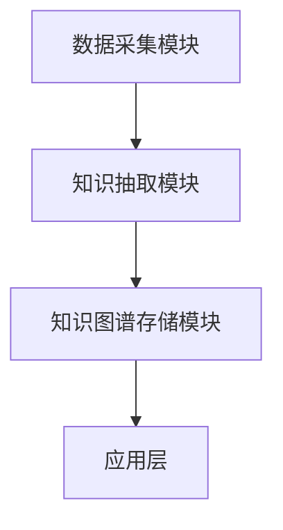
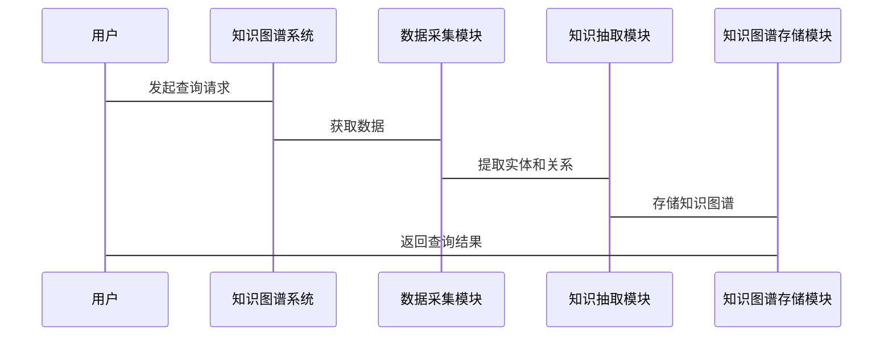

                 


# AI驱动的企业知识图谱：构建、维护与应用实践

> 关键词：知识图谱, AI驱动, 企业应用, 构建方法, 维护策略

> 摘要：本文详细探讨了AI驱动的企业知识图谱的构建、维护与应用实践。从知识图谱的基本概念出发，分析其在企业中的应用价值，详细阐述构建方法与技术细节，探讨维护策略与更新机制，最后结合实际案例展示知识图谱的应用场景与实践价值。

---

## 第一章: 知识图谱的基本概念与技术背景

### 1.1 知识图谱的定义与特点

#### 1.1.1 知识图谱的定义
知识图谱是一种以图结构形式表示知识的语义网络，节点表示实体或概念，边表示实体之间的关系。其核心目标是将分散的、异构的数据整合成一个统一的知识网络，支持复杂的语义查询与推理。

#### 1.1.2 知识图谱的核心特点
- **语义性**：通过实体和关系表示知识的语义结构。
- **可扩展性**：支持大规模数据的整合与扩展。
- **动态性**：能够实时更新以反映数据的变化。
- **可推理性**：支持基于知识图谱的语义推理。

#### 1.1.3 知识图谱与传统数据库的区别
| 特性         | 知识图谱                     | 传统数据库             |
|--------------|-----------------------------|------------------------|
| 数据结构     | 图结构（节点与边）           | 行列式结构             |
| 表达能力     | 支持复杂语义关系             | 支持简单属性关系       |
| 查询能力     | 支持语义查询与推理           | 支持基本的条件查询     |

### 1.2 企业知识图谱的技术背景

#### 1.2.1 知识图谱的技术基础
- **自然语言处理（NLP）**：用于从文本中提取实体和关系。
- **图数据库**：用于存储和管理图结构数据。
- **知识推理**：基于知识图谱进行语义推理的技术。

#### 1.2.2 AI技术在知识图谱中的应用
- **实体识别**：利用NLP技术从文本中提取实体。
- **关系抽取**：通过模式匹配或深度学习提取实体间的关系。
- **知识推理**：基于知识图谱进行路径分析和逻辑推理。

#### 1.2.3 企业知识图谱的构建目标
- 提供统一的企业知识库，支持企业内部的信息共享与复用。
- 支持智能搜索、推荐和决策等应用场景。

### 1.3 企业知识图谱的应用价值

#### 1.3.1 知识图谱在企业中的应用场景
- **企业搜索**：通过知识图谱实现智能搜索和语义检索。
- **推荐系统**：基于知识图谱进行个性化推荐。
- **知识管理**：整合企业内外部知识，提升知识管理水平。

#### 1.3.2 知识图谱对企业管理的提升作用
- 提高信息利用率，降低信息孤岛。
- 支持数据驱动的决策，提升企业智能化水平。

#### 1.3.3 知识图谱的未来发展展望
随着AI技术的进步，知识图谱将更加智能化，支持更复杂的语义推理和实时更新。

---

## 第二章: 知识图谱的构建方法

### 2.1 知识图谱构建的步骤与流程

#### 2.1.1 数据准备与清洗
- 数据来源：企业内部数据、公开数据、爬取数据等。
- 数据清洗：去除重复数据、填补缺失值、处理异常值。

#### 2.1.2 数据抽取与实体识别
- 实体识别：使用NLP技术从文本中提取实体。
- 关系抽取：识别实体之间的关系。

#### 2.1.3 实体关系建模
- 建模方法：基于领域专家的知识，构建实体关系模型。
- 数据规范化：统一实体和关系的命名和定义。

#### 2.1.4 知识图谱存储与管理
- 存储方式：使用图数据库（如Neo4j）存储节点和边。
- 索引优化：建立高效的查询索引。

### 2.2 知识图谱构建的技术细节

#### 2.2.1 实体识别与关系抽取算法
- 实体识别算法：使用CRF或深度学习模型（如BERT）进行实体识别。
- 关系抽取算法：基于规则的模式匹配或基于深度学习的关系抽取。

#### 2.2.2 知识图谱的存储与索引技术
- 图数据库存储：Neo4j、OrientDB等。
- 索引优化：使用标签索引、混合索引等技术提升查询效率。

#### 2.2.3 知识图谱的可视化技术
- 可视化工具：Gephi、Cytoscape等。
- 可视化方法：节点布局、边的权重展示、颜色编码等。

### 2.3 知识图谱构建的工具与框架

#### 2.3.1 知识图谱构建的开源工具
- **DBpedia**：基于维基百科的知识图谱构建工具。
- **Freebase**：谷歌的知识图谱构建工具。
- **Ubergraph**：基于爬虫构建的知识图谱工具。

#### 2.3.2 知识图谱构建的主流框架
- **RDF**：资源描述框架，用于表示知识图谱的数据模型。
- **SPARQL**：用于查询和操作知识图谱的查询语言。

#### 2.3.3 工具与框架的优缺点对比
| 工具/框架   | 优点                     | 缺点                     |
|------------|--------------------------|--------------------------|
| DBpedia    | 数据丰富，易于使用       | 数据更新频率较低         |
| Freebase   | 数据量大，支持多种语言   | 部分功能需要付费         |
| RDF/SPARQL | 标准化程度高             | 学习曲线较陡             |

---

## 第三章: 知识图谱的维护与更新

### 3.1 知识图谱的维护需求

#### 3.1.1 知识图谱的动态更新需求
- 数据源的动态变化：如企业内部数据的更新。
- 知识库的扩展需求：如新增实体或关系。

#### 3.1.2 知识图谱的版本控制
- 版本记录：记录每次更新的具体内容。
- 回滚机制：支持将知识图谱回滚到之前的版本。

#### 3.1.3 知识图谱的纠错与优化
- 错误检测：通过用户反馈或自动校验工具发现错误。
- 优化策略：基于反馈优化实体关系和属性。

### 3.2 知识图谱的更新策略

#### 3.2.1 数据源的动态变化处理
- 数据清洗：处理新增数据中的脏数据。
- 数据整合：将新增数据与现有知识图谱整合。

#### 3.2.2 实体关系的动态调整
- 关系更新：根据最新数据调整实体之间的关系。
- 关系扩展：新增实体之间的关系。

#### 3.2.3 知识图谱的增量更新方法
- 增量抽取：只抽取变化的部分数据。
- 增量存储：只更新变化的部分数据。

### 3.3 知识图谱的维护工具与实践

#### 3.3.1 知识图谱维护的自动化工具
- **数据同步工具**：如Apache NiFi，用于数据的自动同步。
- **自动化校验工具**：如数据校验框架DataLinter。

#### 3.3.2 知识图谱维护的流程管理
- 流程定义：定义知识图谱维护的标准化流程。
- 流程监控：实时监控维护流程的执行状态。

#### 3.3.3 知识图谱维护的最佳实践
- 定期备份：定期备份知识图谱，防止数据丢失。
- 用户反馈：通过用户反馈不断优化知识图谱的内容。

---

## 第四章: 知识图谱的应用与实践

### 4.1 知识图谱在企业中的应用场景

#### 4.1.1 企业搜索与信息检索
- 语义搜索：基于知识图谱进行语义理解，提升搜索效果。
- 智能问答：通过知识图谱提供基于语义的问答服务。

#### 4.1.2 企业推荐系统
- 个性化推荐：基于知识图谱中的实体关系，进行个性化推荐。
- 隐含关系挖掘：挖掘用户行为中的隐含关系，提升推荐精准度。

#### 4.1.3 企业知识管理与决策支持
- 知识整合：整合企业内外部知识，提升知识管理水平。
- 决策支持：基于知识图谱进行数据驱动的决策支持。

### 4.2 知识图谱的应用案例分析

#### 4.2.1 某企业知识图谱构建与应用案例
- 案例背景：某企业希望通过知识图谱整合内部知识资源。
- 实施过程：数据采集、实体识别、关系抽取、知识图谱构建。
- 应用效果：提升企业内部知识共享与复用效率。

#### 4.2.2 知识图谱在供应链管理中的应用
- 数据来源：供应商信息、产品信息、订单信息。
- 实施过程：构建供应链知识图谱，支持供应商评估和风险控制。

---

## 第五章: 知识图谱的系统架构设计

### 5.1 系统功能设计

#### 5.1.1 领域模型设计
- 实体与关系设计：定义核心实体及其关系。
- 属性设计：定义实体的属性。

#### 5.1.2 系统功能模块
- 数据采集模块：负责数据的采集与预处理。
- 知识抽取模块：负责实体识别与关系抽取。
- 知识图谱存储模块：负责知识图谱的存储与管理。

### 5.2 系统架构设计

#### 5.2.1 系统架构图


#### 5.2.2 系统接口设计
- 数据采集接口：提供数据采集的API。
- 知识抽取接口：提供实体识别和关系抽取的API。
- 知识图谱查询接口：提供基于SPARQL的查询接口。

### 5.3 系统交互设计

#### 5.3.1 系统交互流程图


---

## 第六章: 知识图谱的算法实现

### 6.1 知识图谱的算法原理

#### 6.1.1 数据预处理
- 文本清洗：去除停用词、分词处理。
- 数据标注：标注实体和关系。

#### 6.1.2 特征提取
- 实体表示：使用向量表示实体。
- 关系表示：使用向量表示关系。

#### 6.1.3 模型训练
- 使用深度学习模型（如BERT）进行关系抽取。
- 使用图嵌入模型（如TransE）进行知识推理。

### 6.2 知识图谱的算法实现

#### 6.2.1 关系抽取算法
```python
import spacy

nlp = spacy.load("en_core_web_sm")
doc = nlp("Apple is a company located in California.")
for token in doc:
    print(token.text, token.pos_)
```

#### 6.2.2 知识推理算法
```python
from py2neo import Graph

graph = Graph("http://localhost:7474", auth=("neo4j", "password"))
result = graph.run("MATCH (a)-[r]->(b) RETURN a, r, b")
for record in result:
    print(record["a"], record["r"], record["b"])
```

---

## 第七章: 知识图谱的最佳实践与未来趋势

### 7.1 知识图谱的最佳实践

#### 7.1.1 工具选择
- **图数据库选择**：根据需求选择合适的图数据库（如Neo4j、OrientDB）。
- **算法选择**：根据任务需求选择合适的算法（如实体识别、关系抽取）。

#### 7.1.2 团队协作
- **分工明确**：数据工程师负责数据处理，NLP工程师负责知识抽取，数据科学家负责模型训练。
- **流程规范**：建立标准化的开发流程和文档管理。

### 7.2 知识图谱的未来趋势

#### 7.2.1 AI技术的进一步融合
- **大语言模型**：将大语言模型与知识图谱结合，提升语义理解能力。
- **多模态知识图谱**：结合文本、图像、视频等多种模态数据，构建多模态知识图谱。

#### 7.2.2 行业应用的深化
- **金融行业**：应用于风险评估、欺诈检测。
- **医疗行业**：应用于疾病诊断、药物研发。

---

## 作者：AI天才研究院/AI Genius Institute & 禅与计算机程序设计艺术 /Zen And The Art of Computer Programming

---

以上是《AI驱动的企业知识图谱：构建、维护与应用实践》的技术博客文章目录和部分内容示例，您可以根据实际需求扩展具体内容。

