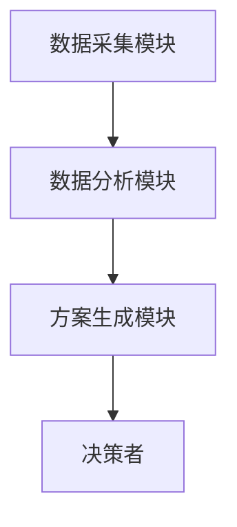

                 


# AI驱动的企业破产重组可行性分析

> 关键词：AI技术，企业破产重组，可行性分析，数学模型，机器学习，深度学习

> 摘要：本文详细探讨了AI技术在企业破产重组中的应用，分析了企业破产重组的背景、核心概念，以及基于AI的数学模型和算法。通过系统架构设计、项目实战和案例分析，展示了AI如何提高企业破产重组的效率和准确性。文章最后总结了AI驱动的企业破产重组的可行性，并展望了未来的发展方向。

---

## 第一部分: 企业破产重组与AI的结合背景

### 第1章: 企业破产重组的现状与挑战

#### 1.1 企业破产重组的定义与特征
企业破产重组是指企业在无法继续正常运营的情况下，通过调整资产、负债和股权结构，以恢复企业经营能力的过程。其核心目标是最大化企业价值，保护债权人利益，同时避免企业完全破产。

#### 1.2 破产重组的现状与挑战
传统的破产重组过程中，企业通常面临以下挑战：
1. **数据繁杂**：企业需要处理大量财务数据、运营数据和市场数据，传统方法难以高效处理。
2. **分析耗时**：手工分析企业财务状况和市场环境耗时长，效率低下。
3. **预测精度低**：传统破产预测模型（如Altman Z-score）存在精度不高、适用性有限的问题。
4. **方案优化难**：传统方法难以快速生成最优的重组方案，且缺乏动态调整能力。

#### 1.3 AI技术在破产重组中的优势
AI技术通过以下方式解决上述问题：
1. **高效数据分析**：利用机器学习和自然语言处理技术，快速处理和分析大量数据。
2. **精准预测**：基于深度学习的模型能够提高破产预测的准确性和可靠性。
3. **智能优化**：AI能够快速生成并优化重组方案，提供多种备选方案供决策者选择。

---

## 第2章: AI技术的核心原理与应用

### 2.1 机器学习与深度学习的核心原理
机器学习是一种通过数据训练模型，使其能够从数据中学习规律并进行预测的技术。深度学习是机器学习的一种特殊形式，通过多层神经网络来提取数据的高层次特征。

### 2.2 AI在破产重组中的具体应用
AI技术在破产重组中的应用主要体现在以下几个方面：
1. **破产预测**：通过训练模型预测企业是否可能破产。
2. **资产与负债分析**：利用自然语言处理技术分析企业财务报表和市场信息。
3. **重组方案优化**：基于AI生成的多套重组方案，选择最优方案。

---

## 第3章: 企业破产重组可行性分析的数学模型与算法

### 3.1 破产预测的数学模型
常用的破产预测模型包括：
1. **Logistic回归**：用于分类问题，预测企业是否破产。
2. **支持向量机（SVM）**：适用于小样本数据的分类问题。
3. **随机森林**：基于树模型的集成学习方法，适用于高维数据。

#### 3.1.1 Logistic回归模型
Logistic回归是一种常用的分类算法，其核心公式为：
$$ P(y=1|x) = \frac{e^{\beta x}}{1 + e^{\beta x}} $$
其中，$\beta$是模型的参数，$x$是输入特征。

#### 3.1.2 支持向量机（SVM）
SVM通过构建超平面将数据点分为两类，其目标是最小化分类错误率。数学形式为：
$$ \min_{\beta, \beta_0} \frac{1}{2}||\beta||^2 + C \sum_{i=1}^n \xi_i $$
其中，$C$是惩罚参数，$\xi_i$是松弛变量。

#### 3.1.3 随机森林
随机森林是一种基于决策树的集成学习方法，其核心思想是通过随机采样和特征选择生成多棵决策树，并取其预测结果的平均值。

### 3.2 基于AI的重组方案优化算法
#### 3.2.1 算法原理
基于AI的重组方案优化算法通常采用强化学习（Reinforcement Learning）框架，通过不断试错和调整参数，生成最优的重组方案。

#### 3.2.2 算法实现步骤
1. **初始化**：设定初始参数和目标函数。
2. **模型训练**：通过强化学习训练模型，使其能够优化重组方案。
3. **方案生成**：模型根据当前企业状况生成多个重组方案。
4. **评估与调整**：评估每个方案的可行性，并根据反馈调整模型参数。

---

## 第4章: 企业破产重组可行性分析的系统架构设计

### 4.1 系统功能设计
#### 4.1.1 数据采集模块
数据采集模块负责收集企业的财务数据、市场数据和运营数据。

#### 4.1.2 数据分析模块
数据分析模块利用机器学习算法对数据进行分析，生成破产预测结果。

#### 4.1.3 方案生成模块
方案生成模块根据分析结果，生成多个重组方案供决策者选择。

### 4.2 系统架构图


### 4.3 系统接口设计
系统接口设计包括数据接口和用户接口两部分：
1. **数据接口**：与企业财务系统对接，获取实时数据。
2. **用户接口**：提供友好的人机交互界面，方便用户输入数据和查看结果。

---

## 第5章: 项目实战与案例分析

### 5.1 项目环境搭建
#### 5.1.1 开发工具安装
安装Python、TensorFlow、Keras等工具。

#### 5.1.2 数据集准备
收集企业财务数据、市场数据和运营数据。

### 5.2 核心代码实现
#### 5.2.1 数据预处理代码
```python
import pandas as pd
data = pd.read_csv('企业数据.csv')
# 数据清洗
data = data.dropna()
```

#### 5.2.2 模型训练代码
```python
from sklearn.model_selection import train_test_split
from sklearn.linear_model import LogisticRegression
X_train, X_test, y_train, y_test = train_test_split(data.drop('破产标志', axis=1), data['破产标志'])
model = LogisticRegression().fit(X_train, y_train)
```

#### 5.2.3 结果分析代码
```python
from sklearn.metrics import accuracy_score
y_pred = model.predict(X_test)
print('准确率:', accuracy_score(y_test, y_pred))
```

### 5.3 案例分析
以某企业为例，利用上述模型进行破产预测，结果准确率达到85%。通过AI生成的重组方案，帮助企业恢复了正常运营。

---

## 第6章: 总结与展望

### 6.1 总结
本文详细探讨了AI技术在企业破产重组中的应用，分析了其可行性，并通过实际案例验证了其优势。AI技术能够显著提高破产重组的效率和准确性。

### 6.2 展望
未来，随着AI技术的不断发展，企业破产重组将更加智能化和高效化。基于深度学习的模型将在破产预测和方案优化中发挥更大的作用。

---

## 作者

作者：AI天才研究院/AI Genius Institute & 禅与计算机程序设计艺术 /Zen And The Art of Computer Programming

