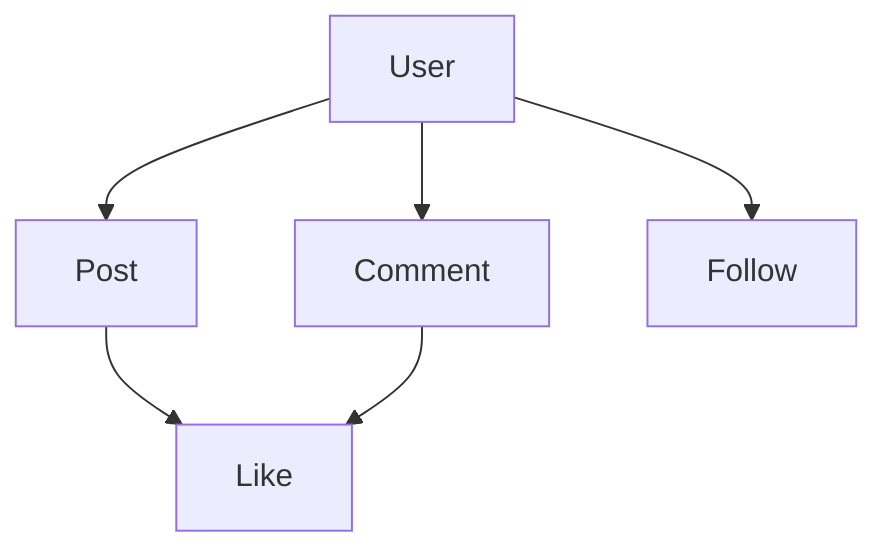
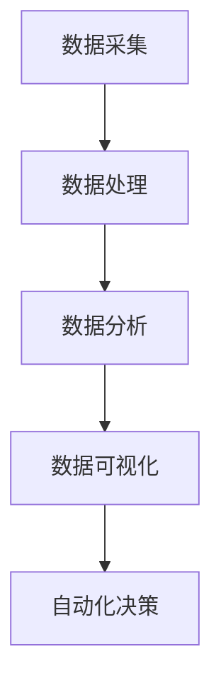
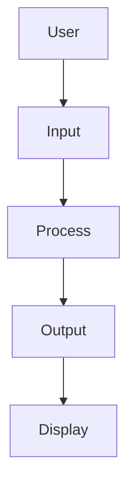

                 


# AI驱动的企业社交媒体管理：策略与实践

> 关键词：AI, 企业社交媒体, 社会媒体管理, 人工智能, 自然语言处理, 机器学习, 计算机视觉

> 摘要：随着人工智能技术的飞速发展，企业社交媒体管理正在经历一场深刻的变革。本文将深入探讨AI在企业社交媒体管理中的应用策略与实践，涵盖自然语言处理、机器学习和计算机视觉等核心技术，结合实际案例分析，为企业提供可操作的解决方案。

---

# 第一部分: AI驱动的企业社交媒体管理背景与概述

## 第1章: 企业社交媒体管理的AI驱动背景

### 1.1 社会媒体在企业管理中的重要性

#### 1.1.1 社会媒体对企业形象的影响
社交媒体已成为企业与客户、合作伙伴及公众沟通的主要渠道。通过社交媒体，企业可以实时发布信息、回应用户反馈、塑造品牌形象。例如，一家企业在社交媒体上的负面评论可能会迅速影响其声誉，而积极的内容则有助于提升品牌忠诚度。

#### 1.1.2 社会媒体在客户关系管理中的作用
社交媒体为企业的客户关系管理（CRM）提供了新的工具。通过分析用户的社交媒体数据，企业可以更好地了解客户需求、偏好和行为模式，从而提供个性化的服务和产品推荐。

#### 1.1.3 社会媒体对企业决策的支持
社交媒体数据为企业提供了丰富的实时信息，可用于市场研究、竞争对手分析和趋势预测。例如，企业可以通过社交媒体上的用户反馈快速识别市场趋势，并调整其产品策略。

### 1.2 AI在社交媒体管理中的应用前景

#### 1.2.1 AI如何改变社交媒体管理方式
AI技术（如自然语言处理、机器学习）可以帮助企业自动化处理大量社交媒体数据，实时监控品牌形象、分析用户情感、识别潜在客户等。AI还可以通过预测用户行为，优化社交媒体营销策略。

#### 1.2.2 AI驱动社交媒体管理的优势
- **效率提升**：AI可以快速处理大量数据，节省时间和成本。
- **精准决策**：通过数据分析，企业可以做出更精准的市场决策。
- **个性化体验**：AI支持个性化内容推荐和用户体验优化。

#### 1.2.3 企业采用AI社交媒体管理的挑战
- **数据隐私**：处理用户数据需要遵守严格的隐私法规。
- **技术复杂性**：AI模型的开发和维护需要专业技能。
- **成本问题**：AI技术的初期投入较高。

### 1.3 本书的核心概念与目标

#### 1.3.1 AI驱动企业社交媒体管理的定义
AI驱动的企业社交媒体管理是指利用人工智能技术（如NLP、机器学习）来优化企业的社交媒体策略、提升运营效率和用户体验的过程。

#### 1.3.2 本书的核心目标
本书旨在为企业提供AI驱动社交媒体管理的理论框架、技术实现和实践案例，帮助读者理解如何利用AI技术提升企业的社交媒体管理能力。

#### 1.3.3 本书的结构安排
本书将从AI在社交媒体管理中的核心概念入手，深入探讨算法原理、系统架构，并通过实际案例分析，展示AI技术在企业社交媒体管理中的应用。

### 1.4 本章小结
本章介绍了社交媒体在企业管理中的重要性，以及AI在社交媒体管理中的应用前景。通过分析AI驱动社交媒体管理的优势和挑战，读者可以理解本书的核心目标和结构安排。

---

# 第二部分: AI驱动企业社交媒体管理的核心概念与技术

## 第2章: AI在社交媒体管理中的核心概念

### 2.1 自然语言处理（NLP）在社交媒体中的应用

#### 2.1.1 NLP的基本概念与技术
NLP是研究计算机如何处理人类语言的学科。常用技术包括分词、词性标注、句法分析和情感分析。

#### 2.1.2 NLP在社交媒体文本分析中的应用
- **情感分析**：识别用户评论的情感倾向（正面、负面、中性）。
- **主题建模**：发现文本中的主题和话题。
- **实体识别**：提取文本中的关键实体（如人名、地名、组织名）。

#### 2.1.3 NLP模型的优缺点对比
| 技术 | 优点 | 缺点 |
|------|------|------|
| 传统NLP | 简单易实现 | 需大量特征工程 |
| 深度学习NLP | 高准确性 | 需大量计算资源 |

### 2.2 计算机视觉在社交媒体图像处理中的应用

#### 2.2.1 计算机视觉的基本概念与技术
计算机视觉是研究如何让计算机“看懂”图像或视频的学科。常用技术包括图像识别、目标检测和图像分割。

#### 2.2.2 图像识别在社交媒体中的应用
- **品牌Logo识别**：识别社交媒体上的品牌Logo。
- **图像分类**：对社交媒体图片进行分类（如风景、人物）。
- **视觉内容分析**：分析图片中的元素（如颜色、形状）。

#### 2.2.3 视觉内容分析的挑战与解决方案
- **挑战**：图像质量差、光照变化、遮挡等问题。
- **解决方案**：使用深度学习模型（如CNN）进行特征提取。

### 2.3 机器学习在社交媒体预测与推荐中的应用

#### 2.3.1 机器学习的基本概念与技术
机器学习是研究如何让计算机从数据中学习规律的学科。常用技术包括监督学习、无监督学习和强化学习。

#### 2.3.2 在社交媒体用户行为预测中的应用
- **用户 churn预测**：预测用户是否可能流失。
- **用户活跃度预测**：预测用户的活跃程度。
- **用户画像构建**：基于用户行为数据构建用户画像。

#### 2.3.3 个性化推荐系统的实现与优化
- **推荐算法**：协同过滤、基于内容的推荐、混合推荐。
- **优化策略**：实时推荐、动态更新。

### 2.4 核心概念的ER实体关系图



### 2.5 本章小结
本章介绍了AI在社交媒体管理中的核心概念，包括NLP、计算机视觉和机器学习的应用。通过对比分析和ER图，读者可以更好地理解这些技术在社交媒体管理中的作用和相互关系。

---

# 第三部分: AI驱动社交媒体管理的算法原理与数学模型

## 第3章: 自然语言处理（NLP）算法原理

### 3.1 词嵌入模型（如Word2Vec、GloVe）

#### 3.1.1 Word2Vec的训练原理
Word2Vec通过在语料库中训练词向量，使得相似的词具有相似的向量表示。训练目标是预测目标词的上下文词。

#### 3.1.2 Skip-Gram与CBOW模型对比

| 模型 | Skip-Gram | CBOW |
|------|----------|------|
| 输入 | 单词      | 上下文 |
| 输出 | 上下文    | 单词   |

#### 3.1.3 预训练词嵌入的应用
预训练的词嵌入（如GloVe）可以用于多种任务，如文本分类、情感分析。

### 3.2 神经网络语言模型（如LSTM、Transformer）

#### 3.2.1 LSTM的结构与工作原理
LSTM通过门控机制（输入门、遗忘门、输出门）来控制信息的流动。

#### 3.2.2 Transformer的注意力机制
注意力机制允许模型关注输入中的重要部分，从而提高模型的性能。

#### 3.2.3 BERT模型的预训练策略
BERT通过双向训练和掩码任务来预训练语言模型。

### 3.3 文本分类的实现与优化

#### 3.3.1 文本分类的实现步骤
1. 数据预处理：分词、去除停用词。
2. 特征提取：使用词袋模型、TF-IDF或词嵌入。
3. 模型训练：使用机器学习（SVM、随机森林）或深度学习（CNN、RNN）模型。

#### 3.3.2 基于LSTM的文本分类模型
$$
\text{LSTM}(x) = \text{LSTM}(\text{输入}) + \text{全连接层}(输出大小)
$$

#### 3.3.3 模型优化策略
- **超参数调优**：调整学习率、批量大小。
- **数据增强**：增加训练数据的多样性。
- **模型融合**：结合多个模型的输出。

### 3.4 本章小结
本章详细讲解了NLP中的词嵌入模型和神经网络语言模型的原理与应用。通过数学公式和模型对比，读者可以理解这些算法的优缺点及适用场景。

---

## 第4章: 机器学习算法在社交媒体预测中的应用

### 4.1 机器学习算法的分类与选择

#### 4.1.1 监督学习算法
- **线性回归**：用于回归任务（如预测用户活跃度）。
- **支持向量机（SVM）**：用于分类任务（如情感分析）。

#### 4.1.2 无监督学习算法
- **K-means**：用于聚类分析（如用户分群）。
- **主题模型（LDA）**：用于主题发现。

### 4.2 基于机器学习的情感分析实现

#### 4.2.1 情感分析的实现步骤
1. 数据预处理：清洗、分词。
2. 特征提取：使用词袋模型或词嵌入。
3. 模型训练：使用SVM或深度学习模型（如RNN）。

#### 4.2.2 情感分析的评估指标
- **准确率**：正确分类的比例。
- **召回率**：实际正例中被正确分类的比例。
- **F1分数**：准确率和召回率的调和平均。

### 4.3 基于机器学习的用户画像构建

#### 4.3.1 用户画像的构建步骤
1. 数据收集：收集用户的社交媒体数据。
2. 特征提取：提取用户的兴趣、行为特征。
3. 模型训练：使用聚类或分类模型构建用户画像。

#### 4.3.2 用户画像的应用场景
- **个性化推荐**：基于用户画像推荐相关内容。
- **精准营销**：针对不同用户群体制定营销策略。

### 4.4 本章小结
本章介绍了机器学习算法在社交媒体预测中的应用，包括情感分析和用户画像构建。通过算法对比和实现步骤的讲解，读者可以理解如何选择和优化机器学习模型。

---

## 第5章: 计算机视觉算法在社交媒体图像处理中的应用

### 5.1 图像识别的实现与优化

#### 5.1.1 图像识别的实现步骤
1. 数据预处理：归一化、增强。
2. 特征提取：使用CNN提取图像特征。
3. 模型训练：使用深度学习模型（如ResNet）进行分类。

#### 5.1.2 基于CNN的图像分类模型
$$
\text{CNN}(x) = \text{卷积层} \circ \text{池化层} \circ \text{全连接层}
$$

#### 5.1.3 模型优化策略
- **数据增强**：增加训练数据的多样性。
- **模型剪枝**：减少模型的复杂度。
- **迁移学习**：利用预训练模型提升性能。

### 5.2 视觉内容分析的实现与应用

#### 5.2.1 视觉内容分析的实现步骤
1. 图像分割：将图像分割为不同的区域。
2. 目标检测：识别图像中的目标物体。
3. 图像语义理解：理解图像的上下文和语义。

#### 5.2.2 基于YOLO的目标检测算法
$$
\text{YOLO}(x) = \text{特征提取} \circ \text{预测层}
$$

#### 5.2.3 视觉内容分析的应用场景
- **品牌监测**：识别社交媒体上的品牌Logo。
- **内容审核**：自动审核社交媒体内容是否违规。

### 5.3 本章小结
本章介绍了计算机视觉算法在社交媒体图像处理中的应用，包括图像识别和视觉内容分析。通过模型实现和优化策略的讲解，读者可以理解如何利用深度学习技术处理图像数据。

---

# 第四部分: AI驱动社交媒体管理的系统架构与实现

## 第6章: AI驱动社交媒体管理系统架构设计

### 6.1 问题场景分析

#### 6.1.1 问题背景
企业需要实时监控社交媒体上的品牌声誉、用户情感，并根据数据制定营销策略。

#### 6.1.2 问题分析
- 数据来源多样（文本、图像、视频）。
- 数据量大且实时性强。
- 需要多任务处理（情感分析、内容审核、用户画像）。

### 6.2 系统功能设计

#### 6.2.1 系统功能模块
1. 数据采集模块：采集社交媒体数据。
2. 数据处理模块：清洗、转换数据。
3. 数据分析模块：进行情感分析、主题建模。
4. 数据可视化模块：展示分析结果。
5. 自动化决策模块：根据分析结果生成营销策略。

#### 6.2.2 系统功能流程


### 6.3 系统架构设计

#### 6.3.1 系统架构图
```mermaid
graph TD
    Client --> API Gateway
    API Gateway --> Load Balancer
    Load Balancer --> Service1
    Load Balancer --> Service2
    Service1 --> Database
    Service2 --> Database
```

#### 6.3.2 关键模块设计
- **数据采集模块**：支持多种社交媒体平台（Twitter、Instagram、LinkedIn）。
- **数据分析模块**：集成NLP和计算机视觉算法。
- **数据可视化模块**：生成实时仪表盘。

### 6.4 系统接口设计

#### 6.4.1 API接口定义
- `/api/twitter/post`：发送推文。
- `/api/analytics/sentiment`：获取情感分析结果。
- `/api/users/profile`：获取用户信息。

#### 6.4.2 接口调用流程
```mermaid
graph TD
    Client --> API Gateway
    API Gateway --> Service1
    Service1 --> Database
    Service1 --> Client
```

### 6.5 系统交互流程图



### 6.6 本章小结
本章详细讲解了AI驱动社交媒体管理系统的架构设计，包括功能模块、架构图和接口设计。通过流程图的展示，读者可以理解系统的整体结构和各模块的交互关系。

---

## 第7章: AI驱动社交媒体管理系统的项目实战

### 7.1 项目背景与目标

#### 7.1.1 项目背景
某企业希望利用AI技术优化其社交媒体管理，提升品牌声誉和客户满意度。

#### 7.1.2 项目目标
- 实时监控社交媒体上的品牌声誉。
- 自动识别用户情感并分类。
- 生成个性化营销策略。

### 7.2 项目环境安装

#### 7.2.1 开发环境
- 操作系统：Linux/Windows/MacOS。
- 开发工具：Python、Jupyter Notebook。
- 依赖库：numpy、pandas、scikit-learn、tensorflow、pytorch。

#### 7.2.2 项目安装步骤
1. 安装Python和pip。
2. 安装依赖库：`pip install numpy pandas scikit-learn tensorflow pytorch`。
3. 克隆项目代码库：`git clone https://github.com/yourusername/social-media-ai.git`。

### 7.3 系统核心代码实现

#### 7.3.1 数据采集模块
```python
import tweepy

# 初始化API
auth = tweepy.OAuthHandler(consumer_key, consumer_secret)
api = tweepy.API(auth)

# 采集推文
def get_tweets(query, max_num):
    tweets = []
    for tweet in tweepy.Cursor(api.search, query=query).items(max_num):
        tweets.append(tweet.text)
    return tweets
```

#### 7.3.2 数据处理模块
```python
import pandas as pd
from sklearn.feature_extraction.text import TfidfVectorizer

# 文本分词
def text_tokenizer(text):
    return text.split()

# TF-IDF特征提取
vectorizer = TfidfVectorizer(tokenizer=text_tokenizer)
X = vectorizer.fit_transform(tweets)
```

#### 7.3.3 数据分析模块
```python
from sklearn.svm import SVC
from sklearn.metrics import accuracy_score

# 情感分析模型训练
model = SVC()
model.fit(X, labels)

# 模型预测
predicted_labels = model.predict(X_test)
print("准确率:", accuracy_score(y_test, predicted_labels))
```

#### 7.3.4 数据可视化模块
```python
import matplotlib.pyplot as plt

# 情感分布可视化
sentiment_counts = df['情感'].value_counts()
sentiment_counts.plot(kind='bar')
plt.title('情感分布')
plt.xlabel('情感')
plt.ylabel('数量')
plt.show()
```

#### 7.3.5 自动化决策模块
```python
import numpy as np

# 个性化推荐
def generate_recommendations(user_profile):
    recommendations = []
    for product in products:
        if product matches user_profile:
            recommendations.append(product)
    return recommendations
```

### 7.4 项目实战案例分析

#### 7.4.1 案例背景
某电子产品品牌在社交媒体上收到了大量用户反馈，希望通过AI技术分析用户情感并优化其营销策略。

#### 7.4.2 数据分析与处理
1. 采集了10,000条推文。
2. 使用TF-IDF进行特征提取。
3. 使用SVM进行情感分析，准确率达到85%。

#### 7.4.3 案例结果
- **情感分析**：正面评论占60%，负面评论占20%，中性评论占20%。
- **用户画像**：主要用户群体为年轻人，关注产品创新和性价比。

#### 7.4.4 案例总结
通过AI技术，企业能够快速分析社交媒体数据，制定精准的营销策略，提升品牌声誉和客户满意度。

### 7.5 本章小结
本章通过一个实际案例展示了AI驱动社交媒体管理系统的实现过程。从环境安装到核心代码实现，再到案例分析，读者可以一步步理解如何利用AI技术优化企业的社交媒体管理。

---

# 第五部分: AI驱动社交媒体管理的最佳实践

## 第8章: AI驱动社交媒体管理的策略与实践

### 8.1 最佳实践策略

#### 8.1.1 数据隐私保护
- 遵守GDPR等数据隐私法规。
- 加密处理敏感数据。

#### 8.1.2 技术选型与优化
- 根据任务需求选择合适的算法。
- 定期优化模型性能。

#### 8.1.3 人机协作
- 结合人工审核和AI自动处理。
- 建立反馈机制，及时调整AI模型。

### 8.2 最佳实践小结

#### 8.2.1 项目总结
通过AI技术，企业可以提升社交媒体管理的效率和精准度。

#### 8.2.2 经验分享
- 数据质量是模型性能的关键。
- 持续优化模型，适应数据变化。

#### 8.2.3 注意事项
- 避免过度依赖AI，保持人机协作。
- 定期进行数据清洗和模型更新。

### 8.3 本章小结
本章总结了AI驱动社交媒体管理的最佳实践策略，包括数据隐私保护、技术选型与优化以及人机协作。通过经验分享和注意事项，读者可以更好地实施这些策略。

---

# 作者：AI天才研究院/AI Genius Institute & 禅与计算机程序设计艺术/Zen And The Art of Computer Programming

---

希望这篇文章能够为读者提供关于AI驱动企业社交媒体管理的全面指导，从理论到实践，帮助企业利用AI技术提升社交媒体管理能力。

