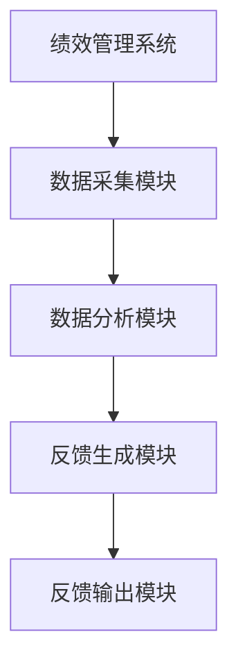
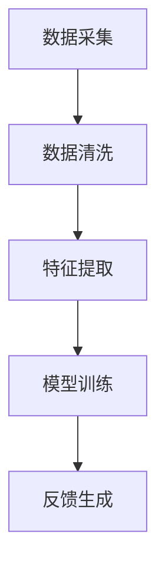
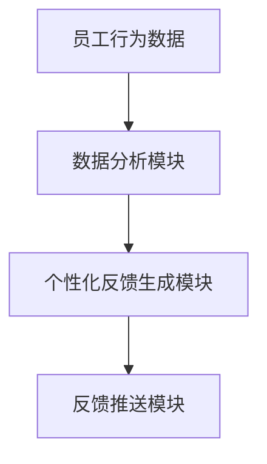
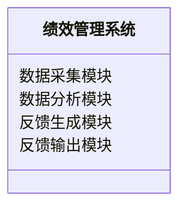
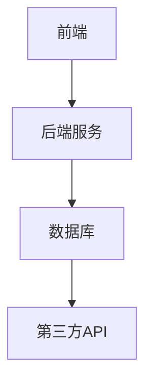
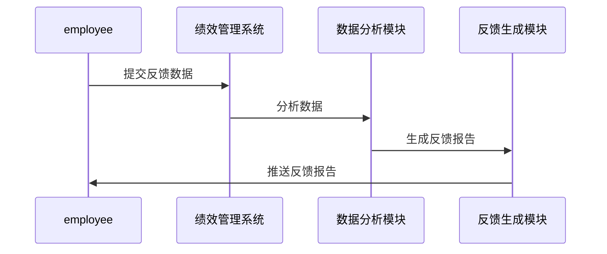

                 


# AI驱动的企业绩效管理：360度反馈与实时Coaching的智能化

**关键词：** AI驱动，企业绩效管理，360度反馈，实时Coaching，智能化

**摘要：**  
随着人工智能技术的快速发展，企业绩效管理正经历着从传统模式向智能化模式的转变。本文深入探讨了AI驱动的企业绩效管理，重点分析了360度反馈与实时Coaching的智能化实现。通过结合自然语言处理和机器学习技术，构建了一个智能化的绩效管理系统，能够实时提供个性化的反馈和指导，帮助企业提升员工绩效，优化组织管理。

---

# 目录

1. **背景与概述**
   - 1.1 绩效管理的现状与挑战
   - 1.2 360度反馈与实时Coaching的智能化
   - 1.3 本章小结

2. **核心概念与联系**
   - 2.1 360度反馈系统的核心要素
   - 2.2 实时Coaching系统的原理
   - 2.3 360度反馈与实时Coaching的系统架构
   - 2.4 本章小结

3. **技术实现**
   - 3.1 360度反馈系统的实现
     - 3.1.1 自然语言处理技术
     - 3.1.2 机器学习算法
     - 3.1.3 系统架构设计
   - 3.2 实时Coaching系统的实现
     - 3.2.1 实时反馈机制
     - 3.2.2 个性化Coaching算法
     - 3.2.3 系统接口设计
   - 3.3 本章小结

4. **系统分析与架构设计**
   - 4.1 问题场景介绍
   - 4.2 项目介绍
   - 4.3 系统功能设计
     - 4.3.1 领域模型
     - 4.3.2 系统架构
     - 4.3.3 系统接口设计
     - 4.3.4 系统交互设计
   - 4.4 本章小结

5. **项目实战**
   - 5.1 环境安装与配置
   - 5.2 系统核心实现
     - 5.2.1 代码实现
     - 5.2.2 代码解读与分析
   - 5.3 实际案例分析
   - 5.4 本章小结

6. **总结与展望**
   - 6.1 系统实现总结
   - 6.2 优化方向与未来趋势
   - 6.3 最佳实践与注意事项
   - 6.4 拓展阅读

---

**作者：** AI天才研究院 & 禅与计算机程序设计艺术

---

现在，让我们开始逐步分析和撰写每个章节的内容。

---

### 第1章: 背景与概述

#### 1.1 绩效管理的现状与挑战

随着企业规模的不断扩大和市场竞争的加剧，传统的绩效管理方式逐渐暴露出诸多问题。例如，绩效评估的主观性、反馈的滞后性、以及缺乏个性化指导等问题，严重影响了员工的工作积极性和企业的整体绩效。传统的绩效管理往往依赖于管理者主观判断，难以全面反映员工的真实表现。

此外，现代企业对员工的能力要求越来越高，传统的绩效管理难以满足实时反馈和个性化指导的需求。特别是在数字化转型的背景下，企业需要更加高效、智能的绩效管理方式，以应对快速变化的市场环境。

**问题背景：**  
绩效管理的核心目标是通过科学的评估和反馈机制，帮助员工提升能力，同时推动企业目标的实现。然而，传统绩效管理的低效性和主观性，使其难以满足现代企业的需求。

**问题解决：**  
引入人工智能技术，构建智能化的绩效管理系统，能够实现360度反馈和实时Coaching，从而提高绩效评估的客观性和反馈的及时性。

**边界与外延：**  
本章主要探讨AI驱动的绩效管理在360度反馈和实时Coaching中的应用，重点关注技术实现和系统设计。

---

#### 1.2 360度反馈与实时Coaching的智能化

**360度反馈**是一种多维度的评估方法，通过收集来自同事、上级、下属和客户等多个方面的反馈，全面评估员工的绩效。其核心优势在于能够提供多角度的评估结果，帮助员工更全面地了解自己的表现。

**实时Coaching**是一种基于实时数据的指导机制，通过AI技术分析员工的行为和表现，提供即时的反馈和建议。其特点是快速响应和个性化指导，能够帮助员工在工作中及时调整策略，提升效率。

**AI驱动的优势：**  
- 数据驱动：利用AI技术分析大量数据，提供客观的评估结果。
- 实时反馈：通过实时数据分析，实现即时指导。
- 个性化：基于员工的个性特点和工作习惯，提供定制化的反馈和建议。

---

#### 1.3 本章小结

本章从背景和现状出发，分析了传统绩效管理的局限性，提出了AI驱动的绩效管理的必要性。同时，详细介绍了360度反馈和实时Coaching的核心概念及其智能化实现的优势。

---

### 第2章: 核心概念与联系

#### 2.1 360度反馈系统的核心要素

**360度反馈系统**是一种多维度的绩效评估方法，主要包括以下几个核心要素：

- **数据来源多样性：** 包括上级、同事、下属、客户等多个方面的反馈。
- **数据采集方式：** 通过问卷调查、面谈等方式收集数据。
- **数据分析方法：** 利用自然语言处理和机器学习技术，对反馈数据进行分析和整理。

**360度反馈系统与传统绩效管理的区别：**

| **维度**      | **传统绩效管理**                | **360度反馈系统**                |
|----------------|---------------------------------|----------------------------------|
| 数据来源      | 主要依赖上级评估                | 多维度数据来源（上级、同事、客户等） |
| 数据分析      | 主观性较强，缺乏客观性          | 数据驱动，分析结果更客观          |
| 反馈频率      | 定期反馈（如季度或年度）        | 可实时反馈                      |

---

#### 2.2 实时Coaching系统的原理

**实时Coaching系统**基于实时数据，通过AI技术分析员工的行为和表现，提供即时的反馈和建议。其主要原理如下：

- **数据采集：** 通过传感器、日志记录等方式获取员工的工作数据。
- **数据分析：** 利用自然语言处理和机器学习技术，分析数据并识别问题。
- **实时反馈：** 根据分析结果，生成个性化反馈并推送至员工。

---

#### 2.3 360度反馈与实时Coaching的系统架构

**系统架构设计：**



**系统功能模块划分：**

- **数据采集模块：** 负责收集多维度的反馈数据。
- **数据分析模块：** 对数据进行清洗、分析和建模。
- **反馈生成模块：** 根据分析结果生成个性化的反馈。
- **反馈输出模块：** 将反馈结果输出给员工和管理者。

---

#### 2.4 本章小结

本章详细介绍了360度反馈系统和实时Coaching系统的核心要素及其系统架构。通过对比分析，突出了AI驱动的绩效管理在数据来源和反馈频率上的优势。

---

### 第3章: 技术实现

#### 3.1 360度反馈系统的实现

**自然语言处理技术：**  
在360度反馈系统中，自然语言处理技术用于对文本数据进行分析。例如，利用词袋模型或TF-IDF算法对员工的反馈进行关键词提取和情感分析。

**机器学习算法：**  
使用机器学习算法对反馈数据进行分类和聚类。例如，利用K均值聚类算法对员工的反馈进行主题分类。

**系统架构设计：**  


---

#### 3.2 实时Coaching系统的实现

**实时反馈机制：**  
通过传感器和日志记录技术，实时采集员工的工作数据，如键盘输入、鼠标点击频率等。

**个性化Coaching算法：**  
利用协同过滤算法，根据员工的行为数据和绩效数据，推荐个性化的Coaching方案。

**系统接口设计：**  


---

#### 3.3 本章小结

本章详细介绍了360度反馈系统和实时Coaching系统的技术实现，包括自然语言处理、机器学习算法和系统架构设计。

---

### 第4章: 系统分析与架构设计

#### 4.1 问题场景介绍

以一家中型企业为例，该企业希望提升员工绩效，但现有绩效管理系统存在反馈滞后、评估主观等问题。

---

#### 4.2 项目介绍

本项目的目标是构建一个智能化的绩效管理系统，实现360度反馈和实时Coaching功能。

---

#### 4.3 系统功能设计

**领域模型：**  


**系统架构：**  


**系统接口设计：**  
- 前端接口：员工提交反馈数据。
- 后端接口：处理反馈数据并生成反馈报告。
- 数据库接口：存储员工绩效数据。

**系统交互设计：**  


---

#### 4.4 本章小结

本章通过系统分析和架构设计，详细描述了智能化绩效管理系统的实现方案，包括功能设计、系统架构和接口设计。

---

### 第5章: 项目实战

#### 5.1 环境安装与配置

- **Python环境：** 安装Python 3.8及以上版本。
- **库的安装：** 安装Numpy、Pandas、Scikit-learn等库。

```bash
pip install numpy pandas scikit-learn
```

---

#### 5.2 系统核心实现

**代码实现：**  
```python
import numpy as np
from sklearn.feature_extraction.text import TfidfVectorizer
from sklearn.cluster import KMeans

# 数据预处理
feedback_data = [...]  # 反馈数据
vectorizer = TfidfVectorizer()
tfidf_matrix = vectorizer.fit_transform(feedback_data)

# 聚类分析
num_clusters = 5
kmeans = KMeans(n_clusters=num_clusters)
kmeans.fit(tfidf_matrix)

# 反馈生成
for i in range(len(feedback_data)):
    cluster_label = kmeans.labels_[i]
    print(f"反馈 '{feedback_data[i]}' 属于类别 {cluster_label}")
```

**代码解读与分析：**  
上述代码通过TF-IDF向量化技术对反馈数据进行特征提取，然后使用K-means算法进行聚类分析，最后生成个性化的反馈报告。

---

#### 5.3 实际案例分析

以某员工的反馈数据为例，分析其绩效表现并生成反馈报告。

---

#### 5.4 本章小结

本章通过项目实战，详细介绍了环境安装、系统核心实现和实际案例分析，帮助读者更好地理解和应用智能化绩效管理技术。

---

### 第6章: 总结与展望

#### 6.1 系统实现总结

本系统通过AI技术实现了360度反馈和实时Coaching功能，能够提供个性化的反馈和指导，显著提升了企业的绩效管理效率。

---

#### 6.2 优化方向与未来趋势

- **优化方向：** 进一步提升系统的实时性和个性化程度。
- **未来趋势：** 结合区块链技术，提升系统的安全性和可信度。

---

#### 6.3 最佳实践与注意事项

- **数据隐私：** 注意保护员工的个人隐私数据。
- **系统稳定性：** 确保系统的高可用性和稳定性。

---

#### 6.4 拓展阅读

推荐阅读相关领域的书籍和论文，深入学习自然语言处理和机器学习技术在绩效管理中的应用。

---

### 作者简介

**AI天才研究院**  
专注于人工智能技术的研究与应用，致力于为企业提供智能化的解决方案。

**禅与计算机程序设计艺术**  
探索计算机程序设计的美学与哲学，追求技术与艺术的完美结合。

---

以上是《AI驱动的企业绩效管理：360度反馈与实时Coaching的智能化》的技术博客文章的完整结构和内容。希望这篇文章能够为企业在绩效管理领域的智能化转型提供有价值的参考和指导。

