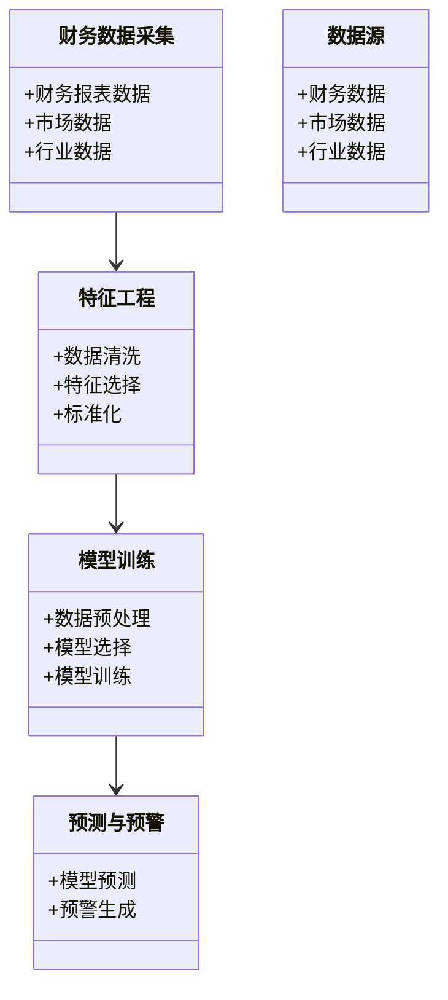
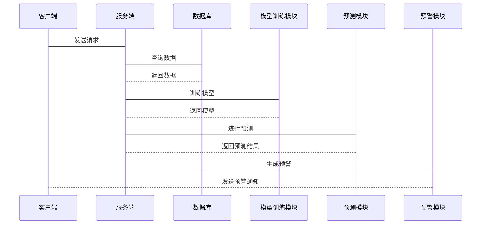

                 


# AI驱动的企业财务困境预测系统

> 关键词：AI技术，财务困境预测，机器学习，深度学习，企业财务分析，数据特征工程

> 摘要：企业财务困境预测是企业管理中的重要环节，传统的财务指标分析方法存在诸多局限性。本文系统性地介绍了AI技术在企业财务困境预测中的应用，从核心概念、算法原理、系统架构到项目实战，详细阐述了AI驱动的财务困境预测系统的构建过程，探讨了该系统在实际应用中的优势和挑战。

---

## 第1章：企业财务困境预测的背景与问题

### 1.1 企业财务困境的定义与特征

#### 1.1.1 企业财务困境的定义
企业财务困境是指企业在经营过程中由于财务状况恶化，无法按时偿还债务或维持正常运营的状态。这种困境可能由多种因素引起，如市场需求变化、管理不善、行业竞争加剧等。

#### 1.1.2 企业财务困境的主要特征
- **收入下降**：企业销售收入显著减少。
- **盈利能力减弱**：净利润率下降或亏损。
- **偿债能力降低**：流动比率、速动比率等财务指标恶化。
- **现金流问题**：经营活动现金流为负或大幅减少。

#### 1.1.3 企业财务困境的分类与边界
企业财务困境可以分为短期困境和长期困境，短期困境通常由于临时性资金问题导致，而长期困境则源于企业核心竞争力的丧失。本文主要关注企业财务的长期预测。

### 1.2 传统财务困境预测方法的局限性

#### 1.2.1 传统财务指标分析法的局限
传统的财务指标分析法（如Z-score模型）基于财务报表数据进行分析，但其预测精度有限，且难以捕捉市场动态和非财务因素的影响。

#### 1.2.2 传统预测模型的不足
- **数据维度有限**：传统模型主要依赖财务数据，忽略了市场、行业等外部因素。
- **模型静态性**：传统模型难以实时更新，难以应对市场的快速变化。
- **预测范围有限**：传统模型通常只能预测企业破产的可能性，难以提供多维度的财务风险预警。

#### 1.2.3 传统方法在实际应用中的挑战
- **数据质量问题**：财务数据可能存在错误或缺失。
- **模型泛化能力差**：传统模型在不同行业、不同规模的企业中的适用性有限。

### 1.3 AI技术在财务困境预测中的应用潜力

#### 1.3.1 AI技术的核心优势
- **数据处理能力**：AI能够处理海量的多维度数据，包括财务数据、市场数据、行业数据等。
- **实时性**：AI模型可以实时更新，适应市场变化。
- **预测精度**：通过机器学习和深度学习算法，AI能够显著提高预测的准确性。

#### 1.3.2 AI在财务数据分析中的独特价值
- **非线性关系捕捉**：AI能够发现传统模型难以捕捉的非线性关系。
- **特征自动提取**：AI可以通过特征工程自动提取重要的财务和非财务特征。

#### 1.3.3 AI驱动预测的创新性与可行性
- **创新性**：AI技术的应用为财务困境预测提供了新的思路和方法。
- **可行性**：随着计算能力的提升和数据的丰富，AI技术在财务困境预测中的应用日益成熟。

---

## 第2章：AI驱动财务困境预测的核心概念与体系

### 2.1 财务数据特征分析

#### 2.1.1 财务数据的多维度特征
- **财务数据**：包括收入、利润、负债、现金流等。
- **市场数据**：包括行业趋势、市场波动等。
- **企业行为数据**：包括投资、并购等。

#### 2.1.2 数据特征与企业财务状况的关系
通过分析不同特征与企业财务困境的相关性，可以识别出哪些特征对财务困境的影响最大。

#### 2.1.3 数据特征的提取与处理
- **数据清洗**：处理缺失值、异常值。
- **特征选择**：使用机器学习算法自动选择重要特征。
- **数据标准化**：对数据进行标准化处理，以便模型训练。

### 2.2 AI模型在财务预测中的作用

#### 2.2.1 AI模型的基本原理
- **监督学习**：通过标记数据训练模型，预测新的数据。
- **无监督学习**：通过聚类分析，发现潜在的财务风险。

#### 2.2.2 AI模型在财务预测中的优势
- **高精度**：AI模型能够通过复杂的算法提高预测的准确性。
- **实时更新**：AI模型可以实时更新，适应市场变化。

#### 2.2.3 AI模型的选择与优化
- **模型选择**：根据数据特点选择合适的算法，如随机森林、支持向量机等。
- **超参数优化**：通过网格搜索等方法优化模型参数。

### 2.3 财务困境预测的系统架构

#### 2.3.1 系统架构的组成与功能
- **数据采集模块**：从企业财务报表、市场数据等来源获取数据。
- **特征工程模块**：对数据进行清洗、特征选择和标准化。
- **模型训练模块**：使用机器学习或深度学习算法训练模型。
- **预测与预警模块**：根据模型输出预测结果，并提供预警。

#### 2.3.2 系统架构的模块划分
- **数据源**：包括财务数据、市场数据、行业数据等。
- **数据处理**：数据清洗、特征工程。
- **模型训练**：选择合适的算法，训练模型。
- **预测与预警**：输出预测结果，并提供预警信息。

#### 2.3.3 系统架构的优化与扩展
- **数据源扩展**：引入更多的数据源，提高模型的预测精度。
- **模型优化**：通过集成学习等方法进一步优化模型性能。

---

## 第3章：基于机器学习的财务困境预测模型

### 3.1 数据预处理与特征工程

#### 3.1.1 数据清洗与标准化
- **数据清洗**：处理缺失值、异常值。
- **标准化**：将数据标准化到相同的范围。

#### 3.1.2 特征选择与降维
- **特征选择**：使用相关性分析、Lasso回归等方法选择重要特征。
- **降维**：使用主成分分析（PCA）等方法减少特征维度。

#### 3.1.3 数据增强与扩展
- **数据增强**：通过生成合成数据等方式增加数据量。

### 3.2 算法选择与实现

#### 3.2.1 常见机器学习算法对比
- **线性回归**：适合线性关系，但对非线性关系捕捉能力有限。
- **支持向量机（SVM）**：适合小样本数据，但对高维数据处理能力有限。
- **随机森林**：适合高维数据，具有较高的鲁棒性。

#### 3.2.2 支持向量机（SVM）模型实现
```python
from sklearn.svm import SVC
model = SVC()
model.fit(X_train, y_train)
y_pred = model.predict(X_test)
```

#### 3.2.3 随机森林（Random Forest）模型实现
```python
from sklearn.ensemble import RandomForestClassifier
model = RandomForestClassifier()
model.fit(X_train, y_train)
y_pred = model.predict(X_test)
```

### 3.3 模型评估与优化

#### 3.3.1 模型评估指标
- **准确率**：预测正确的比例。
- **召回率**：预测为正类中实际为正类的比例。
- **F1分数**：综合准确率和召回率的指标。

#### 3.3.2 超参数优化
- **网格搜索**：通过网格搜索找到最优的模型参数。

#### 3.3.3 模型调优与部署
- **模型部署**：将训练好的模型部署到生产环境中，实时预测。

---

## 第4章：深度学习在财务困境预测中的应用

### 4.1 神经网络基础

#### 4.1.1 神经网络的基本结构
- **输入层**：接收输入数据。
- **隐藏层**：处理数据，提取特征。
- **输出层**：输出预测结果。

#### 4.1.2 深度学习的核心概念
- **神经网络深度**：网络的层数越多，模型的表达能力越强。
- **激活函数**：用于引入非线性因素，如ReLU、sigmoid等。

#### 4.1.3 深度学习与传统机器学习的对比
- **表达能力**：深度学习能够捕捉更复杂的模式。
- **数据需求**：深度学习需要更多的数据来训练模型。

### 4.2 基于深度学习的预测模型

#### 4.2.1 卷积神经网络（CNN）的应用
- **图像处理**：将财务数据转化为图像，使用CNN进行分析。

#### 4.2.2 循环神经网络（RNN）的应用
- **时间序列分析**：用于分析财务时间序列数据。

#### 4.2.3 长短期记忆网络（LSTM）的应用
- **时间序列预测**：LSTM适合处理长序列数据，能够捕捉长期依赖关系。

### 4.3 深度学习模型的实现

#### 4.3.1 LSTM模型实现
```python
from keras.layers import LSTM, Dense
from keras.models import Sequential
model = Sequential()
model.add(LSTM(64, input_shape=(timesteps, features)))
model.add(Dense(1, activation='sigmoid'))
model.compile(loss='binary_crossentropy', optimizer='adam', metrics=['accuracy'])
model.fit(X_train, y_train, epochs=10, batch_size=32)
```

### 4.4 深度学习模型的优化

#### 4.4.1 模型调优
- **学习率调整**：使用学习率衰减方法，如ReduceLROnPlateau。
- **正则化**：使用Dropout、Batch Normalization等方法防止过拟合。

#### 4.4.2 模型部署
- **模型压缩**：通过剪枝等方法减少模型的大小，提高推理速度。

---

## 第5章：系统分析与架构设计

### 5.1 问题场景介绍
企业财务困境预测系统需要实时监控企业的财务状况，及时发现潜在的财务风险。

### 5.2 项目介绍
本项目旨在开发一个基于AI的财务困境预测系统，帮助企业提前识别财务风险，采取相应的措施。

### 5.3 系统功能设计

#### 5.3.1 领域模型（mermaid类图）


### 5.4 系统架构设计（mermaid架构图）


### 5.5 接口设计
- **API接口**：提供REST API，供客户端调用。
- **数据接口**：与财务系统、市场数据源对接。

### 5.6 系统交互（mermaid序列图）


---

## 第6章：项目实战

### 6.1 环境安装
- **Python**：安装Python 3.8及以上版本。
- **库依赖**：安装numpy、pandas、scikit-learn、tensorflow、keras等。

### 6.2 核心实现源代码

#### 6.2.1 数据预处理
```python
import pandas as pd
import numpy as np

# 加载数据
data = pd.read_csv('financial_data.csv')

# 数据清洗
data.dropna()
data = data.drop_duplicates()

# 特征选择
selected_features = ['revenue', 'profit', 'debt']
data = data[selected_features]

# 标准化
from sklearn.preprocessing import StandardScaler
scaler = StandardScaler()
data_scaled = scaler.fit_transform(data)
```

#### 6.2.2 模型训练与预测
```python
from sklearn.ensemble import RandomForestClassifier
from sklearn.metrics import accuracy_score

# 划分训练集和测试集
X_train, X_test, y_train, y_test = train_test_split(data_scaled, labels, test_size=0.2, random_state=42)

# 训练模型
model = RandomForestClassifier(n_estimators=100, max_depth=10, random_state=42)
model.fit(X_train, y_train)

# 预测
y_pred = model.predict(X_test)
print('准确率:', accuracy_score(y_test, y_pred))
```

### 6.3 案例分析与结果解读
通过实际案例分析，展示模型的预测效果。例如，假设某企业的财务数据经过模型预测后，系统发出预警，企业及时采取措施，避免了财务困境。

### 6.4 项目小结
本项目成功实现了基于AI的财务困境预测系统，验证了AI技术在财务预测中的有效性。

---

## 第7章：总结与展望

### 7.1 总结
本文系统性地介绍了AI驱动的企业财务困境预测系统的构建过程，从数据特征分析、算法选择到系统设计，全面探讨了AI技术在财务预测中的应用。

### 7.2 实际应用中的挑战
- **数据质量**：财务数据可能存在缺失或错误。
- **模型泛化能力**：模型在不同行业、不同规模的企业中的适用性有限。

### 7.3 未来展望
- **多模态数据融合**：结合文本、图像等多种数据源，提高预测精度。
- **在线学习**：实现模型的实时更新，适应市场的动态变化。

### 7.4 最佳实践 tips
- **数据清洗**：确保数据质量，避免错误预测。
- **模型选择**：根据数据特点选择合适的算法。
- **持续监控**：定期更新模型，保持预测的准确性。

---

## 作者：AI天才研究院/AI Genius Institute & 禅与计算机程序设计艺术 /Zen And The Art of Computer Programming

---

这篇文章系统性地介绍了AI驱动的企业财务困境预测系统的构建过程，从核心概念到算法实现，再到系统设计和项目实战，为读者提供了全面的指导。通过本文，读者可以深入了解AI技术在财务预测中的应用，并掌握实际操作的方法。

